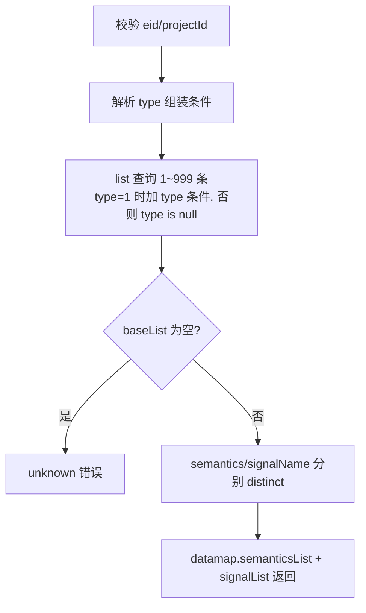
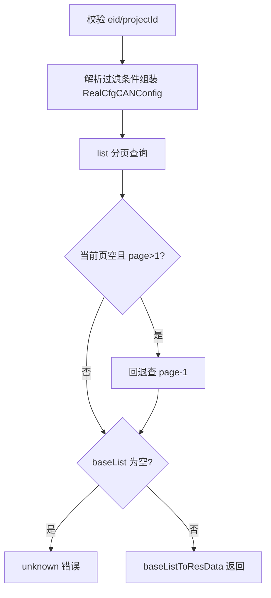
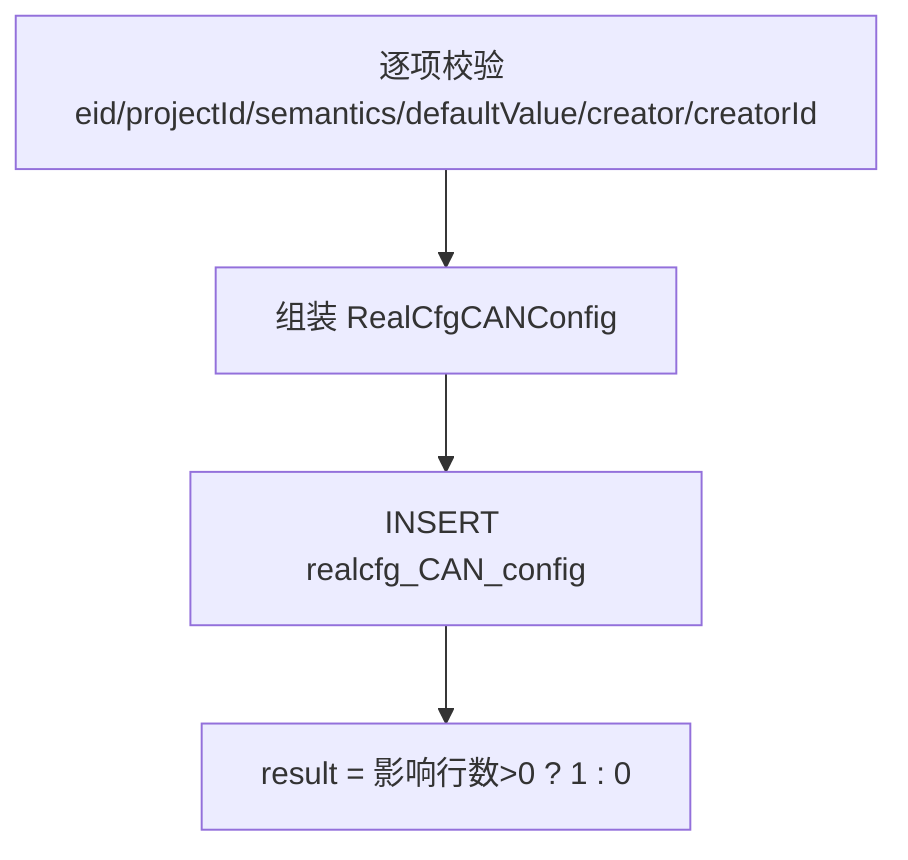
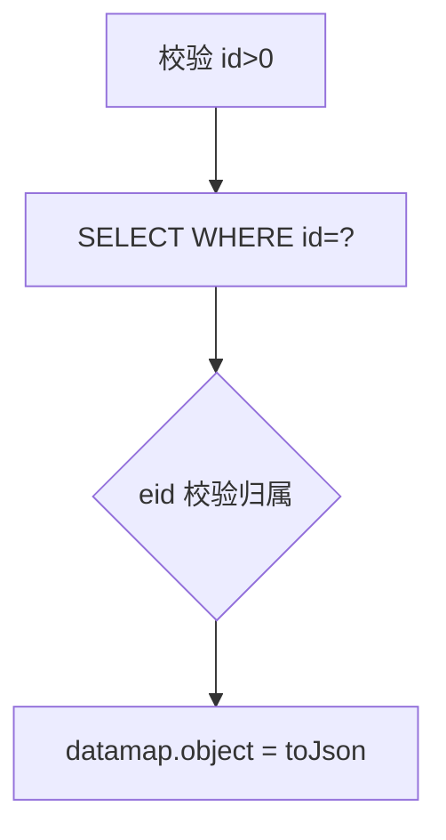
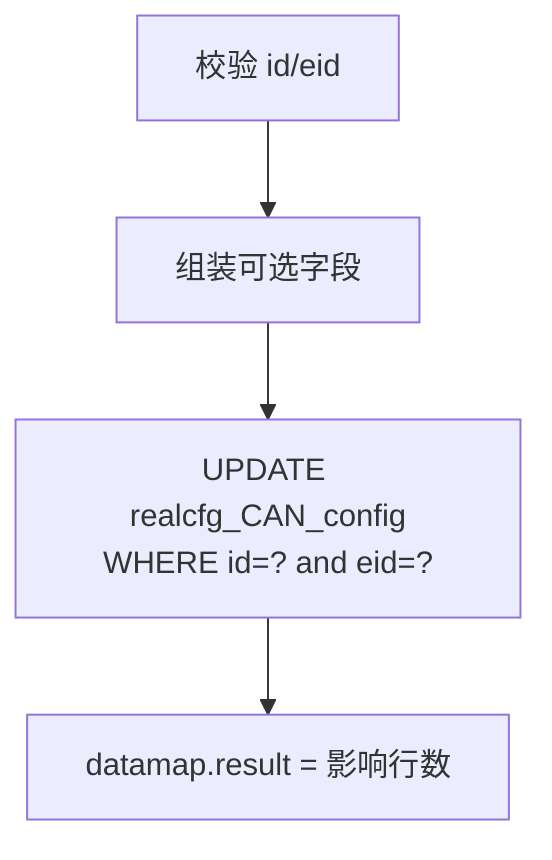
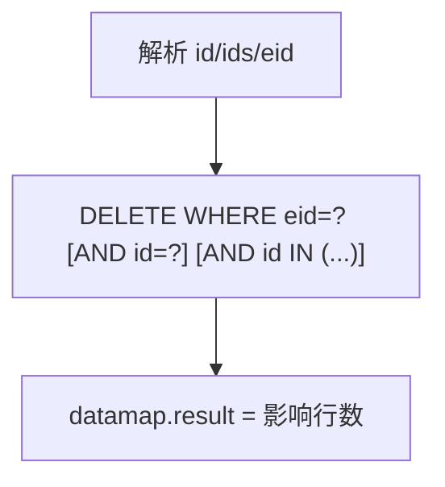
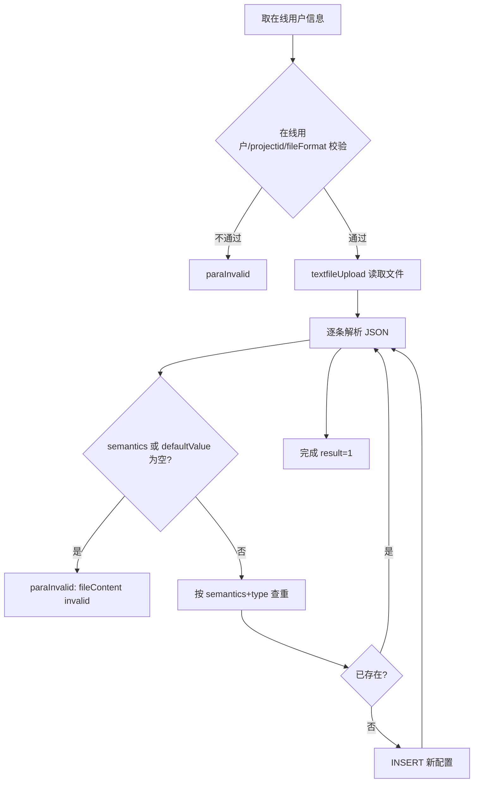

# CANCfg

CAN 信号配置管理服务：维护企业/项目组下的 CAN 信号语义配置（信号名、默认值、取值范围等），提供条件项查询、分页列表、增改删（含批量删除）以及 JSON 文件批量导入。记录带 type 渠道标识（1=PW 创建，null=CANCfg 创建），查询时按渠道隔离。

- 源码：`real-cfg/src/main/java/cn/testin/service/cfg/CANCfg.java`
- 业务实现：`real-cfg/src/main/java/cn/testin/business/impl/RealCfgCANConfigServiceImpl.java`
- DAO：`real-cfg/src/main/java/cn/testin/dao/impl/realcfg/RealcfgCANConfigDAOImpl.java`
- pojo：`cn.testin.pojo.realcfg.RealCfgCANConfig`（表 `realcfg_CAN_config`）

## op 一览

| op | 说明 |
|---|---|
| getConditionList | 查询语义/信号名去重列表（下拉条件项） |
| list | 分页条件查询 CAN 配置列表 |
| add | 新增 CAN 配置 |
| get | 按 id 查询单条配置 |
| maintain | 更新 CAN 配置 |
| delete | 删除（支持 ids 批量） |
| importByFile | JSON 文件批量导入 |

---

### getConditionList (`CANCfg.getConditionList`)

- **入口**：ApiServlet，action=cfg，op=CANCfg.getConditionList
- **实现意图**：为前端筛选下拉框提供条件项：查出该 eid+projectId（可按 type 渠道过滤）下全部 CAN 配置（1~999 条），分别提取 semantics 与 signalName 并去重返回。
- **请求参数**：

| 参数名 | 类型 | 必填 | 说明 |
|---|---|---|---|
| eid | int | 是 | 企业 ID，>=1 |
| projectId | int | 是 | 项目组 ID，>=1 |
| type | int | 否 | 渠道：1=PW 创建；不传查 CANCfg 创建（type is null） |

- **响应结构**：统一返回 `{code, msg, data}` 报文，错误时无 `data` 节点。

| 字段 | 类型 | 说明 |
| --- | --- | --- |
| code | Integer | 返回码，0 成功 |
| msg | String | 提示信息 |
| data | Object | 数据对象 |
| data.semanticsList | Array\<String\> | 去重后的语义字符串数组 |
| data.signalList | Array\<String\> | 去重后的信号名字符串数组 |
- **处理流程**：



- **调用链**：CANCfg → IRealCfgCANConfigService（RealCfgCANConfigServiceImpl）→ IRealcfgCANConfigDAO（RealcfgCANConfigDAOImpl）
- **涉及表与 SQL**：`realcfg_CAN_config`：SELECT WHERE eid/project_id [+type 条件]，`RealcfgCANConfigDAOImpl.list`
- **异常与校验**：eid/projectId 非法返回 `CommonCode.paraInvalid`；结果为空返回 `CommonCode.unknown`。
- **关键代码摘录**：

```java
// real-cfg/src/main/java/cn/testin/service/cfg/CANCfg.java
BaseList<RealCfgCANConfig> baseList = iRealCfgCANConfigService.list(eid, projectId, realcfgcanConfig, 1, 999);
// ...
semanticsList = semanticsList.stream().distinct().collect(Collectors.toList());
signalList = signalList.stream().distinct().collect(Collectors.toList());
datamap.put("semanticsList", semanticsList);
datamap.put("signalList", signalList);
```

---

### list (`CANCfg.list`)

- **入口**：ApiServlet，action=cfg，op=CANCfg.list
- **实现意图**：分页条件查询 CAN 配置列表，支持创建人/信号名/语义/备注模糊过滤与 type 渠道过滤（type=1 查 PW 渠道，否则查 type is null 的 CANCfg 渠道），按 id 倒序。业务层同样有"当前页无数据回退查前一页"兜底。
- **请求参数**：

| 参数名 | 类型 | 必填 | 说明 |
|---|---|---|---|
| eid | int | 是 | 企业 ID，>=1 |
| projectId | int | 是 | 项目组 ID，>=1 |
| page | int | 否 | 页码，默认 1 |
| pageSize | int | 否 | 每页条数，默认 Config.MaxSize |
| creator | string | 否 | 创建人（模糊） |
| signalName | string | 否 | 信号名（模糊） |
| semantics | string | 否 | 语义（模糊） |
| descr | string | 否 | 备注（模糊） |
| type | int | 否 | 渠道：1=PW 创建；不传查 CANCfg 渠道 |

- **响应结构**：统一返回 `{code, msg, data}` 报文，错误时无 `data` 节点。

| 字段 | 类型 | 说明 |
| --- | --- | --- |
| code | Integer | 返回码，0 成功 |
| msg | String | 提示信息 |
| data | Object | 数据对象 |
| data.list | Array\<Object\> | 当前页 CAN 配置数组，元素字段： |
| data.list[].id | Integer | CAN 配置 ID |
| data.list[].eid | Integer | 企业 ID |
| data.list[].projectId | Integer | 项目组 ID |
| data.list[].semantics | String | 语义 |
| data.list[].signalName | String | 信号名 |
| data.list[].defaultValue | String | 默认值 |
| data.list[].valueRange | String | 取值范围 |
| data.list[].creator | String | 创建人 |
| data.list[].creatorId | Integer | 创建人 ID |
| data.list[].descr | String | 备注 |
| data.list[].type | Integer | 渠道：1=PW 创建；null=CANCfg 创建 |
| data.list[].status | Integer | 状态 |
| data.list[].createtime | Long | 创建时间（毫秒时间戳） |
| data.list[].updatetime | Long | 更新时间（毫秒时间戳） |
| data.page | Integer | 当前页码 |
| data.pageSize | Integer | 每页条数 |
| data.totalRow | Long | 总条数 |
| data.totalPage | Integer | 总页数 |
- **处理流程**：



- **调用链**：CANCfg → IRealCfgCANConfigService → IRealcfgCANConfigDAO（list）
- **涉及表与 SQL**：`realcfg_CAN_config`：SELECT + count(*)，WHERE eid/project_id [+semantics/signal_name/creator/descr like] [+type 或 type is null]，ORDER BY id DESC，`RealcfgCANConfigDAOImpl.list`
- **异常与校验**：eid/projectId 非法返回 `CommonCode.paraInvalid`；结果为空返回 `CommonCode.unknown`。
- **关键代码摘录**：

```java
// real-cfg/src/main/java/cn/testin/dao/impl/realcfg/RealcfgCANConfigDAOImpl.java
if (realCfgCANConfig.getType() != null && realCfgCANConfig.getType() == 1) {
    sql.append(" and type = ? ");
    params.add(realCfgCANConfig.getType());
} else {
    sql.append(" and type is null ");
}
```

---

### add (`CANCfg.add`)

- **入口**：ApiServlet，action=cfg，op=CANCfg.add
- **实现意图**：新增一条 CAN 信号配置。semantics、defaultValue、creator、creatorId 必填；signalName、valueRange、descr、type 可选。
- **请求参数**：

| 参数名 | 类型 | 必填 | 说明 |
|---|---|---|---|
| eid | int | 是 | 企业 ID，>=1 |
| projectId | int | 是 | 项目组 ID，>=0 |
| semantics | string | 是 | 语义 |
| signalName | string | 否 | 信号名 |
| defaultValue | string | 是 | 默认值 |
| valueRange | string | 否 | 取值范围 |
| creator | string | 是 | 创建人 |
| creatorId | int | 是 | 创建人 ID |
| descr | string | 否 | 备注 |
| type | int | 否 | 渠道：1=PW 创建；null=CANCfg 创建 |

- **响应结构**：统一返回 `{code, msg, data}` 报文，错误时无 `data` 节点。

| 字段 | 类型 | 说明 |
| --- | --- | --- |
| code | Integer | 返回码，0 成功 |
| msg | String | 提示信息 |
| data | Object | 数据对象 |
| data.result | Integer | 1 成功 / 0 失败 |
- **处理流程**：



- **调用链**：CANCfg → IRealCfgCANConfigService → IRealcfgCANConfigDAO（add）
- **涉及表与 SQL**：`realcfg_CAN_config`：INSERT（eid, project_id, semantics, signal_name, default_value, value_range, creator, creator_id, descr, createtime, updatetime, type），`RealcfgCANConfigDAOImpl.add`
- **异常与校验**：必填项缺失返回 `CommonCode.paraInvalid`；DAO 层二次校验 eid>=1、projectId 非空。
- **关键代码摘录**：

```java
// real-cfg/src/main/java/cn/testin/service/cfg/CANCfg.java
realCfgCANConfig.setEid(eid);
realCfgCANConfig.setProjectId(projectId);
realCfgCANConfig.setSemantics(semantics);
realCfgCANConfig.setSignalName(signalName);
realCfgCANConfig.setDefaultValue(defaultValue);
realCfgCANConfig.setValueRange(valueRange);
realCfgCANConfig.setCreator(creator);
realCfgCANConfig.setCreatorId(creatorId);
realCfgCANConfig.setType(type);
Integer result = iRealCfgCANConfigService.add(realCfgCANConfig);
```

---

### get (`CANCfg.get`)

- **入口**：ApiServlet，action=cfg，op=CANCfg.get
- **实现意图**：按 id 查询单条 CAN 配置；传 eid 时校验记录归属。
- **请求参数**：

| 参数名 | 类型 | 必填 | 说明 |
|---|---|---|---|
| id | int | 是 | CAN 配置 ID，>0 |
| eid | int | 否 | 企业 ID（传入时校验归属） |

- **响应结构**：统一返回 `{code, msg, data}` 报文，错误时无 `data` 节点。

| 字段 | 类型 | 说明 |
| --- | --- | --- |
| code | Integer | 返回码，0 成功 |
| msg | String | 提示信息 |
| data | Object | 数据对象 |
| data.objInfo | Object | RealCfgCANConfig 对象（查不到时无此节点） |
| data.objInfo.id | Integer | CAN 配置 ID |
| data.objInfo.eid | Integer | 企业 ID |
| data.objInfo.projectId | Integer | 项目组 ID |
| data.objInfo.semantics | String | 语义 |
| data.objInfo.signalName | String | 信号名 |
| data.objInfo.defaultValue | String | 默认值 |
| data.objInfo.valueRange | String | 取值范围 |
| data.objInfo.creator | String | 创建人 |
| data.objInfo.creatorId | Integer | 创建人 ID |
| data.objInfo.descr | String | 备注 |
| data.objInfo.type | Integer | 渠道：1=PW 创建；null=CANCfg 创建 |
| data.objInfo.status | Integer | 状态 |
| data.objInfo.createtime | Long | 创建时间（毫秒时间戳） |
| data.objInfo.updatetime | Long | 更新时间（毫秒时间戳） |
- **处理流程**：



- **调用链**：CANCfg → IRealCfgCANConfigService → IRealcfgCANConfigDAO（get）
- **涉及表与 SQL**：`realcfg_CAN_config`：SELECT WHERE id=?，`RealcfgCANConfigDAOImpl.get`
- **异常与校验**：id 非法返回 `CommonCode.paraInvalid`。
- **关键代码摘录**：

```java
// real-cfg/src/main/java/cn/testin/service/cfg/CANCfg.java
RealCfgCANConfig realCfgCANConfig = iRealCfgCANConfigService.get(id, eid);
if (realCfgCANConfig != null) {
    datamap.put(ApiResponse.RES_OBJECT, realCfgCANConfig.toJson());
}
```

---

### maintain (`CANCfg.maintain`)

- **入口**：ApiServlet，action=cfg，op=CANCfg.maintain
- **实现意图**：更新 CAN 配置。id、eid 必填，其余字段可选；DAO 动态拼接 SET 子句，descr 未传置空串。
- **请求参数**：

| 参数名 | 类型 | 必填 | 说明 |
|---|---|---|---|
| id | int | 是 | CAN 配置 ID，>0 |
| eid | int | 是 | 企业 ID，>=1 |
| projectId | int | 否 | 项目组 ID，>=0 |
| semantics | string | 否 | 语义 |
| signalName | string | 否 | 信号名 |
| defaultValue | string | 否 | 默认值 |
| valueRange | string | 否 | 取值范围 |
| creator | string | 否 | 创建人 |
| creatorId | int | 否 | 创建人 ID |
| descr | string | 否 | 备注 |

- **响应结构**：统一返回 `{code, msg, data}` 报文，错误时无 `data` 节点。

| 字段 | 类型 | 说明 |
| --- | --- | --- |
| code | Integer | 返回码，0 成功 |
| msg | String | 提示信息 |
| data | Object | 数据对象 |
| data.result | Integer | 更新影响行数 |
- **处理流程**：



- **调用链**：CANCfg → IRealCfgCANConfigService → IRealcfgCANConfigDAO（maintain）
- **涉及表与 SQL**：`realcfg_CAN_config`：UPDATE（semantics/signal_name/default_value/value_range/creator/creator_id/descr/status/updatetime，WHERE id and eid），`RealcfgCANConfigDAOImpl.maintain`
- **异常与校验**：id/eid 非法返回 `CommonCode.paraInvalid`。
- **关键代码摘录**：

```java
// real-cfg/src/main/java/cn/testin/dao/impl/realcfg/RealcfgCANConfigDAOImpl.java
sql.append("updatetime = ? ");
sql.append(" WHERE id = ? and eid = ?");
params.add(canConfig.getId());
params.add(canConfig.getEid());
```

---

### delete (`CANCfg.delete`)

- **入口**：ApiServlet，action=cfg，op=CANCfg.delete
- **实现意图**：删除 CAN 配置，支持单条（id）与批量（ids 数组），限定在 eid 下。
- **请求参数**：

| 参数名 | 类型 | 必填 | 说明 |
|---|---|---|---|
| id | int | 否 | 单删 ID，>0 |
| ids | array&lt;int&gt; | 否 | 批量删除 ID 数组 |
| eid | int | 是 | 企业 ID，>=1 |

- **响应结构**：统一返回 `{code, msg, data}` 报文，错误时无 `data` 节点。

| 字段 | 类型 | 说明 |
| --- | --- | --- |
| code | Integer | 返回码，0 成功 |
| msg | String | 提示信息 |
| data | Object | 数据对象 |
| data.result | Integer | 删除影响行数 |
- **处理流程**：



- **调用链**：CANCfg → IRealCfgCANConfigService → IRealcfgCANConfigDAO（delete）
- **涉及表与 SQL**：`realcfg_CAN_config`：DELETE WHERE eid=? [AND id=?] [AND id IN (...)]，`RealcfgCANConfigDAOImpl.delete`
- **异常与校验**：id（传入时 <=0）/eid 非法返回 `CommonCode.paraInvalid`。注意：id 与 ids 都未传时按 eid 整删，调用方需自行保证传参。
- **关键代码摘录**：

```java
// real-cfg/src/main/java/cn/testin/service/cfg/CANCfg.java
if (!reqjson.isNull("ids")) {
    ids = reqjson.getJSONArray("ids");
}
// ...
Integer result = iRealCfgCANConfigService.delete(id, eid, ids);
datamap.put("result", result);
```

---

### importByFile (`CANCfg.importByFile`)

- **入口**：ApiServlet，action=cfg，op=CANCfg.importByFile（含 HttpServletRequest，走文件上传通道）
- **实现意图**：通过上传 JSON 文件批量导入 CAN 配置（第一期仅支持 json）。操作人取自在线用户。文件为 JSON 数组，元素含 semantics/signalName/defaultValue/valueRange/descr/type。semantics 或 defaultValue 为空即报错；按 semantics（+type）查重，已存在跳过，否则以在线用户为创建人插入。
- **请求参数**：

| 参数名 | 类型 | 必填 | 说明 |
|---|---|---|---|
| projectid | int | 是 | 项目组 ID（优先取请求体），>=1 |
| fileFormat | string | 是 | 文件格式，仅支持 json |
| （在线用户） | - | 是 | 从 apirequest.onlineUserInfo 取 eid/userid/userName |
| （上传文件） | multipart | 是 | JSON 数组：[{"semantics":"...","signalName":"...","defaultValue":"...","valueRange":"...","descr":"...","type"}] |

- **响应结构**：统一返回 `{code, msg, data}` 报文，错误时无 `data` 节点。

| 字段 | 类型 | 说明 |
| --- | --- | --- |
| code | Integer | 返回码，0 成功 |
| msg | String | 提示信息 |
| data | Object | 数据对象 |
| data.result | Integer | 1（全部处理完成） |
- **处理流程**：



- **调用链**：CANCfg → GenericBaseService.textfileUpload → IRealCfgCANConfigService（list/add）→ IRealcfgCANConfigDAO
- **涉及表与 SQL**：`realcfg_CAN_config`：SELECT（按 semantics 查重）+ INSERT，`RealcfgCANConfigDAOImpl.list/add`
- **异常与校验**：在线用户缺失、projectid 非法、fileFormat 非 json、semantics/defaultValue 为空、文件内容非法 JSON 均返回 `CommonCode.paraInvalid`。
- **关键代码摘录**：

```java
// real-cfg/src/main/java/cn/testin/service/cfg/CANCfg.java
if (StringUtils.isBlank(semantics) || StringUtils.isBlank(defaultValue)) {
    String msg = String.format("(fileContent(%s) is invalid!", fileFormat);
    return ApiUtil.getResult(apirequest, CommonCode.paraInvalid.getValue(), msg);
}
// 构建查询条件信息。
RealCfgCANConfig canConfig = new RealCfgCANConfig();
canConfig.setSemantics(semantics);
if (type != null) { canConfig.setType(type); }
BaseList<RealCfgCANConfig> baselist = this.iRealCfgCANConfigService.list(eid, projectid, canConfig, 1, 100);
```
