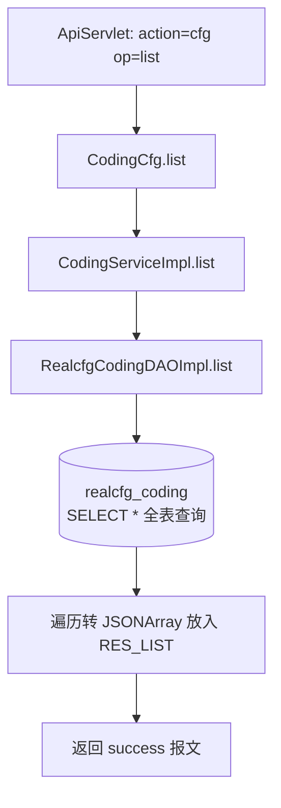

# CodingCfg

执测单元与平台编码对照表查询服务：返回 realcfg_coding 表全量数据，用于执测单元编码（code）与平台编码（pfCode）之间的翻译。只读。

## op 一览

| op | 功能 |
| --- | --- |
| list | 查询编码对照表全量列表 |

### list (`CodingCfg.list`)

- **入口**：ApiServlet，action=cfg，op=CodingCfg.list
- **实现意图**：返回执测单元平台编码对照表的全部记录，每条包含执测单元编码 code、平台编码 pfCode、结果分类 resultCategory 和描述 descr，供各模块做编码翻译或后台展示。无请求参数、无条件过滤。
- **请求参数**：无
- **响应结构**：统一返回 `{code, msg, data}` 报文，错误时无 `data` 节点。

| 字段 | 类型 | 说明 |
| --- | --- | --- |
| code | Integer | 返回码，0 成功 |
| msg | String | 提示信息 |
| data | Object | 数据对象 |
| data.list | Array\<Object\> | 编码对照数组，元素字段： |
| data.list[].code | Integer | 执测单元编码 |
| data.list[].pfCode | Integer | 平台对应编码 |
| data.list[].resultCategory | Integer | 结果分类 |
| data.list[].descr | String | 描述 |
| data.list[].status | Integer | 状态 |
| data.list[].createtime | Long | 创建时间（毫秒时间戳） |
| data.list[].updatetime | Long | 更新时间（毫秒时间戳） |
- **处理流程**：



- **调用链**：cn.testin.service.cfg.CodingCfg → cn.testin.business.impl.CodingServiceImpl → cn.testin.dao.impl.realcfg.RealcfgCodingDAOImpl → 表 realcfg_coding
- **涉及表与 SQL**：
  - `realcfg_coding`：SELECT（`SELECT * FROM realcfg_coding`，无条件），DAO 方法 `RealcfgCodingDAOImpl.list()`
- **异常与校验**：无参数校验；DAO 异常被 catch 后返回 null，service 层判空返回空数组
- **关键代码摘录**：

```java
// real-cfg/src/main/java/cn/testin/service/cfg/CodingCfg.java
List<RealcfgCoding> list = irealcfgcodingservice.list();
JSONArray codingJsonarr = new JSONArray();
if (list != null) {
    for (RealcfgCoding coding : list) {
        codingJsonarr.put(coding.toJson());
    }
}
datamap.put(ApiResponse.RES_LIST, codingJsonarr);
```
