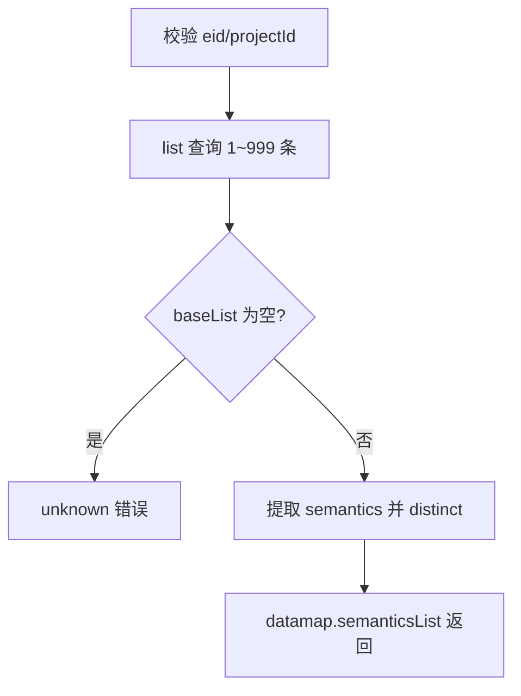
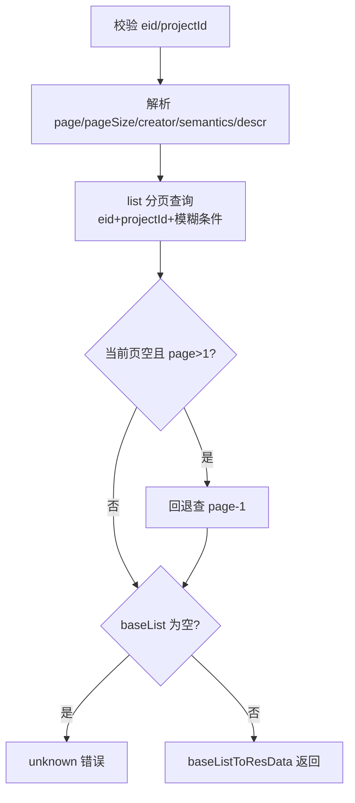
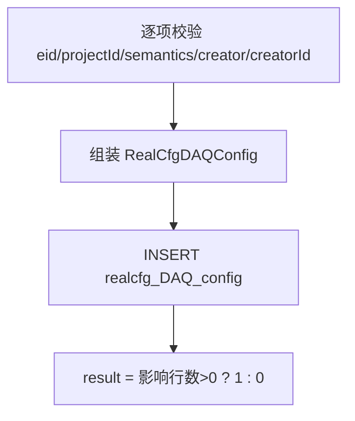
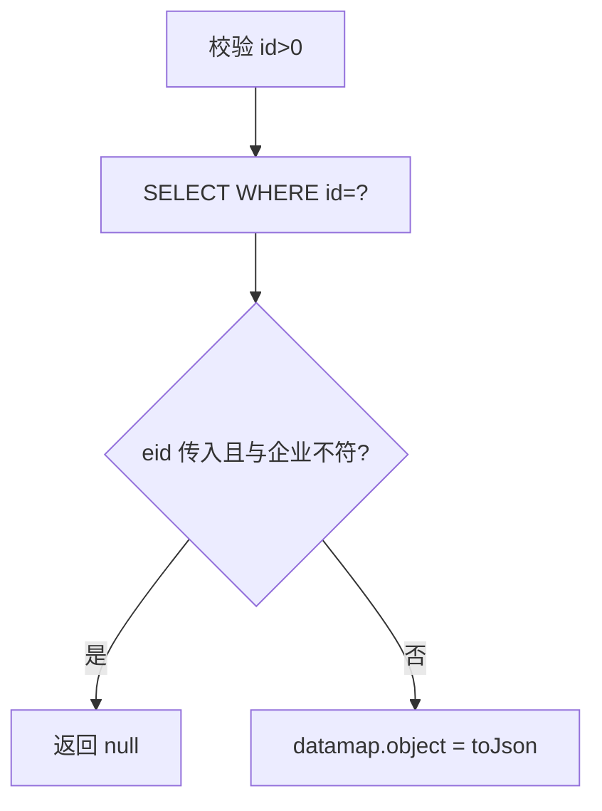
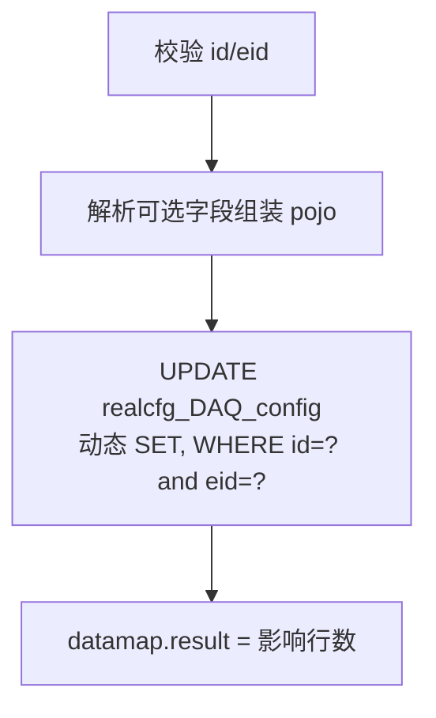
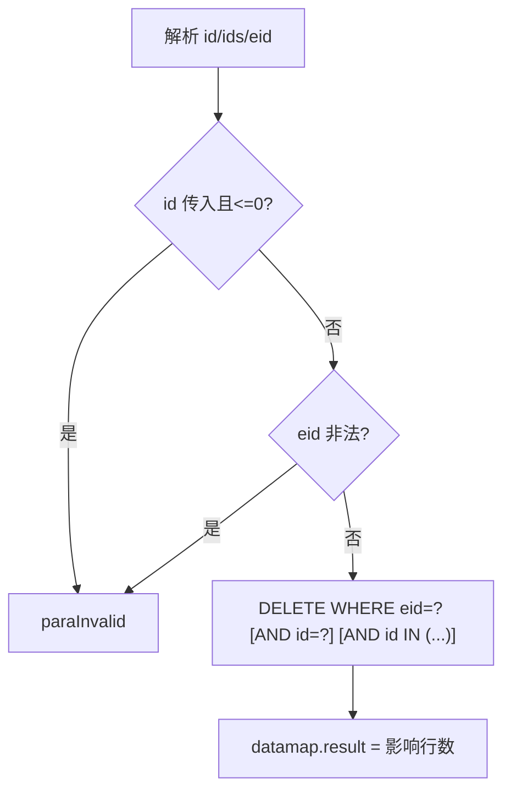
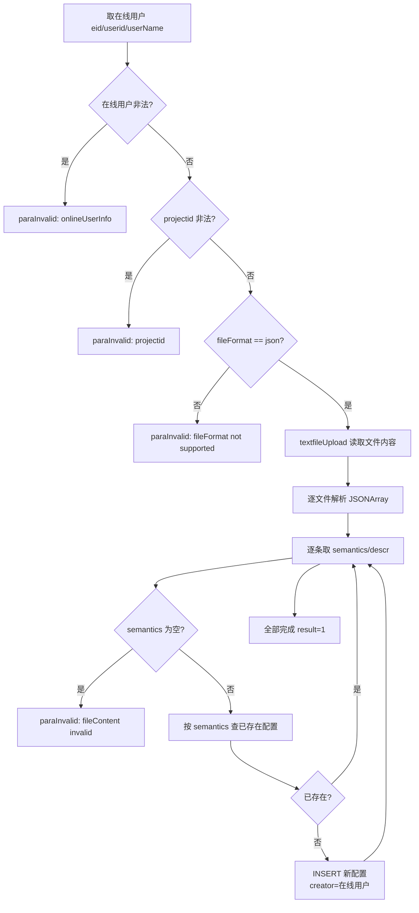

# DAQCfg

DAQ（数据采集）语义配置管理服务：维护企业/项目组下的 DAQ 语义（semantics）配置，提供条件项查询、分页列表、增改删（含批量删除）以及 JSON 文件批量导入。

- 源码：`real-cfg/src/main/java/cn/testin/service/cfg/DAQCfg.java`
- 业务实现：`real-cfg/src/main/java/cn/testin/business/impl/RealCfgDAQConfigServiceImpl.java`
- DAO：`real-cfg/src/main/java/cn/testin/dao/impl/realcfg/RealcfgDAQConfigDAOImpl.java`
- pojo：`cn.testin.pojo.realcfg.RealCfgDAQConfig`（表 `realcfg_DAQ_config`）

## op 一览

| op | 说明 |
|---|---|
| getConditionList | 查询语义去重列表（下拉条件项） |
| list | 分页条件查询 DAQ 配置列表 |
| add | 新增 DAQ 配置 |
| get | 按 id 查询单条配置 |
| maintain | 更新 DAQ 配置 |
| delete | 删除（支持 ids 批量） |
| importByFile | JSON 文件批量导入 |

---

### getConditionList (`DAQCfg.getConditionList`)

- **入口**：ApiServlet，action=cfg，op=DAQCfg.getConditionList
- **实现意图**：为前端筛选下拉框提供条件项：查出该 eid+projectId 下全部 DAQ 配置（1~999 条），提取 semantics 字段并去重返回。
- **请求参数**：

| 参数名 | 类型 | 必填 | 说明 |
|---|---|---|---|
| eid | int | 是 | 企业 ID，>=1 |
| projectId | int | 是 | 项目组 ID，>=1 |

- **响应结构**：统一返回 `{code, msg, data}` 报文，错误时无 `data` 节点。

| 字段 | 类型 | 说明 |
| --- | --- | --- |
| code | Integer | 返回码，0 成功 |
| msg | String | 提示信息 |
| data | Object | 数据对象 |
| data.semanticsList | Array\<String\> | 去重后的语义字符串数组 |
- **处理流程**：



- **调用链**：DAQCfg → IRealCfgDAQConfigService（RealCfgDAQConfigServiceImpl）→ IRealcfgDAQConfigDAO（RealcfgDAQConfigDAOImpl）
- **涉及表与 SQL**：`realcfg_DAQ_config`：SELECT WHERE eid=? and project_id=?，`RealcfgDAQConfigDAOImpl.list`
- **异常与校验**：eid/projectId 缺失、非数字或 <1 返回 `CommonCode.paraInvalid`；查询结果为空返回 `CommonCode.unknown`。
- **关键代码摘录**：

```java
// real-cfg/src/main/java/cn/testin/service/cfg/DAQCfg.java
BaseList<RealCfgDAQConfig> baseList = iRealCfgDAQConfigService.list(eid, projectId, realcfgdaqConfig, 1, 999);
// ...
semanticsList = semanticsList.stream().distinct().collect(Collectors.toList());
datamap.put("semanticsList", semanticsList);
```

---

### list (`DAQCfg.list`)

- **入口**：ApiServlet，action=cfg，op=DAQCfg.list
- **实现意图**：分页条件查询 DAQ 配置列表，支持按创建人、语义、备注模糊过滤（DAO 层 like %x%），按 id 倒序。业务层有"当前页无数据则回退查前一页"的兜底逻辑。
- **请求参数**：

| 参数名 | 类型 | 必填 | 说明 |
|---|---|---|---|
| eid | int | 是 | 企业 ID，>=1 |
| projectId | int | 是 | 项目组 ID，>=1 |
| page | int | 否 | 页码，默认 1 |
| pageSize | int | 否 | 每页条数，默认 Config.MaxSize |
| creator | string | 否 | 创建人（模糊） |
| semantics | string | 否 | 语义（模糊） |
| descr | string | 否 | 备注（模糊） |

- **响应结构**：统一返回 `{code, msg, data}` 报文，错误时无 `data` 节点。

| 字段 | 类型 | 说明 |
| --- | --- | --- |
| code | Integer | 返回码，0 成功 |
| msg | String | 提示信息 |
| data | Object | 数据对象 |
| data.list | Array\<Object\> | 当前页 DAQ 配置数组，元素字段： |
| data.list[].id | Integer | DAQ 配置 ID |
| data.list[].eid | Integer | 企业 ID |
| data.list[].projectId | Integer | 项目组 ID |
| data.list[].semantics | String | 语义 |
| data.list[].creator | String | 创建人 |
| data.list[].creatorId | Integer | 创建人 ID |
| data.list[].descr | String | 备注 |
| data.list[].status | Integer | 状态 |
| data.list[].createtime | Long | 创建时间（毫秒时间戳） |
| data.list[].updatetime | Long | 更新时间（毫秒时间戳） |
| data.page | Integer | 当前页码 |
| data.pageSize | Integer | 每页条数 |
| data.totalRow | Long | 总条数 |
| data.totalPage | Integer | 总页数 |
- **处理流程**：



- **调用链**：DAQCfg → IRealCfgDAQConfigService → IRealcfgDAQConfigDAO（list）
- **涉及表与 SQL**：`realcfg_DAQ_config`：SELECT + SELECT count(*)，WHERE eid/project_id [+semantics/creator/descr like]，ORDER BY id DESC，`RealcfgDAQConfigDAOImpl.list`
- **异常与校验**：eid/projectId 非法返回 `CommonCode.paraInvalid`；结果为空返回 `CommonCode.unknown`。
- **关键代码摘录**：

```java
// real-cfg/src/main/java/cn/testin/business/impl/RealCfgDAQConfigServiceImpl.java
BaseList<RealCfgDAQConfig> list = irealcfgdaqconfigdao.list(eid, projectId, realCfgDAQConfig, page, pageSize);
if (list.getList().size() == 0 && page - 1 >= 1) {
    list = irealcfgdaqconfigdao.list(eid, projectId, realCfgDAQConfig, page - 1, pageSize);
}
```

---

### add (`DAQCfg.add`)

- **入口**：ApiServlet，action=cfg，op=DAQCfg.add
- **实现意图**：新增一条 DAQ 语义配置。semantics、creator、creatorId 必填，descr 可选。
- **请求参数**：

| 参数名 | 类型 | 必填 | 说明 |
|---|---|---|---|
| eid | int | 是 | 企业 ID，>=1 |
| projectId | int | 是 | 项目组 ID，>=0 |
| semantics | string | 是 | 语义 |
| creator | string | 是 | 创建人 |
| creatorId | int | 是 | 创建人 ID |
| descr | string | 否 | 备注 |

- **响应结构**：统一返回 `{code, msg, data}` 报文，错误时无 `data` 节点。

| 字段 | 类型 | 说明 |
| --- | --- | --- |
| code | Integer | 返回码，0 成功 |
| msg | String | 提示信息 |
| data | Object | 数据对象 |
| data.result | Integer | 1 成功 / 0 失败 |
- **处理流程**：



- **调用链**：DAQCfg → IRealCfgDAQConfigService → IRealcfgDAQConfigDAO（add）
- **涉及表与 SQL**：`realcfg_DAQ_config`：INSERT（eid, project_id, semantics, creator, creator_id, descr, createtime, updatetime），`RealcfgDAQConfigDAOImpl.add`
- **异常与校验**：各必填项缺失/非法返回 `CommonCode.paraInvalid`；DAO 层二次校验 eid>=1、projectId/semantics 非空，否则返回 0。
- **关键代码摘录**：

```java
// real-cfg/src/main/java/cn/testin/service/cfg/DAQCfg.java
realCfgDAQConfig.setEid(eid);
realCfgDAQConfig.setProjectId(projectId);
realCfgDAQConfig.setSemantics(semantics);
realCfgDAQConfig.setCreator(creator);
realCfgDAQConfig.setCreatorId(creatorId);
realCfgDAQConfig.setDescr(descr);
Integer result = iRealCfgDAQConfigService.add(realCfgDAQConfig);
datamap.put("result", result > 0 ? 1 : 0);
```

---

### get (`DAQCfg.get`)

- **入口**：ApiServlet，action=cfg，op=DAQCfg.get
- **实现意图**：按 id 查询单条 DAQ 配置；传 eid 时校验记录归属该企业，否则返回空。
- **请求参数**：

| 参数名 | 类型 | 必填 | 说明 |
|---|---|---|---|
| id | int | 是 | DAQ 配置 ID，>0 |
| eid | int | 否 | 企业 ID（传入时校验归属） |

- **响应结构**：统一返回 `{code, msg, data}` 报文，错误时无 `data` 节点。

| 字段 | 类型 | 说明 |
| --- | --- | --- |
| code | Integer | 返回码，0 成功 |
| msg | String | 提示信息 |
| data | Object | 数据对象 |
| data.objInfo | Object | RealCfgDAQConfig 对象（查不到时无此节点） |
| data.objInfo.id | Integer | DAQ 配置 ID |
| data.objInfo.eid | Integer | 企业 ID |
| data.objInfo.projectId | Integer | 项目组 ID |
| data.objInfo.semantics | String | 语义 |
| data.objInfo.creator | String | 创建人 |
| data.objInfo.creatorId | Integer | 创建人 ID |
| data.objInfo.descr | String | 备注 |
| data.objInfo.status | Integer | 状态 |
| data.objInfo.createtime | Long | 创建时间（毫秒时间戳） |
| data.objInfo.updatetime | Long | 更新时间（毫秒时间戳） |
- **处理流程**：



- **调用链**：DAQCfg → IRealCfgDAQConfigService → IRealcfgDAQConfigDAO（get）
- **涉及表与 SQL**：`realcfg_DAQ_config`：SELECT WHERE id=?，`RealcfgDAQConfigDAOImpl.get`
- **异常与校验**：id 缺失/<=0 返回 `CommonCode.paraInvalid`；eid 传入但 <1 同样报错。
- **关键代码摘录**：

```java
// real-cfg/src/main/java/cn/testin/dao/impl/realcfg/RealcfgDAQConfigDAOImpl.java
RealCfgDAQConfig result = this.getRealcfgdao().get(sql.toString(), new Object[]{id}, new RealCfgDAQConfigRowMapper());
if (result != null && eid != null && !result.getEid().equals(eid)) {
    return null;
}
```

---

### maintain (`DAQCfg.maintain`)

- **入口**：ApiServlet，action=cfg，op=DAQCfg.maintain
- **实现意图**：更新 DAQ 配置。id、eid 必填；其余字段（projectId/semantics/creator/creatorId/descr）按需传入，DAO 动态拼接 SET 子句；descr 未传时会被置为空串。
- **请求参数**：

| 参数名 | 类型 | 必填 | 说明 |
|---|---|---|---|
| id | int | 是 | DAQ 配置 ID，>0 |
| eid | int | 是 | 企业 ID，>=1 |
| projectId | int | 否 | 项目组 ID，>=0 |
| semantics | string | 否 | 语义 |
| creator | string | 否 | 创建人 |
| creatorId | int | 否 | 创建人 ID |
| descr | string | 否 | 备注（传入空也生效，key 存在即取） |

- **响应结构**：统一返回 `{code, msg, data}` 报文，错误时无 `data` 节点。

| 字段 | 类型 | 说明 |
| --- | --- | --- |
| code | Integer | 返回码，0 成功 |
| msg | String | 提示信息 |
| data | Object | 数据对象 |
| data.result | Integer | 更新影响行数 |
- **处理流程**：



- **调用链**：DAQCfg → IRealCfgDAQConfigService → IRealcfgDAQConfigDAO（maintain）
- **涉及表与 SQL**：`realcfg_DAQ_config`：UPDATE（project_id/semantics/creator/creator_id/descr/status/updatetime，WHERE id and eid），`RealcfgDAQConfigDAOImpl.maintain`
- **异常与校验**：id/eid 非法返回 `CommonCode.paraInvalid`。
- **关键代码摘录**：

```java
// real-cfg/src/main/java/cn/testin/service/cfg/DAQCfg.java
realCfgDAQConfig.setId(id);
realCfgDAQConfig.setEid(eid);
// ... 可选字段
Integer result = iRealCfgDAQConfigService.maintain(realCfgDAQConfig);
datamap.put("result", result);
```

---

### delete (`DAQCfg.delete`)

- **入口**：ApiServlet，action=cfg，op=DAQCfg.delete
- **实现意图**：删除 DAQ 配置，支持单条（id）与批量（ids 数组）两种方式，均限定在 eid 下。DAO 将 ids 拼为 `id in (...)` 条件。
- **请求参数**：

| 参数名 | 类型 | 必填 | 说明 |
|---|---|---|---|
| id | int | 否 | 单删 ID，>0 |
| ids | array&lt;int&gt; | 否 | 批量删除 ID 数组 |
| eid | int | 是 | 企业 ID，>=1 |

- **响应结构**：统一返回 `{code, msg, data}` 报文，错误时无 `data` 节点。

| 字段 | 类型 | 说明 |
| --- | --- | --- |
| code | Integer | 返回码，0 成功 |
| msg | String | 提示信息 |
| data | Object | 数据对象 |
| data.result | Integer | 删除影响行数 |
- **处理流程**：



- **调用链**：DAQCfg → IRealCfgDAQConfigService → IRealcfgDAQConfigDAO（delete）
- **涉及表与 SQL**：`realcfg_DAQ_config`：DELETE WHERE eid=? [AND id=?] [AND id IN (...)]，`RealcfgDAQConfigDAOImpl.delete`
- **异常与校验**：id/eid 非法返回 `CommonCode.paraInvalid`。注意：id 与 ids 都未传时，SQL 退化为仅按 eid 删除（调用方需自行保证传参）。
- **关键代码摘录**：

```java
// real-cfg/src/main/java/cn/testin/dao/impl/realcfg/RealcfgDAQConfigDAOImpl.java
sql.append("DELETE FROM ").append(RealCfgDAQConfig.table()).append(" WHERE  eid = ?");
if (id != null) {
    sql.append(" AND  id = ?");
}
if (ids != null && ids.length() > 0) {
    sql.append(" AND id in (");
    // 逐个 append ? 占位
}
```

---

### importByFile (`DAQCfg.importByFile`)

- **入口**：ApiServlet，action=cfg，op=DAQCfg.importByFile（签名含 HttpServletRequest，走文件上传通道）
- **实现意图**：通过上传 JSON 文件批量导入 DAQ 配置（第一期仅支持 json 格式）。操作人信息取自在线用户（apirequest.getOnlineUserInfo），文件内容为 JSON 数组，元素含 semantics/descr。逐条处理：semantics 为空的直接报错；先按 semantics 查重（同 eid+projectid 下已存在则跳过），不存在则以在线用户为创建人插入。
- **请求参数**：

| 参数名 | 类型 | 必填 | 说明 |
|---|---|---|---|
| projectid | int | 是 | 项目组 ID（优先取请求体，其次在线用户信息），>=1 |
| fileFormat | string | 是 | 文件格式，仅支持 json |
| （在线用户） | - | 是 | 从 apirequest.onlineUserInfo 取 eid/userid/userName |
| （上传文件） | multipart | 是 | JSON 数组：[{"semantics":"...", "descr":"..."}] |

- **响应结构**：统一返回 `{code, msg, data}` 报文，错误时无 `data` 节点。

| 字段 | 类型 | 说明 |
| --- | --- | --- |
| code | Integer | 返回码，0 成功 |
| msg | String | 提示信息 |
| data | Object | 数据对象 |
| data.result | Integer | 1（全部处理完成）；过程中出错直接返回错误 |
- **处理流程**：



- **调用链**：DAQCfg → GenericBaseService.textfileUpload（文件上传解析）→ IRealCfgDAQConfigService（list 查重 / add 插入）→ IRealcfgDAQConfigDAO
- **涉及表与 SQL**：`realcfg_DAQ_config`：SELECT（按 semantics 查重）+ INSERT，`RealcfgDAQConfigDAOImpl.list/add`
- **异常与校验**：在线用户缺失、projectid 非法、fileFormat 非 json、semantics 为空、文件内容非合法 JSON 均返回 `CommonCode.paraInvalid`。
- **关键代码摘录**：

```java
// real-cfg/src/main/java/cn/testin/service/cfg/DAQCfg.java
BaseList<RealCfgDAQConfig> baselist = iRealCfgDAQConfigService.list(eid, projectid, daqConfig, 1, 100);
if (baselist != null && baselist.getList() != null) {
    boolean hasConfig = false;
    for (RealCfgDAQConfig config : baselist.getList()) {
        if (semantics.equals(config.getSemantics())) { hasConfig = true; break; }
    }
    if (hasConfig) { continue; }
}
// 不存在则插入
daqConfig = new RealCfgDAQConfig();
daqConfig.setEid(eid);
daqConfig.setProjectId(projectid);
daqConfig.setSemantics(semantics);
daqConfig.setCreator(userName);
daqConfig.setCreatorId(userid);
iRealCfgDAQConfigService.add(daqConfig);
```
