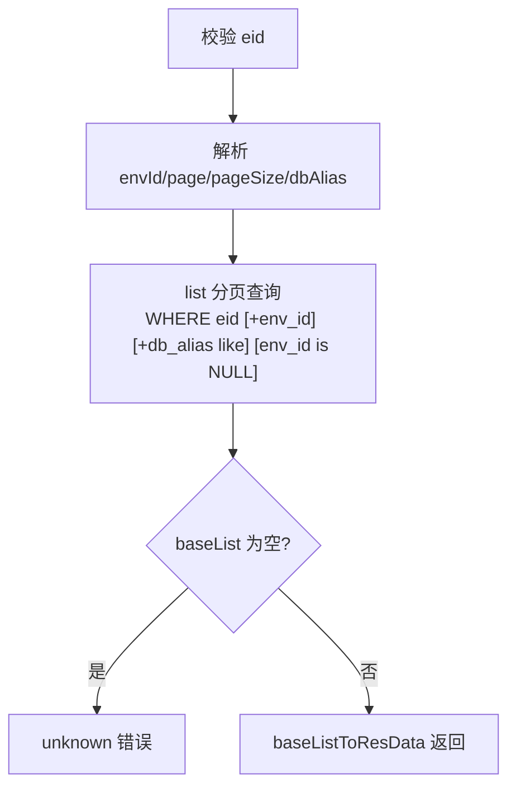
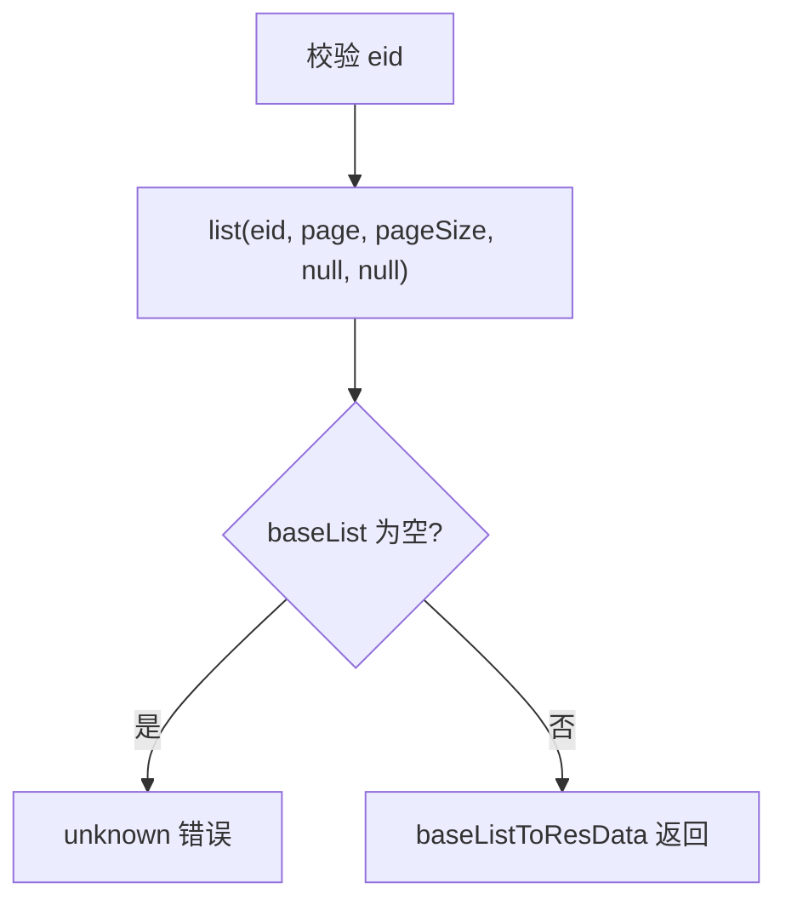
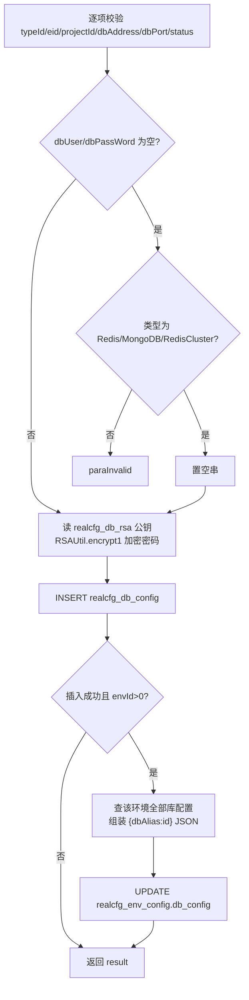
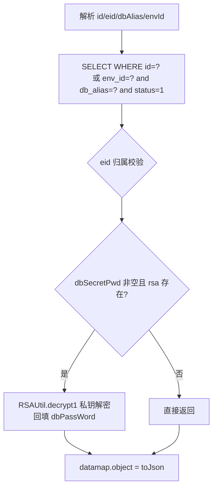
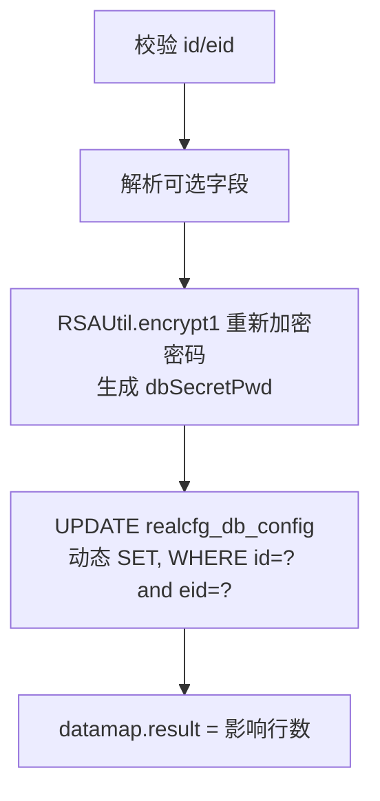
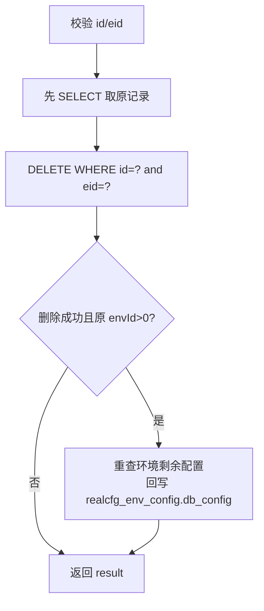
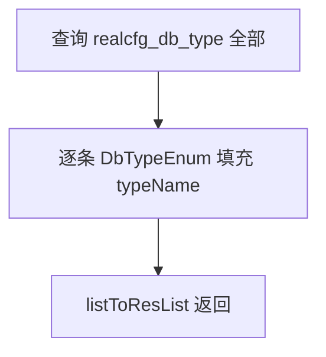
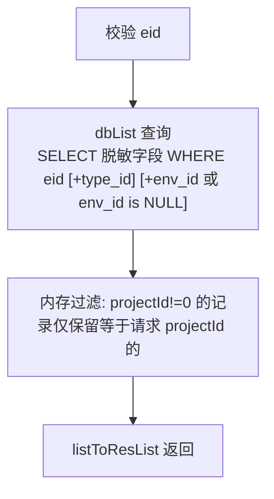
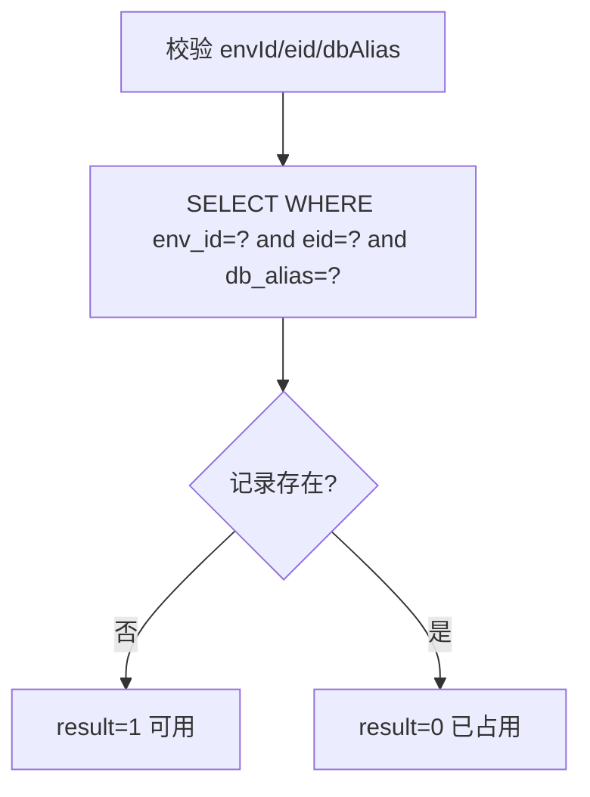

# DbCfg

数据库连接配置管理服务：维护企业/项目组/环境下的数据库连接配置（地址、端口、库名、账号、密码、超时等），供测试执行类业务按环境取用连接信息。密码采用 RSA 加密存储机制：平台在 `realcfg_db_rsa` 表中保存一对 RSA 密钥，写入时用公钥加密（密文存 `db_secret_pwd` 列），读取详情时用私钥解密回填明文。

- 源码：`real-cfg/src/main/java/cn/testin/service/cfg/DbCfg.java`
- 业务实现：`real-cfg/src/main/java/cn/testin/business/impl/RealCfgDbConfigServiceImpl.java`、`RealCfgDbRsaServiceImpl.java`、`RealCfgDbTypeServiceImpl.java`
- DAO：`real-cfg/src/main/java/cn/testin/dao/impl/realcfg/RealcfgDbConfigDAOImpl.java`、`RealcfgDbRsaImpl.java`、`RealcfgDbTypeDAOImpl.java`
- pojo：`cn.testin.pojo.realcfg.RealCfgDbConfig`（表 `realcfg_db_config`，序列 `seq_realcfg_db_config`）、`RealCfgDbRsa`（表 `realcfg_db_rsa`）、`RealCfgDbType`（表 `realcfg_db_type`）

## RSA 密码存储机制（如实记录）

1. `realcfg_db_rsa` 表保存全局一对 RSA 公私钥（`RealCfgDbRsa.pub/pri`），由 `iRealCfgDbRsaService.get()` 读取。
2. add/maintain 时：`dbSecretPwd = RSAUtil.encrypt1(dbPassWord, realCfgDbRsa.getPub())`，密文写入 `db_secret_pwd` 列（`cn.testin.util.RSAUtil.encrypt1`）。同时 `db_password` 列也写入所传值（Redis/MongoDB/RedisCluster 类型允许为空串）。
3. get 时：读取 `db_secret_pwd`，用私钥 `RSAUtil.decrypt1(dbSecretPwd, rsa.getPri())` 解密，将明文回填到 `dbPassWord` 字段后返回。
4. 业务层日志会打印密文（`Logit.debugLog("打印数据库的密文信息：" + dbconfig.getDbSecretPwd())`）。

## op 一览

| op | 说明 |
|---|---|
| listByEnvId | 按环境分页查询数据库配置 |
| list | 按企业分页查询（不含环境归属的记录） |
| add | 新增数据库配置（RSA 加密密码，联动更新环境配置） |
| get | 查询单条配置（私钥解密密码返回） |
| maintain | 更新配置（重新加密密码） |
| delete | 删除配置（联动更新环境配置） |
| typeList | 查询数据库类型列表 |
| dbList | 按类型/项目/环境查可用库列表（脱敏字段集） |
| checkName | 校验环境下 dbAlias 唯一标识是否可用 |

---

### listByEnvId (`DbCfg.listByEnvId`)

- **入口**：ApiServlet，action=cfg，op=DbCfg.listByEnvId
- **实现意图**：按企业 + 环境（envId）分页查询数据库配置，支持 dbAlias 模糊过滤，按创建时间倒序。envId 与 dbAlias 都不传时，DAO 追加 `env_id is NULL`（即查未归属任何环境的配置）。
- **请求参数**：

| 参数名 | 类型 | 必填 | 说明 |
|---|---|---|---|
| eid | int | 是 | 企业 ID，>=1 |
| envId | int | 否 | 环境 ID，>0 |
| page | int | 否 | 页码，默认 1 |
| pageSize | int | 否 | 每页条数，默认 Config.MaxSize |
| dbAlias | string | 否 | 数据库唯一标识（like 模糊） |

- **响应结构**：统一返回 `{code, msg, data}` 报文，错误时无 `data` 节点。

| 字段 | 类型 | 说明 |
| --- | --- | --- |
| code | Integer | 返回码，0 成功 |
| msg | String | 提示信息 |
| data | Object | 数据对象 |
| data.list | Array\<Object\> | 当前页数据库配置数组，元素字段： |
| data.list[].id | Integer | 配置 ID |
| data.list[].eid | Integer | 企业 ID |
| data.list[].projectId | Integer | 项目组 ID |
| data.list[].projectName | String | 项目组名称 |
| data.list[].typeId | Integer | 数据库类型 ID |
| data.list[].dbAddress | String | 数据库地址 |
| data.list[].dbPort | String | 端口 |
| data.list[].dbName | String | 数据库名 |
| data.list[].dbUser | String | 用户名 |
| data.list[].dbPassWord | String | 密码（存储值，列表不解密） |
| data.list[].dbSecretPwd | String | RSA 密文（db_secret_pwd 列） |
| data.list[].dbDescr | String | 描述 |
| data.list[].envId | Integer | 所属环境 ID |
| data.list[].channel | Integer | 渠道：1=环境管理；0=数据库管理 |
| data.list[].dbAlias | String | 环境内唯一标识 |
| data.list[].timeout | Integer | 超时时间（秒） |
| data.list[].status | Integer | 状态 |
| data.list[].createtime | Long | 创建时间（毫秒时间戳） |
| data.list[].updatetime | Long | 更新时间（毫秒时间戳） |
| data.page | Integer | 当前页码 |
| data.pageSize | Integer | 每页条数 |
| data.totalRow | Long | 总条数 |
| data.totalPage | Integer | 总页数 |
- **处理流程**：



- **调用链**：DbCfg → IRealCfgDbConfigService（RealCfgDbConfigServiceImpl）→ IRealcfgDbConfigDAO（RealcfgDbConfigDAOImpl）
- **涉及表与 SQL**：`realcfg_db_config`：SELECT + count(*)，WHERE eid=? [and env_id=?] [and db_alias like ?] [and env_id is NULL]，ORDER BY createtime DESC，`RealcfgDbConfigDAOImpl.list`
- **异常与校验**：eid/envId 非法返回 `CommonCode.paraInvalid`；结果为空返回 `CommonCode.unknown`。
- **关键代码摘录**：

```java
// real-cfg/src/main/java/cn/testin/dao/impl/realcfg/RealcfgDbConfigDAOImpl.java
if (envId != null) {
    sql.append(" and env_id = ?");
}
if (StringUtils.isNotBlank(dbAlias)) {
    sql.append(" and db_alias like ?");
    params.add("%" + dbAlias + "%");
}
if (envId == null && StringUtils.isBlank(dbAlias)) {
    sql.append(" AND env_id is NULL");
}
```

---

### list (`DbCfg.list`)

- **入口**：ApiServlet，action=cfg，op=DbCfg.list
- **实现意图**：按企业分页查询数据库配置列表（内部转发到 DAO.list(eid, page, pageSize, null, null)，即仅查 env_id 为 NULL 的库管理渠道记录），按创建时间倒序。
- **请求参数**：

| 参数名 | 类型 | 必填 | 说明 |
|---|---|---|---|
| eid | int | 是 | 企业 ID，>=1 |
| page | int | 否 | 页码，默认 1 |
| pageSize | int | 否 | 每页条数，默认 Config.MaxSize |

- **响应结构**：统一返回 `{code, msg, data}` 报文，错误时无 `data` 节点。

| 字段 | 类型 | 说明 |
| --- | --- | --- |
| code | Integer | 返回码，0 成功 |
| msg | String | 提示信息 |
| data | Object | 数据对象 |
| data.list | Array\<Object\> | 当前页数据库配置数组，元素字段同 listByEnvId 的 `data.list[]` |
| data.page | Integer | 当前页码 |
| data.pageSize | Integer | 每页条数 |
| data.totalRow | Long | 总条数 |
| data.totalPage | Integer | 总页数 |
- **处理流程**：



- **调用链**：DbCfg → IRealCfgDbConfigService → IRealcfgDbConfigDAO（list）
- **涉及表与 SQL**：`realcfg_db_config`：SELECT + count(*)，WHERE eid=? AND env_id is NULL，`RealcfgDbConfigDAOImpl.list`
- **异常与校验**：eid 非法返回 `CommonCode.paraInvalid`；结果为空返回 `CommonCode.unknown`。
- **关键代码摘录**：

```java
// real-cfg/src/main/java/cn/testin/business/impl/RealCfgDbConfigServiceImpl.java
@Override
public BaseList<RealCfgDbConfig> list(Integer eid, Integer page, Integer pageSize) {
    return irealcfgdbconfigdao.list(eid, page, pageSize, null, null);
}
```

---

### add (`DbCfg.add`)

- **入口**：ApiServlet，action=cfg，op=DbCfg.add
- **实现意图**：新增数据库连接配置。typeId/eid/projectId/dbAddress/dbPort/status 必填；dbUser/dbPassWord 对 Redis/MongoDB/RedisCluster 类型允许为空（置空串）。写入前用 RSA 公钥加密密码生成 dbSecretPwd。插入成功后，若记录归属某个环境（envId>0），业务层会查出该环境下全部库配置，组装 {dbAlias: id} 映射 JSON，回写 `realcfg_env_config.db_config`（环境配置联动）。
- **请求参数**：

| 参数名 | 类型 | 必填 | 说明 |
|---|---|---|---|
| typeId | int | 是 | 数据库类型 ID（DbTypeEnum，>=1） |
| eid | int | 是 | 企业 ID，>=1 |
| projectId | int | 是 | 项目组 ID，>=0 |
| projectName | string | 否 | 项目组名称 |
| dbAddress | string | 是 | 数据库地址 |
| dbPort | string | 是 | 端口（数字） |
| dbName | string | 否 | 数据库名 |
| dbUser | string | 否 | 用户名（Redis/MongoDB/RedisCluster 可空） |
| dbPassWord | string | 否 | 密码（Redis/MongoDB/RedisCluster 可空） |
| status | int | 是 | 状态 0/1 |
| dbDescr | string | 否 | 描述 |
| envId | int | 否 | 所属环境 ID，>0 |
| channel | int | 否 | 渠道：1=环境管理创建；0=数据库管理创建 |
| dbAlias | string | 否 | 环境内唯一标识 |
| timeout | int | 否 | 超时时间（秒），默认 CommonConstants.DEFAULT_TIMEOUT（10 秒） |

- **响应结构**：统一返回 `{code, msg, data}` 报文，错误时无 `data` 节点。

| 字段 | 类型 | 说明 |
| --- | --- | --- |
| code | Integer | 返回码，0 成功 |
| msg | String | 提示信息 |
| data | Object | 数据对象 |
| data.result | Integer | 1 成功 / 0 失败 |
- **处理流程**：



- **调用链**：DbCfg → IRealCfgDbConfigService → IRealcfgDbConfigDAO（add/list）→ IRealCfgDbRsaService（RealCfgDbRsaServiceImpl → RealcfgDbRsaImpl）→ IRealcfgEnvConfigDAO（`SpringHelper.getBean("IRealcfgEnvConfigDAO")`，环境联动）→ cn.testin.util.RSAUtil
- **涉及表与 SQL**：
  - `realcfg_db_config`：INSERT（eid, type_id, project_id, project_name, db_address, db_port, db_name, db_user, db_password, db_descr, status, createtime, updatetime, env_id, channel, db_alias, db_secret_pwd, timeout），`RealcfgDbConfigDAOImpl.add`
  - `realcfg_db_rsa`：SELECT 取密钥对，`RealcfgDbRsaImpl.get`
  - `realcfg_db_config`：SELECT 按 envId 列表（联动），`RealcfgDbConfigDAOImpl.list`
  - `realcfg_env_config`：UPDATE db_config，`IRealcfgEnvConfigDAO.maintain`
- **异常与校验**：各必填项非法返回 `CommonCode.paraInvalid`；status 非 0/1 报错；DAO 层二次校验 typeId/eid/dbAddress/dbPort，失败返回 0。
- **关键代码摘录**：

```java
// real-cfg/src/main/java/cn/testin/service/cfg/DbCfg.java
//使用RSA加密存储，公钥用于生成密码，私钥用于解密，密文存数据库，明文不存
RealCfgDbRsa realCfgDbRsa = iRealCfgDbRsaService.get();
dbSecretPwd = RSAUtil.encrypt1(dbPassWord, realCfgDbRsa.getPub());
// ...
dbConfig.setDbSecretPwd(dbSecretPwd);
Integer result = iRealCfgDbConfigService.add(dbConfig);
```

```java
// real-cfg/src/main/java/cn/testin/business/impl/RealCfgDbConfigServiceImpl.java
// 环境里：将 {dbAlias: id} 映射回写环境配置
JSONObject envDbConfig = new JSONObject();
for (RealCfgDbConfig realCfgDbConfig : resultList) {
    envDbConfig.put(realCfgDbConfig.getDbAlias(), realCfgDbConfig.getId());
}
envConfig.setDbConfig(envDbConfig.toString());
Integer maintainResult = iRealcfgEnvConfigDAO.maintain(envConfig);
```

---

### get (`DbCfg.get`)

- **入口**：ApiServlet，action=cfg，op=DbCfg.get
- **实现意图**：查询单条数据库配置，支持按 id 或按 envId+dbAlias（环境内唯一标识，且要求 status=1）两种方式。查到后用 RSA 私钥解密 db_secret_pwd，明文回填 dbPassWord 返回。传 eid 时校验记录归属。
- **请求参数**：

| 参数名 | 类型 | 必填 | 说明 |
|---|---|---|---|
| id | int | 否 | 配置 ID（传入时 >0） |
| eid | int | 否 | 企业 ID（传入时校验归属，>=1） |
| dbAlias | string | 否 | 环境内唯一标识（与 envId 配合使用） |
| envId | int | 否 | 环境 ID（与 dbAlias 配合使用） |

- **响应结构**：统一返回 `{code, msg, data}` 报文，错误时无 `data` 节点。

| 字段 | 类型 | 说明 |
| --- | --- | --- |
| code | Integer | 返回码，0 成功 |
| msg | String | 提示信息 |
| data | Object | 数据对象 |
| data.objInfo | Object | RealCfgDbConfig 对象（查不到时无此节点） |
| data.objInfo.id | Integer | 配置 ID |
| data.objInfo.eid | Integer | 企业 ID |
| data.objInfo.projectId | Integer | 项目组 ID |
| data.objInfo.projectName | String | 项目组名称 |
| data.objInfo.typeId | Integer | 数据库类型 ID |
| data.objInfo.dbAddress | String | 数据库地址 |
| data.objInfo.dbPort | String | 端口 |
| data.objInfo.dbName | String | 数据库名 |
| data.objInfo.dbUser | String | 用户名 |
| data.objInfo.dbPassWord | String | 密码（RSA 私钥解密后的明文） |
| data.objInfo.dbSecretPwd | String | RSA 密文（db_secret_pwd 列） |
| data.objInfo.dbDescr | String | 描述 |
| data.objInfo.envId | Integer | 所属环境 ID |
| data.objInfo.channel | Integer | 渠道：1=环境管理；0=数据库管理 |
| data.objInfo.dbAlias | String | 环境内唯一标识 |
| data.objInfo.timeout | Integer | 超时时间（秒） |
| data.objInfo.status | Integer | 状态 |
| data.objInfo.createtime | Long | 创建时间（毫秒时间戳） |
| data.objInfo.updatetime | Long | 更新时间（毫秒时间戳） |
- **处理流程**：



- **调用链**：DbCfg → IRealCfgDbConfigService → IRealcfgDbConfigDAO（get）→ IRealCfgDbRsaService → RSAUtil
- **涉及表与 SQL**：`realcfg_db_config`：SELECT WHERE id=? 或 env_id=? and db_alias=? and status=1，`RealcfgDbConfigDAOImpl.get`；`realcfg_db_rsa`：SELECT，`RealcfgDbRsaImpl.get`
- **异常与校验**：id（传入时 <=0）/eid 非法返回 `CommonCode.paraInvalid`。
- **关键代码摘录**：

```java
// real-cfg/src/main/java/cn/testin/service/cfg/DbCfg.java
dbConfig = iRealCfgDbConfigService.get(id, eid, dbAlias, envId);
if (dbConfig != null) {
    RealCfgDbRsa rsa = iRealCfgDbRsaService.get();
    if (!StringUtils.isBlank(dbConfig.getDbSecretPwd())) {
        String dbSecretPwd = dbConfig.getDbSecretPwd();
        if (rsa != null) {
            String clear = RSAUtil.decrypt1(dbSecretPwd, rsa.getPri());
            dbConfig.setDbPassWord(clear);
        }
    }
}
```

---

### maintain (`DbCfg.maintain`)

- **入口**：ApiServlet，action=cfg，op=DbCfg.maintain
- **实现意图**：更新数据库配置。id、eid 必填；typeId 传入时 >=1。dbUser/dbPassWord 对 Redis/MongoDB/RedisCluster 允许为空（置空串）。每次更新都会重新用公钥加密所传密码生成新的 dbSecretPwd 一并更新。DAO 动态拼接 SET（descr 未传置空串），WHERE id and eid。
- **请求参数**：

| 参数名 | 类型 | 必填 | 说明 |
|---|---|---|---|
| id | int | 是 | 配置 ID，>0 |
| eid | int | 是 | 企业 ID，>=1 |
| typeId | int | 否 | 数据库类型 ID，>=1 |
| projectId | int | 否 | 项目组 ID，>=0 |
| projectName | string | 否 | 项目组名称 |
| dbAddress | string | 否 | 数据库地址 |
| dbPort | string | 否 | 端口（数字） |
| dbName | string | 否 | 数据库名 |
| dbUser | string | 否 | 用户名（Redis/MongoDB/RedisCluster 可空） |
| dbPassWord | string | 否 | 密码（Redis/MongoDB/RedisCluster 可空） |
| status | int | 否 | 状态 0/1 |
| dbDescr | string | 否 | 描述 |
| dbAlias | string | 否 | 环境内唯一标识 |
| timeout | int | 否 | 超时时间（秒），默认 DEFAULT_TIMEOUT |

- **响应结构**：统一返回 `{code, msg, data}` 报文，错误时无 `data` 节点。

| 字段 | 类型 | 说明 |
| --- | --- | --- |
| code | Integer | 返回码，0 成功 |
| msg | String | 提示信息 |
| data | Object | 数据对象 |
| data.result | Integer | 更新影响行数 |
- **处理流程**：



- **调用链**：DbCfg → IRealCfgDbConfigService → IRealcfgDbConfigDAO（maintain）→ IRealCfgDbRsaService → RSAUtil
- **涉及表与 SQL**：`realcfg_db_config`：UPDATE（type_id/project_id/project_name/db_address/db_port/db_name/db_user/db_password/db_descr/status/db_alias/db_secret_pwd/timeout/updatetime，WHERE id and eid），`RealcfgDbConfigDAOImpl.maintain`
- **异常与校验**：id/eid 非法、status 非 0/1 返回 `CommonCode.paraInvalid`。
- **关键代码摘录**：

```java
// real-cfg/src/main/java/cn/testin/service/cfg/DbCfg.java
//使用RSA加密存储，公钥用于生成密码，私钥用于解密，密文存数据库，明文不存
RealCfgDbRsa realCfgDbRsa = iRealCfgDbRsaService.get();
dbSecretPwd = RSAUtil.encrypt1(dbPassWord, realCfgDbRsa.getPub());
// ...
dbConfig.setDbSecretPwd(dbSecretPwd);
Integer result = iRealCfgDbConfigService.maintain(dbConfig);
```

---

### delete (`DbCfg.delete`)

- **入口**：ApiServlet，action=cfg，op=DbCfg.delete
- **实现意图**：按 id+eid 物理删除数据库配置。删除成功后，若记录原属某环境（envId>0），业务层重新查询该环境剩余库配置并回写 `realcfg_env_config.db_config` 映射（环境联动，同 add）。
- **请求参数**：

| 参数名 | 类型 | 必填 | 说明 |
|---|---|---|---|
| id | int | 是 | 配置 ID，>0 |
| eid | int | 是 | 企业 ID，>=1 |

- **响应结构**：统一返回 `{code, msg, data}` 报文，错误时无 `data` 节点。

| 字段 | 类型 | 说明 |
| --- | --- | --- |
| code | Integer | 返回码，0 成功 |
| msg | String | 提示信息 |
| data | Object | 数据对象 |
| data.result | Integer | 删除影响行数 |
- **处理流程**：



- **调用链**：DbCfg → IRealCfgDbConfigService → IRealcfgDbConfigDAO（get/delete/list）→ IRealcfgEnvConfigDAO（环境联动）
- **涉及表与 SQL**：`realcfg_db_config`：DELETE WHERE id=? and eid=?，`RealcfgDbConfigDAOImpl.delete`；`realcfg_env_config`：UPDATE db_config（联动）
- **异常与校验**：id/eid 非法返回 `CommonCode.paraInvalid`。
- **关键代码摘录**：

```java
// real-cfg/src/main/java/cn/testin/business/impl/RealCfgDbConfigServiceImpl.java
RealCfgDbConfig dbconfig = irealcfgdbconfigdao.get(id, eid, null, null);
int result = irealcfgdbconfigdao.delete(id, eid);
if (result == 0 || dbconfig == null || dbconfig.getEnvId() == null || dbconfig.getEnvId() <= 0) {
    return result;
}
// 环境里：重查并回写 envconfig.db_config
```

---

### typeList (`DbCfg.typeList`)

- **入口**：ApiServlet，action=cfg，op=DbCfg.typeList
- **实现意图**：查询数据库类型字典列表（`realcfg_db_type`），业务层用 `DbTypeEnum.valOf(typeId)` 补充 typeName 名称后返回。
- **请求参数**：无
- **响应结构**：统一返回 `{code, msg, data}` 报文，错误时无 `data` 节点。

| 字段 | 类型 | 说明 |
| --- | --- | --- |
| code | Integer | 返回码，0 成功 |
| msg | String | 提示信息 |
| data | Object | 数据对象 |
| data.list | Array\<Object\> | 数据库类型数组，元素字段： |
| data.list[].typeId | Integer | 数据库类型 ID |
| data.list[].typeName | String | 数据库类型名（DbTypeEnum 补充） |
| data.list[].status | Integer | 状态 |
| data.list[].createtime | Long | 创建时间（毫秒时间戳） |
| data.list[].updatetime | Long | 更新时间（毫秒时间戳） |
- **处理流程**：



- **调用链**：DbCfg → IRealCfgDbTypeService（RealCfgDbTypeServiceImpl）→ IRealcfgDbTypeDAO（RealcfgDbTypeDAOImpl）
- **涉及表与 SQL**：`realcfg_db_type`：SELECT 全量，`RealcfgDbTypeDAOImpl.list`
- **异常与校验**：无参数校验。
- **关键代码摘录**：

```java
// real-cfg/src/main/java/cn/testin/business/impl/RealCfgDbTypeServiceImpl.java
List<RealCfgDbType> list = irealcfgDbTypeDAO.list();
if (!CollectionUtils.isEmpty(list)) {
    for (RealCfgDbType realCfgDbType : list) {
        realCfgDbType.setTypeName(DbTypeEnum.valOf(realCfgDbType.getTypeId()).getName());
    }
}
```

---

### dbList (`DbCfg.dbList`)

- **入口**：ApiServlet，action=cfg，op=DbCfg.dbList
- **实现意图**：查询某企业下可用的数据库列表（业务侧下拉/选择用），按 typeId/projectId/envId 过滤。DAO 只查脱敏字段集（不含 db_user/db_password/db_secret_pwd）；envId 未传时查 env_id is NULL 的记录。service 层再做一次项目过滤：projectId≠0 的记录仅保留与请求 projectId 相同的，projectId=0（企业级）的记录全部保留。
- **请求参数**：

| 参数名 | 类型 | 必填 | 说明 |
|---|---|---|---|
| eid | int | 是 | 企业 ID，>=1 |
| typeId | int | 否 | 数据库类型 ID，>=1 |
| projectid | int | 否 | 项目组 ID（注意小写 d），>=0 |
| envId | int | 否 | 环境 ID |

- **响应结构**：统一返回 `{code, msg, data}` 报文，错误时无 `data` 节点。

| 字段 | 类型 | 说明 |
| --- | --- | --- |
| code | Integer | 返回码，0 成功 |
| msg | String | 提示信息 |
| data | Object | 数据对象 |
| data.list | Array\<Object\> | 过滤后的库配置数组（脱敏，无 dbUser/dbPassWord/dbSecretPwd），元素字段： |
| data.list[].id | Integer | 配置 ID |
| data.list[].typeId | Integer | 数据库类型 ID |
| data.list[].projectId | Integer | 项目组 ID |
| data.list[].projectName | String | 项目组名称 |
| data.list[].dbAddress | String | 数据库地址 |
| data.list[].dbPort | String | 端口 |
| data.list[].dbName | String | 数据库名 |
| data.list[].dbDescr | String | 描述 |
| data.list[].timeout | Integer | 超时时间（秒） |
| data.list[].channel | Integer | 渠道：1=环境管理；0=数据库管理 |
| data.list[].envId | Integer | 所属环境 ID |
| data.list[].dbAlias | String | 环境内唯一标识 |
| data.list[].status | Integer | 状态 |
| data.list[].createtime | Long | 创建时间（毫秒时间戳） |
| data.list[].updatetime | Long | 更新时间（毫秒时间戳） |
- **处理流程**：



- **调用链**：DbCfg → IRealCfgDbConfigService → IRealcfgDbConfigDAO（dbList）
- **涉及表与 SQL**：`realcfg_db_config`：SELECT id, type_id, project_id, project_name, db_address, db_port, db_name, db_descr, timeout, channel, env_id, db_alias, createtime, updatetime, status WHERE eid=? [AND type_id=?] [AND env_id=? 或 env_id is NULL]，`RealcfgDbConfigDAOImpl.dbList`
- **异常与校验**：eid/typeId/projectid 非法返回 `CommonCode.paraInvalid`；DAO 异常时返回 null（service 层 for 循环可能 NPE，调用方注意）。
- **关键代码摘录**：

```java
// real-cfg/src/main/java/cn/testin/service/cfg/DbCfg.java
List<RealCfgDbConfig> resultList = new ArrayList<>();
for (int i = 0; i < list.size(); i++) {
    RealCfgDbConfig realCfgDbConfig = list.get(i);
    if (realCfgDbConfig.getProjectId() != 0) {
        if (realCfgDbConfig.getProjectId().equals(projectId)) {
            resultList.add(realCfgDbConfig);
        }
    } else {
        resultList.add(realCfgDbConfig);
    }
}
```

---

### checkName (`DbCfg.checkName`)

- **入口**：ApiServlet，action=cfg，op=DbCfg.checkName
- **实现意图**：仅环境管理使用——校验某环境下数据库唯一标识 dbAlias 是否可用。DAO 按 env_id+eid+db_alias 查询，不存在返回 1（可用），存在返回 0（已占用）。
- **请求参数**：

| 参数名 | 类型 | 必填 | 说明 |
|---|---|---|---|
| envId | int | 是 | 环境 ID，>=0（DAO 要求 >=1 才查询） |
| eid | int | 是 | 企业 ID，>=1 |
| dbAlias | string | 是 | 数据库唯一标识（非空） |

- **响应结构**：统一返回 `{code, msg, data}` 报文，错误时无 `data` 节点。

| 字段 | 类型 | 说明 |
| --- | --- | --- |
| code | Integer | 返回码，0 成功 |
| msg | String | 提示信息 |
| data | Object | 数据对象 |
| data.result | Integer | 1 可用 / 0 已存在 |
- **处理流程**：



- **调用链**：DbCfg → IRealCfgDbConfigService → IRealcfgDbConfigDAO（checkName）
- **涉及表与 SQL**：`realcfg_db_config`：SELECT WHERE env_id=? and eid=? and db_alias=?，`RealcfgDbConfigDAOImpl.checkName`
- **异常与校验**：envId<0、eid<1、dbAlias 为空返回 `CommonCode.paraInvalid`。
- **关键代码摘录**：

```java
// real-cfg/src/main/java/cn/testin/dao/impl/realcfg/RealcfgDbConfigDAOImpl.java
sql.append("select * from ");
sql.append(RealCfgDbConfig.table());
sql.append(" where env_id = ? and eid = ? and db_alias = ?");
RealCfgDbConfig result = this.getRealcfgdao().get(sql.toString(), params.toArray(), new RealCfgDbConfigRowMapper());
return result == null ? 1 : 0;
```
