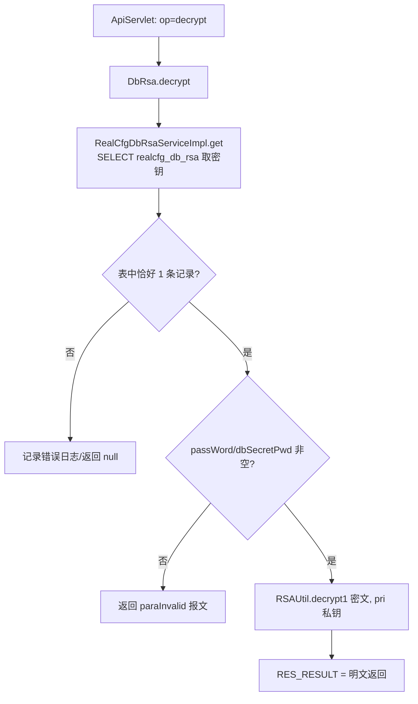
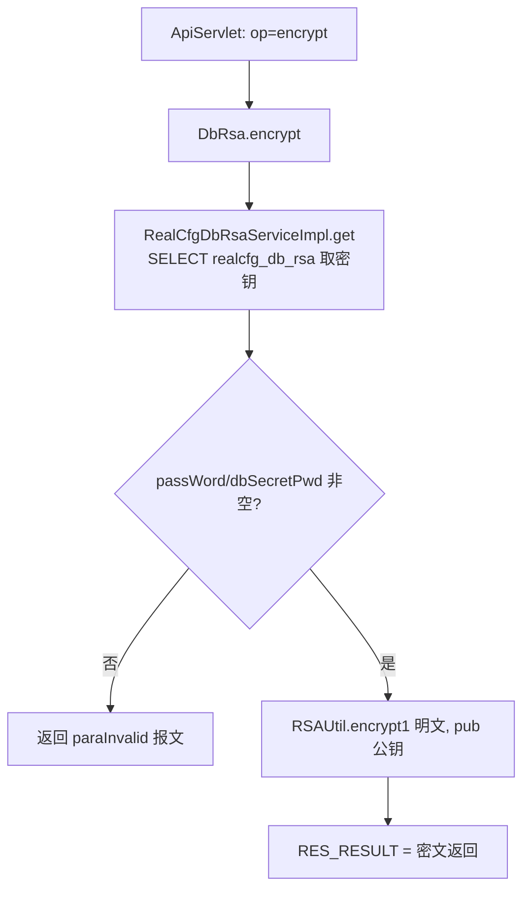

# DbRsa

数据库口令 RSA 加解密服务：使用 realcfg_db_rsa 表中存储的密钥对，提供口令密文解密与明文加密两个内部工具接口（用于数据库连接口令等敏感配置的密文管理）。

## op 一览

| op | 功能 |
| --- | --- |
| decrypt | 用私钥解密口令密文 |
| encrypt | 用公钥加密口令明文 |

### decrypt (`DbRsa.decrypt`)

- **入口**：ApiServlet，action=cfg，op=DbRsa.decrypt
- **实现意图**：读取 realcfg_db_rsa 表中唯一的 RSA 密钥记录，用私钥把传入的口令密文（如数据库配置里的加密口令）还原为明文返回。
- **请求参数**：

| 参数名 | 类型 | 必填 | 说明 |
| --- | --- | --- | --- |
| dbSecretPwd | String | 是 | 待解密的口令密文（Base64） |
| passWord | String | 否 | 兼容旧参数名，但与 dbSecretPwd 同时传时会被 dbSecretPwd 覆盖 |

- **响应结构**：统一返回 `{code, msg, data}` 报文，错误时无 `data` 节点。

| 字段 | 类型 | 说明 |
| --- | --- | --- |
| code | Integer | 返回码，0 成功 |
| msg | String | 提示信息 |
| data | Object | 数据对象 |
| data.result | String | 解密后的口令明文 |
- **处理流程**：



- **调用链**：cn.testin.service.cfg.DbRsa → cn.testin.business.impl.RealCfgDbRsaServiceImpl → cn.testin.dao.impl.realcfg.RealcfgDbRsaImpl → 表 realcfg_db_rsa；加解密工具 cn.testin.util.RSAUtil（RSA/ECB/PKCS1Padding）
- **涉及表与 SQL**：
  - `realcfg_db_rsa`：SELECT（`SELECT * FROM realcfg_db_rsa`，要求全表恰好 1 条记录），DAO 方法 `RealcfgDbRsaImpl.get()`
- **异常与校验**：passWord 与 dbSecretPwd 均为空返回 `CommonCode.paraInvalid`（"dbSecretPwd or passWord is invalid"）；密钥表记录数不为 1 时 DAO 抛 RuntimeException 并记日志返回 null（后续 getPri 可能 NPE）
- **关键代码摘录**：

```java
// real-cfg/src/main/java/cn/testin/service/cfg/DbRsa.java
RealCfgDbRsa rsa = iRealCfgDbRsaService.get();
if (reqJson.has("passWord")) {
    passWord = reqJson.getString("passWord");
}
if (reqJson.has("dbSecretPwd")) {
    passWord = reqJson.getString("dbSecretPwd");
}
if (StringUtils.isBlank(passWord)) {
    return ApiUtil.getResult(apirequest, CommonCode.paraInvalid.getValue(), "dbSecretPwd or passWord is invalid");
}
passWord = RSAUtil.decrypt1(passWord, rsa.getPri()); // 私钥解密得明文
datamap.put(ApiResponse.RES_RESULT, passWord);
```

### encrypt (`DbRsa.encrypt`)

- **入口**：ApiServlet，action=cfg，op=DbRsa.encrypt
- **实现意图**：读取 realcfg_db_rsa 中的公钥，把传入的口令明文加密为密文返回，供写入数据库配置时使用。
- **请求参数**：

| 参数名 | 类型 | 必填 | 说明 |
| --- | --- | --- | --- |
| dbSecretPwd | String | 是 | 待加密的口令明文 |
| passWord | String | 否 | 兼容旧参数名，与 dbSecretPwd 同时传时以 dbSecretPwd 为准 |

- **响应结构**：统一返回 `{code, msg, data}` 报文，错误时无 `data` 节点。

| 字段 | 类型 | 说明 |
| --- | --- | --- |
| code | Integer | 返回码，0 成功 |
| msg | String | 提示信息 |
| data | Object | 数据对象 |
| data.result | String | 加密后的口令密文（Base64） |
- **处理流程**：



- **调用链**：cn.testin.service.cfg.DbRsa → cn.testin.business.impl.RealCfgDbRsaServiceImpl → cn.testin.dao.impl.realcfg.RealcfgDbRsaImpl → 表 realcfg_db_rsa；加解密工具 cn.testin.util.RSAUtil
- **涉及表与 SQL**：
  - `realcfg_db_rsa`：SELECT（`SELECT * FROM realcfg_db_rsa`），DAO 方法 `RealcfgDbRsaImpl.get()`
- **异常与校验**：与 decrypt 相同，参数为空返回 `CommonCode.paraInvalid`
- **关键代码摘录**：

```java
// real-cfg/src/main/java/cn/testin/service/cfg/DbRsa.java
RealCfgDbRsa rsa = iRealCfgDbRsaService.get();
...
// 注释误写为"解密得到明文"，实际为公钥加密
String clear = RSAUtil.encrypt1(passWord, rsa.getPub());
datamap.put(ApiResponse.RES_RESULT, clear);
```
