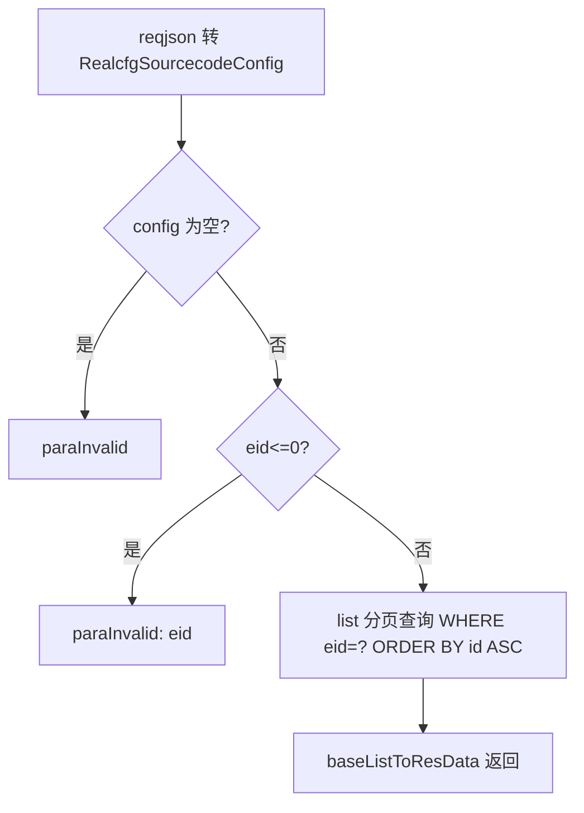
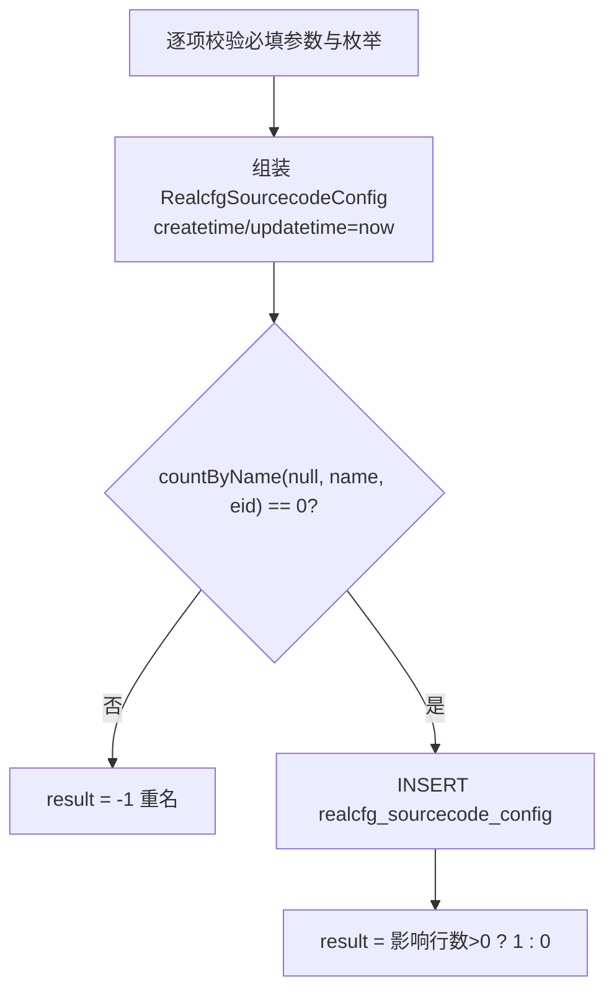
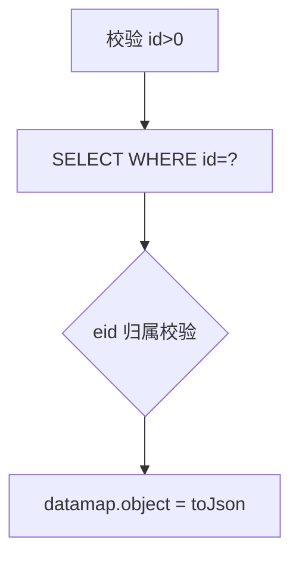
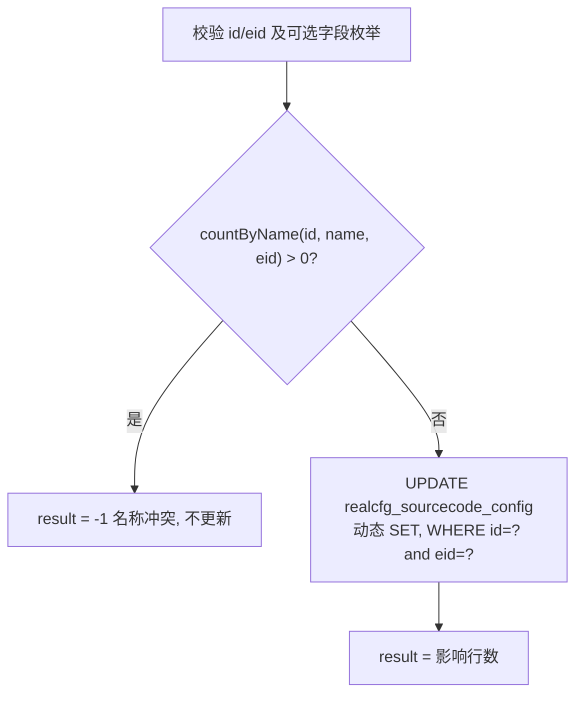
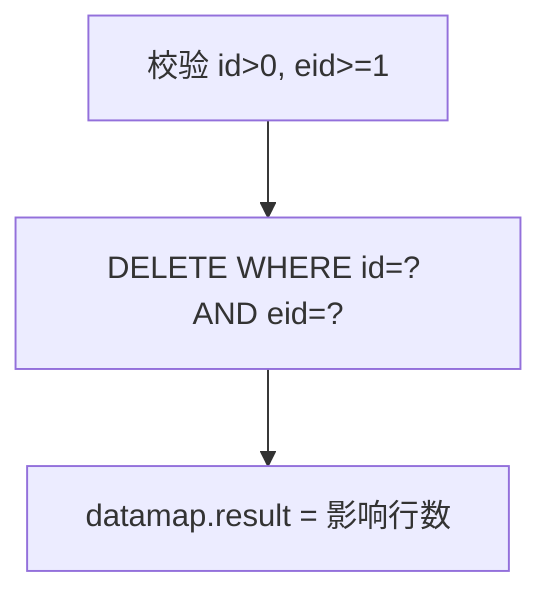

# SourcecodeConfig

源码项目配置管理服务：维护企业下的源码仓库配置（VCS 类型、仓库地址、分支、鉴权方式及凭据），提供分页列表、增改（带重名校验）、单查、删除。凭据（pwd/sshKey）按所传内容直接入库，供源码拉取/构建类业务使用。

- 源码：`real-cfg/src/main/java/cn/testin/service/cfg/SourcecodeConfig.java`
- 业务实现：`real-cfg/src/main/java/cn/testin/business/impl/SourcecodeConfigServiceImpl.java`
- DAO：`real-cfg/src/main/java/cn/testin/dao/impl/realcfg/RealcfgSourcecodeConfigDAOImpl.java`
- pojo：`cn.testin.pojo.realcfg.RealcfgSourcecodeConfig`（表 `realcfg_sourcecode_config`，序列 `seq_realcfg_sourcecode_config`）

## op 一览

| op | 说明 |
|---|---|
| list | 按企业分页查询配置列表 |
| add | 新增源码项目配置（重名拒绝） |
| get | 按 id 查询单条配置 |
| maintain | 更新配置（重名拒绝） |
| remove | 删除配置 |

---

### list (`SourcecodeConfig.list`)

- **入口**：ApiServlet，action=cfg，op=SourcecodeConfig.list
- **实现意图**：按企业 ID 分页查询源码项目配置列表，按 id 升序。
- **请求参数**：

| 参数名 | 类型 | 必填 | 说明 |
|---|---|---|---|
| eid | int | 是 | 企业 ID，>0（请求体需能反序列化为 RealcfgSourcecodeConfig） |
| page | int | 否 | 页码，默认 1 |
| pageSize | int | 否 | 每页条数，默认 Config.MaxSize |

- **响应结构**：统一返回 `{code, msg, data}` 报文，错误时无 `data` 节点。

| 字段 | 类型 | 说明 |
| --- | --- | --- |
| code | Integer | 返回码，0 成功 |
| msg | String | 提示信息 |
| data | Object | 数据对象 |
| data.list | Array\<Object\> | 当前页源码项目配置数组，元素字段： |
| data.list[].id | Integer | 配置 ID |
| data.list[].name | String | 源码项目名称 |
| data.list[].descr | String | 描述 |
| data.list[].eid | Integer | 企业 ID |
| data.list[].projectId | Integer | 项目组 ID |
| data.list[].projectName | String | 项目组名称 |
| data.list[].vcsType | String | 版本控制类型 |
| data.list[].repositoryUrl | String | 仓库地址 |
| data.list[].branchName | String | 分支名称 |
| data.list[].authenticationType | String | 鉴权类型 |
| data.list[].accountId | String | 账户 ID |
| data.list[].pwd | String | 账户密码 |
| data.list[].sshKey | String | SSH 私钥 |
| data.list[].oprUserid | Integer | 操作人 ID |
| data.list[].oprUsername | String | 操作人名称 |
| data.list[].status | Integer | 状态 |
| data.list[].createtime | Long | 创建时间（毫秒时间戳） |
| data.list[].updatetime | Long | 更新时间（毫秒时间戳） |
| data.page | Integer | 当前页码 |
| data.pageSize | Integer | 每页条数 |
| data.totalRow | Long | 总条数 |
| data.totalPage | Integer | 总页数 |
- **处理流程**：



- **调用链**：SourcecodeConfig → ISourcecodeConfigService（SourcecodeConfigServiceImpl）→ IRealcfgSourcecodeConfigDAO（RealcfgSourcecodeConfigDAOImpl）
- **涉及表与 SQL**：`realcfg_sourcecode_config`：SELECT + count(*)，WHERE eid=?，ORDER BY id ASC，`RealcfgSourcecodeConfigDAOImpl.list`
- **异常与校验**：请求体无法转换或 eid 非法返回 `CommonCode.paraInvalid`。
- **关键代码摘录**：

```java
// real-cfg/src/main/java/cn/testin/service/cfg/SourcecodeConfig.java
RealcfgSourcecodeConfig config = RealcfgSourcecodeConfig.toBean(reqjson);
if (config == null) {
    return ApiUtil.getResult(apirequest, CommonCode.paraInvalid.getValue(), CommonCode.paraInvalid.getDescr());
}
BaseList<RealcfgSourcecodeConfig> baseList = this.isourcecodeconfigservice.list(config.getEid(), page, pageSize);
```

---

### add (`SourcecodeConfig.add`)

- **入口**：ApiServlet，action=cfg，op=SourcecodeConfig.add
- **实现意图**：新增源码项目配置。name/eid/vcsType/repositoryUrl/authenticationType/oprUserid/oprUsername 必填；vcsType 与 authenticationType 用枚举（`cn.testin.enums.VcsType`、`cn.testin.enums.AuthenticationType`）校验合法性；status 限定 0/1，未传默认 1。插入前按 eid+name 查重（countByName），重名返回 result=-1。
- **请求参数**：

| 参数名 | 类型 | 必填 | 说明 |
|---|---|---|---|
| name | string | 是 | 源码项目名称（企业内唯一） |
| descr | string | 否 | 描述 |
| eid | int | 是 | 企业 ID，>=1 |
| projectId | int | 否 | 项目组 ID，>=0 |
| projectName | string | 否 | 项目组名称 |
| vcsType | string | 是 | 版本控制类型（VcsType 枚举） |
| repositoryUrl | string | 是 | 仓库地址 |
| branchName | string | 否 | 分支名称 |
| authenticationType | string | 是 | 鉴权类型（AuthenticationType 枚举） |
| accountId | string | 否 | 账户 ID |
| pwd | string | 否 | 账户密码 |
| sshKey | string | 否 | SSH 私钥 |
| oprUserid | int | 是 | 操作人 ID，>=0 |
| oprUsername | string | 是 | 操作人名称 |
| status | int | 否 | 状态 0/1，默认 1 |

- **响应结构**：统一返回 `{code, msg, data}` 报文，错误时无 `data` 节点。

| 字段 | 类型 | 说明 |
| --- | --- | --- |
| code | Integer | 返回码，0 成功 |
| msg | String | 提示信息 |
| data | Object | 数据对象 |
| data.result | Integer | 1 成功 / 0 失败 / -1 名称已存在 |
- **处理流程**：



- **调用链**：SourcecodeConfig → ISourcecodeConfigService → IRealcfgSourcecodeConfigDAO（countByName / add）
- **涉及表与 SQL**：
  - `realcfg_sourcecode_config`：SELECT WHERE eid=? and name=?（查重），`RealcfgSourcecodeConfigDAOImpl.countByName`
  - `realcfg_sourcecode_config`：INSERT（name, descr, eid, project_id, project_name, vcs_type, repository_url, branch_name, authentication_type, account_id, pwd, ssh_key, opr_userid, opr_username, status, createtime, updatetime），`RealcfgSourcecodeConfigDAOImpl.add`
- **异常与校验**：必填项缺失/非法、vcsType 或 authenticationType 非枚举值、status 非 0/1 均返回 `CommonCode.paraInvalid`；重名通过 result=-1 表达（仍返回 success 状态码）。
- **关键代码摘录**：

```java
// real-cfg/src/main/java/cn/testin/service/cfg/SourcecodeConfig.java
Integer count = this.isourcecodeconfigservice.countByName(null, sourcecodeConfig.getName(), sourcecodeConfig.getEid());
if (count != null && count == 0) {
    Integer result = this.isourcecodeconfigservice.add(sourcecodeConfig);
    datamap.put("result", result > 0 ? 1 : 0);
    return jObj.toString();
}
datamap.put("result", -1);
```

---

### get (`SourcecodeConfig.get`)

- **入口**：ApiServlet，action=cfg，op=SourcecodeConfig.get
- **实现意图**：按 id 查询单条源码项目配置；传 eid 时校验记录归属该企业。
- **请求参数**：

| 参数名 | 类型 | 必填 | 说明 |
|---|---|---|---|
| id | int | 是 | 配置 ID，>0 |
| eid | int | 否 | 企业 ID（传入时校验归属） |

- **响应结构**：统一返回 `{code, msg, data}` 报文，错误时无 `data` 节点。

| 字段 | 类型 | 说明 |
| --- | --- | --- |
| code | Integer | 返回码，0 成功 |
| msg | String | 提示信息 |
| data | Object | 数据对象 |
| data.objInfo | Object | RealcfgSourcecodeConfig 对象（查不到时无此节点） |
| data.objInfo.id | Integer | 配置 ID |
| data.objInfo.name | String | 源码项目名称 |
| data.objInfo.descr | String | 描述 |
| data.objInfo.eid | Integer | 企业 ID |
| data.objInfo.projectId | Integer | 项目组 ID |
| data.objInfo.projectName | String | 项目组名称 |
| data.objInfo.vcsType | String | 版本控制类型 |
| data.objInfo.repositoryUrl | String | 仓库地址 |
| data.objInfo.branchName | String | 分支名称 |
| data.objInfo.authenticationType | String | 鉴权类型 |
| data.objInfo.accountId | String | 账户 ID |
| data.objInfo.pwd | String | 账户密码 |
| data.objInfo.sshKey | String | SSH 私钥 |
| data.objInfo.oprUserid | Integer | 操作人 ID |
| data.objInfo.oprUsername | String | 操作人名称 |
| data.objInfo.status | Integer | 状态 |
| data.objInfo.createtime | Long | 创建时间（毫秒时间戳） |
| data.objInfo.updatetime | Long | 更新时间（毫秒时间戳） |
- **处理流程**：



- **调用链**：SourcecodeConfig → ISourcecodeConfigService → IRealcfgSourcecodeConfigDAO（get）
- **涉及表与 SQL**：`realcfg_sourcecode_config`：SELECT WHERE id=?，`RealcfgSourcecodeConfigDAOImpl.get`
- **异常与校验**：id 非法返回 `CommonCode.paraInvalid`。
- **关键代码摘录**：

```java
// real-cfg/src/main/java/cn/testin/service/cfg/SourcecodeConfig.java
sourcecodeConfig = this.isourcecodeconfigservice.get(id, eid);
if (sourcecodeConfig != null) {
    datamap.put(ApiResponse.RES_OBJECT, sourcecodeConfig.toJson());
}
```

---

### maintain (`SourcecodeConfig.maintain`)

- **入口**：ApiServlet，action=cfg，op=SourcecodeConfig.maintain
- **实现意图**：更新源码项目配置。id、eid 必填；name 若修改需先查重（同企业下存在同名且 id 不同的记录时返回 result=-1，不执行更新）。其余字段按需传入，DAO 动态拼接 SET；status 直接覆盖（未传为 null 则不更新该列——注意 service 层无条件 setStatus(status)，DAO 判 null 跳过）。
- **请求参数**：与 add 相同，另加：

| 参数名 | 类型 | 必填 | 说明 |
|---|---|---|---|
| id | int | 是 | 配置 ID，>=1 |

（name/descr/eid/projectId/projectName/vcsType/repositoryUrl/branchName/authenticationType/accountId/pwd/sshKey/oprUserid/oprUsername/status 均为可选更新项；eid 必填）

- **响应结构**：统一返回 `{code, msg, data}` 报文，错误时无 `data` 节点。

| 字段 | 类型 | 说明 |
| --- | --- | --- |
| code | Integer | 返回码，0 成功 |
| msg | String | 提示信息 |
| data | Object | 数据对象 |
| data.result | Integer | 更新影响行数 / -1 名称冲突 |
- **处理流程**：



- **调用链**：SourcecodeConfig → ISourcecodeConfigService → IRealcfgSourcecodeConfigDAO（countByName / maintain）
- **涉及表与 SQL**：`realcfg_sourcecode_config`：SELECT（查重）+ UPDATE（全字段动态 SET，WHERE id and eid），`RealcfgSourcecodeConfigDAOImpl.countByName/maintain`
- **异常与校验**：id/eid 非法、枚举值非法、status 非 0/1 返回 `CommonCode.paraInvalid`；重名 result=-1。
- **关键代码摘录**：

```java
// real-cfg/src/main/java/cn/testin/dao/impl/realcfg/RealcfgSourcecodeConfigDAOImpl.java
// 新增时 id == null, 更新时 id != null
if (result != null && id == null) {
    return 1;
} else if (result != null && id != null && !result.getId().equals(id)) {
    // id不同, eid, 名称相同的, 不更新
    return 1;
}
return 0;
```

---

### remove (`SourcecodeConfig.remove`)

- **入口**：ApiServlet，action=cfg，op=SourcecodeConfig.remove
- **实现意图**：按 id+eid 删除源码项目配置（物理删除）。
- **请求参数**：

| 参数名 | 类型 | 必填 | 说明 |
|---|---|---|---|
| id | int | 是 | 配置 ID，>0 |
| eid | int | 是 | 企业 ID，>=1 |

- **响应结构**：统一返回 `{code, msg, data}` 报文，错误时无 `data` 节点。

| 字段 | 类型 | 说明 |
| --- | --- | --- |
| code | Integer | 返回码，0 成功 |
| msg | String | 提示信息 |
| data | Object | 数据对象 |
| data.result | Integer | 删除影响行数 |
- **处理流程**：



- **调用链**：SourcecodeConfig → ISourcecodeConfigService → IRealcfgSourcecodeConfigDAO（remove）
- **涉及表与 SQL**：`realcfg_sourcecode_config`：DELETE WHERE id=? AND eid=?，`RealcfgSourcecodeConfigDAOImpl.remove`
- **异常与校验**：id/eid 非法返回 `CommonCode.paraInvalid`；DAO 层同样抛 `GeneralException(paraInvalid)`。
- **关键代码摘录**：

```java
// real-cfg/src/main/java/cn/testin/dao/impl/realcfg/RealcfgSourcecodeConfigDAOImpl.java
sql.append("DELETE FROM ");
sql.append(RealcfgSourcecodeConfig.table());
sql.append(" WHERE id = ? AND eid = ?");
params.add(id);
params.add(eid);
Integer result = this.getRealcfgdao().update(sql.toString(), params.toArray());
```
