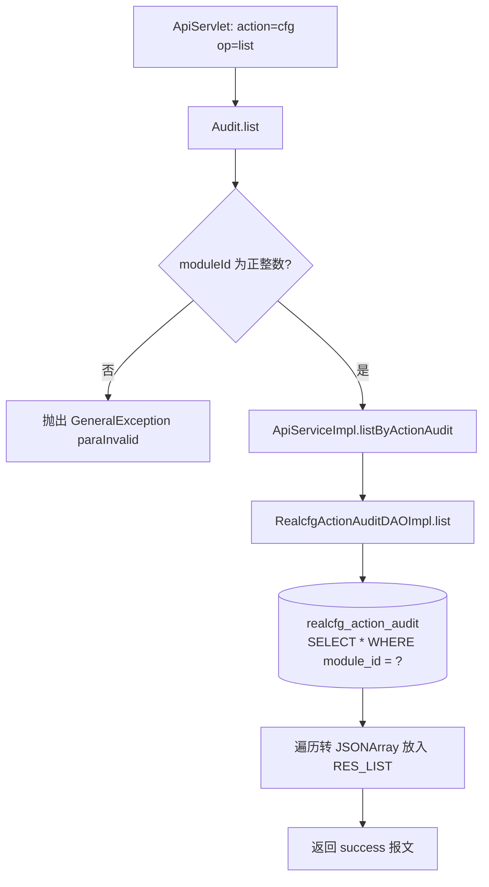
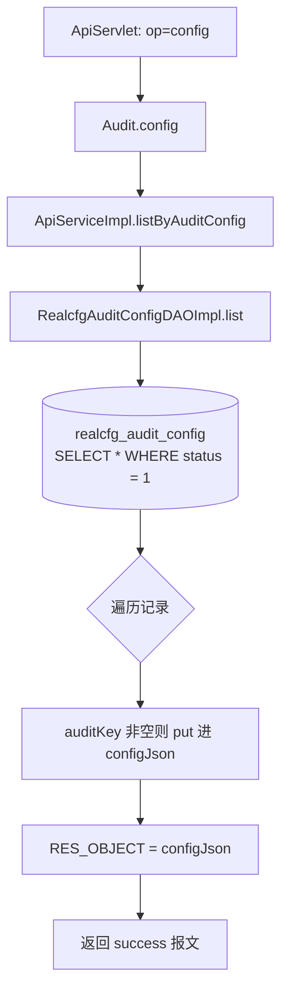

# Audit

接口审计配置查询服务：按模块查询接口审计配置明细（realcfg_action_audit 表），以及查询全局审计开关/参数键值（realcfg_audit_config 表）。

## op 一览

| op | 功能 |
| --- | --- |
| list | 查询某模块的接口审计配置列表 |
| config | 查询全局审计配置键值对 |

### list (`Audit.list`)

- **入口**：ApiServlet，action=cfg，op=Audit.list
- **实现意图**：根据模块 ID 查询该模块下所有接口的审计配置（记录哪些 action/op 需要审计、请求/响应的审计字段配置 reqConfig/respConfig），供后台展示与审计切面使用。
- **请求参数**：

| 参数名 | 类型 | 必填 | 说明 |
| --- | --- | --- | --- |
| moduleId | Integer | 是 | 模块 ID，必须为正整数 |

- **响应结构**：统一返回 `{code, msg, data}` 报文，错误时无 `data` 节点。

| 字段 | 类型 | 说明 |
| --- | --- | --- |
| code | Integer | 返回码，0 成功 |
| msg | String | 提示信息 |
| data | Object | 数据对象 |
| data.list | Array\<Object\> | 接口审计配置数组，元素字段： |
| data.list[].id | Integer | 审计配置 ID |
| data.list[].moduleId | Integer | 模块 ID |
| data.list[].apiAction | String | 接口 action |
| data.list[].apiOp | String | 接口 op |
| data.list[].name | String | 配置名称 |
| data.list[].descr | String | 描述 |
| data.list[].reqConfig | Array\<Object\> | 请求审计字段配置（JSON 数组，非空时输出） |
| data.list[].respConfig | Array\<Object\> | 响应审计字段配置（JSON 数组，非空时输出） |
| data.list[].status | Integer | 状态 |
| data.list[].createtime | Long | 创建时间（毫秒时间戳） |
| data.list[].updatetime | Long | 更新时间（毫秒时间戳） |
- **处理流程**：



- **调用链**：cn.testin.service.cfg.Audit → cn.testin.business.impl.ApiServiceImpl → cn.testin.dao.impl.realcfg.RealcfgActionAuditDAOImpl → 表 realcfg_action_audit
- **涉及表与 SQL**：
  - `realcfg_action_audit`：SELECT（`SELECT * FROM realcfg_action_audit WHERE module_id = ?`），DAO 方法 `RealcfgActionAuditDAOImpl.list(Integer)`
- **异常与校验**：moduleId 为空或 <= 0 时抛出 `GeneralException(CommonCode.paraInvalid)`；DAO 层对 null moduleId 再校验一次
- **关键代码摘录**：

```java
// real-cfg/src/main/java/cn/testin/service/cfg/Audit.java
if (moduleId == null || moduleId <= 0) {
    String msg = CommonCode.paraInvalid.getDescr() + "(moduleId is invalid!)";
    throw new GeneralException(CommonCode.paraInvalid.getValue(), msg);
}
List<RealcfgActionAudit> list = this.iapiservice.listByActionAudit(moduleId);
```

### config (`Audit.config`)

- **入口**：ApiServlet，action=cfg，op=Audit.config
- **实现意图**：查询全局审计配置，把 realcfg_audit_config 表中 status=1 的记录整理为 auditKey→auditValue 的 JSON 对象返回（如审计总开关、采样率等全局参数）。无请求参数。
- **请求参数**：无
- **响应结构**：统一返回 `{code, msg, data}` 报文，错误时无 `data` 节点。

| 字段 | 类型 | 说明 |
| --- | --- | --- |
| code | Integer | 返回码，0 成功 |
| msg | String | 提示信息 |
| data | Object | 数据对象 |
| data.objInfo | Object | 全局审计配置键值对象：键为 auditKey、值为 auditValue；表中无数据时为空对象 `{}` |
- **处理流程**：



- **调用链**：cn.testin.service.cfg.Audit → cn.testin.business.impl.ApiServiceImpl → cn.testin.dao.impl.realcfg.RealcfgAuditConfigDAOImpl → 表 realcfg_audit_config
- **涉及表与 SQL**：
  - `realcfg_audit_config`：SELECT（`SELECT * FROM realcfg_audit_config WHERE status = 1`），DAO 方法 `RealcfgAuditConfigDAOImpl.list()`
- **异常与校验**：无参数校验；跳过 auditKey 为空的脏数据
- **关键代码摘录**：

```java
// real-cfg/src/main/java/cn/testin/service/cfg/Audit.java
JSONObject configJson = new JSONObject();
List<RealcfgAuditConfig> list = this.iapiservice.listByAuditConfig();
if (list != null) {
    for (RealcfgAuditConfig auditConfig : list) {
        if (auditConfig == null || StringUtils.isBlank(auditConfig.getAuditKey())) {
            continue;
        }
        configJson.put(auditConfig.getAuditKey(), auditConfig.getAuditValue());
    }
}
datamap.put(ApiResponse.RES_OBJECT, configJson);
```
