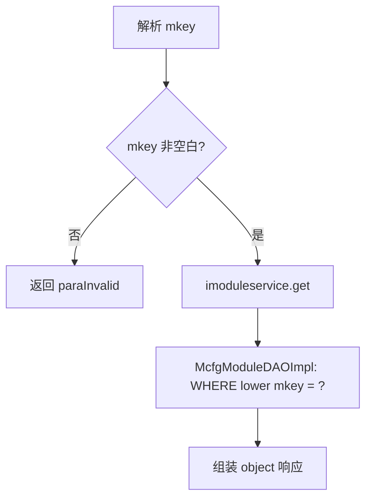
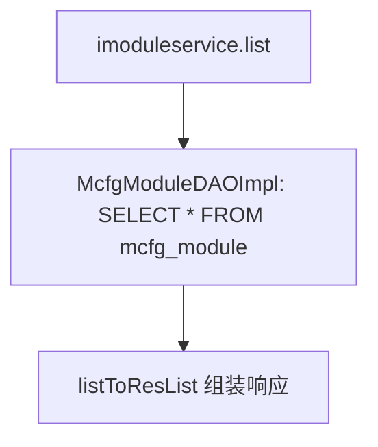

# ModuleCfg

## 职责
openapi 模块（mcfg_module）查询配置。`mcfg_module` 表按 mkey 标识一个业务模块，API 元数据（mcfg_api）通过 moduleId 归属到模块。本类只提供查询，不提供写操作。

- 源码：`real-cfg/src/main/java/cn/testin/service/mcfg/ModuleCfg.java`
- 入口：ApiServlet 按 `action=mcfg`、`op=<方法名>` 反射调用。

## op 一览表

| op | 说明 | 主要表 |
|---|---|---|
| get | 按 mkey 查询模块 | mcfg_module |
| list | 查询全部模块 | mcfg_module |

---

### get (`ModuleCfg.get`)
- **入口**：ApiServlet，action=mcfg，op=ModuleCfg.get
- **实现意图**：按模块 key（mkey，不区分大小写）查询单个模块信息。
- **请求参数**：

| 参数名 | 类型 | 必填 | 说明 |
|---|---|---|---|
| mkey | string | 是 | 模块标识，不能为空白 |

- **响应结构**：统一返回 `{code, msg, data}` 报文，错误时无 `data` 节点。

| 字段 | 类型 | 说明 |
| --- | --- | --- |
| code | Integer | 返回码，0 成功 |
| msg | String | 提示信息 |
| data | Object | 数据对象 |
| data.objInfo | Object | McfgModule 对象（存在时） |
| data.objInfo.id | Integer | 模块 ID |
| data.objInfo.mkey | String | 模块标识 |
| data.objInfo.name | String | 模块名称 |
| data.objInfo.httpHosts | String | HTTP 主机列表 |
| data.objInfo.rpcPrefixName | String | RPC 前缀名 |
| data.objInfo.distributed | Integer | 是否数据分布部署 |
| data.objInfo.ruleConfig | String | 数据分布部署规则 |
| data.objInfo.descr | String | 描述 |
| data.objInfo.status | Integer | 状态 |
| data.objInfo.createtime | Long | 创建时间（毫秒时间戳） |
| data.objInfo.updatetime | Long | 更新时间（毫秒时间戳） |
- **处理流程**：

- **调用链**：ModuleCfg → ModuleServiceImpl.get → McfgModuleDAOImpl.get → 表 mcfg_module
- **涉及表与 SQL**：
  - `mcfg_module`：SELECT * WHERE `lower(mkey)=?`，DAO 方法 `McfgModuleDAOImpl.get`
- **异常与校验**：
  - `mkey` 空白 → `paraInvalid (mkey is invalid!)`
- **关键代码摘录**：
```java
// real-cfg/src/main/java/cn/testin/dao/impl/mcfg/McfgModuleDAOImpl.java
sql.append("SELECT * FROM ");
sql.append(McfgModule.table());
sql.append(" WHERE lower(mkey) = ? ");
return this.getMcfgdao().get(sql.toString(), new Object[]{mkey.toLowerCase()}, new McfgModuleRowMapper());
```

---

### list (`ModuleCfg.list`)
- **入口**：ApiServlet，action=mcfg，op=ModuleCfg.list
- **实现意图**：查询全部 openapi 模块列表（无分页、无条件）。
- **请求参数**：无
- **响应结构**：统一返回 `{code, msg, data}` 报文，错误时无 `data` 节点。

| 字段 | 类型 | 说明 |
| --- | --- | --- |
| code | Integer | 返回码，0 成功 |
| msg | String | 提示信息 |
| data | Object | 数据对象 |
| data.list | Array\<Object\> | McfgModule 数组，元素字段： |
| data.list[].id | Integer | 模块 ID |
| data.list[].mkey | String | 模块标识 |
| data.list[].name | String | 模块名称 |
| data.list[].httpHosts | String | HTTP 主机列表 |
| data.list[].rpcPrefixName | String | RPC 前缀名 |
| data.list[].distributed | Integer | 是否数据分布部署 |
| data.list[].ruleConfig | String | 数据分布部署规则 |
| data.list[].descr | String | 描述 |
| data.list[].status | Integer | 状态 |
| data.list[].createtime | Long | 创建时间（毫秒时间戳） |
| data.list[].updatetime | Long | 更新时间（毫秒时间戳） |
- **处理流程**：

- **调用链**：ModuleCfg → ModuleServiceImpl.list → McfgModuleDAOImpl.list → 表 mcfg_module
- **涉及表与 SQL**：
  - `mcfg_module`：SELECT *（全表），DAO 方法 `McfgModuleDAOImpl.list`
- **异常与校验**：无参数校验；底层异常由 ApiServlet 统一处理。
- **关键代码摘录**：
```java
// real-cfg/src/main/java/cn/testin/service/mcfg/ModuleCfg.java
public String list(ApiRequest apirequest) throws Exception {
    List<McfgModule> list = this.imoduleservice.list();
    JSONObject jObj = ApiUtil.getJSONobj(apirequest,
            CommonCode.success.getValue(), CommonCode.success.getDescr());
    Map<String, Object> datamap = new HashMap<>();
    listToResList(datamap, list);
    jObj.put(ApiResponse.RES_DATA, datamap);
    return jObj.toString();
}
```
