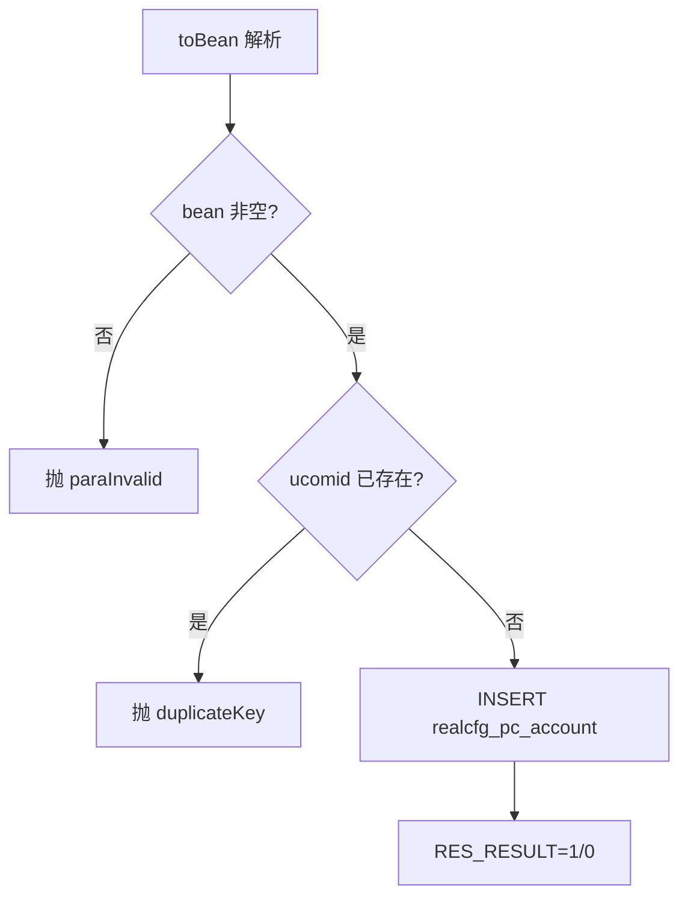
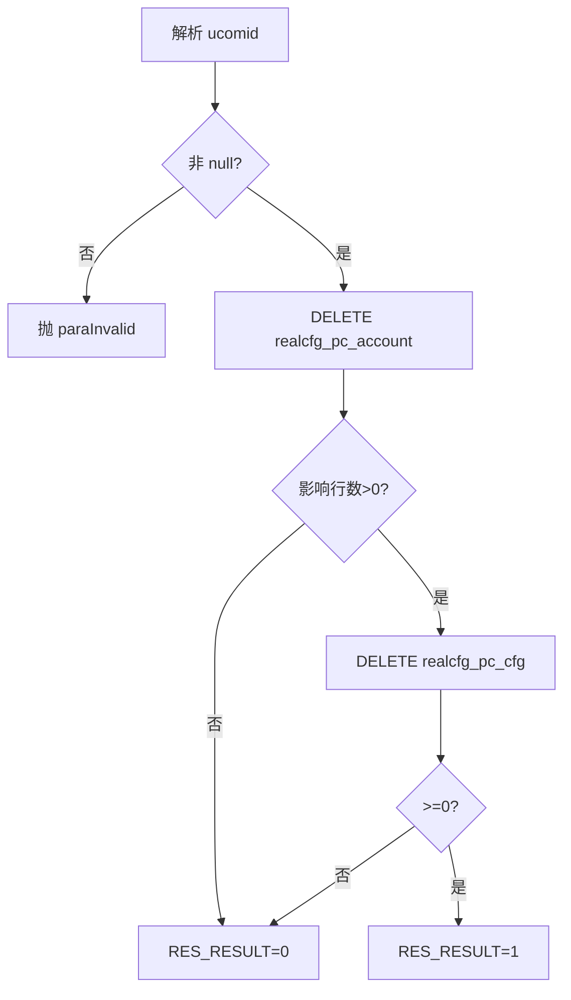
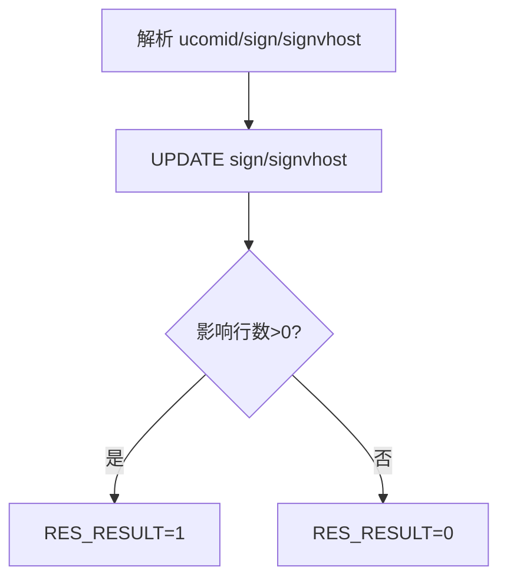
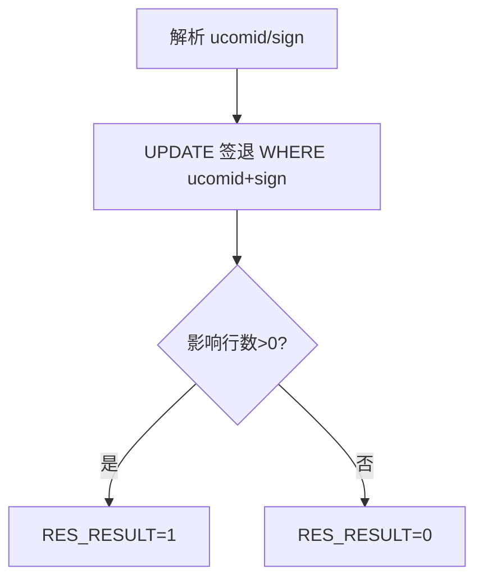
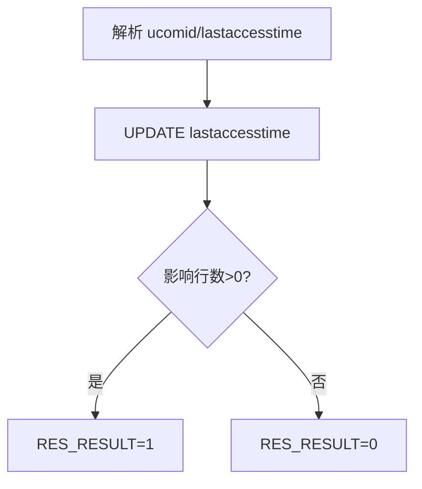
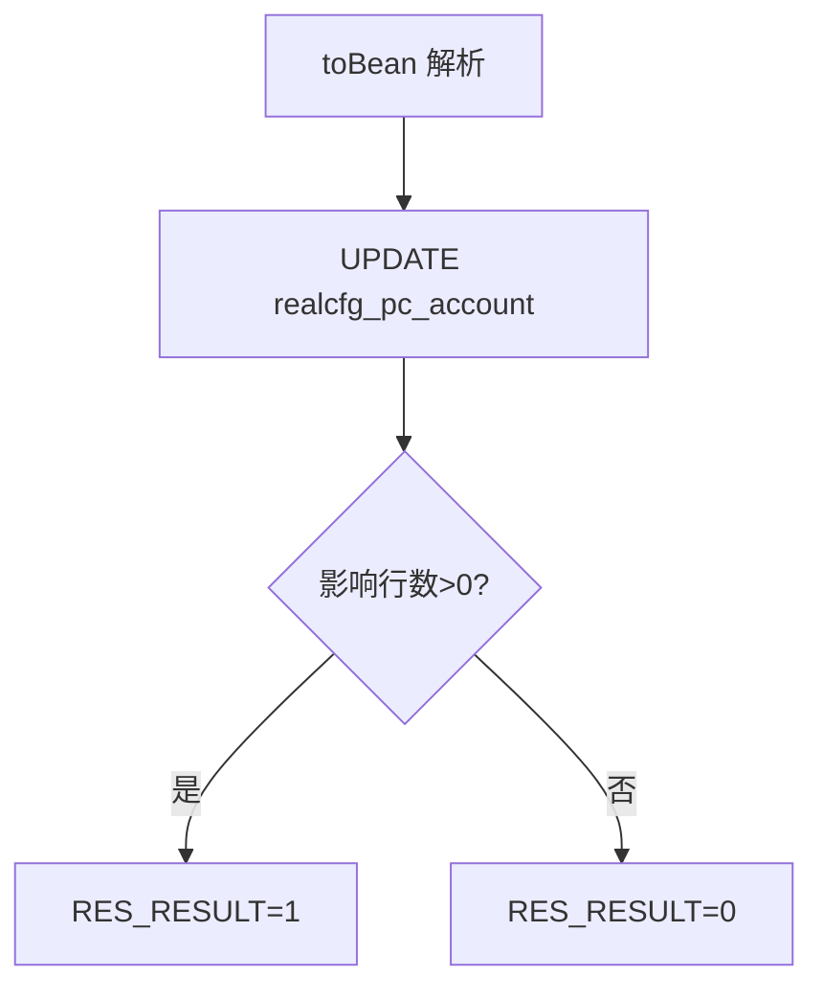
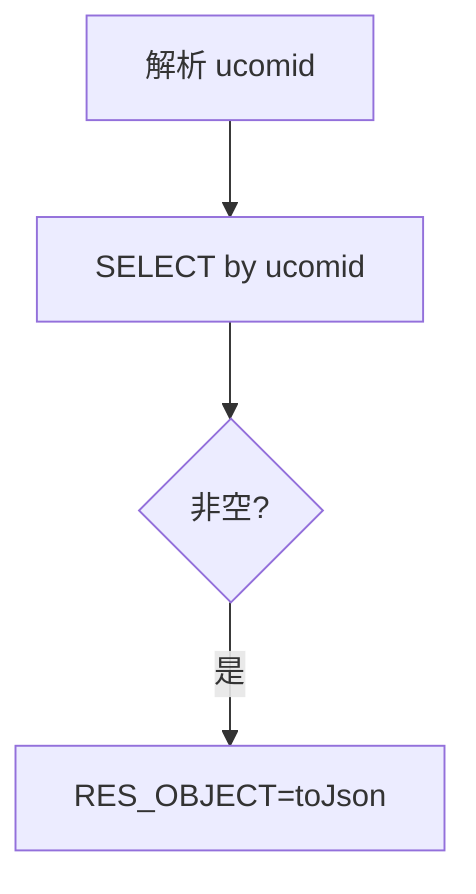
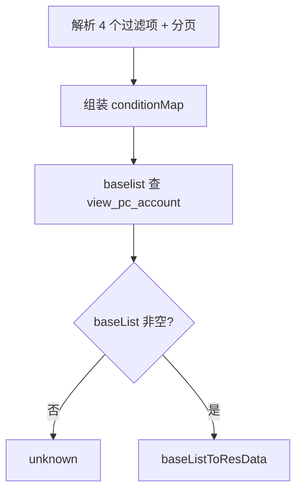

# PcAccount

上位机账号服务：上位机（ucomid）账号的生命周期管理与登录状态上报（签到/签退/最后访问时间）。删除账号会级联删除其上位机配置。

源码：`real-cfg/src/main/java/cn/testin/service/cfg/PcAccount.java`
业务实现：`cn.testin.business.impl.PcAccountServiceImpl`（`IPcAccountService`）

## op 一览

| op | 说明 |
| --- | --- |
| add | 新增上位机账号 |
| remove | 删除账号（级联删 realcfg_pc_cfg） |
| signReport | 登录（签到）上报 |
| signoutReport | 签退上报 |
| report | 最后访问时间上报 |
| maintain | 维护账号信息 |
| get | 查询单个账号 |
| list | 分页查询账号列表（view_pc_account） |

---

### add (`PcAccount.add`)

- **入口**：ApiServlet，action=cfg，op=PcAccount.add
- **实现意图**：新增上位机账号。请求体经 `RealcfgPcAccount.toBean(reqjson)` 解析；业务层先按 ucomid 查重，已存在报 duplicateKey，否则 INSERT。
- **请求参数**：RealcfgPcAccount 结构（ucomid、descr、location、status 等，见 pojo `cn.testin.pojo.realcfg.RealcfgPcAccount`）；`ucomid` 业务层隐式必填（用于查重）。
- **响应结构**：统一返回 `{code, msg, data}` 报文，错误时无 `data` 节点。

| 字段 | 类型 | 说明 |
| --- | --- | --- |
| code | Integer | 返回码，0 成功 |
| msg | String | 提示信息 |
| data | Object | 数据对象 |
| data.result | Integer | 1 成功 / 0 失败 |
- **处理流程**：



- **调用链**：PcAccount → PcAccountServiceImpl.add → IRealcfgPcAccountDAO（get / add）
- **涉及表与 SQL**：`realcfg_pc_account`（SELECT by ucomid、INSERT）
- **异常与校验**：`CommonCode.paraInvalid`（bean 为 null）；`CommonCode.duplicateKey`（ucomid 已存在）。
- **关键代码摘录**：

```java
// real-cfg/src/main/java/cn/testin/business/impl/PcAccountServiceImpl.java
RealcfgPcAccount dbPcAccount = get(pcAccount.getUcomid());
if (dbPcAccount != null) {
    throw new GeneralException(CommonCode.duplicateKey.getValue(), CommonCode.duplicateKey.getDescr());
}
return this.irealcfgpcaccountdao.add(pcAccount) > 0;
```

---

### remove (`PcAccount.remove`)

- **入口**：ApiServlet，action=cfg，op=PcAccount.remove
- **实现意图**：删除上位机账号，并级联删除该上位机的配置（`realcfg_pc_cfg`）。两步都成功才返回成功。
- **请求参数**：

| 参数名 | 类型 | 必填 | 说明 |
| --- | --- | --- | --- |
| ucomid | String | 是 | 上位机 id（业务层判 null） |

- **响应结构**：统一返回 `{code, msg, data}` 报文，错误时无 `data` 节点。

| 字段 | 类型 | 说明 |
| --- | --- | --- |
| code | Integer | 返回码，0 成功 |
| msg | String | 提示信息 |
| data | Object | 数据对象 |
| data.result | Integer | 1 成功 / 0 失败 |
- **处理流程**：



- **调用链**：PcAccount → PcAccountServiceImpl.remove → IRealcfgPcAccountDAO.delete / IRealcfgPcCfgDAO.delete
- **涉及表与 SQL**：`realcfg_pc_account`（DELETE）、`realcfg_pc_cfg`（DELETE by ucomid）
- **异常与校验**：`CommonCode.paraInvalid`——ucomid 为 null。
- **关键代码摘录**：

```java
// real-cfg/src/main/java/cn/testin/business/impl/PcAccountServiceImpl.java
if (this.irealcfgpcaccountdao.delete(ucomid) > 0
        && this.irealcfgpccfgdao.delete(ucomid) >= 0) {
    result = true;
}
```

---

### signReport (`PcAccount.signReport`)

- **入口**：ApiServlet，action=cfg，op=PcAccount.signReport
- **实现意图**：上位机登录签到上报：写入签到标识 sign 与签到所在 vhost（signvhost），标记该上位机当前登录在某服务节点。
- **请求参数**：

| 参数名 | 类型 | 必填 | 说明 |
| --- | --- | --- | --- |
| ucomid | String | 是 | 上位机 id |
| sign | String | 是 | 签到标识 |
| signvhost | Integer | 否 | 签到节点 vhost |

- **响应结构**：统一返回 `{code, msg, data}` 报文，错误时无 `data` 节点。

| 字段 | 类型 | 说明 |
| --- | --- | --- |
| code | Integer | 返回码，0 成功 |
| msg | String | 提示信息 |
| data | Object | 数据对象 |
| data.result | Integer | 1 成功 / 0 失败 |
- **处理流程**：



- **调用链**：PcAccount → PcAccountServiceImpl.signReport → IRealcfgPcAccountDAO.signReport
- **涉及表与 SQL**：`realcfg_pc_account`（UPDATE sign, signvhost WHERE ucomid）
- **异常与校验**：service 层无显式校验（ucomid/sign 缺失则更新 0 行返回 0）。⚠️ **待复核**：DAO 层 `signReport` 对 signvhost 判空抛异常、对 sign 不判空（`ifnull(sign,'')`），与上表「sign=是 / signvhost=否」的必填标注疑似标反。
- **关键代码摘录**：

```java
// real-cfg/src/main/java/cn/testin/business/impl/PcAccountServiceImpl.java
public boolean signReport(String ucomid, String sign, Integer signvhost) throws GeneralException {
    return this.irealcfgpcaccountdao.signReport(ucomid, sign, signvhost) > 0;
}
```

---

### signoutReport (`PcAccount.signoutReport`)

- **入口**：ApiServlet，action=cfg，op=PcAccount.signoutReport
- **实现意图**：上位机签退上报，清除/更新签到标识，标记上位机下线。
- **请求参数**：

| 参数名 | 类型 | 必填 | 说明 |
| --- | --- | --- | --- |
| ucomid | String | 是 | 上位机 id |
| sign | String | 是 | 签到标识（用于匹配当前会话） |

- **响应结构**：统一返回 `{code, msg, data}` 报文，错误时无 `data` 节点。

| 字段 | 类型 | 说明 |
| --- | --- | --- |
| code | Integer | 返回码，0 成功 |
| msg | String | 提示信息 |
| data | Object | 数据对象 |
| data.result | Integer | 1 成功 / 0 失败 |
- **处理流程**：



- **调用链**：PcAccount → PcAccountServiceImpl.signoutReport → IRealcfgPcAccountDAO.signoutReport
- **涉及表与 SQL**：`realcfg_pc_account`（UPDATE WHERE ucomid AND sign）
- **异常与校验**：无显式校验。
- **关键代码摘录**：

```java
// real-cfg/src/main/java/cn/testin/service/cfg/PcAccount.java
boolean result = this.ipcaccountservice.signoutReport(ucomid, sign);
```

---

### report (`PcAccount.report`)

- **入口**：ApiServlet，action=cfg，op=PcAccount.report
- **实现意图**：上报上位机最后访问时间（lastaccesstime），用于在线活跃度统计与僵尸上位机识别。
- **请求参数**：

| 参数名 | 类型 | 必填 | 说明 |
| --- | --- | --- | --- |
| ucomid | String | 是 | 上位机 id |
| lastaccesstime | Long | 是 | 最后访问时间戳（毫秒） |

- **响应结构**：统一返回 `{code, msg, data}` 报文，错误时无 `data` 节点。

| 字段 | 类型 | 说明 |
| --- | --- | --- |
| code | Integer | 返回码，0 成功 |
| msg | String | 提示信息 |
| data | Object | 数据对象 |
| data.result | Integer | 1 成功 / 0 失败 |
- **处理流程**：



- **调用链**：PcAccount → PcAccountServiceImpl.report → IRealcfgPcAccountDAO.report
- **涉及表与 SQL**：`realcfg_pc_account`（UPDATE lastaccesstime WHERE ucomid）
- **异常与校验**：无显式校验。
- **关键代码摘录**：

```java
// real-cfg/src/main/java/cn/testin/business/impl/PcAccountServiceImpl.java
public boolean report(String ucomid, Long lastaccesstime) throws GeneralException {
    return this.irealcfgpcaccountdao.report(ucomid, lastaccesstime) > 0;
}
```

---

### maintain (`PcAccount.maintain`)

- **入口**：ApiServlet，action=cfg，op=PcAccount.maintain
- **实现意图**：按 ucomid 更新账号可变属性（描述、位置、状态等），请求体按 RealcfgPcAccount 解析。
- **请求参数**：RealcfgPcAccount 结构；`ucomid` 为定位键。
- **响应结构**：统一返回 `{code, msg, data}` 报文，错误时无 `data` 节点。

| 字段 | 类型 | 说明 |
| --- | --- | --- |
| code | Integer | 返回码，0 成功 |
| msg | String | 提示信息 |
| data | Object | 数据对象 |
| data.result | Integer | 1 成功 / 0 失败 |
- **处理流程**：



- **调用链**：PcAccount → PcAccountServiceImpl.maintain → IRealcfgPcAccountDAO.update
- **涉及表与 SQL**：`realcfg_pc_account`（UPDATE by ucomid）
- **异常与校验**：无显式校验。
- **关键代码摘录**：

```java
// real-cfg/src/main/java/cn/testin/business/impl/PcAccountServiceImpl.java
public boolean maintain(RealcfgPcAccount pcAccount) throws GeneralException {
    return this.irealcfgpcaccountdao.update(pcAccount) > 0;
}
```

---

### get (`PcAccount.get`)

- **入口**：ApiServlet，action=cfg，op=PcAccount.get
- **实现意图**：按 ucomid 查询单个上位机账号详情。
- **请求参数**：

| 参数名 | 类型 | 必填 | 说明 |
| --- | --- | --- | --- |
| ucomid | String | 是 | 上位机 id |

- **响应结构**：统一返回 `{code, msg, data}` 报文，错误时无 `data` 节点。

| 字段 | 类型 | 说明 |
| --- | --- | --- |
| code | Integer | 返回码，0 成功 |
| msg | String | 提示信息 |
| data | Object | 数据对象 |
| data.objInfo | Object | RealcfgPcAccount 对象（无记录时无此节点） |
| data.objInfo.ucomid | String | 上位机账号 |
| data.objInfo.ucomidPwd | String | 上位机密码 |
| data.objInfo.descr | String | 描述 |
| data.objInfo.status | Integer | 状态 |
| data.objInfo.createtime | Long | 创建时间（毫秒时间戳） |
| data.objInfo.updatetime | Long | 更新时间（毫秒时间戳） |
| data.objInfo.signvhost | Integer | 登录 vhost |
| data.objInfo.sign | String | 登录标识 |
| data.objInfo.signtime | Long | 登录时间 |
| data.objInfo.signouttime | Long | 登出时间 |
| data.objInfo.lastaccesstime | Long | 最后访问时间 |
- **处理流程**：



- **调用链**：PcAccount → PcAccountServiceImpl.get → IRealcfgPcAccountDAO.get
- **涉及表与 SQL**：`realcfg_pc_account`（SELECT by ucomid）
- **异常与校验**：无显式校验。
- **关键代码摘录**：

```java
// real-cfg/src/main/java/cn/testin/service/cfg/PcAccount.java
RealcfgPcAccount result = this.ipcaccountservice.get(ucomid);
if (result != null) {
    datamap.put(ApiResponse.RES_OBJECT, result.toJson());
}
```

---

### list (`PcAccount.list`)

- **入口**：ApiServlet，action=cfg，op=PcAccount.list
- **实现意图**：多条件分页查询上位机账号，返回 `view_pc_account` 视图行（账号 + 配置合并信息）。page 缺省为 1、pageSize 缺省取 Config.MaxSize，即不传分页参数时实际查第一页大页。
- **请求参数**：

| 参数名 | 类型 | 必填 | 说明 |
| --- | --- | --- | --- |
| ucomid | String | 否 | 上位机 id 过滤 |
| descr | String | 否 | 描述过滤 |
| signvhost | Integer | 否 | 签到节点过滤 |
| location | String | 否 | 机房/位置过滤 |
| page | Integer | 否 | 页码，≤0 归一为 1 |
| pageSize | Integer | 否 | 每页条数，越界取 Config.MaxSize |

- **响应结构**：统一返回 `{code, msg, data}` 报文，错误时无 `data` 节点。

| 字段 | 类型 | 说明 |
| --- | --- | --- |
| code | Integer | 返回码，0 成功 |
| msg | String | 提示信息 |
| data | Object | 数据对象 |
| data.list | Array\<Object\> | 当前页 ViewPcAccount 数组，元素字段： |
| data.list[].ucomid | String | 上位机账号 |
| data.list[].ucomidPwd | String | 上位机密码 |
| data.list[].descr | String | 描述 |
| data.list[].status | Integer | 状态 |
| data.list[].createtime | Long | 创建时间（毫秒时间戳） |
| data.list[].updatetime | Long | 更新时间（毫秒时间戳） |
| data.list[].signvhost | Integer | 登录 vhost |
| data.list[].sign | String | 登录标识 |
| data.list[].signtime | Long | 登录时间 |
| data.list[].signouttime | Long | 登出时间 |
| data.list[].lastaccesstime | Long | 最后访问时间 |
| data.list[].ip | String | IP 地址（ViewPcAccount 扩展字段） |
| data.list[].location | String | 位置信息（ViewPcAccount 扩展字段） |
| data.page | Integer | 当前页码 |
| data.pageSize | Integer | 每页条数 |
| data.totalRow | Long | 总条数 |
| data.totalPage | Integer | 总页数 |
- **处理流程**：



- **调用链**：PcAccount → PcAccountServiceImpl.baselist → IRealcfgPcAccountDAO.baselist
- **涉及表与 SQL**：`view_pc_account`（SELECT 分页）
- **异常与校验**：结果空返回 `CommonCode.unknown`。
- **关键代码摘录**：

```java
// real-cfg/src/main/java/cn/testin/service/cfg/PcAccount.java
BaseList<ViewPcAccount> baseList = this.ipcaccountservice.baselist(conditionMap, page, pageSize);
if (baseList == null || baseList.getList() == null) {
    return ApiUtil.getResult(apirequest, CommonCode.unknown.getValue(), CommonCode.unknown.getDescr());
}
```
