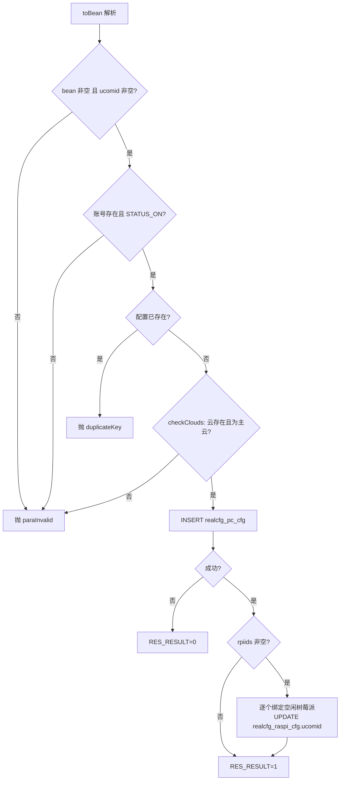
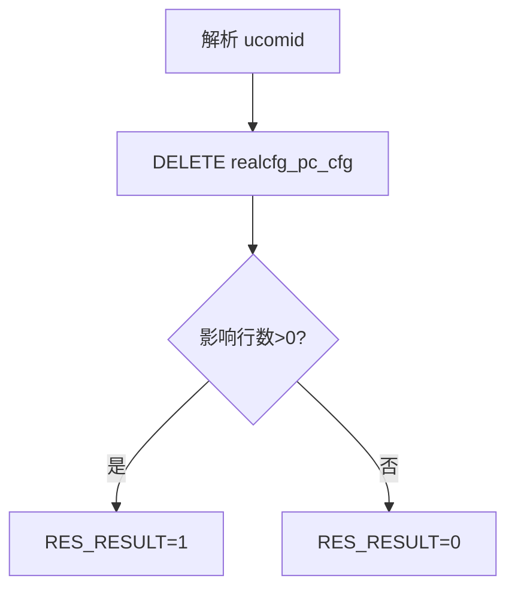
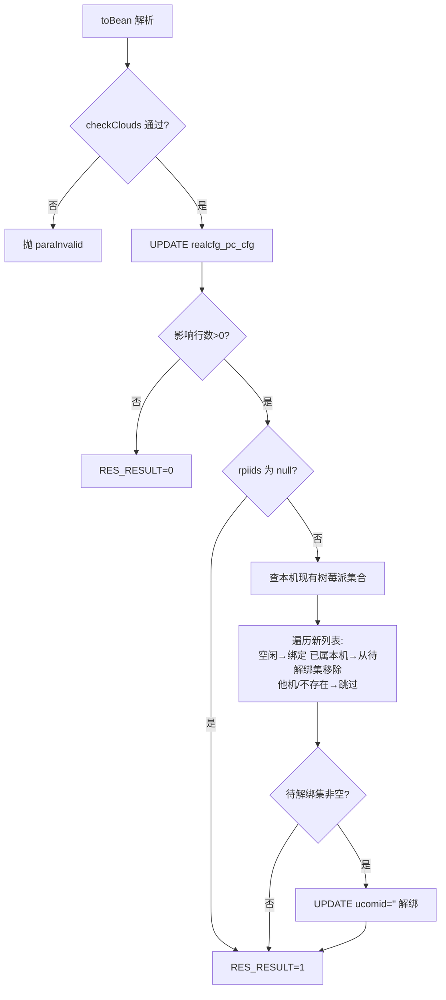
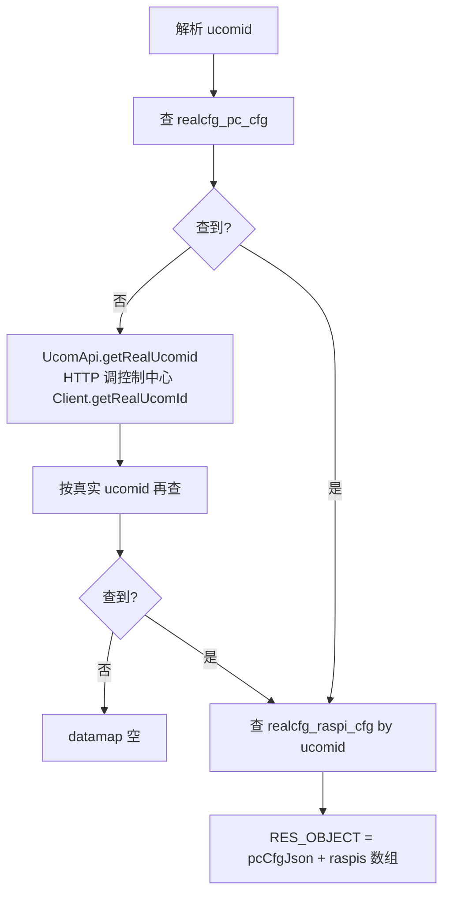
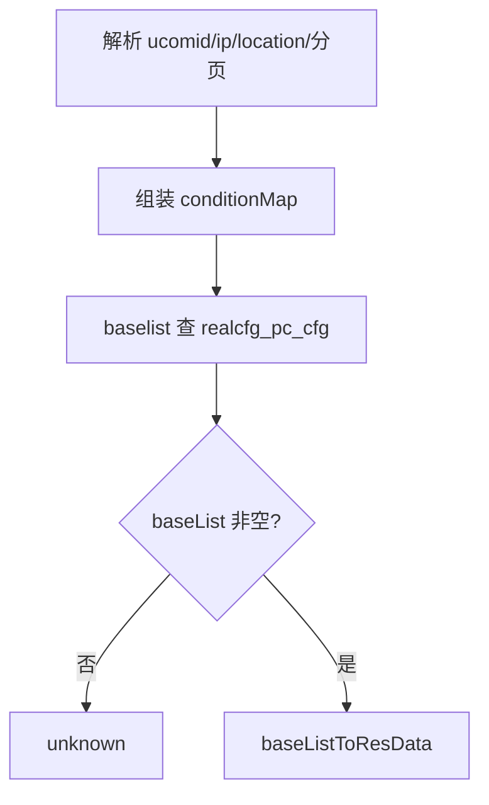

# PcCfg

上位机配置服务：上位机的接入配置（IP、位置、主云列表 clouds、关联树莓派 rpiids）。新增/维护时校验账号状态与主云合法性，并同步维护树莓派与上位机的归属关系。

源码：`real-cfg/src/main/java/cn/testin/service/cfg/PcCfg.java`
业务实现：`cn.testin.business.impl.PcCfgServiceImpl`（`IPcCfgService`）

## op 一览

| op | 说明 |
| --- | --- |
| add | 新增上位机配置（含树莓派绑定） |
| remove | 按 ucomid 删除配置 |
| maintain | 维护配置 + 树莓派归属差量同步 |
| get | 查询配置（含树莓派列表；支持虚拟 ucomid 转真实） |
| list | 多条件分页查询配置列表 |

---

### add (`PcCfg.add`)

- **入口**：ApiServlet，action=cfg，op=PcCfg.add
- **实现意图**：新增上位机配置。业务层校验链：ucomid 非空 → 账号存在且状态为 `RealcfgPcAccount.STATUS_ON`（启用）→ 配置不重复 → clouds 中的云都存在且都是主云（上位机不允许配置子云，checkClouds）。INSERT 成功后处理 rpiids：逐个查树莓派，未登记或已归属其他上位机的跳过，空闲的绑定到本上位机。
- **请求参数**：RealcfgPcCfg 结构，关键字段：

| 参数名 | 类型 | 必填 | 说明 |
| --- | --- | --- | --- |
| ucomid | String | 是 | 上位机 id，须对应启用状态账号 |
| clouds | String | 否 | 主云名 JSON 数组串，元素须为已存在的主云 |
| rpiids | List\<String\> | 否 | 待绑定树莓派 id 列表 |
| ip / location 等 | - | 否 | 见 pojo `cn.testin.pojo.realcfg.RealcfgPcCfg` |

- **响应结构**：统一返回 `{code, msg, data}` 报文，错误时无 `data` 节点。

| 字段 | 类型 | 说明 |
| --- | --- | --- |
| code | Integer | 返回码，0 成功 |
| msg | String | 提示信息 |
| data | Object | 数据对象 |
| data.result | Integer | 1 成功 / 0 失败 |
- **处理流程**：



- **调用链**：PcCfg → PcCfgServiceImpl.add → IRealcfgPcAccountDAO / IRealcfgPcCfgDAO / IRealcfgDeviceSourceDAO（checkClouds）/ IRealcfgRaspiCfgDAO
- **涉及表与 SQL**：`realcfg_pc_account`（SELECT）、`realcfg_pc_cfg`（SELECT/INSERT）、`realcfg_device_source`（SELECT）、`realcfg_raspi_cfg`（SELECT/UPDATE ucomid）
- **异常与校验**：`CommonCode.paraInvalid`（ucomid 空/账号不存在或未启用/clouds 含不存在的云或子云）；`CommonCode.duplicateKey`（配置已存在）。
- **关键代码摘录**：

```java
// real-cfg/src/main/java/cn/testin/business/impl/PcCfgServiceImpl.java
RealcfgPcAccount pcAccount = this.irealcfgpcaccountdao.get(pcCfg.getUcomid());
if (pcAccount == null || !pcAccount.getStatus().equals(RealcfgPcAccount.STATUS_ON)) {
    throw new GeneralException(CommonCode.paraInvalid.getValue(), msg);
}
...
// 上位机不能设置子云
if (StringUtils.isNotBlank(deviceSource.getParentName())) {
    throw new GeneralException(CommonCode.paraInvalid.getValue(), msg);
}
```

---

### remove (`PcCfg.remove`)

- **入口**：ApiServlet，action=cfg，op=PcCfg.remove
- **实现意图**：按 ucomid 删除上位机配置（仅删 `realcfg_pc_cfg`，不动账号与树莓派归属）。
- **请求参数**：

| 参数名 | 类型 | 必填 | 说明 |
| --- | --- | --- | --- |
| ucomid | String | 是 | 上位机 id |

- **响应结构**：统一返回 `{code, msg, data}` 报文，错误时无 `data` 节点。

| 字段 | 类型 | 说明 |
| --- | --- | --- |
| code | Integer | 返回码，0 成功 |
| msg | String | 提示信息 |
| data | Object | 数据对象 |
| data.result | Integer | 1 成功 / 0 失败 |
- **处理流程**：



- **调用链**：PcCfg → PcCfgServiceImpl.remove → IRealcfgPcCfgDAO.delete
- **涉及表与 SQL**：`realcfg_pc_cfg`（DELETE by ucomid）
- **异常与校验**：无显式校验。
- **关键代码摘录**：

```java
// real-cfg/src/main/java/cn/testin/business/impl/PcCfgServiceImpl.java
public boolean remove(String ucomid) throws GeneralException {
    return this.irealcfgpccfgdao.delete(ucomid) > 0;
}
```

---

### maintain (`PcCfg.maintain`)

- **入口**：ApiServlet，action=cfg，op=PcCfg.maintain
- **实现意图**：更新上位机配置并差量同步树莓派归属。先 checkClouds 校验主云合法性，UPDATE 主表；rpiids 为 null 表示不动树莓派，否则：与库中本机现有树莓派比对——新列表中的空闲树莓派绑定到本机、已属本机的保留、库中剩余未出现在新列表中的解绑（ucomid 置空串）。已归属其他上位机的树莓派跳过。
- **请求参数**：RealcfgPcCfg 结构；`ucomid` 为定位键；`clouds`（主云数组串）、`rpiids`（树莓派全量列表，null=不维护）可选。
- **响应结构**：统一返回 `{code, msg, data}` 报文，错误时无 `data` 节点。

| 字段 | 类型 | 说明 |
| --- | --- | --- |
| code | Integer | 返回码，0 成功 |
| msg | String | 提示信息 |
| data | Object | 数据对象 |
| data.result | Integer | 1 成功 / 0 失败 |
- **处理流程**：



- **调用链**：PcCfg → PcCfgServiceImpl.maintain → IRealcfgPcCfgDAO / IRealcfgDeviceSourceDAO / IRealcfgRaspiCfgDAO
- **涉及表与 SQL**：`realcfg_pc_cfg`（UPDATE）、`realcfg_device_source`（SELECT）、`realcfg_raspi_cfg`（SELECT list by ucomid / UPDATE 绑定与解绑）
- **异常与校验**：`CommonCode.paraInvalid`——clouds 含不存在的云或子云；单棵树莓派处理异常被 catch 忽略（容错继续）。
- **关键代码摘录**：

```java
// real-cfg/src/main/java/cn/testin/business/impl/PcCfgServiceImpl.java
// raspiCfgMap 剩余的则要取消对应的关联关系。
if (raspiCfgMap.size() > 0) {
    for (String rpiid : raspiCfgMap.keySet()) {
        RealcfgRaspiCfg raspiCfg = new RealcfgRaspiCfg();
        raspiCfg.setRpiid(rpiid);
        raspiCfg.setUcomid(StringUtils.EMPTY);
        this.irealcfgraspicfgdao.update(raspiCfg);
    }
}
```

---

### get (`PcCfg.get`)

- **入口**：ApiServlet，action=cfg，op=PcCfg.get
- **实现意图**：查询上位机配置并附带其树莓派列表（`raspis` 数组）。若按传入 ucomid 查不到配置，会调用控制中心接口 `Client.getRealUcomId` 把虚拟/别名 ucomid 转成真实 ucomid 后再查一次（转换失败记 errorLog 并放弃）。
- **请求参数**：

| 参数名 | 类型 | 必填 | 说明 |
| --- | --- | --- | --- |
| ucomid | String | 是 | 上位机 id（可为虚拟 id，自动转真实 id） |

- **响应结构**：统一返回 `{code, msg, data}` 报文，错误时无 `data` 节点。

| 字段 | 类型 | 说明 |
| --- | --- | --- |
| code | Integer | 返回码，0 成功 |
| msg | String | 提示信息 |
| data | Object | 数据对象 |
| data.objInfo | Object | RealcfgPcCfg 对象（无记录时无此节点） |
| data.objInfo.ucomid | String | 上位机账号 |
| data.objInfo.ip | String | 上位机 IP |
| data.objInfo.clouds | Array\<Object\> | 设备云（主云）名称数组 |
| data.objInfo.config | Object | 优先级配置对象（非空时输出） |
| data.objInfo.netManage | Integer | 网络管理（0 自动 / 1 手动） |
| data.objInfo.location | String | 机房信息 |
| data.objInfo.caseNum | String | 机柜信息 |
| data.objInfo.caseFloor | String | 机柜层 |
| data.objInfo.descr | String | 描述 |
| data.objInfo.remoteUrl | String | 真机地址 |
| data.objInfo.associatedAccount | String | 关联账户（非空时输出） |
| data.objInfo.status | Integer | 状态 |
| data.objInfo.createtime | Long | 创建时间（毫秒时间戳） |
| data.objInfo.updatetime | Long | 更新时间（毫秒时间戳） |
| data.objInfo.raspis | Array\<Object\> | 树莓派数组，元素字段： |
| data.objInfo.raspis[].rpiid | String | 树莓派编码 |
| data.objInfo.raspis[].ucomid | String | 归属上位机 id |
| data.objInfo.raspis[].appVersion | String | app 版本 |
| data.objInfo.raspis[].mac | String | 树莓派 MAC 地址 |
| data.objInfo.raspis[].ip | String | 树莓派 IP |
| data.objInfo.raspis[].devices | Array\<Object\> | 连接设备数组，元素字段： |
| data.objInfo.raspis[].devices[].bus | Integer | 总线号 |
| data.objInfo.raspis[].devices[].dev | Integer | 设备号 |
| data.objInfo.raspis[].devices[].devpath | String | 设备路径 |
| data.objInfo.raspis[].devices[].port | Integer | 端口 |
| data.objInfo.raspis[].devices[].serial | String | 序列号 |
| data.objInfo.raspis[].location | String | 树莓派位置 |
| data.objInfo.raspis[].reporttime | Long | 上报时间（毫秒时间戳） |
| data.objInfo.raspis[].status | Integer | 状态 |
| data.objInfo.raspis[].createtime | Long | 创建时间（毫秒时间戳） |
| data.objInfo.raspis[].updatetime | Long | 更新时间（毫秒时间戳） |
- **处理流程**：



- **调用链**：PcCfg → PcCfgServiceImpl.get → IRealcfgPcCfgDAO；IRaspiCfgService.list；外部服务 [设备控制中心](../../../设备控制中心（real-controlcenter）/07-开放接口文档/00-模块索引.md)（`cn.testin.api.contorlcenter.UcomApi.getRealUcomid`，HTTP `ApiUtil.doPress(controlCenterPrefixName, ...)`，op=`Client.getRealUcomId`）
- **涉及表与 SQL**：`realcfg_pc_cfg`（SELECT by ucomid）、`realcfg_raspi_cfg`（SELECT by ucomid）
- **异常与校验**：真实 id 查询抛 `GeneralException` 被 catch 记录（Logit.errorLog），不影响主流程。
- **关键代码摘录**：

```java
// real-cfg/src/main/java/cn/testin/service/cfg/PcCfg.java
RealcfgPcCfg result = this.ipccfgservice.get(ucomid);
if (result == null) {
    String realUcomid = new UcomApi().getRealUcomid(ucomid);
    try {
        result = this.ipccfgservice.get(realUcomid);
    } catch (GeneralException e) {
        Logit.errorLog(e.getMessage(), e);
    }
    if (result != null) {
        ucomid = realUcomid;
    }
}
```

---

### list (`PcCfg.list`)

- **入口**：ApiServlet，action=cfg，op=PcCfg.list
- **实现意图**：多条件分页查询上位机配置。page 缺省 1、pageSize 缺省 Config.MaxSize。
- **请求参数**：

| 参数名 | 类型 | 必填 | 说明 |
| --- | --- | --- | --- |
| ucomid | String | 否 | 上位机 id 过滤 |
| ip | String | 否 | IP 过滤 |
| location | String | 否 | 机房/位置过滤 |
| page | Integer | 否 | 页码，≤0 归一为 1 |
| pageSize | Integer | 否 | 每页条数，越界取 Config.MaxSize |

- **响应结构**：统一返回 `{code, msg, data}` 报文，错误时无 `data` 节点。

| 字段 | 类型 | 说明 |
| --- | --- | --- |
| code | Integer | 返回码，0 成功 |
| msg | String | 提示信息 |
| data | Object | 数据对象 |
| data.list | Array\<Object\> | 当前页 RealcfgPcCfg 数组，元素字段： |
| data.list[].ucomid | String | 上位机账号 |
| data.list[].ip | String | 上位机 IP |
| data.list[].clouds | String | 设备云（主云）名称 JSON 数组串 |
| data.list[].pcConfig | String | 优先级配置 JSON 对象串 |
| data.list[].netManage | Integer | 网络管理（0 自动 / 1 手动） |
| data.list[].location | String | 机房信息 |
| data.list[].caseNum | String | 机柜信息 |
| data.list[].descr | String | 描述 |
| data.list[].remoteUrl | String | 真机地址 |
| data.list[].status | Integer | 状态 |
| data.list[].createtime | Long | 创建时间（毫秒时间戳） |
| data.list[].updatetime | Long | 更新时间（毫秒时间戳） |
| data.list[].caseFloor | String | 机柜层 |
| data.list[].associatedAccount | String | 关联账户 |
| data.page | Integer | 当前页码 |
| data.pageSize | Integer | 每页条数 |
| data.totalRow | Long | 总条数 |
| data.totalPage | Integer | 总页数 |
- **处理流程**：



- **调用链**：PcCfg → PcCfgServiceImpl.baselist → IRealcfgPcCfgDAO.baselist
- **涉及表与 SQL**：`realcfg_pc_cfg`（SELECT 分页）
- **异常与校验**：结果空返回 `CommonCode.unknown`。
- **关键代码摘录**：

```java
// real-cfg/src/main/java/cn/testin/service/cfg/PcCfg.java
BaseList<RealcfgPcCfg> baseList = this.ipccfgservice.baselist(conditionMap, page, pageSize);
if (baseList == null || baseList.getList() == null) {
    return ApiUtil.getResult(apirequest, CommonCode.unknown.getValue(), CommonCode.unknown.getDescr());
}
```
