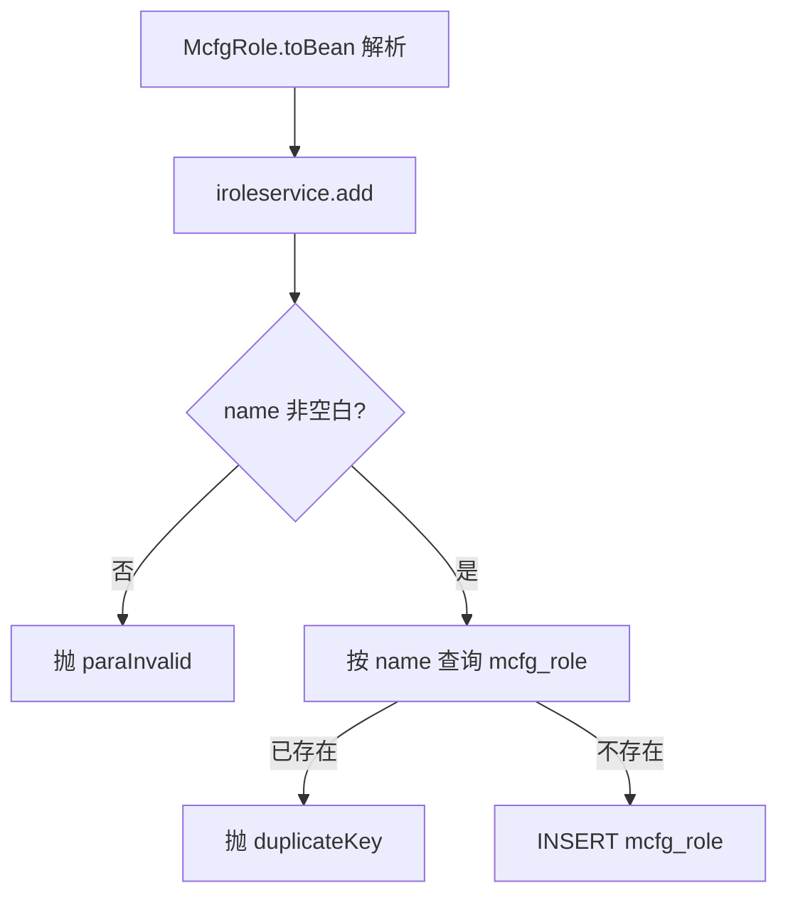
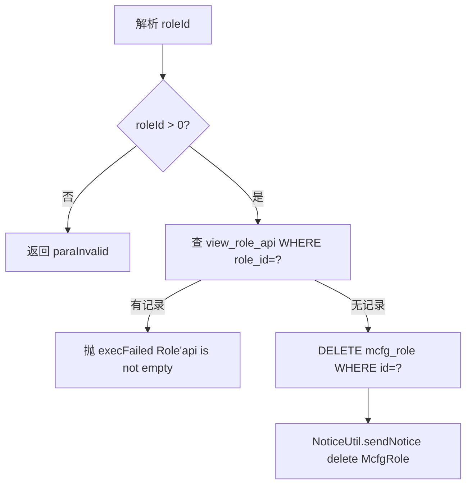
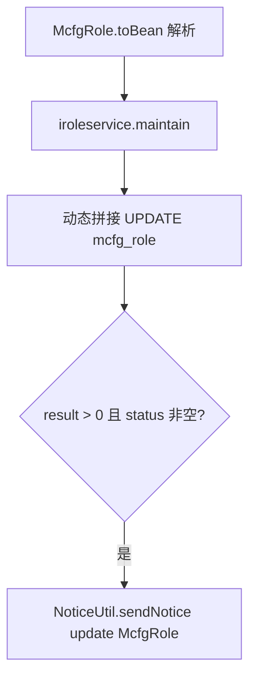
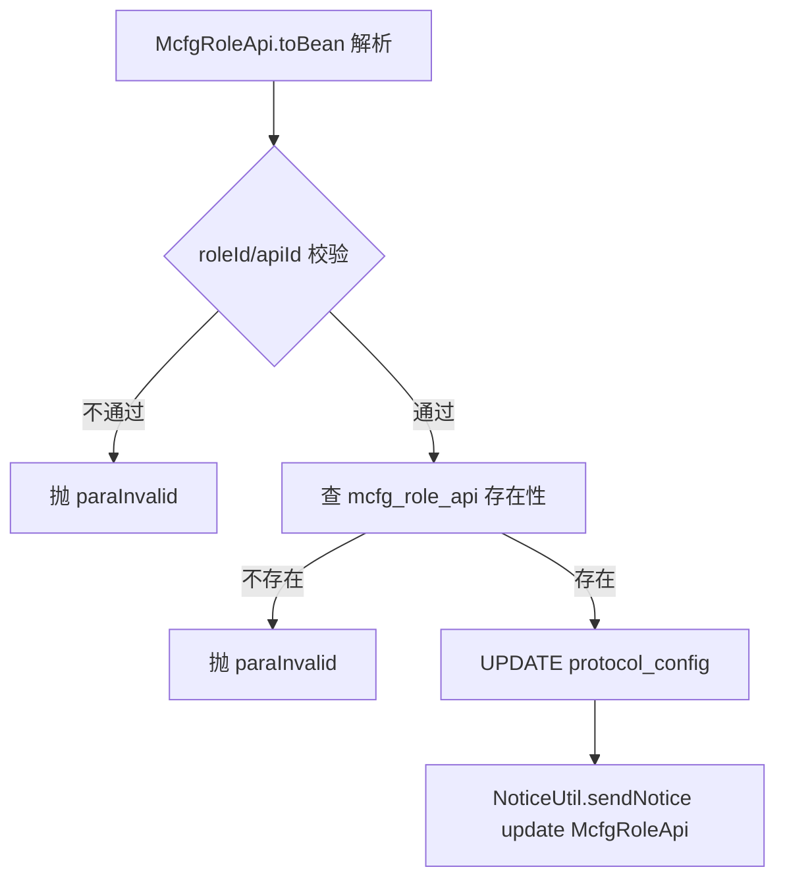
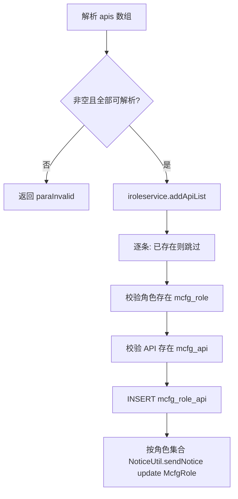
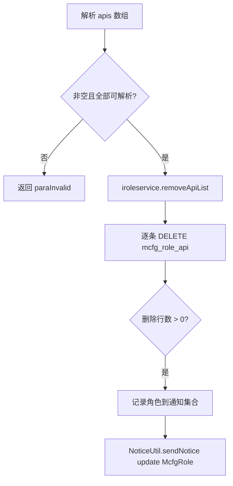
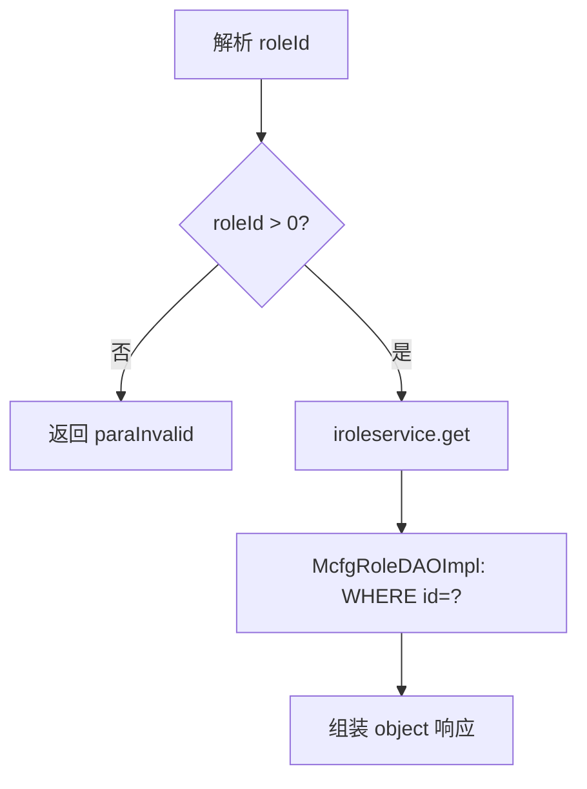
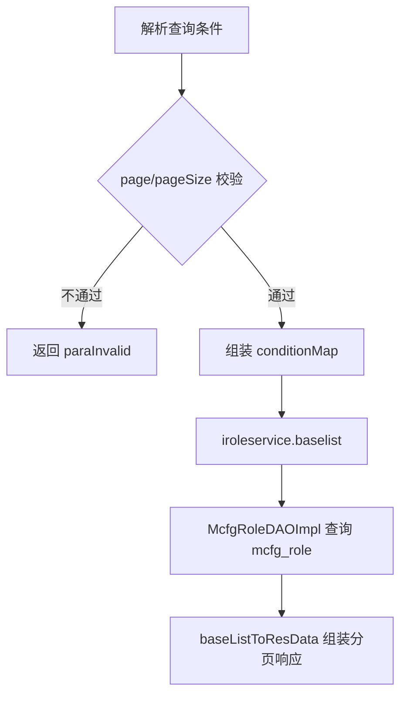

# RoleCfg

## 职责
openapi 角色与角色-API 授权配置。维护 `mcfg_role`（角色）与 `mcfg_role_api`（角色拥有的 API 及角色级协议配置 protocolConfig）两张表。角色名下仍存在 API 时不允许删除；角色-API 关系变化时通过 NoticeUtil 发异步通知（target=McfgRole），供网关/缓存刷新权限。

- 源码：`real-cfg/src/main/java/cn/testin/service/mcfg/RoleCfg.java`
- 入口：ApiServlet 按 `action=mcfg`、`op=<方法名>` 反射调用。

## op 一览表

| op | 说明 | 主要表 |
|---|---|---|
| add | 新增角色（名称唯一） | mcfg_role |
| delete | 删除角色（有 API 时拒绝） | mcfg_role, view_role_api |
| maintain | 更新角色名称/状态 | mcfg_role |
| maintainApi | 维护角色某 API 的协议配置 | mcfg_role_api |
| addApi | 批量为角色添加 API | mcfg_role_api, mcfg_role, mcfg_api |
| removeApi | 批量移除角色 API | mcfg_role_api |
| get | 按 roleId 查询角色 | mcfg_role |
| list | 角色分页查询 | mcfg_role |

---

### add (`RoleCfg.add`)
- **入口**：ApiServlet，action=mcfg，op=RoleCfg.add
- **实现意图**：新增 openapi 角色；业务层先按名称查重，重名抛 duplicateKey。
- **请求参数**（由 `McfgRole.toBean` 映射）：

| 参数名 | 类型 | 必填 | 说明 |
|---|---|---|---|
| name | string | 是 | 角色名称，唯一 |
| status | int | 否 | 状态，默认启用（STATUS_ON） |

- **响应结构**：统一返回 `{code, msg, data}` 报文，错误时无 `data` 节点。

| 字段 | 类型 | 说明 |
| --- | --- | --- |
| code | Integer | 返回码，0 成功 |
| msg | String | 提示信息 |
| data | Object | 数据对象 |
| data.result | Integer | 1 成功 / 0 失败 |
- **处理流程**：

- **调用链**：RoleCfg → RoleServiceImpl.add → McfgRoleDAOImpl（list 查重 + add）→ 表 mcfg_role
- **涉及表与 SQL**：
  - `mcfg_role`：SELECT WHERE `name=?`（查重）；INSERT（name, status, createtime, updatetime），DAO 方法 `McfgRoleDAOImpl.list / add`
- **异常与校验**：
  - name 空白 → `paraInvalid`；name 已存在 → `duplicateKey`
- **关键代码摘录**：
```java
// real-cfg/src/main/java/cn/testin/business/impl/RoleServiceImpl.java
Map<String, Object> conditionMap = new HashMap<>();
conditionMap.put("name", role.getName());
List<McfgRole> list = this.imcfgroledao.list(conditionMap, 0, 1);
if (list != null && list.size() > 0) {
    throw new GeneralException(CommonCode.duplicateKey.getValue(), CommonCode.duplicateKey.getDescr());
}
return this.imcfgroledao.add(role);
```

---

### delete (`RoleCfg.delete`)
- **入口**：ApiServlet，action=mcfg，op=RoleCfg.delete
- **实现意图**：删除角色；若角色下仍配置有 API（view_role_api 存在记录）则拒绝删除。
- **请求参数**：

| 参数名 | 类型 | 必填 | 说明 |
|---|---|---|---|
| roleId | int | 是 | 角色 ID，必须 > 0 |

- **响应结构**：统一返回 `{code, msg, data}` 报文，错误时无 `data` 节点。

| 字段 | 类型 | 说明 |
| --- | --- | --- |
| code | Integer | 返回码，0 成功 |
| msg | String | 提示信息 |
| data | Object | 数据对象 |
| data.result | Integer | 删除影响行数 |
- **处理流程**：

- **调用链**：RoleCfg → RoleServiceImpl.delete → ViewRoleApiDAOImpl.list（校验）→ McfgRoleDAOImpl.delete → 表 mcfg_role；NoticeUtil（notice-manager 兜底）
- **涉及表与 SQL**：
  - `view_role_api`：SELECT WHERE `role_id=?` LIMIT 1（存在性校验）
  - `mcfg_role`：DELETE WHERE `id=?`，DAO 方法 `McfgRoleDAOImpl.delete`
- **异常与校验**：
  - `roleId <= 0` → `paraInvalid`；角色下存在 API → `execFailed (Role'api is not empty!)`
- **关键代码摘录**：
```java
// real-cfg/src/main/java/cn/testin/business/impl/RoleServiceImpl.java
Map<String, Object> conditionMap = new HashMap<>();
conditionMap.put("roleId", id);
List<ViewRoleApi> list = this.iviewroleapidao.list(conditionMap, 0, 1);
if (list != null && list.size() > 0) {
    throw new GeneralException(CommonCode.execFailed.getValue(),
        CommonCode.execFailed.getDescr() + "(Role'api is not empty!)");
}
return this.imcfgroledao.delete(id);
```

---

### maintain (`RoleCfg.maintain`)
- **入口**：ApiServlet，action=mcfg，op=RoleCfg.maintain
- **实现意图**：按 id 更新角色名称/状态（动态字段）；状态变更时发异步通知。
- **请求参数**（由 `McfgRole.toBean` 映射）：

| 参数名 | 类型 | 必填 | 说明 |
|---|---|---|---|
| id / roleId | int | 是 | 角色 ID |
| name | string | 否 | 角色名称 |
| status | int | 否 | 状态 |

- **响应结构**：统一返回 `{code, msg, data}` 报文，错误时无 `data` 节点。

| 字段 | 类型 | 说明 |
| --- | --- | --- |
| code | Integer | 返回码，0 成功 |
| msg | String | 提示信息 |
| data | Object | 数据对象 |
| data.result | Integer | 1 成功 / 0 失败 |
- **处理流程**：

- **调用链**：RoleCfg → RoleServiceImpl.maintain → McfgRoleDAOImpl.update → 表 mcfg_role；NoticeUtil（notice-manager 兜底）
- **涉及表与 SQL**：
  - `mcfg_role`：UPDATE SET updatetime[, name][, status] WHERE `id=?`，DAO 方法 `McfgRoleDAOImpl.update`
- **异常与校验**：
  - role/id 为空 → `paraInvalid`
- **关键代码摘录**：
```java
// real-cfg/src/main/java/cn/testin/dao/impl/mcfg/McfgRoleDAOImpl.java
Integer result = this.getMcfgdao().update(sql.toString(), params.toArray());
// 针对角色信息调整
if (result > 0 && role.getStatus() != null) {
    NoticeUtil.sendNotice("update", "McfgRole", role.getId());
}
```

---

### maintainApi (`RoleCfg.maintainApi`)
- **入口**：ApiServlet，action=mcfg，op=RoleCfg.maintainApi
- **实现意图**：维护角色下某个 API 的特殊配置（protocolConfig，需为合法 JSON）；记录必须已存在。
- **请求参数**（由 `McfgRoleApi.toBean` 映射）：

| 参数名 | 类型 | 必填 | 说明 |
|---|---|---|---|
| roleId | int | 是 | 角色 ID |
| apiId | int | 是 | API ID |
| protocolConfig | string | 否 | 协议配置，合法 JSON |

- **响应结构**：统一返回 `{code, msg, data}` 报文，错误时无 `data` 节点。

| 字段 | 类型 | 说明 |
| --- | --- | --- |
| code | Integer | 返回码，0 成功 |
| msg | String | 提示信息 |
| data | Object | 数据对象 |
| data.result | Integer | 1 成功 / 0 失败 |
- **处理流程**：

- **调用链**：RoleCfg → RoleServiceImpl.maintainApi → McfgRoleApiDAOImpl（get + update）→ 表 mcfg_role_api；NoticeUtil（notice-manager 兜底）
- **涉及表与 SQL**：
  - `mcfg_role_api`：SELECT / UPDATE WHERE `role_id=? AND api_id=?`，DAO 方法 `McfgRoleApiDAOImpl.get / update`
- **异常与校验**：
  - roleId / apiId 为空 → `paraInvalid`；记录不存在 → `paraInvalid`；protocolConfig 非合法 JSON → `paraInvalid`
- **关键代码摘录**：
```java
// real-cfg/src/main/java/cn/testin/business/impl/RoleServiceImpl.java
McfgRoleApi dbroleapi = this.imcfgroleapidao.get(roleApi.getRoleId(), roleApi.getApiId());
if (dbroleapi == null) {
    throw new GeneralException(CommonCode.paraInvalid.getValue(),
        CommonCode.paraInvalid.getDescr() + "(roleId/apiId is invalid!)");
}
return this.imcfgroleapidao.update(roleApi);
```

---

### addApi (`RoleCfg.addApi`)
- **入口**：ApiServlet，action=mcfg，op=RoleCfg.addApi
- **实现意图**：批量为角色添加 API 授权。逐条跳过已存在的关系；校验角色与 API 均存在后才插入；全部完成后按涉及的角色发异步通知。
- **请求参数**：

| 参数名 | 类型 | 必填 | 说明 |
|---|---|---|---|
| apis | array | 是 | McfgRoleApi 数组（roleId、apiId、protocolConfig 等），不能为空 |

- **响应结构**：统一返回 `{code, msg, data}` 报文，错误时无 `data` 节点。

| 字段 | 类型 | 说明 |
| --- | --- | --- |
| code | Integer | 返回码，0 成功 |
| msg | String | 提示信息 |
| data | Object | 数据对象 |
| data.result | Integer | 1 成功 / 0 失败 |
- **处理流程**：

- **调用链**：RoleCfg → RoleServiceImpl.addApiList → McfgRoleApiDAOImpl（get + add）、McfgRoleDAOImpl.get、McfgApiDAOImpl.get → 表 mcfg_role_api / mcfg_role / mcfg_api；NoticeUtil（notice-manager 兜底）
- **涉及表与 SQL**：
  - `mcfg_role_api`：SELECT（查重）+ INSERT（role_id, api_id, protocol_config, access_frequency, access_quota, quota_unit, status, createtime, updatetime）
  - `mcfg_role` / `mcfg_api`：SELECT 存在性校验
- **异常与校验**：
  - apis 为空或解析条数不一致 → `paraInvalid`
  - roleId 不存在 / apiId 不存在 → `paraInvalid`
- **关键代码摘录**：
```java
// real-cfg/src/main/java/cn/testin/business/impl/RoleServiceImpl.java
for (McfgRoleApi roleApi : apiList) {
    McfgRoleApi dbroleapi = this.imcfgroleapidao.get(roleApi.getRoleId(), roleApi.getApiId());
    if (dbroleapi != null) { continue; }
    // 校验角色、API 存在后
    this.imcfgroleapidao.add(roleApi);
}
// 做异步通知
NoticeUtil.sendNotice("update", "McfgRole", key);
```

---

### removeApi (`RoleCfg.removeApi`)
- **入口**：ApiServlet，action=mcfg，op=RoleCfg.removeApi
- **实现意图**：批量移除角色的 API 授权；实际删除成功的角色会收到异步通知。
- **请求参数**：

| 参数名 | 类型 | 必填 | 说明 |
|---|---|---|---|
| apis | array | 是 | McfgRoleApi 数组（至少含 roleId、apiId），不能为空 |

- **响应结构**：统一返回 `{code, msg, data}` 报文，错误时无 `data` 节点。

| 字段 | 类型 | 说明 |
| --- | --- | --- |
| code | Integer | 返回码，0 成功 |
| msg | String | 提示信息 |
| data | Object | 数据对象 |
| data.result | Integer | 1 成功 / 0 失败 |
- **处理流程**：

- **调用链**：RoleCfg → RoleServiceImpl.removeApiList → McfgRoleApiDAOImpl.delete → 表 mcfg_role_api；NoticeUtil（notice-manager 兜底）
- **涉及表与 SQL**：
  - `mcfg_role_api`：DELETE WHERE `role_id=? AND api_id=?`，DAO 方法 `McfgRoleApiDAOImpl.delete`
- **异常与校验**：
  - apis 为空或解析条数不一致 → `paraInvalid`
- **关键代码摘录**：
```java
// real-cfg/src/main/java/cn/testin/business/impl/RoleServiceImpl.java
Integer delResult = this.imcfgroleapidao.delete(roleApi.getRoleId(), roleApi.getApiId());
if (delResult > 0) {
    roleidmap.put(roleApi.getRoleId(), roleApi.getRoleId());
}
// ... 对涉及角色逐一 NoticeUtil.sendNotice("update", "McfgRole", key);
```

---

### get (`RoleCfg.get`)
- **入口**：ApiServlet，action=mcfg，op=RoleCfg.get
- **实现意图**：按 roleId 查询单个角色详情。
- **请求参数**：

| 参数名 | 类型 | 必填 | 说明 |
|---|---|---|---|
| roleId | int | 是 | 角色 ID，必须 > 0 |

- **响应结构**：统一返回 `{code, msg, data}` 报文，错误时无 `data` 节点。

| 字段 | 类型 | 说明 |
| --- | --- | --- |
| code | Integer | 返回码，0 成功 |
| msg | String | 提示信息 |
| data | Object | 数据对象 |
| data.objInfo | Object | McfgRole 对象（存在时） |
| data.objInfo.id | Integer | 角色 ID |
| data.objInfo.name | String | 角色名称 |
| data.objInfo.status | Integer | 状态 |
| data.objInfo.createtime | Long | 创建时间（毫秒时间戳） |
| data.objInfo.updatetime | Long | 更新时间（毫秒时间戳） |
- **处理流程**：

- **调用链**：RoleCfg → RoleServiceImpl.get → McfgRoleDAOImpl.get → 表 mcfg_role
- **涉及表与 SQL**：
  - `mcfg_role`：SELECT * WHERE `id=?`，DAO 方法 `McfgRoleDAOImpl.get`
- **异常与校验**：
  - `roleId` 为空或 `<= 0` → `paraInvalid`
- **关键代码摘录**：
```java
// real-cfg/src/main/java/cn/testin/service/mcfg/RoleCfg.java
if (roleId == null || roleId <= 0) {
    String msg = CommonCode.paraInvalid.getDescr() + "(roleId is invalid!)";
    return ApiUtil.getResult(apirequest, CommonCode.paraInvalid.getValue(), msg);
}
McfgRole role = this.iroleservice.get(roleId);
```

---

### list (`RoleCfg.list`)
- **入口**：ApiServlet，action=mcfg，op=RoleCfg.list
- **实现意图**：按名称（精确 name / 模糊 vagueName）/ 状态分页查询角色列表。
- **请求参数**：

| 参数名 | 类型 | 必填 | 说明 |
|---|---|---|---|
| name | string | 否 | 角色名精确匹配 |
| vagueName | string | 否 | 角色名模糊匹配（like %x%） |
| status | int | 否 | 状态 |
| page | int | 是 | 页码，> 0 |
| pageSize | int | 是 | 每页条数，1 ~ Config.MaxSize |

- **响应结构**：统一返回 `{code, msg, data}` 报文，错误时无 `data` 节点。

| 字段 | 类型 | 说明 |
| --- | --- | --- |
| code | Integer | 返回码，0 成功 |
| msg | String | 提示信息 |
| data | Object | 数据对象 |
| data.list | Array\<Object\> | 当前页 McfgRole 数组，元素字段： |
| data.list[].id | Integer | 角色 ID |
| data.list[].name | String | 角色名称 |
| data.list[].status | Integer | 状态 |
| data.list[].createtime | Long | 创建时间（毫秒时间戳） |
| data.list[].updatetime | Long | 更新时间（毫秒时间戳） |
| data.page | Integer | 当前页码 |
| data.pageSize | Integer | 每页条数 |
| data.totalRow | Long | 总条数 |
| data.totalPage | Integer | 总页数 |
- **处理流程**：

- **调用链**：RoleCfg → RoleServiceImpl.baselist → McfgRoleDAOImpl.baselist → 表 mcfg_role
- **涉及表与 SQL**：
  - `mcfg_role`：SELECT count(*) / SELECT *（`name=?`、`name like ?`、`status=?`），DAO 方法 `McfgRoleDAOImpl.baselist / list / rowsCount`
- **异常与校验**：
  - `page <= 0`、`pageSize` 越界 → `paraInvalid`；查询结果 null → `unknown`
- **关键代码摘录**：
```java
// real-cfg/src/main/java/cn/testin/service/mcfg/RoleCfg.java
BaseList<McfgRole> baseList = this.iroleservice.baselist(conditionMap, page, pageSize);
if (baseList == null || baseList.getList() == null) {
    return ApiUtil.getResult(apirequest, CommonCode.unknown.getValue(), CommonCode.unknown.getDescr());
}
Map<String, Object> datamap = new HashMap<String, Object>();
baseListToResData(datamap, baseList);
```
