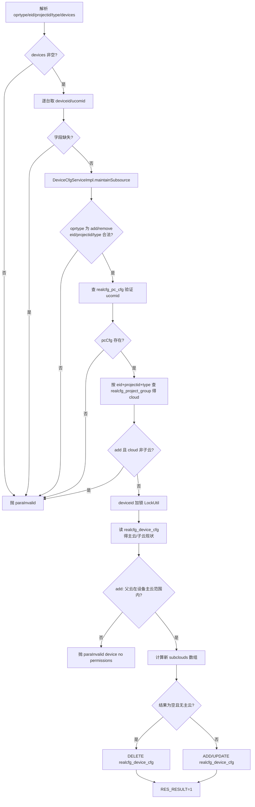
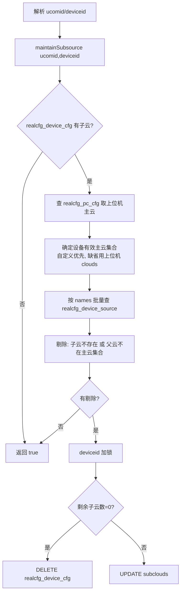
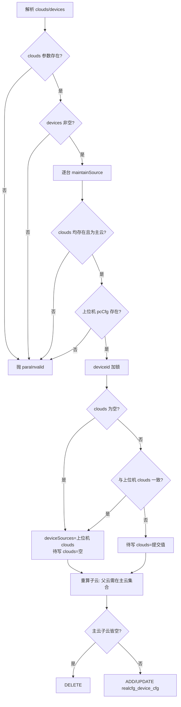
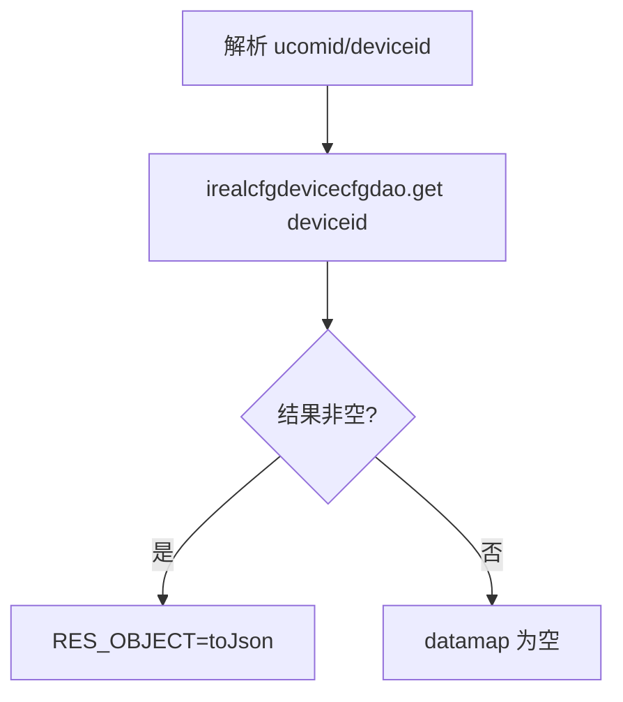
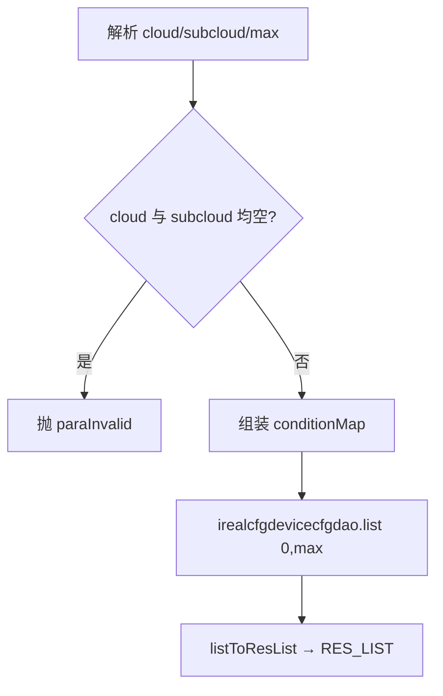
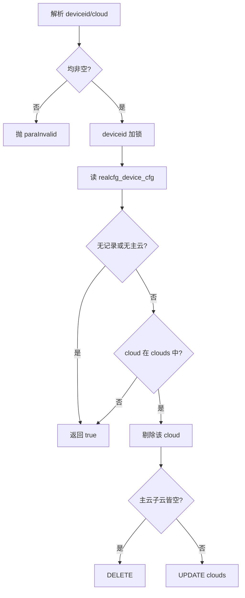

# DeviceCfg

设备云配置服务：维护单台设备与"设备云（主云）/ 设备子云"的绑定关系，决定一台真机可以被哪些云（企业私有云分组）调度使用。

源码：`real-cfg/src/main/java/cn/testin/service/cfg/DeviceCfg.java`
业务实现：`cn.testin.business.impl.DeviceCfgServiceImpl`（`IDeviceCfgService`）

## op 一览

| op | 说明 |
| --- | --- |
| maintainSubsource | 批量维护设备自定义子云（add/remove 某企业项目组的子云） |
| cleanSubsource | 清理设备子云中失效的云（父云不在设备主云范围内时剔除） |
| maintainSource | 批量维护设备自定义主云列表 |
| get | 查询单台设备的云配置 |
| list | 按主云/子云查询设备配置列表 |
| clean | 清除设备上指定的主云 |

---

### maintainSubsource (`DeviceCfg.maintainSubsource`)

- **入口**：ApiServlet，action=cfg，op=DeviceCfg.maintainSubsource
- **实现意图**：为一批设备添加/移除某企业（eid）某项目组（projectid+type）对应的设备子云。service 层遍历 devices 数组逐台调用业务层；业务层先按 eid/projectid/type 查 `realcfg_project_group` 得到子云名（devicegroupid），校验子云必须存在且有父云（add 时），并校验设备的主云范围包含该子云的父云（权限校验），然后在按 deviceid 加锁的临界区内对 `realcfg_device_cfg.subclouds` 做增删。若操作后设备既无主云也无子云则删除记录。

- **请求参数**：

| 参数名 | 类型 | 必填 | 说明 |
| --- | --- | --- | --- |
| oprtype | String | 是 | 操作类型：`add` / `remove` |
| eid | Integer | 是 | 企业 id，>0 |
| projectid | Integer | 是 | 项目 id，>0 |
| type | Integer | 是 | 项目类型：app=1，web=2 |
| devices | JSONArray | 是 | 设备数组，元素含 `deviceid`、`ucomid`，缺一不可 |

- **响应结构**：统一返回 `{code, msg, data}` 报文，错误时无 `data` 节点。

| 字段 | 类型 | 说明 |
| --- | --- | --- |
| code | Integer | 返回码，0 成功 |
| msg | String | 提示信息 |
| data | Object | 数据对象 |
| data.result | Integer | 固定 1（全部成功；任何一台失败抛 GeneralException 整体失败） |

- **处理流程**：



- **调用链**：DeviceCfg → DeviceCfgServiceImpl（IDeviceCfgService）→ IRealcfgDeviceCfgDAO / IRealcfgPcCfgDAO / IRealcfgProjectGroupDAO / IRealcfgDeviceSourceDAO；锁：`LockUtil.getLock(new KEY("IDeviceCfgService.RealcfgDeviceCfg.deviceid", deviceid))`
- **涉及表与 SQL**：
  - `realcfg_project_group`：SELECT（eid+projectid+type → devicegroupid）
  - `realcfg_pc_cfg`：SELECT（校验 ucomid）
  - `realcfg_device_source`：SELECT（校验子云及父云）
  - `realcfg_device_cfg`：SELECT / INSERT / UPDATE / DELETE（mapper 方法 add/update/delete/get）
- **异常与校验**：`CommonCode.paraInvalid`——devices 为空、字段缺失、oprtype/eid/projectid/type 非法、ucomid 不存在、add 时 cloud 非子云、设备无该子云父云权限。
- **关键代码摘录**：

```java
// real-cfg/src/main/java/cn/testin/business/impl/DeviceCfgServiceImpl.java
conditionMap.put("eid", eid);
conditionMap.put("projectid", projectid);
conditionMap.put("type", type);
List<RealcfgProjectGroup> projectGroups = this.irealcfgprojectgroupdao.list(conditionMap, 0, Config.MaxSize);
if (projectGroups.size() == 0) {
    throw new GeneralException(CommonCode.paraInvalid.getValue(), msg);
} else {
    cloud = projectGroups.get(0).getDevicegroupid();
}
// 设置设备子云不能为主云信息
RealcfgDeviceSource deviceSource = this.irealcfgdevicesourcedao.get(cloud);
if (oprtype.equalsIgnoreCase("add")
        && (deviceSource == null || StringUtils.isBlank(deviceSource.getParentName()))) {
    throw new GeneralException(CommonCode.paraInvalid.getValue(), msg);
}
```

---

### cleanSubsource (`DeviceCfg.cleanSubsource`)

- **入口**：ApiServlet，action=cfg，op=DeviceCfg.cleanSubsource
- **实现意图**：清理单台设备的失效子云。读取设备当前子云列表，逐个核对：子云已不存在、或子云的父云不在该设备有效主云范围（设备自定义主云，缺省时回落到上位机配置的主云）内，则剔除。全部失效则删除整行，部分失效则 UPDATE。按 deviceid 加锁。
- **请求参数**：

| 参数名 | 类型 | 必填 | 说明 |
| --- | --- | --- | --- |
| ucomid | String | 是 | 上位机 id（业务层判空） |
| deviceid | String | 是 | 设备 id |

- **响应结构**：统一返回 `{code, msg, data}` 报文，错误时无 `data` 节点。

| 字段 | 类型 | 说明 |
| --- | --- | --- |
| code | Integer | 返回码，0 成功 |
| msg | String | 提示信息 |
| data | Object | 数据对象 |
| data.result | Integer | 1 成功 / 0 失败 |
- **处理流程**：



- **调用链**：DeviceCfg → DeviceCfgServiceImpl.maintainSubsource(ucomid, deviceid) → IRealcfgDeviceCfgDAO / IRealcfgPcCfgDAO / IRealcfgDeviceSourceDAO
- **涉及表与 SQL**：`realcfg_device_cfg`（get/update/delete）、`realcfg_pc_cfg`（get）、`realcfg_device_source`（list by names）
- **异常与校验**：`CommonCode.paraInvalid`——ucomid/deviceid 为空；清理结果写 debugLog。
- **关键代码摘录**：

```java
// real-cfg/src/main/java/cn/testin/business/impl/DeviceCfgServiceImpl.java
for (String subsource : dbdevicecfg.getSubclouds()) {
    RealcfgDeviceSource deviceSource = devicesourcemap.get(subsource);
    if (deviceSource == null) {
        subsourcemap.remove(subsource);
    } else if (StringUtils.isBlank(deviceSource.getParentName())
            || !sourcemap.containsKey(deviceSource.getParentName())) {
        subsourcemap.remove(deviceSource.getName());
    }
}
```

---

### maintainSource (`DeviceCfg.maintainSource`)

- **入口**：ApiServlet，action=cfg，op=DeviceCfg.maintainSource
- **实现意图**：为一批设备设置自定义主云列表。clouds 去重后逐台处理：校验每个云都存在且为主云（无 parentName）；校验上位机存在。加锁后：若提交 clouds 与上位机配置完全一致，则置空（表示"跟随上位机"）；若 clouds 为空数组，表示清除自定义、跟随上位机。同时重算子云：仅保留父云仍在新主云集合中的子云。最终主云、子云皆空则删除记录，否则新增/更新。

- **请求参数**：

| 参数名 | 类型 | 必填 | 说明 |
| --- | --- | --- | --- |
| clouds | JSONArray\<String\> | 是 | 主云名列表（可为空数组表示跟随上位机；缺省该字段报错） |
| devices | JSONArray | 是 | 设备数组，元素含 `deviceid`、`ucomid` |

- **响应结构**：统一返回 `{code, msg, data}` 报文，错误时无 `data` 节点。

| 字段 | 类型 | 说明 |
| --- | --- | --- |
| code | Integer | 返回码，0 成功 |
| msg | String | 提示信息 |
| data | Object | 数据对象 |
| data.result | Integer | 固定 1 |
- **处理流程**：



- **调用链**：DeviceCfg → DeviceCfgServiceImpl.maintainSource → IRealcfgDeviceSourceDAO / IRealcfgPcCfgDAO / IRealcfgDeviceCfgDAO
- **涉及表与 SQL**：`realcfg_device_source`（list by names）、`realcfg_pc_cfg`（get）、`realcfg_device_cfg`（get/add/update/delete）
- **异常与校验**：`CommonCode.paraInvalid`——clouds 为 null、含不存在的云、含子云、ucomid 为空或不存在、devices 为空。
- **关键代码摘录**：

```java
// real-cfg/src/main/java/cn/testin/business/impl/DeviceCfgServiceImpl.java
// 与上位机的云配置一致，一致则将对应设备的待更新云信息设置为空数组。
if (samepccfg) {
    clouds = new String[]{};
}
...
if (clouds.length == 0 && maintainSubsources.length == 0) {
    if (this.irealcfgdevicecfgdao.delete(deviceid) >= 0) {
        result = true;
    }
}
```

---

### get (`DeviceCfg.get`)

- **入口**：ApiServlet，action=cfg，op=DeviceCfg.get
- **实现意图**：按 deviceid 查询设备的云配置记录（自定义主云 + 子云）。ucomid 仅透传，实际查询只用 deviceid。
- **请求参数**：

| 参数名 | 类型 | 必填 | 说明 |
| --- | --- | --- | --- |
| ucomid | String | 否 | 上位机 id |
| deviceid | String | 否 | 设备 id |

- **响应结构**：统一返回 `{code, msg, data}` 报文，错误时无 `data` 节点。

| 字段 | 类型 | 说明 |
| --- | --- | --- |
| code | Integer | 返回码，0 成功 |
| msg | String | 提示信息 |
| data | Object | 数据对象 |
| data.objInfo | Object | RealcfgDeviceCfg 对象（无记录时无此节点） |
| data.objInfo.deviceid | String | 设备 id |
| data.objInfo.clouds | Array\<String\> | 自定义主云列表 |
| data.objInfo.subclouds | Array\<String\> | 子云列表 |
| data.objInfo.descr | String | 描述 |
| data.objInfo.status | Integer | 状态 |
| data.objInfo.createtime | Long | 创建时间（毫秒时间戳） |
| data.objInfo.updatetime | Long | 更新时间（毫秒时间戳） |
- **处理流程**：



- **调用链**：DeviceCfg → DeviceCfgServiceImpl.get → IRealcfgDeviceCfgDAO.get
- **涉及表与 SQL**：`realcfg_device_cfg`（SELECT by deviceid）
- **异常与校验**：无显式校验。
- **关键代码摘录**：

```java
// real-cfg/src/main/java/cn/testin/service/cfg/DeviceCfg.java
RealcfgDeviceCfg result = this.idevicecfgservice.get(ucomid, deviceid);
...
if (result != null) {
    datamap.put(ApiResponse.RES_OBJECT, result.toJson());
}
```

---

### list (`DeviceCfg.list`)

- **入口**：ApiServlet，action=cfg，op=DeviceCfg.list
- **实现意图**：按主云（cloud）或子云（subcloud）反查绑定了该云的设备配置列表，用于"查看某云下有哪些设备"。cloud 与 subcloud 至少传一个。
- **请求参数**：

| 参数名 | 类型 | 必填 | 说明 |
| --- | --- | --- | --- |
| cloud | String | 否 | 主云名（与 subcloud 至少传一个） |
| subcloud | String | 否 | 子云名（与 cloud 至少传一个） |
| max | Integer | 否 | 返回上限，非法或越界取 Config.MaxSize |

- **响应结构**：统一返回 `{code, msg, data}` 报文，错误时无 `data` 节点。

| 字段 | 类型 | 说明 |
| --- | --- | --- |
| code | Integer | 返回码，0 成功 |
| msg | String | 提示信息 |
| data | Object | 数据对象 |
| data.list | Array\<Object\> | RealcfgDeviceCfg 数组，元素字段： |
| data.list[].deviceid | String | 设备 id |
| data.list[].clouds | Array\<String\> | 自定义主云列表 |
| data.list[].subclouds | Array\<String\> | 子云列表 |
| data.list[].descr | String | 描述 |
| data.list[].status | Integer | 状态 |
| data.list[].createtime | Long | 创建时间（毫秒时间戳） |
| data.list[].updatetime | Long | 更新时间（毫秒时间戳） |
- **处理流程**：



- **调用链**：DeviceCfg → DeviceCfgServiceImpl.list → IRealcfgDeviceCfgDAO.list
- **涉及表与 SQL**：`realcfg_device_cfg`（SELECT WHERE cloud/subcloud 匹配）
- **异常与校验**：`CommonCode.paraInvalid`——cloud、subcloud 均空白。
- **关键代码摘录**：

```java
// real-cfg/src/main/java/cn/testin/service/cfg/DeviceCfg.java
if (StringUtils.isBlank(cloud) && StringUtils.isBlank(subcloud)) {
    throw new GeneralException(CommonCode.paraInvalid.getValue(), msg);
}
List<RealcfgDeviceCfg> list = idevicecfgservice.list(conditionMap, 0, max);
```

---

### clean (`DeviceCfg.clean`)

- **入口**：ApiServlet，action=cfg，op=DeviceCfg.clean
- **实现意图**：从单台设备的自定义主云列表中移除指定主云（cloud）。加锁后读记录，从 clouds 数组中剔除目标；若剔除后无主云且无子云则删除整行，否则 UPDATE。记录不存在或本来不含该云视为成功（幂等）。
- **请求参数**：

| 参数名 | 类型 | 必填 | 说明 |
| --- | --- | --- | --- |
| deviceid | String | 是 | 设备 id |
| cloud | String | 是 | 待清除的主云名 |

- **响应结构**：统一返回 `{code, msg, data}` 报文，错误时无 `data` 节点。

| 字段 | 类型 | 说明 |
| --- | --- | --- |
| code | Integer | 返回码，0 成功 |
| msg | String | 提示信息 |
| data | Object | 数据对象 |
| data.result | Integer | 1 成功 / 0 失败 |
- **处理流程**：



- **调用链**：DeviceCfg → DeviceCfgServiceImpl.cleanSource → IRealcfgDeviceCfgDAO
- **涉及表与 SQL**：`realcfg_device_cfg`（get/update/delete）
- **异常与校验**：`CommonCode.paraInvalid`——deviceid 或 cloud 空白。
- **关键代码摘录**：

```java
// real-cfg/src/main/java/cn/testin/business/impl/DeviceCfgServiceImpl.java
if ((deviceCfg.getSubclouds() == null || deviceCfg.getSubclouds().length == 0)
        && (maintainSources == null || maintainSources.length == 0)) {
    if (this.irealcfgdevicecfgdao.delete(deviceid) >= 0) {
        return true;
    }
} else {
    if (this.irealcfgdevicecfgdao.update(tmpdeviceCfg) > 0) {
        return true;
    }
}
```
