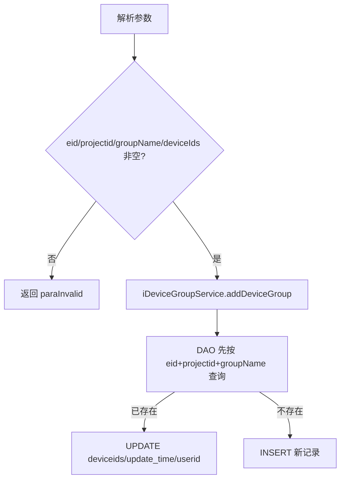
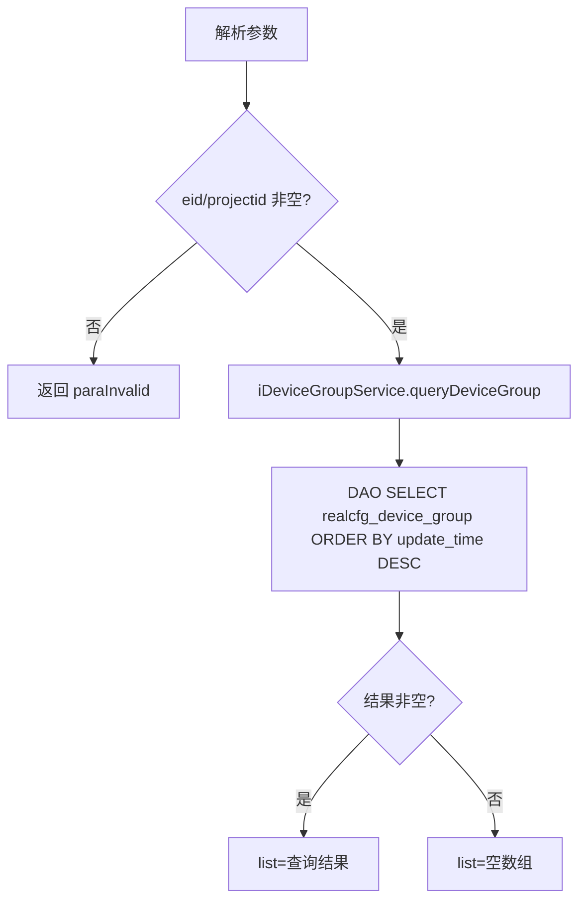
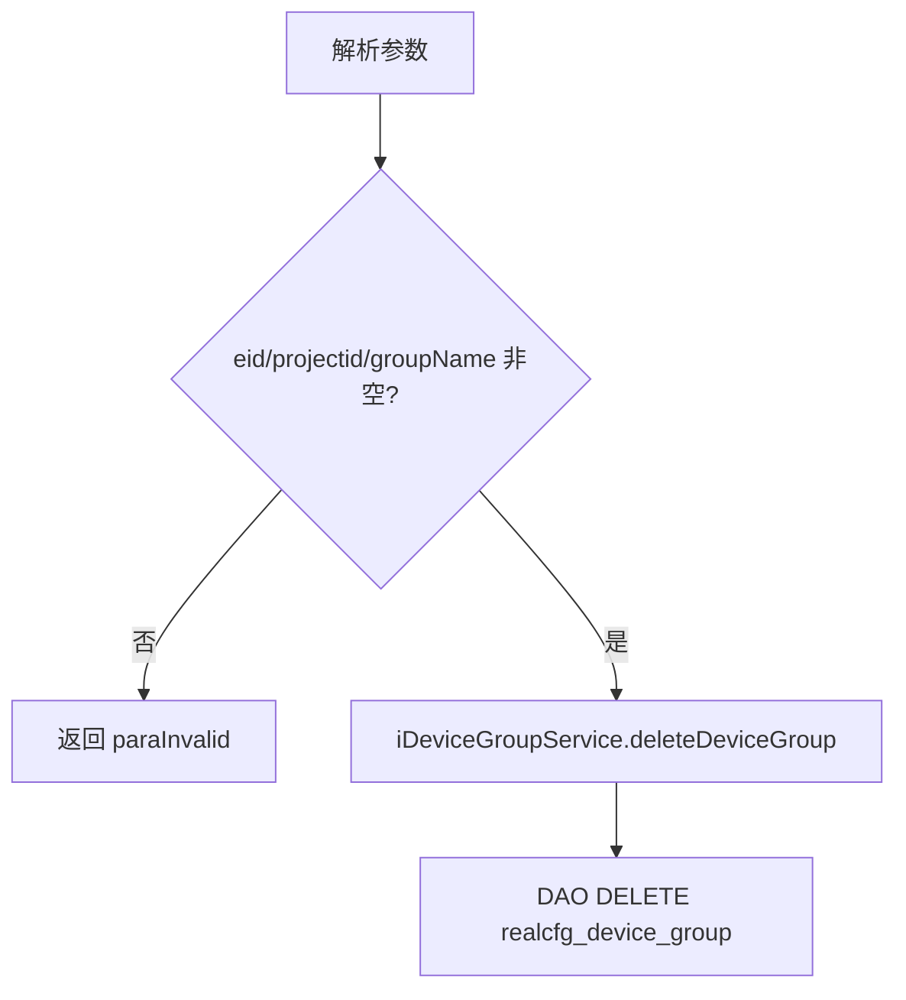

# DeviceGroup

## 职责
常用设备组管理。维护 `realcfg_device_group` 表：以（eid + projectid + group_name）为业务主键，保存项目组下用户收藏/常用的设备 ID 集合（deviceIds 为逗号分隔字符串）。新增接口带有"存在则更新"的 upsert 语义。数据走 realcfg 数据源（getRealcfgdao）。

- 源码：`real-cfg/src/main/java/cn/testin/service/group/DeviceGroup.java`
- 入口：ApiServlet 按 `action=group`、`op=<方法名>` 反射调用。

## op 一览表

| op | 说明 | 主要表 |
|---|---|---|
| addDeviceGroup | 新增/更新常用设备组（upsert） | realcfg_device_group |
| queryDeviceGroup | 查询项目组下设备组列表 | realcfg_device_group |
| deleteDeviceGroup | 按组名删除设备组 | realcfg_device_group |

---

### addDeviceGroup (`DeviceGroup.addDeviceGroup`)
- **入口**：ApiServlet，action=group，op=DeviceGroup.addDeviceGroup
- **实现意图**：保存项目组的常用设备组；同名组已存在时更新设备列表与操作人，否则插入新记录。
- **请求参数**：

| 参数名 | 类型 | 必填 | 说明 |
|---|---|---|---|
| eid | int | 是 | 企业 ID |
| projectid | int | 是 | 项目组 ID |
| userid | int | 否 | 操作人 ID |
| groupName | string | 是 | 设备组名称 |
| deviceIds | string | 是 | 设备 ID 集合（逗号分隔字符串） |

- **响应结构**：统一返回 `{code, msg, data}` 报文，错误时无 `data` 节点。

| 字段 | 类型 | 说明 |
| --- | --- | --- |
| code | Integer | 返回码，0 成功 |
| msg | String | 提示信息 |
| data | Object | 数据对象 |
| data.result | Integer | 影响行数（插入或更新） |
- **处理流程**：

- **调用链**：DeviceGroup → DeviceGroupServiceImpl.addDeviceGroup → DeviceGroupDAOImpl（queryDeviceGroup / updateDeviceGroup / addDeviceGroup）→ 表 realcfg_device_group
- **涉及表与 SQL**：
  - `realcfg_device_group`：SELECT WHERE `eid=? AND projectid=? AND group_name=?`；UPDATE SET `deviceids=?, update_time=?, userid=?`；INSERT（eid, projectid, userid, group_name, deviceids, create_time, update_time）
- **异常与校验**：
  - eid / projectid / groupName / deviceIds 任一为空 → `paraInvalid (param is invalid. param: ...)`
- **关键代码摘录**：
```java
// real-cfg/src/main/java/cn/testin/business/impl/DeviceGroupServiceImpl.java
Integer result = -1;
List<DBDeviceGroup> groupList = iDeviceGroupDAO.queryDeviceGroup(eid, projectid, groupName);
if (!CollectionUtils.isEmpty(groupList)) {
    result = iDeviceGroupDAO.updateDeviceGroup(eid, projectid, userid, groupName, deviceIds);
} else {
    result = iDeviceGroupDAO.addDeviceGroup(eid, projectid, userid, groupName, deviceIds);
}
return result;
```

---

### queryDeviceGroup (`DeviceGroup.queryDeviceGroup`)
- **入口**：ApiServlet，action=group，op=DeviceGroup.queryDeviceGroup
- **实现意图**：查询企业项目组下的常用设备组列表，可按组名过滤，按更新时间倒序。
- **请求参数**：

| 参数名 | 类型 | 必填 | 说明 |
|---|---|---|---|
| eid | int | 是 | 企业 ID |
| projectid | int | 是 | 项目组 ID |
| groupName | string | 否 | 设备组名称（精确匹配） |

- **响应结构**：统一返回 `{code, msg, data}` 报文，错误时无 `data` 节点。

| 字段 | 类型 | 说明 |
| --- | --- | --- |
| code | Integer | 返回码，0 成功 |
| msg | String | 提示信息 |
| data | Object | 数据对象 |
| data.list | Array\<Object\> | DBDeviceGroup 数组（无数据时为空数组） |
| data.list[].eid | Integer | 企业 ID |
| data.list[].projectid | Integer | 项目组 ID |
| data.list[].userid | Integer | 操作人 ID |
| data.list[].groupName | String | 设备组名称 |
| data.list[].deviceIds | String | 设备 ID 集合（逗号分隔字符串） |
| data.list[].createTime | Long | 创建时间（毫秒时间戳） |
| data.list[].updateTime | Long | 更新时间（毫秒时间戳） |
- **处理流程**：

- **调用链**：DeviceGroup → DeviceGroupServiceImpl.queryDeviceGroup → DeviceGroupDAOImpl.queryDeviceGroup → 表 realcfg_device_group
- **涉及表与 SQL**：
  - `realcfg_device_group`：SELECT * WHERE `eid=? AND projectid=? [AND group_name=?]` ORDER BY `update_time` DESC，DAO 方法 `DeviceGroupDAOImpl.queryDeviceGroup`
- **异常与校验**：
  - eid / projectid 为空 → `paraInvalid`
- **关键代码摘录**：
```java
// real-cfg/src/main/java/cn/testin/dao/impl/group/DeviceGroupDAOImpl.java
StringBuilder sql = new StringBuilder("select * from " + DBDeviceGroup.TABLE_NAME);
sql.append(" where eid = ? and projectid = ? ");
if (StringUtils.isNotBlank(groupName)) {
    sql.append(" and group_name = ? ");
    params.add(groupName);
}
sql.append(" order by update_time desc");
return this.getRealcfgdao().query(sql.toString(), params.toArray(), new DBDeviceGroupMapper());
```

---

### deleteDeviceGroup (`DeviceGroup.deleteDeviceGroup`)
- **入口**：ApiServlet，action=group，op=DeviceGroup.deleteDeviceGroup
- **实现意图**：按（eid + projectid + groupName）物理删除常用设备组。
- **请求参数**：

| 参数名 | 类型 | 必填 | 说明 |
|---|---|---|---|
| eid | int | 是 | 企业 ID |
| projectid | int | 是 | 项目组 ID |
| groupName | string | 是 | 设备组名称 |

- **响应结构**：统一返回 `{code, msg, data}` 报文，错误时无 `data` 节点。

| 字段 | 类型 | 说明 |
| --- | --- | --- |
| code | Integer | 返回码，0 成功 |
| msg | String | 提示信息 |
| data | Object | 数据对象 |
| data.result | Integer | 删除影响行数 |
- **处理流程**：

- **调用链**：DeviceGroup → DeviceGroupServiceImpl.deleteDeviceGroup → DeviceGroupDAOImpl.deleteDeviceGroup → 表 realcfg_device_group
- **涉及表与 SQL**：
  - `realcfg_device_group`：DELETE WHERE `eid=? AND projectid=? AND group_name=?`，DAO 方法 `DeviceGroupDAOImpl.deleteDeviceGroup`
- **异常与校验**：
  - eid / projectid / groupName 任一为空 → `paraInvalid`；DAO 层参数异常返回 `DBDeviceGroup.SQL_EXCEPTION` 并写错误日志
- **关键代码摘录**：
```java
// real-cfg/src/main/java/cn/testin/dao/impl/group/DeviceGroupDAOImpl.java
StringBuilder sql = new StringBuilder("delete from " + DBDeviceGroup.TABLE_NAME);
sql.append(" where eid = ? and projectid = ? and group_name = ?");
List<Object> params = new ArrayList<>();
params.add(eid);
params.add(projectid);
params.add(groupName);
return this.getRealcfgdao().update(sql.toString(), params.toArray());
```
