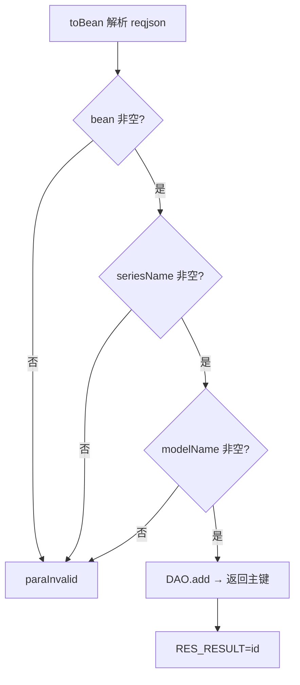
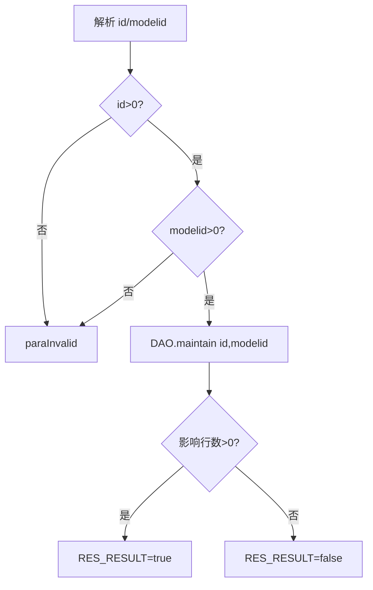
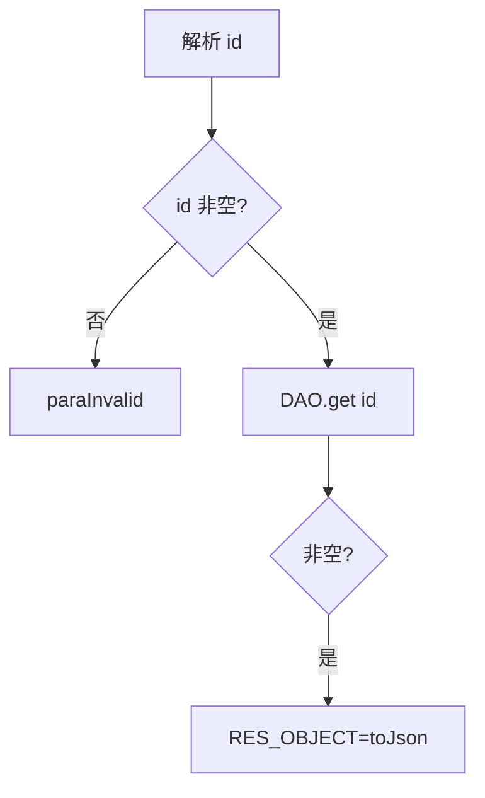
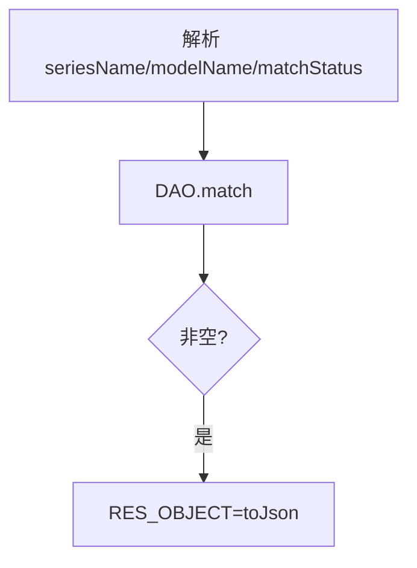

# DeviceModel

设备机型档案服务：维护"上位机自动上报的设备（seriesName/modelName）"与平台标准机型（modelid）之间的映射关系。

源码：`real-cfg/src/main/java/cn/testin/service/cfg/DeviceModel.java`
业务实现：`cn.testin.business.impl.DeviceModelServiceImpl`（`IRealcfgDeviceModelService`）

## op 一览

| op | 说明 |
| --- | --- |
| add | 新增设备机型映射记录 |
| maintain | 维护映射（id ↔ modelid 绑定） |
| get | 按 id 查询映射记录 |
| match | 按 seriesName/modelName 匹配（@deprecated） |

---

### add (`DeviceModel.add`)

- **入口**：ApiServlet，action=cfg，op=DeviceModel.add
- **实现意图**：新增一条设备机型映射。请求体整体经 `RealcfgDeviceModel.toBean(reqjson)` 反序列化，校验 seriesName、modelName 非空后落库；返回新记录主键 id。典型来源是上位机自动上报的未识别机型。
- **请求参数**：整个 reqjson 按 RealcfgDeviceModel 结构解析，关键字段：

| 参数名 | 类型 | 必填 | 说明 |
| --- | --- | --- | --- |
| seriesName | String | 是 | 设备系列名（上报别名） |
| modelName | String | 是 | 机型名 |
| modelid | Integer | 否 | 关联的标准机型 id |
| 其他字段 | - | 否 | 见 pojo `cn.testin.pojo.realcfg.RealcfgDeviceModel` |

- **响应结构**：统一返回 `{code, msg, data}` 报文，错误时无 `data` 节点。

| 字段 | 类型 | 说明 |
| --- | --- | --- |
| code | Integer | 返回码，0 成功 |
| msg | String | 提示信息 |
| data | Object | 数据对象 |
| data.result | Integer | 新增记录主键 id |
- **处理流程**：



- **调用链**：DeviceModel → DeviceModelServiceImpl.add → IRealcfgDeviceModelDAO.add
- **涉及表与 SQL**：`realcfg_device_model`（INSERT）
- **异常与校验**：`CommonCode.paraInvalid`——bean 解析失败、seriesName/modelName 空白（以 ApiUtil.getResult 返回，非抛异常）。
- **关键代码摘录**：

```java
// real-cfg/src/main/java/cn/testin/service/cfg/DeviceModel.java
RealcfgDeviceModel deviceModel = RealcfgDeviceModel.toBean(reqjson);
if (StringUtils.isBlank(deviceModel.getSeriesName())) { ... }
if (StringUtils.isBlank(deviceModel.getModelName())) { ... }
Integer result = irealcfgdevicemodelservice.add(deviceModel);
datamap.put(ApiResponse.RES_RESULT, result);
```

---

### maintain (`DeviceModel.maintain`)

- **入口**：ApiServlet，action=cfg，op=DeviceModel.maintain
- **实现意图**：把一条已存在的设备机型映射（id）绑定到标准机型（modelid），即运营人员人工确认"该上报机型 = 平台某标准机型"。
- **请求参数**：

| 参数名 | 类型 | 必填 | 说明 |
| --- | --- | --- | --- |
| id | Integer | 是 | 映射记录主键，>0 |
| modelid | Integer | 是 | 标准机型 id，>0 |

- **响应结构**：统一返回 `{code, msg, data}` 报文，错误时无 `data` 节点。

| 字段 | 类型 | 说明 |
| --- | --- | --- |
| code | Integer | 返回码，0 成功 |
| msg | String | 提示信息 |
| data | Object | 数据对象 |
| data.result | Boolean | true（影响行数>0）/ false |
- **处理流程**：



- **调用链**：DeviceModel → DeviceModelServiceImpl.maintain → IRealcfgDeviceModelDAO.maintain
- **涉及表与 SQL**：`realcfg_device_model`（UPDATE modelid WHERE id）
- **异常与校验**：`CommonCode.paraInvalid`——id/modelid 缺失或 ≤0。
- **关键代码摘录**：

```java
// real-cfg/src/main/java/cn/testin/service/cfg/DeviceModel.java
Integer result = irealcfgdevicemodelservice.maintain(id, modelid);
if (result > 0) {
    datamap.put(ApiResponse.RES_RESULT, true);
} else {
    datamap.put(ApiResponse.RES_RESULT, false);
}
```

---

### get (`DeviceModel.get`)

- **入口**：ApiServlet，action=cfg，op=DeviceModel.get
- **实现意图**：按主键 id 查询单条设备机型映射详情。
- **请求参数**：

| 参数名 | 类型 | 必填 | 说明 |
| --- | --- | --- | --- |
| id | Integer | 是 | 映射记录主键 |

- **响应结构**：统一返回 `{code, msg, data}` 报文，错误时无 `data` 节点。

| 字段 | 类型 | 说明 |
| --- | --- | --- |
| code | Integer | 返回码，0 成功 |
| msg | String | 提示信息 |
| data | Object | 数据对象 |
| data.objInfo | Object | RealcfgDeviceModel 对象（无记录时无此节点） |
| data.objInfo.id | Integer | 主键 id |
| data.objInfo.modelid | Integer | 关联的标准机型 id |
| data.objInfo.seriesName | String | 系列名 |
| data.objInfo.modelName | String | 机型名称 |
| data.objInfo.dpiWidth | Integer | 分辨率宽度 |
| data.objInfo.dpiHeight | Integer | 分辨率高度 |
| data.objInfo.screenSize | Double | 屏幕大小 |
| data.objInfo.cpu | Integer | CPU |
| data.objInfo.cpuNum | Integer | CPU 数量 |
| data.objInfo.ram | Long | 内存 |
| data.objInfo.status | Integer | 状态 |
| data.objInfo.createtime | Long | 创建时间（毫秒时间戳） |
| data.objInfo.updatetime | Long | 更新时间（毫秒时间戳） |
- **处理流程**：



- **调用链**：DeviceModel → DeviceModelServiceImpl.get → IRealcfgDeviceModelDAO.get
- **涉及表与 SQL**：`realcfg_device_model`（SELECT by id）
- **异常与校验**：`CommonCode.paraInvalid`——id 缺失。
- **关键代码摘录**：

```java
// real-cfg/src/main/java/cn/testin/service/cfg/DeviceModel.java
RealcfgDeviceModel deviceModel = irealcfgdevicemodelservice.get(id);
if (deviceModel != null) {
    datamap.put(ApiResponse.RES_OBJECT, deviceModel.toJson());
}
```

---

### match (`DeviceModel.match`)

- **入口**：ApiServlet，action=cfg，op=DeviceModel.match
- **实现意图**（@deprecated，已废弃）：按 seriesName（别名）+ modelName（机型名）+ matchStatus（匹配状态）查询映射记录，供旧链路自动匹配机型使用。
- **请求参数**：

| 参数名 | 类型 | 必填 | 说明 |
| --- | --- | --- | --- |
| seriesName | String | 否 | 系列名/别名 |
| modelName | String | 否 | 机型名 |
| matchStatus | Integer | 否 | 匹配状态过滤 |

- **响应结构**：统一返回 `{code, msg, data}` 报文，错误时无 `data` 节点。

| 字段 | 类型 | 说明 |
| --- | --- | --- |
| code | Integer | 返回码，0 成功 |
| msg | String | 提示信息 |
| data | Object | 数据对象 |
| data.objInfo | Object | RealcfgDeviceModel 对象（无匹配时无此节点，字段同 `get`） |
- **处理流程**：



- **调用链**：DeviceModel → DeviceModelServiceImpl.match → IRealcfgDeviceModelDAO.match
- **涉及表与 SQL**：`realcfg_device_model`（SELECT by seriesName/modelName/matchStatus）
- **异常与校验**：无显式校验；接口已标记 `@deprecated`。
- **关键代码摘录**：

```java
// real-cfg/src/main/java/cn/testin/service/cfg/DeviceModel.java
/**
 * @deprecated 根据 seriesName、modelName 查询 设备机型 信息
 */
public String match(ApiRequest apirequest) throws Exception {
    ...
    RealcfgDeviceModel deviceModel = irealcfgdevicemodelservice.match(seriesName, modelName, matchStatus);
```
