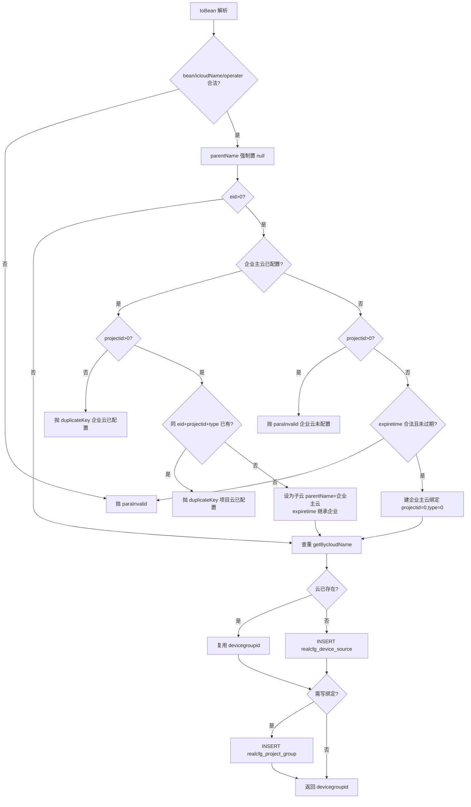
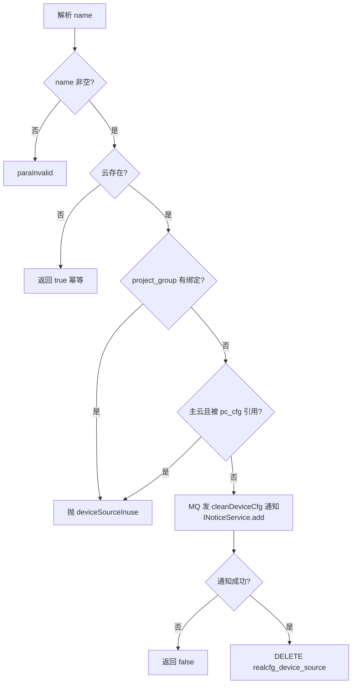
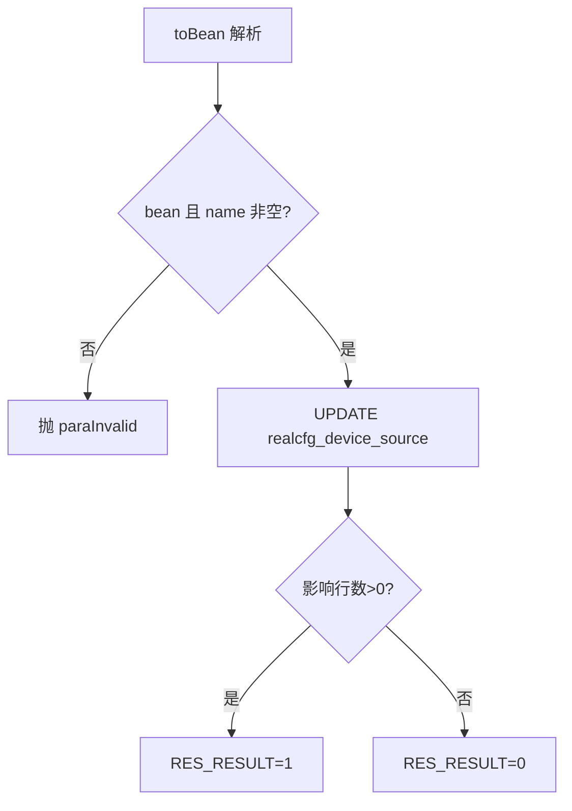
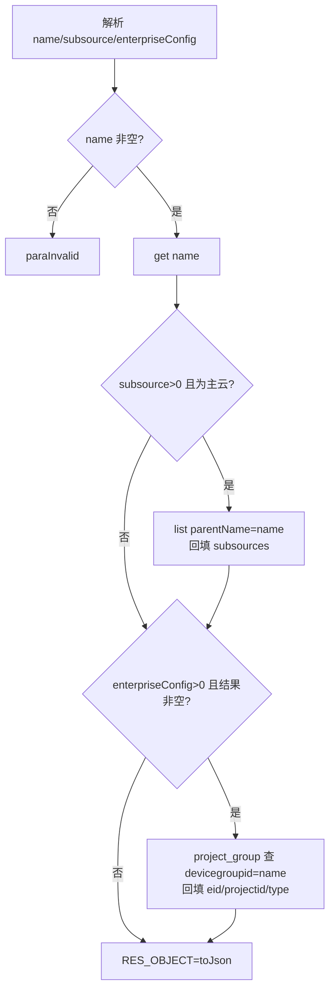
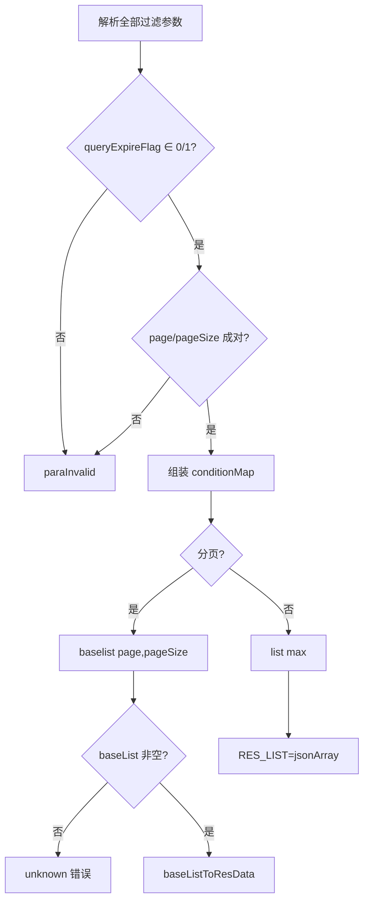

# DeviceSource

设备云管理服务：设备云（devicegroupid）本身的增删改查，以及企业/项目组与云的绑定关系（`realcfg_project_group`）。主云由平台创建，子云在企业已分配主云后按项目生成。

源码：`real-cfg/src/main/java/cn/testin/service/cfg/DeviceSource.java`
业务实现：`cn.testin.business.impl.DeviceSourceServiceImpl`（`IDeviceSourceService`）

## op 一览

| op | 说明 |
| --- | --- |
| add | 新增设备云（可带企业/项目组绑定） |
| remove | 按云名删除设备云（使用中禁止删除） |
| maintain | 更新设备云属性 |
| get | 查询云详情（可带子云列表、企业配置） |
| list | 条件查询云列表（支持分页与多种视图） |

---

### add (`DeviceSource.add`)

- **入口**：ApiServlet，action=cfg，op=DeviceSource.add
- **实现意图**：新增设备云。请求体经 `RealcfgDeviceSource.toBean(reqjson)` 反序列化。业务层规则：
  - 必传 icloudName（云显示名）与 operater（操作人）；parentName 不允许接口传入（强制置 null，子云由企业逻辑推导）。
  - 传 eid>0 时：若企业已配置主云（projectid=0 的记录存在），则本次必须带 projectid，生成子云（parentName=企业主云），且子云 expiretime 继承企业主云；同 eid+projectid+type 重复配置报 duplicateKey。若企业未配置主云，则不允许带 projectid，本次创建的是企业主云，expiretime 必须大于当前时间。
  - 云实体按 (icloudName, parentName) 去重复用已有记录；随后写入 `realcfg_project_group` 绑定关系。

- **请求参数**：按 RealcfgDeviceSource 结构解析，关键字段：

| 参数名 | 类型 | 必填 | 说明 |
| --- | --- | --- | --- |
| icloudName | String | 是 | 云显示名 |
| operater | Integer | 是 | 操作人 uid，>0 |
| eid | Integer | 否 | 企业 id；>0 时触发企业云逻辑 |
| projectid | Integer | 否 | 项目 id（企业已配主云时必填） |
| type | Integer | 否 | 项目类型 |
| expiretime | Long | 否 | 创建企业主云时必填且须晚于当前时间 |

- **响应结构**：统一返回 `{code, msg, data}` 报文，错误时无 `data` 节点。

| 字段 | 类型 | 说明 |
| --- | --- | --- |
| code | Integer | 返回码，0 成功 |
| msg | String | 提示信息 |
| data | Object | 数据对象 |
| data.result | String | 云名 devicegroupid |
- **处理流程**：



- **调用链**：DeviceSource → DeviceSourceServiceImpl.add → IRealcfgDeviceSourceDAO / IRealcfgProjectGroupDAO
- **涉及表与 SQL**：
  - `realcfg_project_group`：SELECT（eid+projectid=0 / eid+projectid+type）、INSERT
  - `realcfg_device_source`：SELECT getBycloudName(icloudName, parentName)、INSERT
- **异常与校验**：`CommonCode.paraInvalid`（参数缺失/expiretime 过期/企业云未配置）；`CommonCode.duplicateKey`（企业云或项目云重复配置）。
- **关键代码摘录**：

```java
// real-cfg/src/main/java/cn/testin/business/impl/DeviceSourceServiceImpl.java
// 设备云的父类设备云信息不能通过接口传递。
deviceSource.setParentName(null);
...
RealcfgDeviceSource dbdeviceSource = this.irealcfgdevicesourcedao.getBycloudName(
        deviceSource.getIcloudName(), deviceSource.getParentName());
String devicegroupid;
if (dbdeviceSource != null) {
    devicegroupid = dbdeviceSource.getName();
} else {
    devicegroupid = this.irealcfgdevicesourcedao.add(deviceSource);
}
```

---

### remove (`DeviceSource.remove`)

- **入口**：ApiServlet，action=cfg，op=DeviceSource.remove
- **实现意图**：按云名删除设备云。删除前做两道占用检查：1）`realcfg_project_group` 中存在该云的绑定则拒绝；2）主云被任一上位机（`realcfg_pc_cfg.cloud`）引用则拒绝。通过后先经 MQ 发布 `cleanDeviceCfg` 通知（通知各节点清理内存/缓存中的设备云配置），再删除记录。
- **请求参数**：

| 参数名 | 类型 | 必填 | 说明 |
| --- | --- | --- | --- |
| name | String | 是 | 云名 devicegroupid |

- **响应结构**：统一返回 `{code, msg, data}` 报文，错误时无 `data` 节点。

| 字段 | 类型 | 说明 |
| --- | --- | --- |
| code | Integer | 返回码，0 成功 |
| msg | String | 提示信息 |
| data | Object | 数据对象 |
| data.result | Integer | 1 成功 / 0 失败 |
- **处理流程**：



- **调用链**：DeviceSource → DeviceSourceServiceImpl.delete → IRealcfgDeviceSourceDAO / IRealcfgProjectGroupDAO / IRealcfgPcCfgDAO；外部服务 notice-manager（`INoticeService`，SpringHelper.getBean("INoticeService")，MQ 通知 `CfgConfigEnum.NoticeType.cleanDeviceCfg`）
- **涉及表与 SQL**：`realcfg_device_source`（SELECT/DELETE）、`realcfg_project_group`（SELECT by devicegroupid）、`realcfg_pc_cfg`（SELECT by cloud）
- **异常与校验**：`CommonCode.paraInvalid`（name 空）；`RealfgCode.deviceSourceInuse`（云被项目组或上位机占用）。
- **关键代码摘录**：

```java
// real-cfg/src/main/java/cn/testin/business/impl/DeviceSourceServiceImpl.java
conditionMap.put("devicegroupid", name);
List<RealcfgProjectGroup> list = this.irealcfgprojectgroupdao.list(conditionMap, 0, 1);
if (list != null && list.size() > 0) {
    throw new GeneralException(RealfgCode.deviceSourceInuse.getValue(), msg);
}
...
INoticeService inoticeservice = (INoticeService) SpringHelper.getBean("INoticeService");
Long result = inoticeservice.add(notice);
```

---

### maintain (`DeviceSource.maintain`)

- **入口**：ApiServlet，action=cfg，op=DeviceSource.maintain
- **实现意图**：按 name 更新设备云的可变属性（显示名、描述、过期时间等），请求体按 RealcfgDeviceSource 解析。
- **请求参数**：RealcfgDeviceSource 结构；`name`（String，必填）为定位键，其余字段按需更新。
- **响应结构**：统一返回 `{code, msg, data}` 报文，错误时无 `data` 节点。

| 字段 | 类型 | 说明 |
| --- | --- | --- |
| code | Integer | 返回码，0 成功 |
| msg | String | 提示信息 |
| data | Object | 数据对象 |
| data.result | Integer | 1 成功 / 0 失败 |
- **处理流程**：



- **调用链**：DeviceSource → DeviceSourceServiceImpl.maintain → IRealcfgDeviceSourceDAO.update
- **涉及表与 SQL**：`realcfg_device_source`（UPDATE by name）
- **异常与校验**：`CommonCode.paraInvalid`——bean 为 null 或 name 为 null。
- **关键代码摘录**：

```java
// real-cfg/src/main/java/cn/testin/business/impl/DeviceSourceServiceImpl.java
if (deviceSource == null || deviceSource.getName() == null) {
    throw new GeneralException(CommonCode.paraInvalid.getValue(), msg);
}
return this.irealcfgdevicesourcedao.update(deviceSource) > 0;
```

---

### get (`DeviceSource.get`)

- **入口**：ApiServlet，action=cfg，op=DeviceSource.get
- **实现意图**：查询单个云详情。两个可选增强：`subsource=1` 且该云为主云时，附带其全部子云名列表；`enterpriseConfig>0` 时，反查 `realcfg_project_group` 回填绑定的 eid/projectid/type。
- **请求参数**：

| 参数名 | 类型 | 必填 | 说明 |
| --- | --- | --- | --- |
| name | String | 是 | 云名 |
| subsource | Integer | 否 | >0 时返回子云名列表 |
| enterpriseConfig | Integer | 否 | >0 时回填企业绑定信息 |

- **响应结构**：统一返回 `{code, msg, data}` 报文，错误时无 `data` 节点。

| 字段 | 类型 | 说明 |
| --- | --- | --- |
| code | Integer | 返回码，0 成功 |
| msg | String | 提示信息 |
| data | Object | 数据对象 |
| data.objInfo | Object | RealcfgDeviceSource 对象（无记录时无此节点） |
| data.objInfo.name | String | 设备云标识 |
| data.objInfo.icloudName | String | 设备云名称 |
| data.objInfo.parentName | String | 父云名称（主云为空） |
| data.objInfo.descr | String | 描述 |
| data.objInfo.operater | Integer | 云创建人 uid |
| data.objInfo.status | Integer | 状态 |
| data.objInfo.createtime | Long | 创建时间（毫秒时间戳） |
| data.objInfo.updatetime | Long | 更新时间（毫秒时间戳） |
| data.objInfo.taskExpirePeriod | Long | 任务过期周期 |
| data.objInfo.sourceConfig | Object | 设备云权限配置（有配置时才返回） |
| data.objInfo.subsources | Array\<String\> | 子云名列表（subsource>0 且为主云时返回） |
| data.objInfo.eid | Integer | 企业 id（enterpriseConfig>0 回填时返回） |
| data.objInfo.projectid | Integer | 项目组 id（回填时返回） |
| data.objInfo.type | Integer | 项目类型（回填时返回，1 app / 2 web） |
- **处理流程**：



- **调用链**：DeviceSource → DeviceSourceServiceImpl.get / list → IRealcfgDeviceSourceDAO；IProjectGroupService（`iprojectgroupservice.list`）
- **涉及表与 SQL**：`realcfg_device_source`（SELECT by name / by parentName）、`realcfg_project_group`（SELECT by devicegroupid）
- **异常与校验**：`CommonCode.paraInvalid`——name 空白。
- **关键代码摘录**：

```java
// real-cfg/src/main/java/cn/testin/service/cfg/DeviceSource.java
if (subsource > 0 && result != null && StringUtils.isBlank(result.getParentName())) {
    conditionMap.put("parentName", name);
    List<RealcfgDeviceSource> subsources = this.idevicesourceservice.list(conditionMap, Config.MaxSize);
    ...
    result.setSubsources(subsourceList);
}
```

---

### list (`DeviceSource.list`)

- **入口**：ApiServlet，action=cfg，op=DeviceSource.list
- **实现意图**：设备云多条件查询。按企业维度（eids/eid/projectid/projectGroupStatus）走 `view_project_group_source` 视图；`queryFilterproperFlag=1` 走 `view_filterproper_source` 视图；`queryParentFlag=1` 只查主云；`queryExpireFlag` 过滤是否过期。page/pageSize 必须成对出现，传了则走分页（BaseList），否则按 max 截断返回全量数组。
- **请求参数**：

| 参数名 | 类型 | 必填 | 说明 |
| --- | --- | --- | --- |
| eids | JSONArray\<Integer\> | 否 | 企业 id 数组 |
| eid | Integer | 否 | 单个企业 id |
| projectid | Integer | 否 | 项目 id |
| projectGroupStatus | Integer | 否 | 项目组状态过滤 |
| queryExpireFlag | Integer | 否 | 0/1，是否过期过滤，其他值报错 |
| queryParentFlag | Integer | 否 | =1 只查主云 |
| queryFilterproperFlag | Integer | 否 | =1 查 view_filterproper_source |
| max | Integer | 否 | 非分页时返回上限 |
| page | Integer | 否 | 页码，与 pageSize 成对 |
| pageSize | Integer | 否 | 每页条数，与 page 成对 |

- **响应结构**：统一返回 `{code, msg, data}` 报文，错误时无 `data` 节点。分页模式额外含分页字段。

| 字段 | 类型 | 说明 |
| --- | --- | --- |
| code | Integer | 返回码，0 成功 |
| msg | String | 提示信息 |
| data | Object | 数据对象 |
| data.list | Array\<Object\> | RealcfgDeviceSource 数组，元素字段： |
| data.list[].name | String | 设备云标识 |
| data.list[].icloudName | String | 设备云名称 |
| data.list[].parentName | String | 父云名称 |
| data.list[].descr | String | 描述 |
| data.list[].operater | Integer | 云创建人 uid |
| data.list[].status | Integer | 状态 |
| data.list[].createtime | Long | 创建时间（毫秒时间戳） |
| data.list[].updatetime | Long | 更新时间（毫秒时间戳） |
| data.list[].taskExpirePeriod | Long | 任务过期周期 |
| data.list[].sourceConfig | Object | 设备云权限配置（有配置时才返回） |
| data.list[].subsources | Array\<String\> | 子云名列表（有值时返回） |
| data.list[].eid | Integer | 企业 id（有值时返回） |
| data.list[].projectid | Integer | 项目组 id（有值时返回） |
| data.list[].type | Integer | 项目类型（有值时返回） |
| data.page | Integer | 当前页码（仅分页模式） |
| data.pageSize | Integer | 每页条数（仅分页模式） |
| data.totalRow | Long | 总条数（仅分页模式） |
| data.totalPage | Integer | 总页数（仅分页模式） |
- **处理流程**：



- **调用链**：DeviceSource → DeviceSourceServiceImpl.list/baselist → IRealcfgDeviceSourceDAO（`tableByJoinPrj()` → view_project_group_source，`tableByFilterProper()` → view_filterproper_source）
- **涉及表与 SQL**：`realcfg_device_source`（SELECT）、`view_project_group_source`（企业维度视图）、`view_filterproper_source`（过滤属性视图）
- **异常与校验**：`CommonCode.paraInvalid`——queryExpireFlag 非 0/1、page 与 pageSize 不成对；分页结果为空返回 `CommonCode.unknown`。
- **关键代码摘录**：

```java
// real-cfg/src/main/java/cn/testin/service/cfg/DeviceSource.java
if (paging) {
    BaseList<RealcfgDeviceSource> baseList = this.idevicesourceservice.baselist(conditionMap, page, pageSize);
    baseListToResData(datamap, baseList);
} else {
    List<RealcfgDeviceSource> list = this.idevicesourceservice.list(conditionMap, max);
    ...
    datamap.put(ApiResponse.RES_LIST, jsonArray);
}
```
