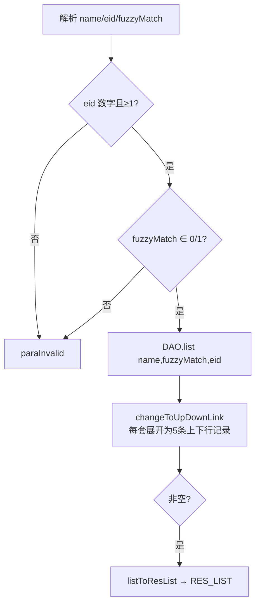
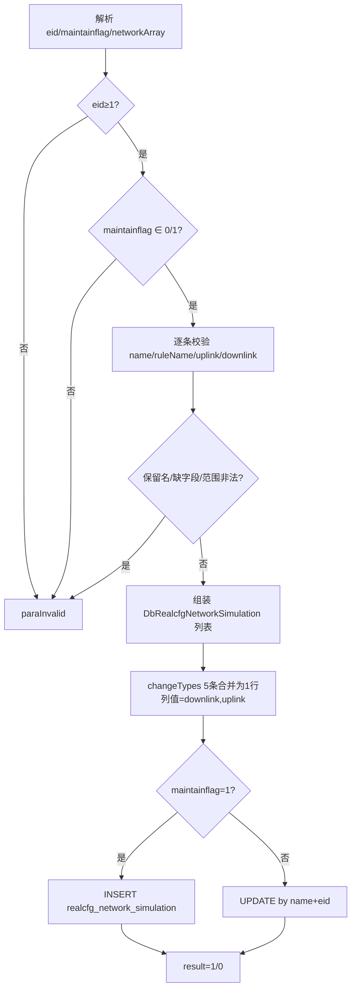
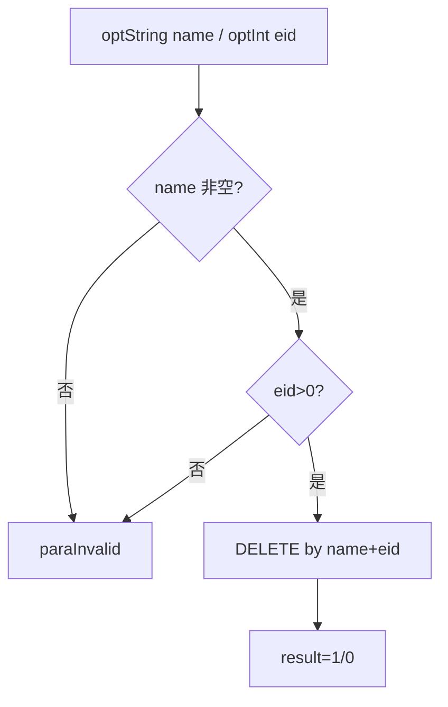

# NetworkCfg

弱网（网络模拟）配置服务：按企业维护一套弱网规则配置。存储模型是一行存一套（rate/delay/loss/corruption/reorder 五列各存 "下行,上行"），接口层对外表现为五条上下行记录，service 内部做行转列/列转行转换。

源码：`real-cfg/src/main/java/cn/testin/service/cfg/NetworkCfg.java`
业务实现：`cn.testin.business.impl.NetworkSimulationServiceImpl`（`INetworkSimulationService`）

## op 一览

| op | 说明 |
| --- | --- |
| list | 查询企业弱网配置（行转列展开为 5 条/套） |
| maintain | 新增（maintainflag=1）或更新（=0）弱网配置 |
| delete | 按名称删除一套弱网配置 |

---

### list (`NetworkCfg.list`)

- **入口**：ApiServlet，action=cfg，op=NetworkCfg.list
- **实现意图**：查询企业的弱网配置列表，支持按名称精确/模糊匹配。DAO 返回的每行（一套配置，五规则列各为 "downlink,uplink" 串）被 `changeToUpDownLink` 展开为最多 5 条记录（rate/delay/loss/corruption/reorder 各一条，带上下行数值），前端直接展示。
- **请求参数**：

| 参数名 | 类型 | 必填 | 说明 |
| --- | --- | --- | --- |
| name | String | 否 | 弱网配置名，不传查全部 |
| eid | Integer | 是 | 企业 id，≥1 |
| fuzzyMatch | Integer | 否 | 是否对 name 模糊匹配，0/1，默认 0 |

- **响应结构**：统一返回 `{code, msg, data}` 报文，错误时无 `data` 节点。

| 字段 | 类型 | 说明 |
| --- | --- | --- |
| code | Integer | 返回码，0 成功 |
| msg | String | 提示信息 |
| data | Object | 数据对象 |
| data.list | Array\<Object\> | 弱网配置数组（每套展开为 5 条上下行记录；空结果不返回此节点） |
| data.list[].name | String | 弱网配置名 |
| data.list[].rulename | String | 网络规则名称（rate/delay/loss/corruption/reorder） |
| data.list[].uplink | Integer | 上行值 |
| data.list[].downlink | Integer | 下行值 |
| data.list[].eid | Integer | 企业 id |
| data.list[].write | Integer | 是否可写（0 不可写 1 可写） |
| data.list[].status | Integer | 状态 |
- **处理流程**：



- **调用链**：NetworkCfg → NetworkSimulationServiceImpl.list → IDbRealcfgNetworkSimulationDAO.list
- **涉及表与 SQL**：`realcfg_network_simulation`（SELECT by eid/name，可模糊）
- **异常与校验**：`CommonCode.paraInvalid`——eid 缺失/<1、fuzzyMatch 越界；Logit.messageLog 记录请求响应。
- **关键代码摘录**：

```java
// real-cfg/src/main/java/cn/testin/service/cfg/NetworkCfg.java
List<DbRealcfgNetworkSimulation> list = inetworksimulationservice.list(name, fuzzyMatch, eid);
list = changeToUpDownLink(list);
...
if (StringUtils.isNotBlank(net.getRate())) {
    networkSimulationTypes[0].setRulename("rate");
    networkSimulationTypes[0].setDownlink(Integer.parseInt(net.getRate().split(",")[0]));
    networkSimulationTypes[0].setUplink(Integer.parseInt(net.getRate().split(",")[1]));
}
```

---

### maintain (`NetworkCfg.maintain`)

- **入口**：ApiServlet，action=cfg，op=NetworkCfg.maintain
- **实现意图**：新增或更新一套弱网配置。请求把五种规则作为数组逐条传入（name 相同），service 逐条校验：name 非空且不得使用保留名（wifi/sim/unlimited/4G/3G/2G，注意代码转小写后与 "4G" 等大写常量比较，实际仅小写保留名生效）；ruleName 必填；uplink/downlink 必为数字；并按规则做取值范围校验（validateRule：loss/corruption/reorder 0-100，delay 0-60000ms，rate 0-100000）。随后 `changeTypes` 把 5 条合并为一行（每列 "downlink,uplink"），maintainflag=1 走 INSERT（status=1，rate/reorder 规则 write=1 其余 0），=0 走 UPDATE。
- **请求参数**：

| 参数名 | 类型 | 必填 | 说明 |
| --- | --- | --- | --- |
| eid | Integer | 是 | 企业 id，≥1 |
| maintainflag | Integer | 是 | 1=新增，0=更新 |
| networkArray | JSONArray | 是 | 规则数组，元素：`name`、`ruleName`、`uplink`、`downlink` |

- **响应结构**：统一返回 `{code, msg, data}` 报文，错误时无 `data` 节点。

| 字段 | 类型 | 说明 |
| --- | --- | --- |
| code | Integer | 返回码，0 成功 |
| msg | String | 提示信息 |
| data | Object | 数据对象 |
| data.result | Integer | 1 成功 / 0 失败 |
- **处理流程**：



- **调用链**：NetworkCfg → NetworkSimulationServiceImpl.add/update → IDbRealcfgNetworkSimulationDAO.add/update
- **涉及表与 SQL**：`realcfg_network_simulation`（INSERT / UPDATE by name+eid）
- **异常与校验**：`CommonCode.paraInvalid`——eid/maintainflag 非法、networkArray 为空或任一条目非法（含保留名、范围越界）。validateRule 范围：loss/corruption/reorder ∈ [0,100]，delay ∈ [0,60000]，rate ∈ [0,100000]。
- **关键代码摘录**：

```java
// real-cfg/src/main/java/cn/testin/service/cfg/NetworkCfg.java
paramlist = changeTypes(paramlist);
boolean result = false;
if (maintainflag == 1) {
    result = inetworksimulationservice.add(paramlist, eid);
} else {
    result = inetworksimulationservice.update(paramlist, eid);
}
```

---

### delete (`NetworkCfg.delete`)

- **入口**：ApiServlet，action=cfg，op=NetworkCfg.delete
- **实现意图**：按配置名 + 企业 id 删除一整套弱网配置（一行）。
- **请求参数**：

| 参数名 | 类型 | 必填 | 说明 |
| --- | --- | --- | --- |
| name | String | 是 | 弱网配置名 |
| eid | Integer | 是 | 企业 id，>0 |

- **响应结构**：统一返回 `{code, msg, data}` 报文，错误时无 `data` 节点。

| 字段 | 类型 | 说明 |
| --- | --- | --- |
| code | Integer | 返回码，0 成功 |
| msg | String | 提示信息 |
| data | Object | 数据对象 |
| data.result | Integer | 1 成功 / 0 失败 |
- **处理流程**：



- **调用链**：NetworkCfg → NetworkSimulationServiceImpl.deleteByName → IDbRealcfgNetworkSimulationDAO.deleteByName
- **涉及表与 SQL**：`realcfg_network_simulation`（DELETE WHERE name=? AND eid=?）
- **异常与校验**：`CommonCode.paraInvalid`——name 空白、eid≤0。
- **关键代码摘录**：

```java
// real-cfg/src/main/java/cn/testin/service/cfg/NetworkCfg.java
boolean result = inetworksimulationservice.deleteByName(name, eid);
datamap.put("result", result ? 1 : 0);
```
