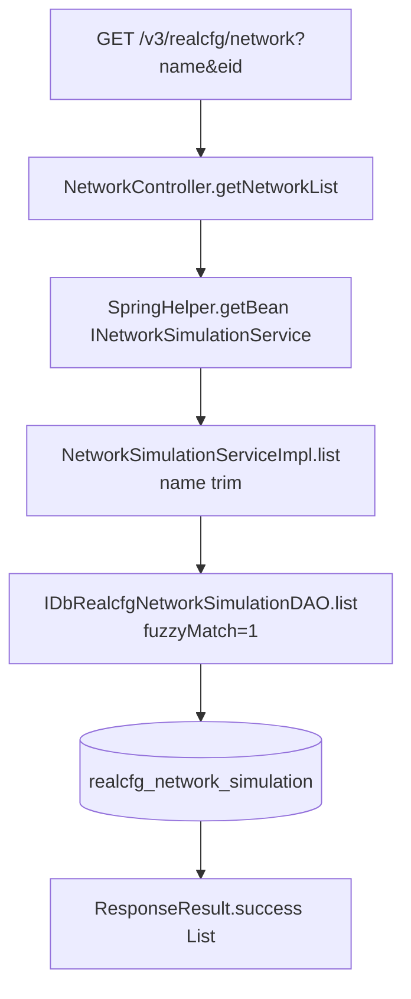

# NetworkController

弱网模拟配置查询服务：返回企业可用的网络模拟（弱网）配置列表，供执行端在真机上下发限速/丢包/延迟等网络规则时选择。

类路径：`real-cfg/src/main/java/cn/testin/controller/NetworkController.java`，基础路径 `/v3/realcfg/network`。

## 本类接口一览

| 接口 | 方法 | 路径 | 功能 |
| --- | --- | --- | --- |
| getNetworkList | GET | /v3/realcfg/network | 按名称/企业查询弱网配置列表 |

## getNetworkList (`GET /v3/realcfg/network`)

- **实现意图**：弱网配置是预设的一组网络参数模板（网速 rate、延迟 delay、丢包 loss、损坏 corruption、重排序 reorder），例如 "3G"、"弱网-高丢包"。本接口按企业 id（eid）返回全部模板，可选按名称精确/模糊过滤（fuzzyMatch 恒传 1，即模糊匹配）。Service 通过 `SpringHelper.getBean` 手动获取（老式 XML 装配的服务），非注解注入。

- **请求参数**：

| 参数名 | 类型 | 必填 | 说明 |
| --- | --- | --- | --- |
| name | String | 否 | 网络类型名称，trim 后模糊匹配 |
| eid | Integer | 是 | 企业 id |

- **响应结构**：`ResponseResult<List<DbRealcfgNetworkSimulation>>`，结构 `{code, msg, data}`，`data` 为弱网配置数组。

| 字段 | 类型 | 说明 |
| --- | --- | --- |
| code | Integer | 返回码，0 成功 |
| msg | String | 提示信息 |
| data | Array\<Object\> | 弱网配置数组，元素字段： |
| data[].name | String | 网络类型名称 |
| data[].rulename | String | 网络规则名称 |
| data[].rate | String | 网速 |
| data[].delay | String | 延迟 |
| data[].loss | String | 丢包率 |
| data[].corruption | String | 损坏率 |
| data[].reorder | String | 重排序 |
| data[].write | Integer | 是否可写（0 不可写 1 可写，可写项后台可改上下行取值） |
| data[].originalName | String | 原网络名称 |

- **处理流程**：



- **调用链**：`NetworkController` → `INetworkSimulationService`（`NetworkSimulationServiceImpl`，XML Bean 装配）→ `IDbRealcfgNetworkSimulationDAO`。无外部服务调用。同模块内该 Service 还提供 `add/update/deleteByName`（弱网配置的增删改由 ApiServlet 侧接口使用，见 [模块索引](../00-模块索引.md) 中 NetworkCfg）。

- **涉及表与 SQL**：

| 表 | 操作 | DAO 方法 |
| --- | --- | --- |
| realcfg_network_simulation | select | IDbRealcfgNetworkSimulationDAO.list(name, fuzzyMatch, eid) |

- **异常与校验**：无显式校验；eid 为必填 RequestParam，缺失时 Spring 返回 400。name 仅做 trim。

- **关键代码摘录**：

```java
// real-cfg/src/main/java/cn/testin/business/impl/NetworkSimulationServiceImpl.java
@Override
public List<DbRealcfgNetworkSimulation> list(String name, Integer fuzzyMatch, Integer eid) {
    if (StringUtils.isNotBlank(name)) {
        name = name.trim();
    }
    return idbrealcfgnetworksimulationdao.list(name, fuzzyMatch, eid);
}
```
