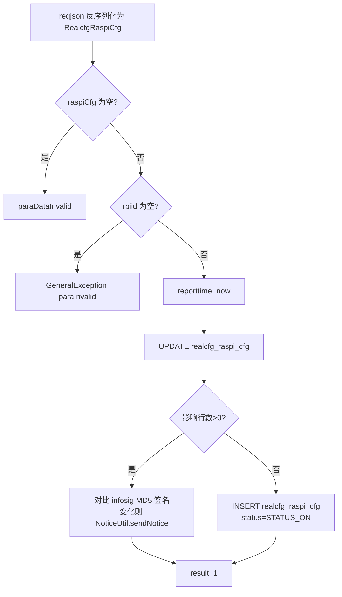
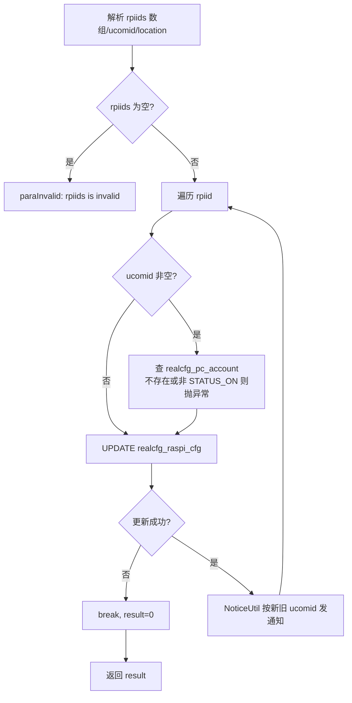
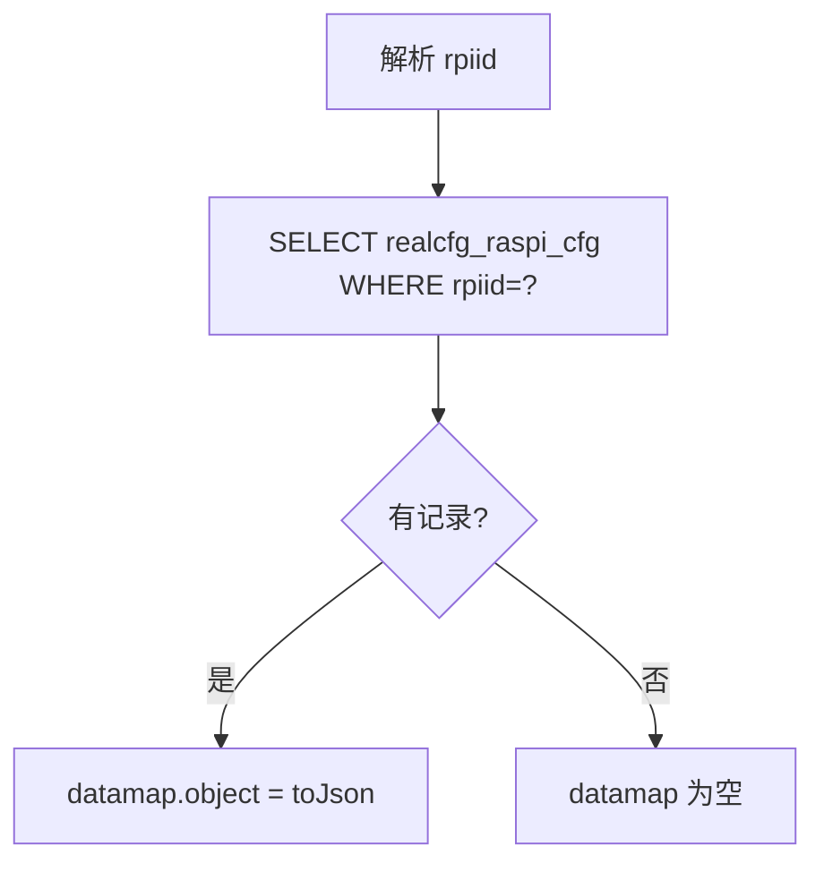
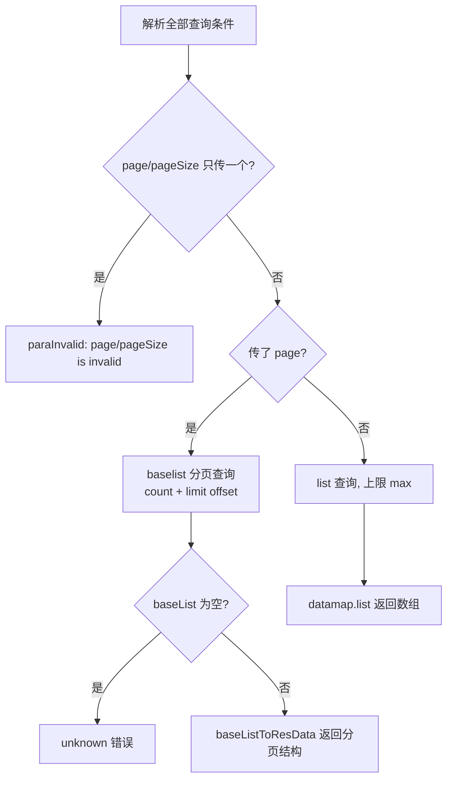

# RaspiCfg

树莓派（Raspberry Pi，下位机）配置管理服务：接收树莓派心跳/信息上报（upsert），维护其与上位机账号（ucomid）、机位的绑定关系，并提供单查与列表查询。

- 源码：`real-cfg/src/main/java/cn/testin/service/cfg/RaspiCfg.java`
- 业务实现：`real-cfg/src/main/java/cn/testin/business/impl/RaspiCfgServiceImpl.java`
- DAO：`real-cfg/src/main/java/cn/testin/dao/impl/realcfg/RealcfgRaspiCfgDAOImpl.java`
- pojo：`cn.testin.pojo.realcfg.RealcfgRaspiCfg`（表 `realcfg_raspi_cfg`）

## op 一览

| op | 说明 |
|---|---|
| report | 树莓派信息上报（有则更新、无则新增） |
| maintain | 批量维护树莓派的上位机账号与机位 |
| get | 按 rpiid 查询单条树莓派信息 |
| list | 条件查询树莓派列表（支持分页） |

---

### report (`RaspiCfg.report`)

- **入口**：ApiServlet，action=cfg，op=RaspiCfg.report
- **实现意图**：树莓派启动/心跳时上报自身信息（应用版本、MAC、IP、挂载设备列表、机位等）。业务层设置 reporttime 为当前时间，先尝试 UPDATE；影响行数为 0（无记录）时 INSERT，实现 upsert。DAO 在 UPDATE 后会对比新旧信息签名（appVersion+mac+ip+devices 的 MD5），有变化时通过 NoticeUtil 发送变更通知。
- **请求参数**：整个请求体反序列化为 `RealcfgRaspiCfg`：

| 参数名 | 类型 | 必填 | 说明 |
|---|---|---|---|
| rpiid | string | 是 | 树莓派唯一标识 |
| ucomid | string | 否 | 绑定的上位机账号 |
| appVersion | string | 否 | 应用版本 |
| mac | string | 否 | MAC 地址 |
| ip | string | 否 | IP 地址 |
| devices | array | 否 | 挂载设备列表（serial/bus/dev/devpath/port） |
| location | string | 否 | 机位 |

- **响应结构**：统一返回 `{code, msg, data}` 报文，错误时无 `data` 节点。

| 字段 | 类型 | 说明 |
| --- | --- | --- |
| code | Integer | 返回码，0 成功 |
| msg | String | 提示信息 |
| data | Object | 数据对象 |
| data.result | Integer | 1 成功 / 0 失败 |
- **处理流程**：



- **调用链**：RaspiCfg → IRaspiCfgService（RaspiCfgServiceImpl）→ IRealcfgRaspiCfgDAO（RealcfgRaspiCfgDAOImpl）→ NoticeUtil（MQ 通知，notice-manager）
- **涉及表与 SQL**：
  - `realcfg_raspi_cfg`：UPDATE（app_version/mac/ip/devices/status/ucomid/location/reporttime/updatetime，按 rpiid），`RealcfgRaspiCfgDAOImpl.update`
  - `realcfg_raspi_cfg`：INSERT（rpiid, ucomid, app_version, mac, ip, devices, location, reporttime, status, createtime, updatetime），`RealcfgRaspiCfgDAOImpl.add`
- **异常与校验**：请求体解析失败返回 `CommonCode.paraDataInvalid`；rpiid 为空抛 `GeneralException(paraInvalid)`。
- **关键代码摘录**：

```java
// real-cfg/src/main/java/cn/testin/business/impl/RaspiCfgServiceImpl.java
raspiCfg.setReporttime(System.currentTimeMillis());
// 更新无记录，则做新增操作
if (this.irealcfgraspicfgdao.update(raspiCfg) > 0) {
    result = true;
} else {
    if (this.irealcfgraspicfgdao.add(raspiCfg) > 0) {
        result = true;
    }
}
```

---

### maintain (`RaspiCfg.maintain`)

- **入口**：ApiServlet，action=cfg，op=RaspiCfg.maintain
- **实现意图**：批量维护树莓派与上位机账号（ucomid）、机位（location）的绑定关系。逐个 rpiid 执行 UPDATE；若 ucomid 非空，先校验其对应 `realcfg_pc_account` 记录存在且状态为 STATUS_ON，否则抛参数异常。任一 rpiid 更新失败即中断（break），result 取最后一次执行结果。DAO 层会按新旧 ucomid 分别发送变更通知。
- **请求参数**：

| 参数名 | 类型 | 必填 | 说明 |
|---|---|---|---|
| rpiids | array&lt;string&gt; | 是 | 树莓派 ID 数组，不能为空 |
| ucomid | string | 否 | 上位机账号（须为 `realcfg_pc_account` 中启用状态的账号） |
| location | string | 否 | 机位 |

- **响应结构**：统一返回 `{code, msg, data}` 报文，错误时无 `data` 节点。

| 字段 | 类型 | 说明 |
| --- | --- | --- |
| code | Integer | 返回码，0 成功 |
| msg | String | 提示信息 |
| data | Object | 数据对象 |
| data.result | Integer | 1 成功 / 0 失败 |
- **处理流程**：



- **调用链**：RaspiCfg → IRaspiCfgService → IRealcfgRaspiCfgDAO（update）、IRealcfgPcAccountDAO（校验上位机账号）→ NoticeUtil（notice-manager）
- **涉及表与 SQL**：
  - `realcfg_raspi_cfg`：UPDATE（ucomid/location/updatetime，按 rpiid），`RealcfgRaspiCfgDAOImpl.update`
  - `realcfg_pc_account`：SELECT 校验 ucomid，`irealcfgpcaccountdao.get`
- **异常与校验**：rpiids 为空返回 `CommonCode.paraInvalid`；ucomid 非法（账号不存在或停用）抛 `GeneralException(paraInvalid)`。
- **关键代码摘录**：

```java
// real-cfg/src/main/java/cn/testin/business/impl/RaspiCfgServiceImpl.java
// 检验上位机账号的合法性
if (StringUtils.isNotBlank(raspiCfg.getUcomid())) {
    RealcfgPcAccount pcAccount = this.irealcfgpcaccountdao.get(raspiCfg.getUcomid());
    if (pcAccount == null || !pcAccount.getStatus().equals(RealcfgPcAccount.STATUS_ON)) {
        String msg = CommonCode.paraInvalid.getDescr() + "(ucomid is invalid!)";
        throw new GeneralException(CommonCode.paraInvalid.getValue(), msg);
    }
}
```

---

### get (`RaspiCfg.get`)

- **入口**：ApiServlet，action=cfg，op=RaspiCfg.get
- **实现意图**：按 rpiid 查询单条树莓派配置信息。
- **请求参数**：

| 参数名 | 类型 | 必填 | 说明 |
|---|---|---|---|
| rpiid | string | 是 | 树莓派唯一标识 |

- **响应结构**：统一返回 `{code, msg, data}` 报文，错误时无 `data` 节点。

| 字段 | 类型 | 说明 |
| --- | --- | --- |
| code | Integer | 返回码，0 成功 |
| msg | String | 提示信息 |
| data | Object | 数据对象 |
| data.objInfo | Object | RealcfgRaspiCfg 对象（查不到则无此节点） |
| data.objInfo.rpiid | String | 树莓派唯一标识 |
| data.objInfo.ucomid | String | 绑定的上位机账号 |
| data.objInfo.appVersion | String | 应用版本 |
| data.objInfo.mac | String | MAC 地址 |
| data.objInfo.ip | String | IP 地址 |
| data.objInfo.devices | Array\<Object\> | 挂载设备列表，元素字段： |
| data.objInfo.devices[].serial | String | 设备序列号 |
| data.objInfo.devices[].bus | Integer | 总线号 |
| data.objInfo.devices[].dev | Integer | 设备号 |
| data.objInfo.devices[].devpath | String | 设备路径 |
| data.objInfo.devices[].port | Integer | 端口 |
| data.objInfo.location | String | 机位 |
| data.objInfo.reporttime | Long | 上报时间（毫秒时间戳） |
| data.objInfo.status | Integer | 状态 |
| data.objInfo.createtime | Long | 创建时间（毫秒时间戳） |
| data.objInfo.updatetime | Long | 更新时间（毫秒时间戳） |
- **处理流程**：



- **调用链**：RaspiCfg → IRaspiCfgService → IRealcfgRaspiCfgDAO（get）
- **涉及表与 SQL**：`realcfg_raspi_cfg`：SELECT WHERE rpiid=?，`RealcfgRaspiCfgDAOImpl.get`
- **异常与校验**：rpiid 为空时 DAO 层抛 `GeneralException(paraInvalid)`。
- **关键代码摘录**：

```java
// real-cfg/src/main/java/cn/testin/service/cfg/RaspiCfg.java
RealcfgRaspiCfg result = this.iraspicfgservice.get(rpiid);
Map<String, Object> datamap = new HashMap<>();
if (result != null) {
    datamap.put(ApiResponse.RES_OBJECT, result.toJson());
}
```

---

### list (`RaspiCfg.list`)

- **入口**：ApiServlet，action=cfg，op=RaspiCfg.list
- **实现意图**：条件查询树莓派列表。支持两种模式：传 page+pageSize 走分页（返回 totalRow/totalPage 等分页信息，由基类 `baseListToResData` 转换）；不传则按 max 上限返回全量列表。onlinetime/offlinetime 为相对毫秒数，分别换算为 reporttime>=now-onlinetime（在线时长内上报过）与 reporttime<now-offlinetime（离线超过该时长）。location 走模糊匹配。
- **请求参数**：

| 参数名 | 类型 | 必填 | 说明 |
|---|---|---|---|
| rpiid | string | 否 | 树莓派 ID（精确） |
| ucomid | string | 否 | 上位机账号（精确） |
| ip | string | 否 | IP 地址（精确） |
| appVersion | string | 否 | 应用版本（精确） |
| location | string | 否 | 机位（like 模糊） |
| onlinetime | long | 否 | 在线判定：reporttime >= now-onlinetime |
| offlinetime | long | 否 | 离线判定：reporttime < now-offlinetime |
| max | int | 否 | 非分页模式最大条数，越界取 Config.MaxSize |
| page | int | 否 | 页码（与 pageSize 必须同时传） |
| pageSize | int | 否 | 每页条数（与 page 必须同时传） |

- **响应结构**：统一返回 `{code, msg, data}` 报文，错误时无 `data` 节点。分页模式额外含分页字段。

| 字段 | 类型 | 说明 |
| --- | --- | --- |
| code | Integer | 返回码，0 成功 |
| msg | String | 提示信息 |
| data | Object | 数据对象 |
| data.list | Array\<Object\> | RealcfgRaspiCfg 数组，元素字段： |
| data.list[].rpiid | String | 树莓派唯一标识 |
| data.list[].ucomid | String | 绑定的上位机账号 |
| data.list[].appVersion | String | 应用版本 |
| data.list[].mac | String | MAC 地址 |
| data.list[].ip | String | IP 地址 |
| data.list[].devices | Array\<Object\> | 挂载设备列表（serial/bus/dev/devpath/port） |
| data.list[].location | String | 机位 |
| data.list[].reporttime | Long | 上报时间（毫秒时间戳） |
| data.list[].status | Integer | 状态 |
| data.list[].createtime | Long | 创建时间（毫秒时间戳） |
| data.list[].updatetime | Long | 更新时间（毫秒时间戳） |
| data.page | Integer | 当前页码（仅分页模式） |
| data.pageSize | Integer | 每页条数（仅分页模式） |
| data.totalRow | Long | 总条数（仅分页模式） |
| data.totalPage | Integer | 总页数（仅分页模式） |
- **处理流程**：



- **调用链**：RaspiCfg → IRaspiCfgService → IRealcfgRaspiCfgDAO（list / baselist / rowsCount）
- **涉及表与 SQL**：`realcfg_raspi_cfg`：SELECT（动态 WHERE：rpiid/ucomid/ip/app_version 精确、location like、reporttime 范围）与 SELECT count(*)，`RealcfgRaspiCfgDAOImpl.list/baselist/conditionsql`
- **异常与校验**：page/pageSize 单独出现返回 `CommonCode.paraInvalid`；分页查询结果为空返回 `CommonCode.unknown`。
- **关键代码摘录**：

```java
// real-cfg/src/main/java/cn/testin/dao/impl/realcfg/RealcfgRaspiCfgDAOImpl.java
if (conditionMap.containsKey("onlinetime") && (long) conditionMap.get("onlinetime") > 0) {
    sqlwhere.append(" reporttime >= ? ");
    params.add(System.currentTimeMillis() - (long) conditionMap.get("onlinetime"));
}
if (conditionMap.containsKey("offlinetime") && (long) conditionMap.get("offlinetime") > 0) {
    sqlwhere.append(" reporttime < ? ");
    params.add(System.currentTimeMillis() - (long) conditionMap.get("offlinetime"));
}
```
