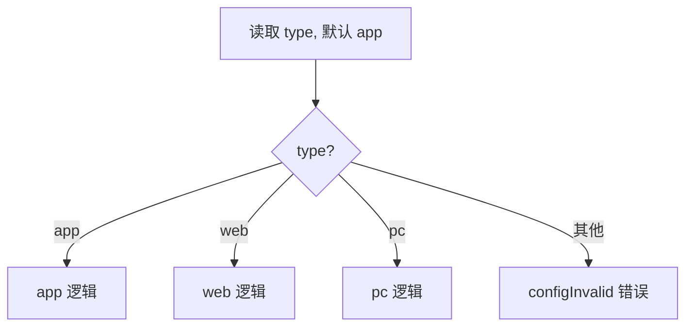
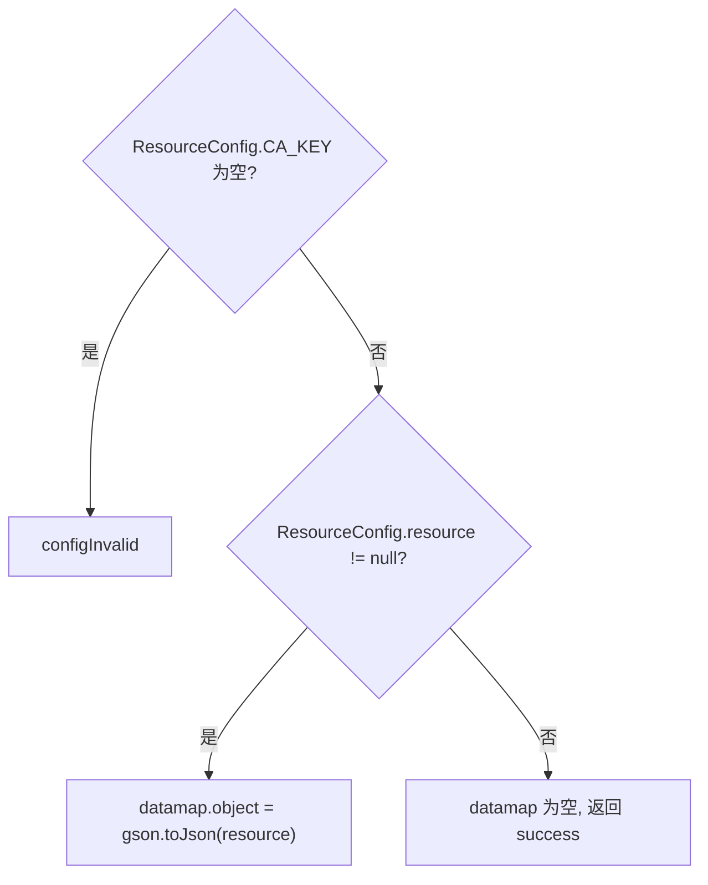
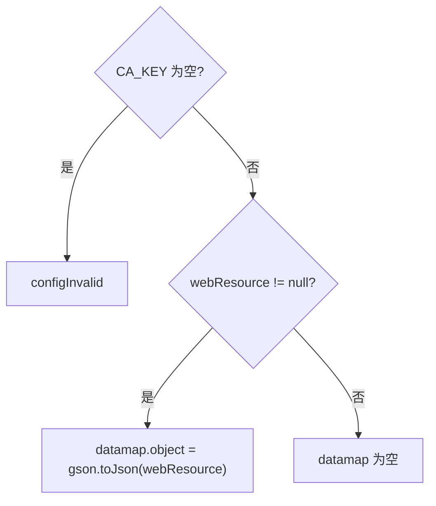
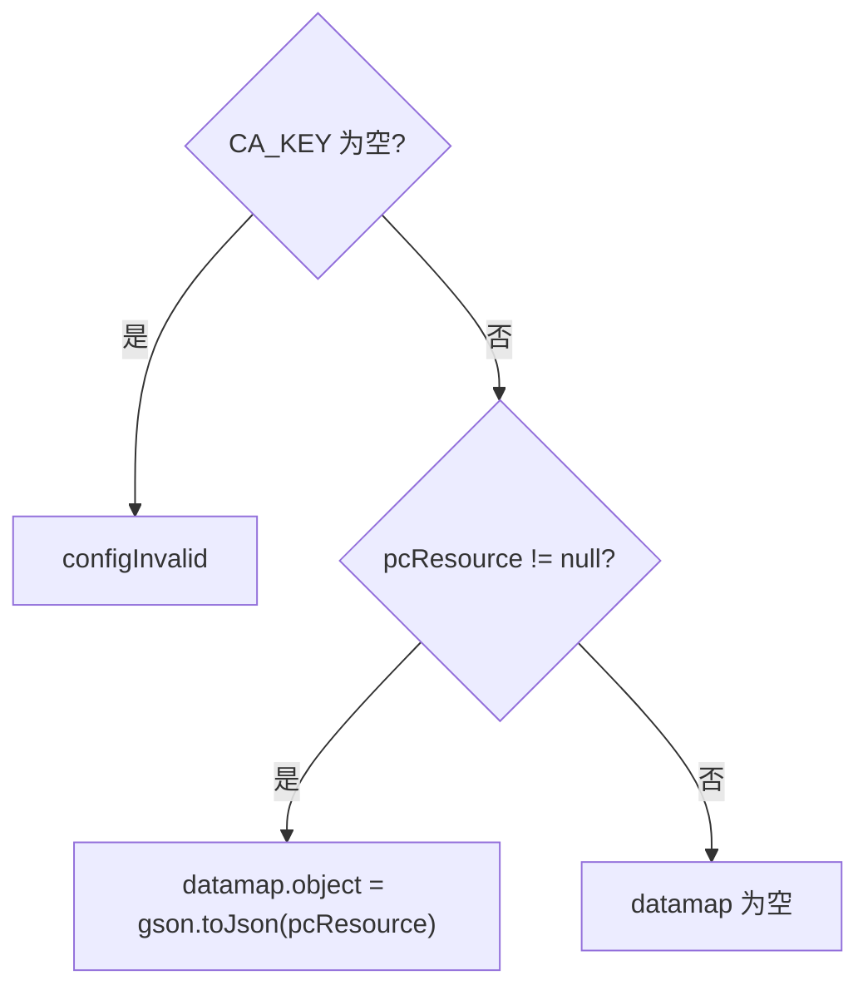

# Resource

客户端资源配置下发服务：按资源类型（app/web/pc）返回当前节点加载的授权/资源配置（`RealcfgResource`）。数据不走数据库，来自 classpath 下 `resource.properties` 与启动时加载到 `ResourceConfig` 静态字段中的资源对象，属于私有化部署的许可证（license）资源配置读取。

- 源码：`real-cfg/src/main/java/cn/testin/service/cfg/Resource.java`
- 配置载体：`real-cfg/src/main/java/cn/testin/util/ResourceConfig.java`（静态块加载 `resource.properties`）

## op 一览

| op | 说明 |
|---|---|
| get | 按 type 分发到 app/web/pc |
| app | 返回 app 端资源配置 |
| web | 返回 web 端资源配置 |
| pc | 返回 pc 端资源配置 |

---

### get (`Resource.get`)

- **入口**：ApiServlet，action=cfg，op=Resource.get
- **实现意图**：资源配置的统一入口，按请求中的 `type` 分发到 app/web/pc 三个具体实现；type 不识别时返回配置无效错误。
- **请求参数**：

| 参数名 | 类型 | 必填 | 说明 |
|---|---|---|---|
| type | string | 否 | 资源类型：app / web / pc（忽略大小写），默认 app |

- **响应结构**：按 type 分发到 app/web/pc 各实现，响应报文同对应实现（统一 `{code, msg, data}`，`data.objInfo` 为 RealcfgResource 对象）。
- **处理流程**：



- **调用链**：Resource.get → Resource.app / web / pc
- **涉及表与 SQL**：无（读取内存中的 ResourceConfig 静态配置）
- **异常与校验**：type 无法识别返回 `CommonCode.configInvalid`。
- **关键代码摘录**：

```java
// real-cfg/src/main/java/cn/testin/service/cfg/Resource.java
String type = reqjson.optString("type", "app");
if ("app".equalsIgnoreCase(type)) {
    return app(apirequest);
} else if ("web".equalsIgnoreCase(type)) {
    return web(apirequest);
} else if ("pc".equalsIgnoreCase(type)) {
    return pc(apirequest);
} else {
    return ApiUtil.getResult(apirequest, CommonCode.configInvalid.getValue(), CommonCode.configInvalid.getDescr());
}
```

---

### app (`Resource.app`)

- **入口**：ApiServlet，action=cfg，op=Resource.app
- **实现意图**：返回 app 端资源配置。前置校验 `ResourceConfig.CA_KEY`（CA 授权 key，来自 resource.properties 的 `CA_KEY`/`app.ca.key`），为空说明本节点无授权配置，直接返回 configInvalid。资源对象 `ResourceConfig.resource` 非空时放入 datamap.object 返回。
- **请求参数**：无（忽略请求体）
- **响应结构**：统一返回 `{code, msg, data}` 报文，错误时无 `data` 节点。

| 字段 | 类型 | 说明 |
| --- | --- | --- |
| code | Integer | 返回码，0 成功 |
| msg | String | 提示信息 |
| data | Object | 数据对象 |
| data.objInfo | Object | RealcfgResource 对象（ResourceConfig.resource 为空时无此节点） |
| data.objInfo.expiretime | Long | 授权到期时间（时间戳） |
| data.objInfo.authorizedSystem | Array\<String\> | 授权的系统类型（Android/iOS/HarmonyOS/HarmonyOS Next） |
| data.objInfo.deviceMax | Integer | 设备授权数量 |
| data.objInfo.androidDeviceMax | Integer | Android 授权数量（0 表示 0-deviceMax 个） |
| data.objInfo.iosDeviceMax | Integer | iOS 授权数量（0 表示 0-deviceMax 个） |
| data.objInfo.hmDeviceMax | Integer | 鸿蒙 OS 授权数量（0 表示 0-deviceMax 个） |
| data.objInfo.harmonyOSDeviceMax | Integer | 鸿蒙 Next 授权数量（0 表示 0-deviceMax 个） |
- **处理流程**：



- **调用链**：Resource.app → cn.testin.util.ResourceConfig（静态配置）
- **涉及表与 SQL**：无
- **异常与校验**：CA_KEY 为空返回 `CommonCode.configInvalid`。
- **关键代码摘录**：

```java
// real-cfg/src/main/java/cn/testin/service/cfg/Resource.java
if (StringUtils.isBlank(ResourceConfig.CA_KEY)) {
    return ApiUtil.getResult(apirequest, CommonCode.configInvalid.getValue(), CommonCode.configInvalid.getDescr());
}
if (ResourceConfig.resource != null) {
    datamap.put(ApiResponse.RES_OBJECT, new JSONObject(gson.toJson(ResourceConfig.resource)));
}
```

---

### web (`Resource.web`)

- **入口**：ApiServlet，action=cfg，op=Resource.web
- **实现意图**：返回 web 端资源配置，逻辑与 app 相同，数据取自 `ResourceConfig.webResource`。同样以 `ResourceConfig.CA_KEY` 作为授权有效性前置校验。
- **请求参数**：无
- **响应结构**：统一返回 `{code, msg, data}` 报文，错误时无 `data` 节点。

| 字段 | 类型 | 说明 |
| --- | --- | --- |
| code | Integer | 返回码，0 成功 |
| msg | String | 提示信息 |
| data | Object | 数据对象 |
| data.objInfo | Object | RealcfgResource 对象（ResourceConfig.webResource 为空时无此节点），字段同 `app` |
- **处理流程**：



- **调用链**：Resource.web → cn.testin.util.ResourceConfig
- **涉及表与 SQL**：无
- **异常与校验**：CA_KEY 为空返回 `CommonCode.configInvalid`。
- **关键代码摘录**：

```java
// real-cfg/src/main/java/cn/testin/service/cfg/Resource.java
if (ResourceConfig.webResource != null) {
    datamap.put(ApiResponse.RES_OBJECT, new JSONObject(gson.toJson(ResourceConfig.webResource)));
}
```

---

### pc (`Resource.pc`)

- **入口**：ApiServlet，action=cfg，op=Resource.pc
- **实现意图**：返回 pc 端资源配置，逻辑同上，数据取自 `ResourceConfig.pcResource`。
- **请求参数**：无
- **响应结构**：统一返回 `{code, msg, data}` 报文，错误时无 `data` 节点。

| 字段 | 类型 | 说明 |
| --- | --- | --- |
| code | Integer | 返回码，0 成功 |
| msg | String | 提示信息 |
| data | Object | 数据对象 |
| data.objInfo | Object | RealcfgResource 对象（ResourceConfig.pcResource 为空时无此节点），字段同 `app` |
- **处理流程**：



- **调用链**：Resource.pc → cn.testin.util.ResourceConfig
- **涉及表与 SQL**：无
- **异常与校验**：CA_KEY 为空返回 `CommonCode.configInvalid`。
- **关键代码摘录**：

```java
// real-cfg/src/main/java/cn/testin/service/cfg/Resource.java
if (ResourceConfig.pcResource != null) {
    datamap.put(ApiResponse.RES_OBJECT, new JSONObject(gson.toJson(ResourceConfig.pcResource)));
}
```

---

## 附：ResourceConfig 加载机制

`ResourceConfig` 在静态块中从 classpath 的 `resource.properties` 读取授权信息（可被环境变量 `TESTINPRO_LICENSE_FINGER_PRINT` 覆盖指纹），关键配置项：

| 配置项 | 静态字段 | 说明 |
|---|---|---|
| fingerprint | FINGER_PRINT | 硬件唯一码/许可证指纹 |
| KEY / app.key | _KEY | app 端 key，前 10 位取 MD5 得 MD5_KEY |
| CA_KEY / app.ca.key | CA_KEY | app 端 CA 授权 key（本服务的前置校验项） |
| web.key / web.ca.key | WEB_KEY / WEB_CA_KEY | web 端 key 与 CA key |
| pc.key / pc.ca.key | PC_KEY / PC_CA_KEY | pc 端 key 与 CA key |

`resource` / `webResource` / `pcResource` 三个 `RealcfgResource` 静态对象由启动流程（监听器/初始化类）赋值，本服务仅负责读取下发。
