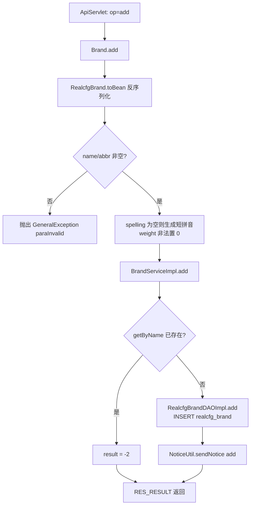
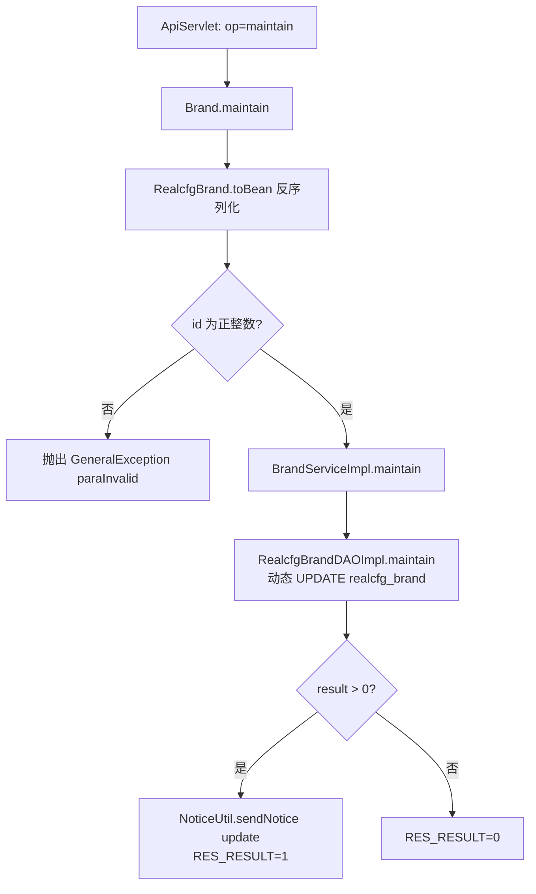
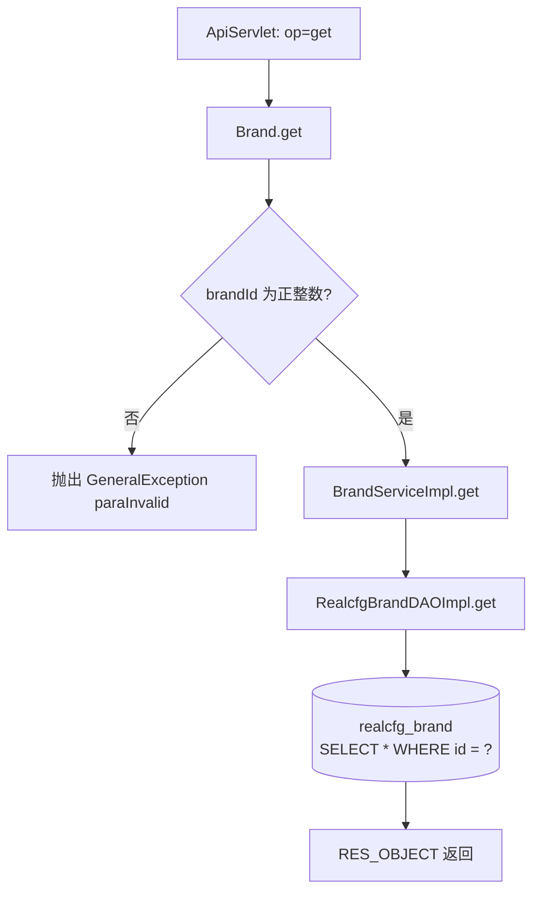
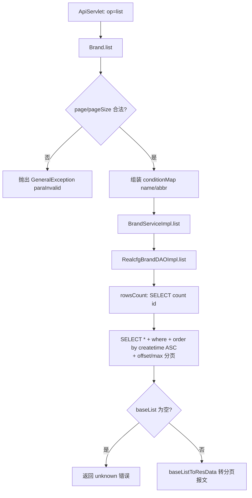

# Brand

手机品牌配置管理服务：品牌（realcfg_brand 表）的增、改、查、分页列表，供机型库与管理后台使用。新增/修改成功后会通过 NoticeUtil 发送 MQ 通知刷新缓存。

## op 一览

| op | 功能 |
| --- | --- |
| add | 新增品牌 |
| maintain | 修改品牌信息 |
| get | 按 brandId 查询品牌详情 |
| list | 分页查询品牌列表 |

### add (`Brand.add`)

- **入口**：ApiServlet，action=cfg，op=Brand.add
- **实现意图**：新增手机品牌。名称、英文缩写必填；拼音缩写未传时通过 jpinyin 按品牌名自动生成短拼音；权重未传或小于 0 时置 0。业务层先按名称查重，重名返回 -2；插入成功（返回自增 id）后发送 MQ 通知。
- **请求参数**（RealcfgBrand.toBean 从 reqjson 反序列化）：

| 参数名 | 类型 | 必填 | 说明 |
| --- | --- | --- | --- |
| name | String | 是 | 品牌名称 |
| abbr | String | 是 | 品牌英文缩写 |
| spelling | String | 否 | 拼音缩写，缺省自动生成（PinyinHelper.getShortPinyin） |
| logoUrl | String | 否 | 品牌 logo 地址 |
| weight | Integer | 否 | 权重，缺省/负数时置 0 |

- **响应结构**：统一返回 `{code, msg, data}` 报文，错误时无 `data` 节点。

| 字段 | 类型 | 说明 |
| --- | --- | --- |
| code | Integer | 返回码，0 成功 |
| msg | String | 提示信息 |
| data | Object | 数据对象 |
| data.result | Integer | >0 为新增记录 id，0 失败，-2 品牌名已存在 |
- **处理流程**：



- **调用链**：cn.testin.service.cfg.Brand → cn.testin.business.impl.BrandServiceImpl → cn.testin.dao.impl.realcfg.RealcfgBrandDAOImpl → 表 realcfg_brand；通知经 cn.testin.util.NoticeUtil（MQ）→ notice-manager；拼音生成用第三方库 jpinyin（PinyinHelper）
- **涉及表与 SQL**：
  - `realcfg_brand`：SELECT（按 name 查重，`RealcfgBrandDAOImpl.getByName`）；INSERT（name, abbr, spelling, logo_url, weight, status, createtime, updatetime，序列 seq_realcfg_brand 生成 id，`RealcfgBrandDAOImpl.add`）
- **异常与校验**：name 为空 → `GeneralException(CommonCode.paraInvalid)` "brandName is invalid!"；abbr 为空 → "brandAbbr is invalid!"；DAO 层异常 catch 后返回 0
- **关键代码摘录**：

```java
// real-cfg/src/main/java/cn/testin/service/cfg/Brand.java
if (StringUtils.isBlank(brand.getSpelling())) {
    brand.setSpelling(PinyinHelper.getShortPinyin(brand.getName().trim()));
}
if (brand.getWeight() == null || brand.getWeight() < 0) {
    brand.setWeight(0);
}
Integer result = this.ibrandservice.add(brand);

// real-cfg/src/main/java/cn/testin/business/impl/BrandServiceImpl.java
RealcfgBrand brandInfo = irealcfgbranddao.getByName(name);
if (brandInfo == null) {
    result = irealcfgbranddao.add(realcfgBrand);
} else {
    result = -2; // 已存在相同的品牌名称
}
```

### maintain (`Brand.maintain`)

- **入口**：ApiServlet，action=cfg，op=Brand.maintain
- **实现意图**：按品牌 id 修改品牌信息，非空字段动态拼入 UPDATE 语句（name/abbr/spelling/logoUrl/weight/status），updatetime 强制刷新；更新成功后发送 MQ 通知。
- **请求参数**：

| 参数名 | 类型 | 必填 | 说明 |
| --- | --- | --- | --- |
| id | Integer | 是 | 品牌 id，必须为正整数 |
| name / abbr / spelling / logoUrl / weight / status | String / Integer | 否 | 传哪个字段改哪个字段 |

- **响应结构**：统一返回 `{code, msg, data}` 报文，错误时无 `data` 节点。

| 字段 | 类型 | 说明 |
| --- | --- | --- |
| code | Integer | 返回码，0 成功 |
| msg | String | 提示信息 |
| data | Object | 数据对象 |
| data.result | Integer | 1 成功 / 0 失败 |
- **处理流程**：



- **调用链**：cn.testin.service.cfg.Brand → cn.testin.business.impl.BrandServiceImpl → cn.testin.dao.impl.realcfg.RealcfgBrandDAOImpl → 表 realcfg_brand；通知 → notice-manager
- **涉及表与 SQL**：
  - `realcfg_brand`：UPDATE（按非空字段动态 SET + `updatetime = ?`，`WHERE id = ?`），DAO 方法 `RealcfgBrandDAOImpl.maintain(RealcfgBrand)`
- **异常与校验**：bean 为 null 返回 paraInvalid 报文；id 非法抛 `GeneralException(CommonCode.paraInvalid)` "brandId is invalid!"；DAO 异常 catch 返回 0
- **关键代码摘录**：

```java
// real-cfg/src/main/java/cn/testin/dao/impl/realcfg/RealcfgBrandDAOImpl.java
if (realcfgBrand.getName() != null) {
    sql.append("name = ?, ");
    params.add(realcfgBrand.getName());
}
// ... 其余字段同理
sql.append("updatetime = ? ");
sql.append(" WHERE id = ? ");
Integer result = this.getRealcfgdao().update(sql.toString(), params.toArray());
if (result != null && result > 0) { // 通知消息队列
    NoticeUtil.sendNotice("update", "RealcfgBrand", realcfgBrand.getId());
}
```

### get (`Brand.get`)

- **入口**：ApiServlet，action=cfg，op=Brand.get
- **实现意图**：按品牌 id 查询单个品牌详情。
- **请求参数**：

| 参数名 | 类型 | 必填 | 说明 |
| --- | --- | --- | --- |
| brandId | Integer | 是 | 品牌 id，必须为正整数 |

- **响应结构**：统一返回 `{code, msg, data}` 报文，错误时无 `data` 节点。

| 字段 | 类型 | 说明 |
| --- | --- | --- |
| code | Integer | 返回码，0 成功 |
| msg | String | 提示信息 |
| data | Object | 数据对象 |
| data.objInfo | Object | RealcfgBrand 对象（无记录时无此节点） |
| data.objInfo.brandId | Integer | 品牌 ID |
| data.objInfo.brandName | String | 品牌名称 |
| data.objInfo.brandAbbr | String | 品牌英文缩写 |
| data.objInfo.spelling | String | 品牌拼音缩写 |
| data.objInfo.logoUrl | String | 品牌 logo 地址 |
| data.objInfo.weight | Integer | 权重 |
| data.objInfo.status | Integer | 状态 |
| data.objInfo.createtime | Long | 创建时间（毫秒时间戳） |
| data.objInfo.updatetime | Long | 更新时间（毫秒时间戳） |
- **处理流程**：



- **调用链**：cn.testin.service.cfg.Brand → cn.testin.business.impl.BrandServiceImpl → cn.testin.dao.impl.realcfg.RealcfgBrandDAOImpl → 表 realcfg_brand
- **涉及表与 SQL**：
  - `realcfg_brand`：SELECT（`SELECT * FROM realcfg_brand WHERE id = ?`），DAO 方法 `RealcfgBrandDAOImpl.get(Integer)`
- **异常与校验**：brandId 非法抛 `GeneralException(CommonCode.paraInvalid)`；DAO 异常 catch 返回 null
- **关键代码摘录**：

```java
// real-cfg/src/main/java/cn/testin/service/cfg/Brand.java
if (brandId == null || brandId <= 0) {
    String msg = CommonCode.paraInvalid.getDescr() + "(brandId is invalid!)";
    throw new GeneralException(CommonCode.paraInvalid.getValue(), msg);
}
RealcfgBrand brand = this.ibrandservice.get(brandId);
if (brand != null) {
    datamap.put(ApiResponse.RES_OBJECT, brand.toJson());
}
```

### list (`Brand.list`)

- **入口**：ApiServlet，action=cfg，op=Brand.list
- **实现意图**：分页查询品牌列表，支持按名称（模糊匹配 name 或 spelling）、缩写（模糊匹配 abbr）过滤，固定按 createtime 升序排序。
- **请求参数**：

| 参数名 | 类型 | 必填 | 说明 |
| --- | --- | --- | --- |
| brandName | String | 否 | 品牌名/拼音模糊查询 |
| brandAbbr | String | 否 | 缩写模糊查询 |
| page | Integer | 是 | 页码，从 1 开始 |
| pageSize | Integer | 是 | 每页条数，必须 0 < pageSize < Config.MaxSize |

- **响应结构**：统一返回 `{code, msg, data}` 报文，错误时无 `data` 节点。

| 字段 | 类型 | 说明 |
| --- | --- | --- |
| code | Integer | 返回码，0 成功 |
| msg | String | 提示信息 |
| data | Object | 数据对象 |
| data.list | Array\<Object\> | 当前页品牌数组，元素字段： |
| data.list[].brandId | Integer | 品牌 ID |
| data.list[].brandName | String | 品牌名称 |
| data.list[].brandAbbr | String | 品牌英文缩写 |
| data.list[].spelling | String | 品牌拼音缩写 |
| data.list[].logoUrl | String | 品牌 logo 地址 |
| data.list[].weight | Integer | 权重 |
| data.list[].status | Integer | 状态 |
| data.list[].createtime | Long | 创建时间（毫秒时间戳） |
| data.list[].updatetime | Long | 更新时间（毫秒时间戳） |
| data.page | Integer | 当前页码 |
| data.pageSize | Integer | 每页条数 |
| data.totalRow | Long | 总条数 |
| data.totalPage | Integer | 总页数 |
- **处理流程**：



- **调用链**：cn.testin.service.cfg.Brand → cn.testin.business.impl.BrandServiceImpl → cn.testin.dao.impl.realcfg.RealcfgBrandDAOImpl → 表 realcfg_brand
- **涉及表与 SQL**：
  - `realcfg_brand`：SELECT count(id)（`RealcfgBrandDAOImpl.rowsCount`）；SELECT * WHERE (name like ? or spelling like ?) and abbr like ? ORDER BY createtime ASC LIMIT 分页（`RealcfgBrandDAOImpl.list`）
- **异常与校验**：page <= 0、pageSize <= 0 或 >= Config.MaxSize 抛 `GeneralException(CommonCode.paraInvalid)`；查询结果为 null 返回 `CommonCode.unknown`
- **关键代码摘录**：

```java
// real-cfg/src/main/java/cn/testin/service/cfg/Brand.java
SortField sortField = new SortField();
sortField.setFieldName("createtime");
sortField.setDesc(false);
BaseList<RealcfgBrand> baseList = this.ibrandservice.list(conditionMap, fields, page, pageSize);
if (baseList == null || baseList.getList() == null) {
    return ApiUtil.getResult(apirequest, CommonCode.unknown.getValue(), CommonCode.unknown.getDescr());
}
baseListToResData(datamap, baseList);
```
