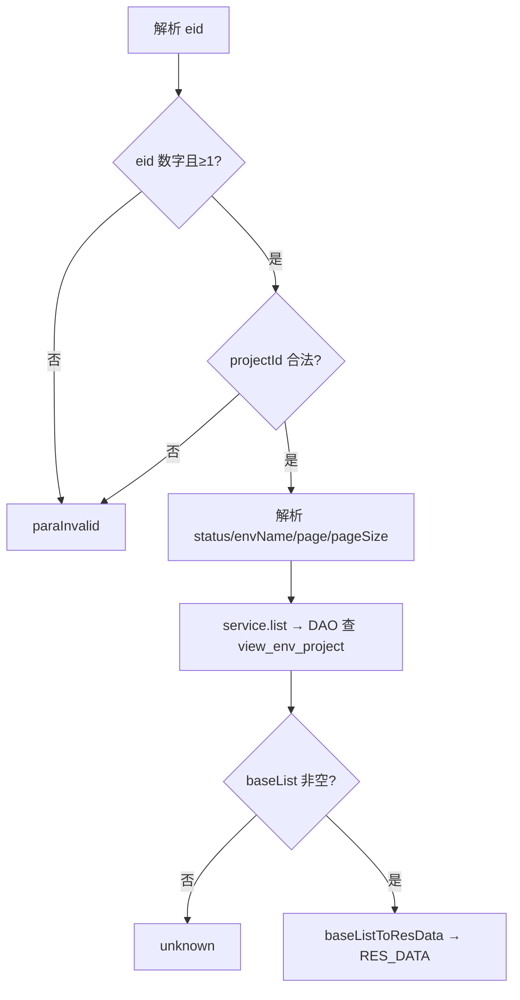
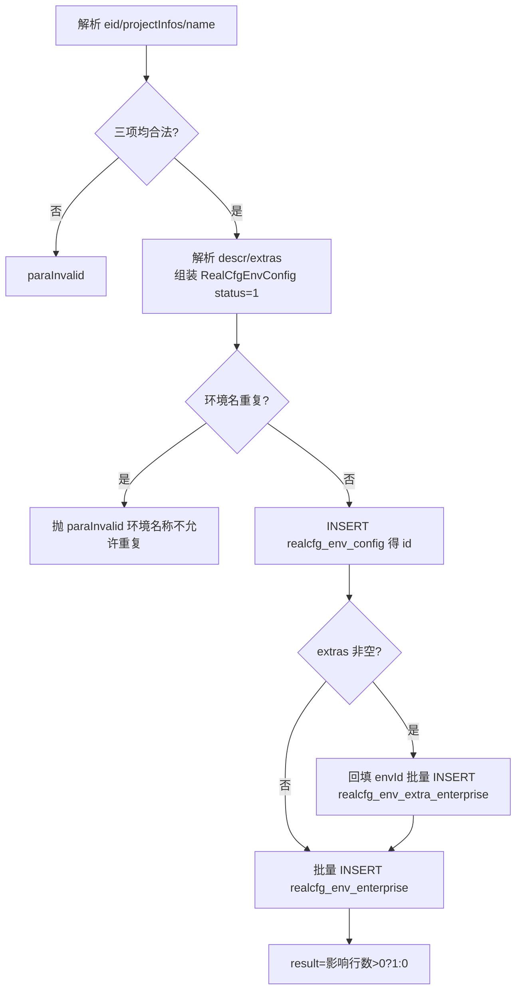
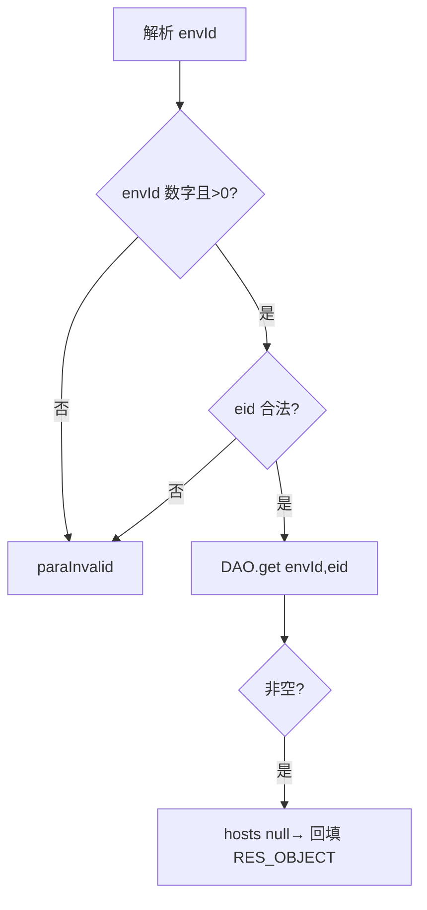
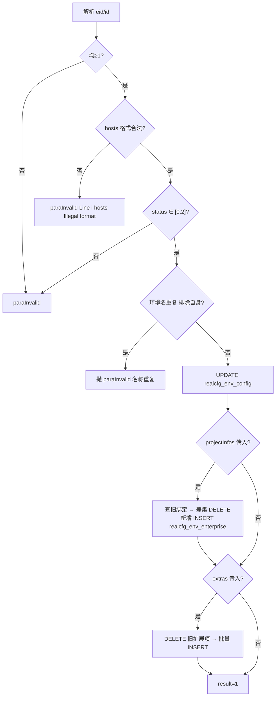
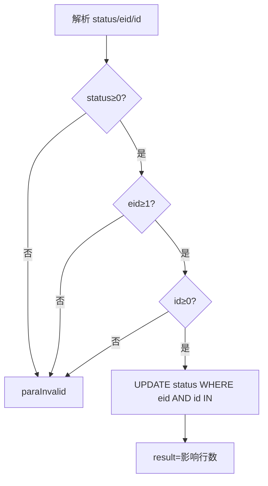

# EnvCfg

环境配置服务：企业级测试环境（名称、hosts、DB 配置、项目绑定、扩展项）的增删改查与状态管理。环境名全局唯一，环境与企业项目通过 `realcfg_env_enterprise` 关系表关联，列表查询走 `view_env_project` 视图。

源码：`real-cfg/src/main/java/cn/testin/service/cfg/EnvCfg.java`
业务实现：`cn.testin.business.impl.RealCfgEnvConfigServiceImpl`（`IRealCfgEnvConfigService`）

## op 一览

| op | 说明 |
| --- | --- |
| list | 分页查询环境配置列表 |
| add | 新增环境配置（含项目绑定与扩展项） |
| get | 查询单个环境详情 |
| maintain | 维护环境（属性 + 项目绑定 + 扩展项） |
| updateStatus | 修改环境状态（0 逻辑删除 / 1 正常 / 2 禁用） |

---

### list (`EnvCfg.list`)

- **入口**：ApiServlet，action=cfg，op=EnvCfg.list
- **实现意图**：按企业（eid，必填）分页查询环境配置，可选按 projectId、status、envName 过滤。返回视图 `view_env_project` 的行（含项目关联信息）。
- **请求参数**：

| 参数名 | 类型 | 必填 | 说明 |
| --- | --- | --- | --- |
| eid | Integer | 是 | 企业 id，≥1 |
| projectId | Integer | 否 | 项目 id 过滤，≥1 |
| status | Integer | 否 | 状态过滤（单值加入 statuses） |
| envName | String | 否 | 环境名过滤 |
| page | Integer | 否 | 页码，缺省 1 |
| pageSize | Integer | 否 | 每页条数，缺省/越界取 Config.MaxSize |

- **响应结构**：统一返回 `{code, msg, data}` 报文，错误时无 `data` 节点。

| 字段 | 类型 | 说明 |
| --- | --- | --- |
| code | Integer | 返回码，0 成功 |
| msg | String | 提示信息 |
| data | Object | 数据对象 |
| data.list | Array\<Object\> | 当前页环境配置视图数组（RealCfgEnvConfigView），元素字段： |
| data.list[].id | Integer | 环境主键 |
| data.list[].name | String | 环境名 |
| data.list[].eid | Integer | 企业 ID |
| data.list[].hosts | String | hosts 内容 |
| data.list[].dbConfig | String | DB 配置 |
| data.list[].descr | String | 描述 |
| data.list[].projectNames | Array\<String\> | 关联项目名称数组 |
| data.list[].projectIds | Array\<Integer\> | 关联项目 ID 数组 |
| data.list[].extras | Array\<Object\> | 扩展项数组，元素字段： |
| data.list[].extras[].id | Integer | 扩展项 ID |
| data.list[].extras[].envId | Integer | 环境 ID |
| data.list[].extras[].projectId | Integer | 项目 ID |
| data.list[].extras[].type | Integer | 扩展项类型 |
| data.list[].extras[].content | String | 扩展项内容 |
| data.list[].extras[].status | Integer | 状态 |
| data.list[].extras[].createtime | Long | 创建时间（毫秒时间戳） |
| data.list[].extras[].updatetime | Long | 更新时间（毫秒时间戳） |
| data.list[].status | Integer | 状态 |
| data.list[].createtime | Long | 创建时间（毫秒时间戳） |
| data.list[].updatetime | Long | 更新时间（毫秒时间戳） |
| data.page | Integer | 当前页码 |
| data.pageSize | Integer | 每页条数 |
| data.totalRow | Long | 总条数 |
| data.totalPage | Integer | 总页数 |
- **处理流程**：



- **调用链**：EnvCfg → RealCfgEnvConfigServiceImpl.list → IRealcfgEnvConfigDAO.list（RealcfgEnvConfigDAOImpl，按 projectId 过滤时拼 `env_id IN (select env_id from view_env_project where env_projectid = ?)`）
- **涉及表与 SQL**：`view_env_project`（SELECT 分页）
- **异常与校验**：`CommonCode.paraInvalid`——eid 缺失/非数字/<1、projectId<1；全程 Logit.messageLog 记录请求与响应。
- **关键代码摘录**：

```java
// real-cfg/src/main/java/cn/testin/service/cfg/EnvCfg.java
BaseList<RealCfgEnvConfigView> baseList =
        irealcfgenvconfigservice.list(eid, projectId, statuses, envConfig, page, pageSize);
if (baseList == null || baseList.getList() == null) {
    return ApiUtil.getResult(apirequest, CommonCode.unknown.getValue(), CommonCode.unknown.getDescr());
}
baseListToResData(datamap, baseList);
```

---

### add (`EnvCfg.add`)

- **入口**：ApiServlet，action=cfg，op=EnvCfg.add
- **实现意图**：新增环境配置。业务层先校验环境名全局不重复（`contains(name, null)`），插入主表拿回自增 id，批量插入扩展项（回填 envId），最后批量写入 `realcfg_env_enterprise` 项目绑定关系。service 层固定 status=1。
- **请求参数**：

| 参数名 | 类型 | 必填 | 说明 |
| --- | --- | --- | --- |
| eid | Integer | 是 | 企业 id，≥1 |
| name | String | 是 | 环境名（全局唯一） |
| projectInfos | JSONArray | 是 | 项目绑定数组，元素含 `projectid`、`projectName`，不能为空数组 |
| descr | String | 否 | 描述 |
| extras | JSONArray | 否 | 扩展项数组，按 List\<RealCfgEnvConfigExtra\> 反序列化 |

- **响应结构**：统一返回 `{code, msg, data}` 报文，错误时无 `data` 节点。

| 字段 | 类型 | 说明 |
| --- | --- | --- |
| code | Integer | 返回码，0 成功 |
| msg | String | 提示信息 |
| data | Object | 数据对象 |
| data.result | Integer | 1 成功 / 0 失败（业务层返回关系表插入影响行数） |
- **处理流程**：



- **调用链**：EnvCfg → RealCfgEnvConfigServiceImpl.add → IRealcfgEnvConfigDAO（add / add(extras) / addToRelation / contains）
- **涉及表与 SQL**：
  - `realcfg_env_config`：INSERT（name,eid,hosts,db_config,status,descr,createtime,updatetime）
  - `realcfg_env_extra_enterprise`：批量 INSERT
  - `realcfg_env_enterprise`：批量 INSERT（env_id,eid,project_id,project_name,createtime,updatetime）
- **异常与校验**：`CommonCode.paraInvalid`——eid/projectInfos/name 非法；业务层环境名重复抛 `paraInvalid("环境名称不允许重复！")`。
- **关键代码摘录**：

```java
// real-cfg/src/main/java/cn/testin/business/impl/RealCfgEnvConfigServiceImpl.java
if (this.irealcfgenvconfigdao.contains(envConfig.getName(), null) > 0) {
    throw new GeneralException(CommonCode.paraInvalid.getValue(), "环境名称不允许重复！");
}
int key = this.irealcfgenvconfigdao.add(envConfig);
if (!CollectionUtils.isEmpty(extras)){
    for (RealCfgEnvConfigExtra extra : extras) { extra.setEnvId(key); }
    this.irealcfgenvconfigdao.add(extras);
}
return this.irealcfgenvconfigdao.addToRelation(key, envConfig.getEid(), projectInfo);
```

---

### get (`EnvCfg.get`)

- **入口**：ApiServlet，action=cfg，op=EnvCfg.get
- **实现意图**：按 envId（必填）+ eid（可选，>0 时参与过滤）查询单个环境详情；hosts 为 null 时业务层归一化为空串。
- **请求参数**：

| 参数名 | 类型 | 必填 | 说明 |
| --- | --- | --- | --- |
| envId | Integer | 是 | 环境主键，>0 |
| eid | Integer | 否 | 企业 id，传入须 ≥1 |

- **响应结构**：统一返回 `{code, msg, data}` 报文，错误时无 `data` 节点。

| 字段 | 类型 | 说明 |
| --- | --- | --- |
| code | Integer | 返回码，0 成功 |
| msg | String | 提示信息 |
| data | Object | 数据对象 |
| data.objInfo | Object | RealCfgEnvConfig 对象（无记录时无此节点） |
| data.objInfo.id | Integer | 环境主键 |
| data.objInfo.name | String | 环境名 |
| data.objInfo.eid | Integer | 企业 ID |
| data.objInfo.hosts | String | hosts 内容 |
| data.objInfo.dbConfig | String | DB 配置 |
| data.objInfo.descr | String | 描述 |
| data.objInfo.extras | Array\<Object\> | 扩展项数组，元素字段： |
| data.objInfo.extras[].id | Integer | 扩展项 ID |
| data.objInfo.extras[].envId | Integer | 环境 ID |
| data.objInfo.extras[].projectId | Integer | 项目 ID |
| data.objInfo.extras[].type | Integer | 扩展项类型 |
| data.objInfo.extras[].content | String | 扩展项内容 |
| data.objInfo.extras[].status | Integer | 状态 |
| data.objInfo.extras[].createtime | Long | 创建时间（毫秒时间戳） |
| data.objInfo.extras[].updatetime | Long | 更新时间（毫秒时间戳） |
| data.objInfo.status | Integer | 状态 |
| data.objInfo.createtime | Long | 创建时间（毫秒时间戳） |
| data.objInfo.updatetime | Long | 更新时间（毫秒时间戳） |
- **处理流程**：



- **调用链**：EnvCfg → RealCfgEnvConfigServiceImpl.get → IRealcfgEnvConfigDAO.get
- **涉及表与 SQL**：`realcfg_env_config`（SELECT by id/eid）
- **异常与校验**：`CommonCode.paraInvalid`——envId 缺失/≤0、eid<1。
- **关键代码摘录**：

```java
// real-cfg/src/main/java/cn/testin/business/impl/RealCfgEnvConfigServiceImpl.java
RealCfgEnvConfig result = this.irealcfgenvconfigdao.get(envId, eid);
if (result != null && result.getHosts() == null) {
    result.setHosts("");
}
```

---

### maintain (`EnvCfg.maintain`)

- **入口**：ApiServlet，action=cfg，op=EnvCfg.maintain
- **实现意图**：全量维护环境：更新主表字段（name/descr/hosts/status），hosts 先经 `HostsUtil.hostsCheckUtil` 逐行格式校验；传 projectInfos 时做增量同步——与库中旧绑定比对，差集删除、新增插入；传 extras 时先清空该环境全部扩展项再重建。环境名重复（排除自身 id）报参数错误。
- **请求参数**：

| 参数名 | 类型 | 必填 | 说明 |
| --- | --- | --- | --- |
| eid | Integer | 是 | 企业 id，≥1 |
| id | Integer | 是 | 环境主键，≥1 |
| name | String | 否 | 环境名 |
| descr | String | 否 | 描述 |
| hosts | String | 否 | hosts 内容，逐行 `ip 域名` 格式校验 |
| status | Integer | 否 | 0 删除 / 1 正常 / 2 禁用，区间 [0,2] |
| projectInfos | JSONArray | 否 | 项目绑定全量（增量同步） |
| extras | JSONArray | 否 | 扩展项全量（先删后插） |

- **响应结构**：统一返回 `{code, msg, data}` 报文，错误时无 `data` 节点。

| 字段 | 类型 | 说明 |
| --- | --- | --- |
| code | Integer | 返回码，0 成功 |
| msg | String | 提示信息 |
| data | Object | 数据对象 |
| data.result | Integer | 1 成功 / 0 失败（业务层成功恒返回 1） |
- **处理流程**：



- **调用链**：EnvCfg → RealCfgEnvConfigServiceImpl.maintain → IRealcfgEnvConfigDAO（contains / maintain / listToRelation / remove / addToRelation / deleteExtra / add）；工具：`cn.testin.util.HostsUtil`
- **涉及表与 SQL**：`realcfg_env_config`（UPDATE）、`realcfg_env_enterprise`（SELECT/DELETE/INSERT）、`realcfg_env_extra_enterprise`（DELETE by envId / 批量 INSERT）
- **异常与校验**：`CommonCode.paraInvalid`——eid/id 非法、hosts 格式错误（带行号）、status 越界、名称重复。
- **关键代码摘录**：

```java
// real-cfg/src/main/java/cn/testin/service/cfg/EnvCfg.java
if (!reqjson.isNull("hosts")) {
    hosts = reqjson.getString("hosts");
    int i = HostsUtil.hostsCheckUtil(hosts);
    if (i != 0) {
        String msg = CommonCode.paraInvalid.getDescr() + "(Line " + i + " ,hosts Illegal format!)";
        return ApiUtil.getResult(apirequest, CommonCode.paraInvalid.getValue(), msg);
    }
}
```

---

### updateStatus (`EnvCfg.updateStatus`)

- **入口**：ApiServlet，action=cfg，op=EnvCfg.updateStatus
- **实现意图**：修改单个环境的状态：0=逻辑删除、1=正常、2=禁用。service 层把单个 id 包成单元素列表调 DAO 批量更新。
- **请求参数**：

| 参数名 | 类型 | 必填 | 说明 |
| --- | --- | --- | --- |
| id | Integer | 是 | 环境主键，≥0 |
| eid | Integer | 是 | 企业 id，≥1 |
| status | Integer | 是 | 目标状态，≥0 |

- **响应结构**：统一返回 `{code, msg, data}` 报文，错误时无 `data` 节点。

| 字段 | 类型 | 说明 |
| --- | --- | --- |
| code | Integer | 返回码，0 成功 |
| msg | String | 提示信息 |
| data | Object | 数据对象 |
| data.result | Integer | 影响行数 |
- **处理流程**：



- **调用链**：EnvCfg → RealCfgEnvConfigServiceImpl.updateStatus → IRealcfgEnvConfigDAO.updateStatus
- **涉及表与 SQL**：`realcfg_env_config`（UPDATE status WHERE eid=? AND env_id IN (...)）
- **异常与校验**：`CommonCode.paraInvalid`——status/eid/id 缺失或越界。
- **关键代码摘录**：

```java
// real-cfg/src/main/java/cn/testin/service/cfg/EnvCfg.java
ArrayList<Integer> ids = new ArrayList<>();
ids.add(id);
Integer result = irealcfgenvconfigservice.updateStatus(eid, ids, status);
```
