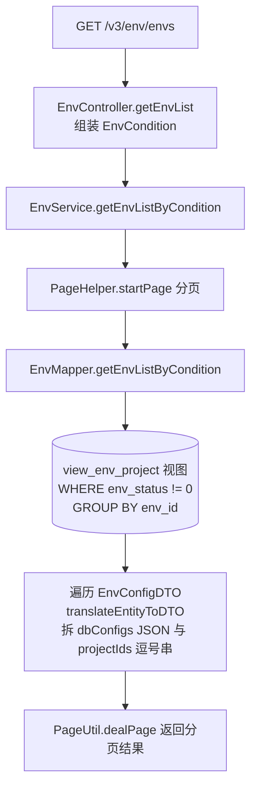

# EnvController

环境配置查询服务：为管理后台提供"环境列表"的分页条件查询，环境指一套 hosts/数据库配置的组合，可被多个项目引用。

类路径：`real-cfg/src/main/java/cn/testin/controller/EnvController.java`，基础路径 `/v3/env`。

## 本类接口一览

| 接口 | 方法 | 路径 | 功能 |
| --- | --- | --- | --- |
| getEnvList | GET | /v3/env/envs | 按项目/状态/名称分页查询环境列表 |

## getEnvList (`GET /v3/env/envs`)

- **实现意图**：管理后台"环境管理"页的列表数据源。环境（env）是一套 hosts 配置 + 数据库配置的集合，底层查询的是视图 `view_env_project`（环境与环境-项目关联的聚合视图），通过 `GROUP BY env_id` 把每个环境关联到的项目 id/名称用 `group_concat` 拼成逗号串，Service 层再拆成结构化的 `useProjects` 列表返回给前端。设计上把"环境"与"使用它的项目"一次查全，避免前端二次查询。

- **请求参数**：

| 参数名 | 类型 | 必填 | 说明 |
| --- | --- | --- | --- |
| project_id | Integer | 否 | 项目 id，精确匹配 `env_projectid` |
| status | Integer | 否 | 环境状态，精确匹配 `env_status` |
| env_name | String | 否 | 环境名称，模糊 LIKE 匹配 |
| page | Integer | 否（默认 1） | 页码 |
| page_size | Integer | 否（默认 20） | 每页条数 |

- **响应结构**：`ResponseResult<PageInfoList<EnvResponseDTO>>`，结构 `{code, msg, data}`，`data` 为分页包装对象。

| 字段 | 类型 | 说明 |
| --- | --- | --- |
| code | Integer | 返回码，0 成功 |
| msg | String | 提示信息 |
| data | Object | 分页包装 PageInfoList |
| data.totalRow | Long | 总条数 |
| data.totalPage | Integer | 总页数 |
| data.pageSize | Integer | 每页条数 |
| data.page | Integer | 当前页码 |
| data.list | Array\<Object\> | 环境列表，元素为 EnvResponseDTO： |
| data.list[].id | Integer | 环境 id |
| data.list[].envName | String | 环境名称 |
| data.list[].hosts | String | hosts 配置原文 |
| data.list[].dbConfigs | Array\<Object\> | 数据库配置列表，由 JSON Map 反序列化，元素字段： |
| data.list[].dbConfigs[].dbConfigId | Integer | 数据库配置 id |
| data.list[].dbConfigs[].dbConfigName | String | 数据库配置名 |
| data.list[].useProjects | Array\<Object\> | 引用该环境的项目，元素字段： |
| data.list[].useProjects[].projectId | Integer | 项目 id |
| data.list[].useProjects[].projectName | String | 项目名称 |

- **处理流程**：



- **调用链**：`EnvController` → `EnvService` → `EnvMapper`（MyBatis）。无跨模块/外部服务调用。

- **涉及表与 SQL**：

| 表/视图 | 操作 | Mapper 方法 |
| --- | --- | --- |
| view_env_project | select | EnvMapper.getEnvListByCondition |

- **异常与校验**：无显式校验逻辑，所有查询参数均可为空；分页参数由 `@RequestParam defaultValue` 兜底。SQL 恒定带 `env_status != 0`，即过滤掉已删除/无效环境。

- **关键代码摘录**：

```java
// real-cfg/src/main/java/cn/testin/business/service/EnvService.java
PageHelper.startPage(page, pageSize);
List<EnvConfigDTO> envConfigs = envMapper.getEnvListByCondition(envCondition);
PageInfo<EnvConfigDTO> pageInfo = new PageInfo<>(envConfigs);
List<EnvResponseDTO> envResponseList = new ArrayList<>();
for (EnvConfigDTO entity : envConfigs) {
    envResponseList.add(EnvResponseDTO.translateEntityToDTO(entity));
}
PageInfo<EnvResponseDTO> result = PageUtil.copyPageInfo(pageInfo);
result.setList(envResponseList);
return PageUtil.dealPage(result);
```
