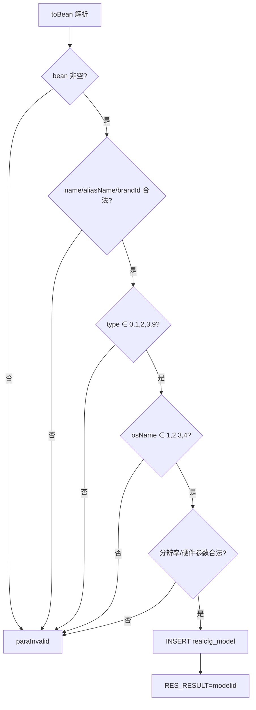
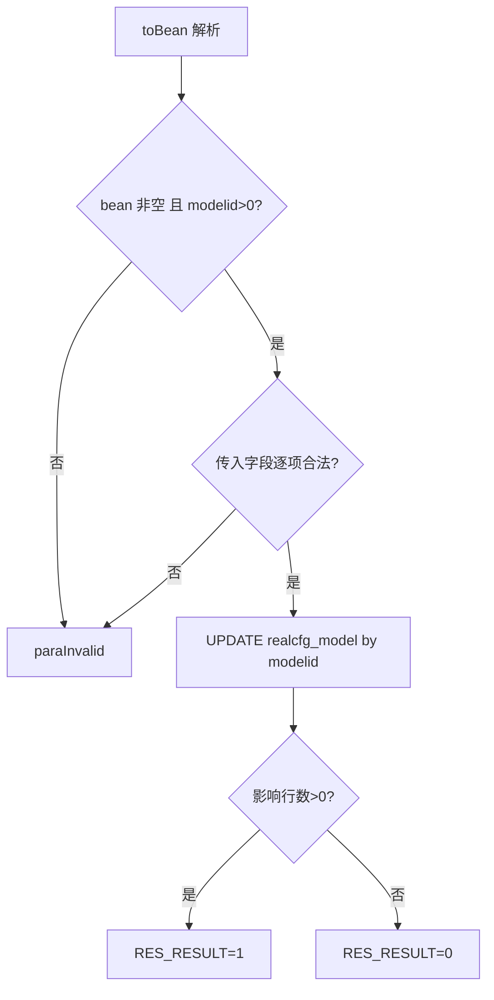
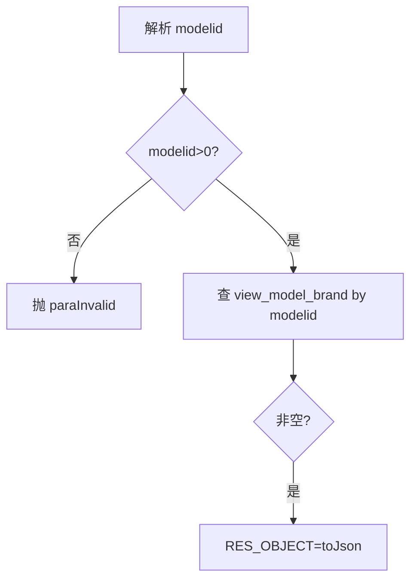
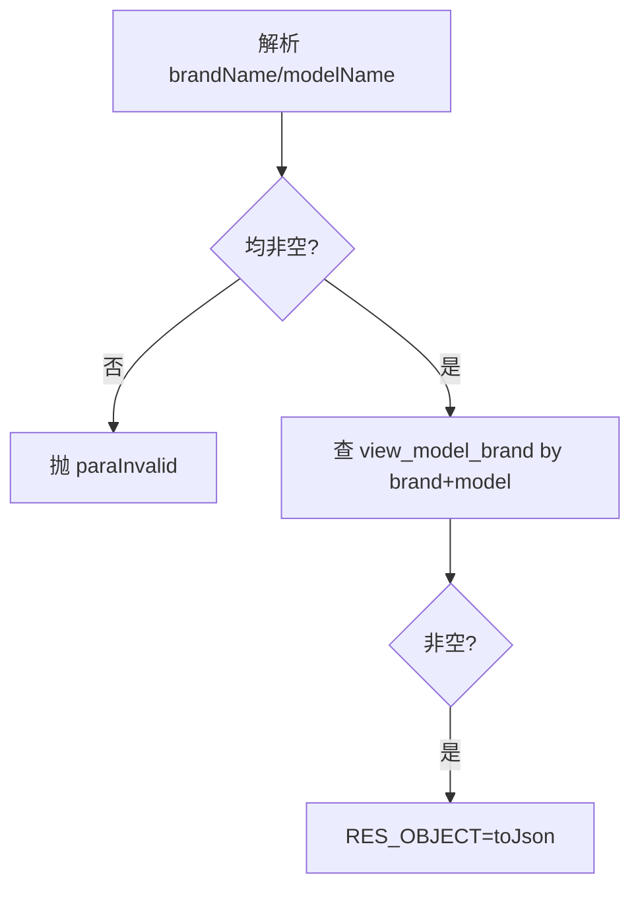
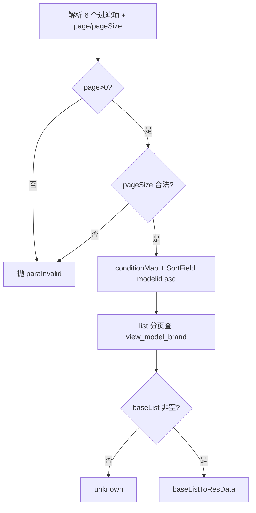

# Model

机型库服务：平台标准机型档案（品牌、分辨率、CPU/内存、NFC/蓝牙/指纹/OTG、上下架时间等）的维护，查询走 `view_model_brand` 机型-品牌联合视图。

源码：`real-cfg/src/main/java/cn/testin/service/cfg/Model.java`
业务实现：`cn.testin.business.impl.ModelServiceImpl`（`IRealcfgModelService`）

## op 一览

| op | 说明 |
| --- | --- |
| add | 新增机型 |
| maintain | 维护机型（按 modelid 部分更新） |
| get | 按 modelid 查询机型（含品牌） |
| getByDevice | 按品牌名+机型名查询 |
| list | 多条件分页查询机型列表 |

---

### add (`Model.add`)

- **入口**：ApiServlet，action=cfg，op=Model.add
- **实现意图**：新增标准机型。请求体经 `RealcfgModel.toBean(reqjson)` 解析后做一轮严格字段校验（名称/别名/品牌、机型类型、操作系统、分辨率与硬件参数非负），通过后 INSERT，返回自增 modelid。
- **请求参数**：RealcfgModel 结构，关键校验：

| 参数名 | 类型 | 必填 | 说明 |
| --- | --- | --- | --- |
| name | String | 是 | 机型名 |
| aliasName | String | 是 | 机型别名 |
| brandId | Integer | 是 | 品牌 id，>0 |
| type | Integer | 是 | 机型类型，合法值 0/1/2/3/9 |
| osName | Integer | 是 | 操作系统，合法值 1/2/3/4 |
| dpiWidth / dpiHeight | Integer | 是 | 分辨率，>0 |
| screenSize / cpuFreq / cpuNum | Number | 是 | ≥0 |
| ram / rom | Integer | 否 | 传入须 ≥0 |
| nfc / bluetooth / fingermark / otg | Integer | 否 | <0 非法（-1 表默认值） |
| onShelveTime / offShelveTime | Long | 否 | 上下架时间，≥0 |

- **响应结构**：统一返回 `{code, msg, data}` 报文，错误时无 `data` 节点。

| 字段 | 类型 | 说明 |
| --- | --- | --- |
| code | Integer | 返回码，0 成功 |
| msg | String | 提示信息 |
| data | Object | 数据对象 |
| data.result | Integer | 新机型 modelid（失败为 0） |
- **处理流程**：



- **调用链**：Model → ModelServiceImpl.add → IRealcfgModelDAO.add
- **涉及表与 SQL**：`realcfg_model`（INSERT）
- **异常与校验**：`CommonCode.paraInvalid`——上述全部字段校验（逐项返回具体字段名）。
- **关键代码摘录**：

```java
// real-cfg/src/main/java/cn/testin/service/cfg/Model.java
if (model.getType() == null
        || (!model.getType().equals(0) && !model.getType().equals(1)
        && !model.getType().equals(2) && !model.getType().equals(9) && !model.getType().equals(3))) {
    return ApiUtil.getResult(apirequest, CommonCode.paraInvalid.getValue(), msg);
}
Integer result = irealcfgmodelservice.add(model);
```

---

### maintain (`Model.maintain`)

- **入口**：ApiServlet，action=cfg，op=Model.maintain
- **实现意图**：按 modelid 部分更新机型字段。仅校验传入字段的合法性（数值参数传入时必须 >0 或 ≥0，与 add 的口径略有差异：maintain 中 screenSize/cpuFreq/cpuNum/ram/rom 传入须 >0），未传字段不更新。
- **请求参数**：RealcfgModel 结构；`modelid`（Integer，必填，>0）为定位键；`status`（Integer，≥0）可更新；其余同 add 的可选字段。
- **响应结构**：统一返回 `{code, msg, data}` 报文，错误时无 `data` 节点。

| 字段 | 类型 | 说明 |
| --- | --- | --- |
| code | Integer | 返回码，0 成功 |
| msg | String | 提示信息 |
| data | Object | 数据对象 |
| data.result | Integer | 1 成功 / 0 失败 |
- **处理流程**：



- **调用链**：Model → ModelServiceImpl.maintain → IRealcfgModelDAO.maintain
- **涉及表与 SQL**：`realcfg_model`（UPDATE by modelid）
- **异常与校验**：`CommonCode.paraInvalid`——modelid 缺失/≤0、各传入字段非法。
- **关键代码摘录**：

```java
// real-cfg/src/main/java/cn/testin/service/cfg/Model.java
if (model.getModelid() == null || model.getModelid() <= 0) {
    return ApiUtil.getResult(apirequest, CommonCode.paraInvalid.getValue(), msg);
}
Integer result = irealcfgmodelservice.maintain(model);
```

---

### get (`Model.get`)

- **入口**：ApiServlet，action=cfg，op=Model.get
- **实现意图**：按 modelid 查询机型详情，返回 `view_model_brand` 视图行（机型 + 品牌信息合并）。
- **请求参数**：

| 参数名 | 类型 | 必填 | 说明 |
| --- | --- | --- | --- |
| modelid | Integer | 是 | 机型 id，>0 |

- **响应结构**：统一返回 `{code, msg, data}` 报文，错误时无 `data` 节点。

| 字段 | 类型 | 说明 |
| --- | --- | --- |
| code | Integer | 返回码，0 成功 |
| msg | String | 提示信息 |
| data | Object | 数据对象 |
| data.objInfo | Object | RealcfgViewModelBrand 对象（无记录时无此节点） |
| data.objInfo.modelid | Integer | 机型 ID |
| data.objInfo.modelName | String | 机型名称 |
| data.objInfo.modelAlias | String | 机型别名 |
| data.objInfo.brandId | Integer | 品牌 ID |
| data.objInfo.brandName | String | 品牌名称 |
| data.objInfo.brandAbbr | String | 品牌别名 |
| data.objInfo.brandLogoUrl | String | 品牌 logo 地址 |
| data.objInfo.brandStatus | Integer | 品牌状态 |
| data.objInfo.brandSpelling | String | 品牌拼音 |
| data.objInfo.type | Integer | 机型分类（0 phone / 1 pad / 2 tv / 9 other） |
| data.objInfo.osName | Integer | 系统名称（1 android / 2 iOS） |
| data.objInfo.syspfName | String | 系统平台名称 |
| data.objInfo.dpiWidth | Integer | 分辨率宽度 |
| data.objInfo.dpiHeight | Integer | 分辨率高度 |
| data.objInfo.resolution | String | 分辨率 |
| data.objInfo.screenSize | Double | 屏幕大小 |
| data.objInfo.picUrl | String | 机型图片（小图） |
| data.objInfo.picUrlM | String | 机型图片（中图） |
| data.objInfo.picUrlB | String | 机型图片（大图） |
| data.objInfo.cpuFreq | Integer | CPU 最大频率 |
| data.objInfo.cpuNum | Integer | CPU 数量 |
| data.objInfo.cpuModel | String | CPU 型号 |
| data.objInfo.cpuBrand | String | CPU 芯片品牌 |
| data.objInfo.cpuProcessor | String | CPU 架构 |
| data.objInfo.gpuVendor | String | GPU 厂商 |
| data.objInfo.gpuRenderer | String | GPU 渲染器 |
| data.objInfo.gpuVersion | String | GPU 版本 |
| data.objInfo.ram | Long | 内存 |
| data.objInfo.rom | Long | 存储 |
| data.objInfo.nfc | Integer | NFC 支持（0 否 / 1 是） |
| data.objInfo.bluetooth | Integer | 蓝牙支持（0 否 / 1 是） |
| data.objInfo.bluetoothVersion | String | 蓝牙版本 |
| data.objInfo.onShelveTime | Long | 上架时间（毫秒时间戳） |
| data.objInfo.offShelveTime | Long | 下架时间（毫秒时间戳） |
| data.objInfo.fingermark | Integer | 指纹识别（0 否 / 1 是） |
| data.objInfo.otg | Integer | OTG 支持（0 否 / 1 是） |
| data.objInfo.weight | Integer | 权重 |
| data.objInfo.logicalResolution | String | 逻辑分辨率 |
| data.objInfo.status | Integer | 状态 |
| data.objInfo.createtime | Long | 创建时间（毫秒时间戳） |
| data.objInfo.updatetime | Long | 更新时间（毫秒时间戳） |
- **处理流程**：



- **调用链**：Model → ModelServiceImpl.get(modelid) → IRealcfgModelDAO.get
- **涉及表与 SQL**：`view_model_brand`（SELECT by modelid）
- **异常与校验**：`CommonCode.paraInvalid`——modelid 缺失/≤0（抛 GeneralException）。
- **关键代码摘录**：

```java
// real-cfg/src/main/java/cn/testin/service/cfg/Model.java
RealcfgViewModelBrand realcfgModel = irealcfgmodelservice.get(modelid);
if (realcfgModel != null) {
    datamap.put(ApiResponse.RES_OBJECT, realcfgModel.toJson());
}
```

---

### getByDevice (`Model.getByDevice`)

- **入口**：ApiServlet，action=cfg，op=Model.getByDevice
- **实现意图**：按品牌名 + 机型名查询机型，供上位机/设备侧用上报的品牌与机型字符串反查平台标准机型。
- **请求参数**：

| 参数名 | 类型 | 必填 | 说明 |
| --- | --- | --- | --- |
| brandName | String | 是 | 品牌名 |
| modelName | String | 是 | 机型名 |

- **响应结构**：统一返回 `{code, msg, data}` 报文，错误时无 `data` 节点。

| 字段 | 类型 | 说明 |
| --- | --- | --- |
| code | Integer | 返回码，0 成功 |
| msg | String | 提示信息 |
| data | Object | 数据对象 |
| data.objInfo | Object | RealcfgViewModelBrand 对象（无记录时无此节点） |
| data.objInfo.modelid | Integer | 机型 ID |
| data.objInfo.modelName | String | 机型名称 |
| data.objInfo.modelAlias | String | 机型别名 |
| data.objInfo.brandId | Integer | 品牌 ID |
| data.objInfo.brandName | String | 品牌名称 |
| data.objInfo.brandAbbr | String | 品牌别名 |
| data.objInfo.brandLogoUrl | String | 品牌 logo 地址 |
| data.objInfo.brandStatus | Integer | 品牌状态 |
| data.objInfo.brandSpelling | String | 品牌拼音 |
| data.objInfo.type | Integer | 机型分类（0 phone / 1 pad / 2 tv / 9 other） |
| data.objInfo.osName | Integer | 系统名称（1 android / 2 iOS） |
| data.objInfo.syspfName | String | 系统平台名称 |
| data.objInfo.dpiWidth | Integer | 分辨率宽度 |
| data.objInfo.dpiHeight | Integer | 分辨率高度 |
| data.objInfo.resolution | String | 分辨率 |
| data.objInfo.screenSize | Double | 屏幕大小 |
| data.objInfo.picUrl | String | 机型图片（小图） |
| data.objInfo.picUrlM | String | 机型图片（中图） |
| data.objInfo.picUrlB | String | 机型图片（大图） |
| data.objInfo.cpuFreq | Integer | CPU 最大频率 |
| data.objInfo.cpuNum | Integer | CPU 数量 |
| data.objInfo.cpuModel | String | CPU 型号 |
| data.objInfo.cpuBrand | String | CPU 芯片品牌 |
| data.objInfo.cpuProcessor | String | CPU 架构 |
| data.objInfo.gpuVendor | String | GPU 厂商 |
| data.objInfo.gpuRenderer | String | GPU 渲染器 |
| data.objInfo.gpuVersion | String | GPU 版本 |
| data.objInfo.ram | Long | 内存 |
| data.objInfo.rom | Long | 存储 |
| data.objInfo.nfc | Integer | NFC 支持（0 否 / 1 是） |
| data.objInfo.bluetooth | Integer | 蓝牙支持（0 否 / 1 是） |
| data.objInfo.bluetoothVersion | String | 蓝牙版本 |
| data.objInfo.onShelveTime | Long | 上架时间（毫秒时间戳） |
| data.objInfo.offShelveTime | Long | 下架时间（毫秒时间戳） |
| data.objInfo.fingermark | Integer | 指纹识别（0 否 / 1 是） |
| data.objInfo.otg | Integer | OTG 支持（0 否 / 1 是） |
| data.objInfo.weight | Integer | 权重 |
| data.objInfo.logicalResolution | String | 逻辑分辨率 |
| data.objInfo.status | Integer | 状态 |
| data.objInfo.createtime | Long | 创建时间（毫秒时间戳） |
| data.objInfo.updatetime | Long | 更新时间（毫秒时间戳） |
- **处理流程**：



- **调用链**：Model → ModelServiceImpl.get(brandName, modelName) → IRealcfgModelDAO.get
- **涉及表与 SQL**：`view_model_brand`（SELECT by brandName+modelName）
- **异常与校验**：`CommonCode.paraInvalid`——brandName/modelName 空白（抛 GeneralException）。
- **关键代码摘录**：

```java
// real-cfg/src/main/java/cn/testin/service/cfg/Model.java
RealcfgViewModelBrand realcfgModel = irealcfgmodelservice.get(brandName, modelName);
```

---

### list (`Model.list`)

- **入口**：ApiServlet，action=cfg，op=Model.list
- **实现意图**：机型多条件分页查询，固定按 modelid 升序，返回 `view_model_brand` 视图行。page、pageSize 必填。
- **请求参数**：

| 参数名 | 类型 | 必填 | 说明 |
| --- | --- | --- | --- |
| brandName | String | 否 | 品牌名 |
| brandAbbr | String | 否 | 品牌缩写 |
| modelName | String | 否 | 机型名 |
| modelAlias | String | 否 | 机型别名 |
| syspfName | String | 否 | 系统平台名 |
| resolution | String | 否 | 分辨率 |
| page | Integer | 是 | 页码，>0 |
| pageSize | Integer | 是 | 每页条数，0 < size < Config.MaxSize |

- **响应结构**：统一返回 `{code, msg, data}` 报文，错误时无 `data` 节点。

| 字段 | 类型 | 说明 |
| --- | --- | --- |
| code | Integer | 返回码，0 成功 |
| msg | String | 提示信息 |
| data | Object | 数据对象 |
| data.list | Array\<Object\> | 当前页机型数组（RealcfgViewModelBrand），元素字段： |
| data.list[].modelid | Integer | 机型 ID |
| data.list[].modelName | String | 机型名称 |
| data.list[].modelAlias | String | 机型别名 |
| data.list[].brandId | Integer | 品牌 ID |
| data.list[].brandName | String | 品牌名称 |
| data.list[].brandAbbr | String | 品牌别名 |
| data.list[].brandLogoUrl | String | 品牌 logo 地址 |
| data.list[].brandStatus | Integer | 品牌状态 |
| data.list[].brandSpelling | String | 品牌拼音 |
| data.list[].type | Integer | 机型分类（0 phone / 1 pad / 2 tv / 9 other） |
| data.list[].osName | Integer | 系统名称（1 android / 2 iOS） |
| data.list[].syspfName | String | 系统平台名称 |
| data.list[].dpiWidth | Integer | 分辨率宽度 |
| data.list[].dpiHeight | Integer | 分辨率高度 |
| data.list[].resolution | String | 分辨率 |
| data.list[].screenSize | Double | 屏幕大小 |
| data.list[].picUrl | String | 机型图片（小图） |
| data.list[].picUrlM | String | 机型图片（中图） |
| data.list[].picUrlB | String | 机型图片（大图） |
| data.list[].cpuFreq | Integer | CPU 最大频率 |
| data.list[].cpuNum | Integer | CPU 数量 |
| data.list[].cpuModel | String | CPU 型号 |
| data.list[].cpuBrand | String | CPU 芯片品牌 |
| data.list[].cpuProcessor | String | CPU 架构 |
| data.list[].gpuVendor | String | GPU 厂商 |
| data.list[].gpuRenderer | String | GPU 渲染器 |
| data.list[].gpuVersion | String | GPU 版本 |
| data.list[].ram | Long | 内存 |
| data.list[].rom | Long | 存储 |
| data.list[].nfc | Integer | NFC 支持（0 否 / 1 是） |
| data.list[].bluetooth | Integer | 蓝牙支持（0 否 / 1 是） |
| data.list[].bluetoothVersion | String | 蓝牙版本 |
| data.list[].onShelveTime | Long | 上架时间（毫秒时间戳） |
| data.list[].offShelveTime | Long | 下架时间（毫秒时间戳） |
| data.list[].fingermark | Integer | 指纹识别（0 否 / 1 是） |
| data.list[].otg | Integer | OTG 支持（0 否 / 1 是） |
| data.list[].weight | Integer | 权重 |
| data.list[].logicalResolution | String | 逻辑分辨率 |
| data.list[].status | Integer | 状态 |
| data.list[].createtime | Long | 创建时间（毫秒时间戳） |
| data.list[].updatetime | Long | 更新时间（毫秒时间戳） |
| data.page | Integer | 当前页码 |
| data.pageSize | Integer | 每页条数 |
| data.totalRow | Long | 总条数 |
| data.totalPage | Integer | 总页数 |
- **处理流程**：



- **调用链**：Model → ModelServiceImpl.list(conditionMap, fields, page, pageSize) → IRealcfgModelDAO.list
- **涉及表与 SQL**：`view_model_brand`（SELECT 分页，ORDER BY modelid ASC）
- **异常与校验**：`CommonCode.paraInvalid`——page/pageSize 非法（抛 GeneralException）；结果空返回 `CommonCode.unknown`。
- **关键代码摘录**：

```java
// real-cfg/src/main/java/cn/testin/service/cfg/Model.java
SortField sortField = new SortField();
sortField.setFieldName("modelid");
sortField.setDesc(false);
BaseList<RealcfgViewModelBrand> baseList =
        this.irealcfgmodelservice.list(conditionMap, new SortField[]{sortField}, page, pageSize);
```
