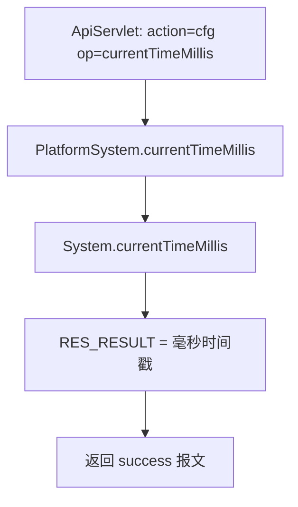

# PlatformSystem

平台系统信息查询服务：提供服务器当前系统时间戳，用于客户端/前台校时。

## op 一览

| op | 功能 |
| --- | --- |
| currentTimeMillis | 获取服务器当前系统毫秒时间戳 |

### currentTimeMillis (`PlatformSystem.currentTimeMillis`)

- **入口**：ApiServlet，action=cfg，op=PlatformSystem.currentTimeMillis
- **实现意图**：返回 平台配置 服务器的当前系统时间（毫秒），前端可用它与本地时间比对做时钟校准或请求签名时间戳。无任何参数、不访问数据库、无业务层调用。
- **请求参数**：无
- **响应结构**：统一返回 `{code, msg, data}` 报文，错误时无 `data` 节点。

| 字段 | 类型 | 说明 |
| --- | --- | --- |
| code | Integer | 返回码，0 成功 |
| msg | String | 提示信息 |
| data | Object | 数据对象 |
| data.result | Long | `System.currentTimeMillis()` 毫秒时间戳 |
- **处理流程**：



- **调用链**：cn.testin.service.cfg.PlatformSystem（无业务层、无 DAO、无外部依赖）
- **涉及表与 SQL**：无
- **异常与校验**：无参数校验；方法不抛受检异常
- **关键代码摘录**：

```java
// real-cfg/src/main/java/cn/testin/service/cfg/PlatformSystem.java
public String currentTimeMillis(ApiRequest apirequest) {
    JSONObject jObj = ApiUtil.getJSONobj(apirequest,
            CommonCode.success.getValue(), CommonCode.success.getDescr());
    Map<String, Object> datamap = new HashMap<>(16);
    datamap.put(ApiResponse.RES_RESULT, java.lang.System.currentTimeMillis());
    jObj.put(ApiResponse.RES_DATA, datamap);
    return jObj.toString();
}
```
