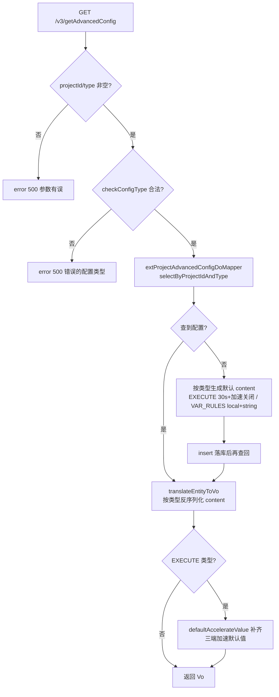
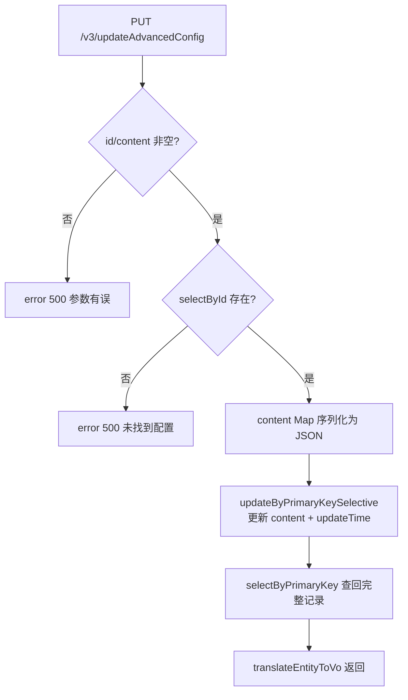
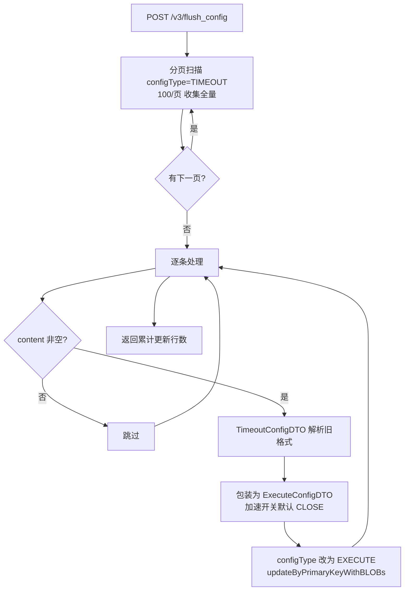

# ProjectAdvancedConfigController

项目高级配置服务：以 (projectId, configType) 为维度存储项目的 JSON 格式高级配置，当前支持两类——`EXECUTE`（执行超时与全局控制加速开关）和 `VAR_RULES`（变量规则），供脚本执行引擎读取。

类路径：`real-cfg/src/main/java/cn/testin/controller/ProjectAdvancedConfigController.java`，基础路径 `/v3/realcfg/project`。

## 本类接口一览

| 接口 | 方法 | 路径 | 功能 |
| --- | --- | --- | --- |
| get | GET | /v3/realcfg/project/getAdvancedConfig | 查询项目高级配置（不存在则建默认配置） |
| update | PUT | /v3/realcfg/project/updateAdvancedConfig | 更新项目高级配置内容 |
| flushConfig | POST | /v3/realcfg/project/flush_config | 数据迁移：TIMEOUT 旧配置升级为 EXECUTE 新格式 |

## get (`GET /v3/realcfg/project/getAdvancedConfig`)

- **实现意图**：读取某项目某类型的配置。采用"读不到就建默认值再读"的自愈式设计：首次访问某项目的 EXECUTE/VAR_RULES 配置时，自动生成默认配置（EXECUTE 默认超时 30s、三端 app/web/pc 全局控制加速均关闭；VAR_RULES 默认 web/pc 均为 local 字符串变量）落库后返回，前端永远拿到完整结构，不用处理"未配置"分支。返回时 EXECUTE 配置还会补齐三个平台（Android/Harmony/iOS）加速开关的默认值。

- **请求参数**：

| 参数名 | 类型 | 必填 | 说明 |
| --- | --- | --- | --- |
| project_id | Integer | 是 | 项目 id |
| type | String | 是 | 配置类型：EXECUTE / VAR_RULES（枚举 ProjectAdvancedConfigType） |

- **响应结构**：`ResponseResult<ProjectAdvancedConfigVo>`，统一返回 `{code, msg, data}` 报文。

| 字段 | 类型 | 说明 |
| --- | --- | --- |
| code | Integer | 返回码，0 成功 |
| msg | String | 提示信息 |
| data | Object | 数据对象（ProjectAdvancedConfigVo） |
| data.id | Integer | 配置记录 ID |
| data.projectId | Integer | 项目 ID |
| data.configType | String | 配置类型（EXECUTE / VAR_RULES） |
| data.content | Object | 配置内容，按 configType 区分结构（见下） |
| data.content.app | Object | EXECUTE：app 端配置（ConfigDetail） |
| data.content.pc | Object | EXECUTE：pc 端配置（ConfigDetail）；VAR_RULES：pc 端变量规则（VarRulesDTO） |
| data.content.web | Object | EXECUTE：web 端配置（ConfigDetail）；VAR_RULES：web 端变量规则（VarRulesDTO） |
| data.content.app.timeout | Integer | EXECUTE app 端超时时间（毫秒） |
| data.content.app.androidGlobalControlAccelerated | Integer | EXECUTE app 端 Android 全局控制加速开关 |
| data.content.app.harmonyGlobalControlAccelerated | Integer | EXECUTE app 端鸿蒙全局控制加速开关 |
| data.content.app.iOSGlobalControlAccelerated | Integer | EXECUTE app 端 iOS 全局控制加速开关 |
| data.content.pc.timeout | Integer | EXECUTE pc 端超时时间（毫秒） |
| data.content.pc.androidGlobalControlAccelerated | Integer | EXECUTE pc 端 Android 全局控制加速开关 |
| data.content.pc.harmonyGlobalControlAccelerated | Integer | EXECUTE pc 端鸿蒙全局控制加速开关 |
| data.content.pc.iOSGlobalControlAccelerated | Integer | EXECUTE pc 端 iOS 全局控制加速开关 |
| data.content.web.timeout | Integer | EXECUTE web 端超时时间（毫秒） |
| data.content.web.androidGlobalControlAccelerated | Integer | EXECUTE web 端 Android 全局控制加速开关 |
| data.content.web.harmonyGlobalControlAccelerated | Integer | EXECUTE web 端鸿蒙全局控制加速开关 |
| data.content.web.iOSGlobalControlAccelerated | Integer | EXECUTE web 端 iOS 全局控制加速开关 |
| data.content.pc.varScope | String | VAR_RULES pc 端变量作用域 |
| data.content.pc.varType | String | VAR_RULES pc 端变量类型 |
| data.content.pc.varName | String | VAR_RULES pc 端变量名 |
| data.content.pc.subType | String | VAR_RULES pc 端子类型 |
| data.content.web.varScope | String | VAR_RULES web 端变量作用域 |
| data.content.web.varType | String | VAR_RULES web 端变量类型 |
| data.content.web.varName | String | VAR_RULES web 端变量名 |
| data.content.web.subType | String | VAR_RULES web 端子类型 |

- **处理流程**：



- **调用链**：`ProjectAdvancedConfigController` → `ProjectAdvancedConfigService.getConfigByProjectIdAndType` → `ExtProjectAdvancedConfigDoMapper.selectByProjectIdAndType` / `ProjectAdvancedConfigDoMapper.insert`。无外部服务调用。

- **涉及表与 SQL**：

| 表 | 操作 | Mapper 方法 |
| --- | --- | --- |
| realcfg_project_advanced_config | select | selectByProjectIdAndType |
| realcfg_project_advanced_config | insert | insert |

- **异常与校验**：projectId/type 为空返回 error(500, "参数有误！")；type 不在枚举内返回 error(500, "错误的配置类型！")。注意此处用 500 业务码而非标准参数错误码。

- **关键代码摘录**：

```java
// real-cfg/src/main/java/cn/testin/business/service/ProjectAdvancedConfigService.java
List<ProjectAdvancedConfigDo> dos = extProjectAdvancedConfigDoMapper.selectByProjectIdAndType(projectId, type);
if (!CollectionUtils.isEmpty(dos)) {
    return translateEntityToVo(dos.get(0));
}
// 如果未找到，生成默认配置
ProjectAdvancedConfigDo config = new ProjectAdvancedConfigDo();
config.setProjectId(projectId);
config.setConfigType(type);
switch (ProjectAdvancedConfigType.getType(type)) {
    case EXECUTE:   config.setContent(createExecDefault());  break;
    case VAR_RULES: config.setContent(createRulesDefault()); break;
}
projectAdvancedConfigDoMapper.insert(config);
```

## update (`PUT /v3/realcfg/project/updateAdvancedConfig`)

- **实现意图**：更新已存在配置的 content。DTO 的 content 是 Map（前端传任意 JSON 结构），Service 序列化为 JSON 字符串按主键选择性更新（只更新 content/updateTime），然后重新查出完整记录返回，保证前端拿到的是落库后的真实状态。

- **请求参数**：Body `ProjectAdvancedConfigDTO`：

| 参数名 | 类型 | 必填 | 说明 |
| --- | --- | --- | --- |
| id | Integer | 是 | 配置记录 id |
| projectId | Integer | 否 | 项目 id（更新时未使用） |
| configType | String | 否 | 配置类型（更新时未使用） |
| content | Map\<String, Object\> | 是 | 配置内容 JSON |

- **响应结构**：`ResponseResult<ProjectAdvancedConfigVo>`，统一返回 `{code, msg, data}` 报文，字段同 get（data 为更新后的完整 ProjectAdvancedConfigVo）。

| 字段 | 类型 | 说明 |
| --- | --- | --- |
| code | Integer | 返回码，0 成功 |
| msg | String | 提示信息 |
| data | Object | 数据对象（ProjectAdvancedConfigVo） |
| data.id | Integer | 配置记录 ID |
| data.projectId | Integer | 项目 ID |
| data.configType | String | 配置类型（EXECUTE / VAR_RULES） |
| data.content | Object | 配置内容，按 configType 区分结构（EXECUTE 见 ExecuteConfigDTO，VAR_RULES 见 VarRulesConfigDTO） |
| data.content.app | Object | EXECUTE：app 端配置（ConfigDetail） |
| data.content.pc | Object | EXECUTE：pc 端配置（ConfigDetail）；VAR_RULES：pc 端变量规则（VarRulesDTO） |
| data.content.web | Object | EXECUTE：web 端配置（ConfigDetail）；VAR_RULES：web 端变量规则（VarRulesDTO） |
| data.content.app.timeout | Integer | EXECUTE app 端超时时间（毫秒） |
| data.content.app.androidGlobalControlAccelerated | Integer | EXECUTE app 端 Android 全局控制加速开关 |
| data.content.app.harmonyGlobalControlAccelerated | Integer | EXECUTE app 端鸿蒙全局控制加速开关 |
| data.content.app.iOSGlobalControlAccelerated | Integer | EXECUTE app 端 iOS 全局控制加速开关 |
| data.content.pc.timeout | Integer | EXECUTE pc 端超时时间（毫秒） |
| data.content.pc.androidGlobalControlAccelerated | Integer | EXECUTE pc 端 Android 全局控制加速开关 |
| data.content.pc.harmonyGlobalControlAccelerated | Integer | EXECUTE pc 端鸿蒙全局控制加速开关 |
| data.content.pc.iOSGlobalControlAccelerated | Integer | EXECUTE pc 端 iOS 全局控制加速开关 |
| data.content.web.timeout | Integer | EXECUTE web 端超时时间（毫秒） |
| data.content.web.androidGlobalControlAccelerated | Integer | EXECUTE web 端 Android 全局控制加速开关 |
| data.content.web.harmonyGlobalControlAccelerated | Integer | EXECUTE web 端鸿蒙全局控制加速开关 |
| data.content.web.iOSGlobalControlAccelerated | Integer | EXECUTE web 端 iOS 全局控制加速开关 |
| data.content.pc.varScope | String | VAR_RULES pc 端变量作用域 |
| data.content.pc.varType | String | VAR_RULES pc 端变量类型 |
| data.content.pc.varName | String | VAR_RULES pc 端变量名 |
| data.content.pc.subType | String | VAR_RULES pc 端子类型 |
| data.content.web.varScope | String | VAR_RULES web 端变量作用域 |
| data.content.web.varType | String | VAR_RULES web 端变量类型 |
| data.content.web.varName | String | VAR_RULES web 端变量名 |
| data.content.web.subType | String | VAR_RULES web 端子类型 |

- **处理流程**：



- **调用链**：`ProjectAdvancedConfigController` → `ProjectAdvancedConfigService.updateConfig` / `selectById` → `ProjectAdvancedConfigDoMapper.updateByPrimaryKeySelective` / `selectByPrimaryKey`。

- **涉及表与 SQL**：

| 表 | 操作 | Mapper 方法 |
| --- | --- | --- |
| realcfg_project_advanced_config | select | selectByPrimaryKey |
| realcfg_project_advanced_config | update | updateByPrimaryKeySelective |

- **异常与校验**：Controller 层三道校验（id/content 空、记录不存在），均返回 error(500)。不做 content 结构合法性校验，结构由写入方保证。

- **关键代码摘录**：

```java
// real-cfg/src/main/java/cn/testin/business/service/ProjectAdvancedConfigService.java
ProjectAdvancedConfigDo projectAdvancedConfigDo = new ProjectAdvancedConfigDo();
projectAdvancedConfigDo.setId(dto.getId());
projectAdvancedConfigDo.setContent(JsonUtil.toJsonString(dto.getContent()));
projectAdvancedConfigDo.setUpdateTime(System.currentTimeMillis());
projectAdvancedConfigDoMapper.updateByPrimaryKeySelective(projectAdvancedConfigDo);
projectAdvancedConfigDo = projectAdvancedConfigDoMapper.selectByPrimaryKey(dto.getId());
return translateEntityToVo(projectAdvancedConfigDo);
```

## flushConfig (`POST /v3/realcfg/project/flush_config`)

- **实现意图**：一次性配置格式升级接口。旧版超时配置以 `TIMEOUT` 类型、纯数字 content（TimeoutConfigDTO：app/web/pc 三个毫秒数）存储；新版 `EXECUTE` 类型扩展了三端全局控制加速开关。本接口分页扫描全部 TIMEOUT 记录，把旧数字超时包装成 ConfigDetail（三端加速开关默认关闭），改写 config_type 为 EXECUTE 并整体更新 content。返回累计更新行数供迁移核对。

- **请求参数**：无。

- **响应结构**：`ResponseResult<Integer>`，统一返回 `{code, msg, data}` 报文。

| 字段 | 类型 | 说明 |
| --- | --- | --- |
| code | Integer | 返回码，0 成功 |
| msg | String | 提示信息 |
| data | Integer | 成功更新的配置条数 |

- **处理流程**：



- **调用链**：`ProjectAdvancedConfigController` → `ProjectAdvancedConfigService.flushAdvancedConfig` → `ProjectAdvancedConfigDoMapper.selectAllWithCondition` / `updateByPrimaryKeyWithBLOBs`。`@Transactional`（注意：整批在一个事务内，数据量极大时有长事务风险）。

- **涉及表与 SQL**：

| 表 | 操作 | Mapper 方法 |
| --- | --- | --- |
| realcfg_project_advanced_config | select（分页） | selectAllWithCondition |
| realcfg_project_advanced_config | update | updateByPrimaryKeyWithBLOBs |

- **异常与校验**：无参数；依赖枚举 `ProjectAdvancedConfigType.TIMEOUT / EXECUTE` 与 `GLobalControlAcceleratedEnum.CLOSE` 做格式转换，旧 content 非合法 JSON 时 `JsonUtil.parseObject` 抛异常导致整个事务回滚。

- **关键代码摘录**：

```java
// real-cfg/src/main/java/cn/testin/business/service/ProjectAdvancedConfigService.java
TimeoutConfigDTO timeoutConfig = JsonUtil.parseObject(content, TimeoutConfigDTO.class);
ExecuteConfigDTO executeConfigDTO = new ExecuteConfigDTO();
Integer type = GLobalControlAcceleratedEnum.CLOSE.getType();
executeConfigDTO.setApp(new ConfigDetail(timeoutConfig.getApp(), type, type, type));
executeConfigDTO.setWeb(new ConfigDetail(timeoutConfig.getWeb(), type, type, type));
executeConfigDTO.setPc(new ConfigDetail(timeoutConfig.getPc(), type, type, type));
configDo.setConfigType(ProjectAdvancedConfigType.EXECUTE.name());
configDo.setContent(JsonUtil.toJsonString(executeConfigDTO));
result += projectAdvancedConfigDoMapper.updateByPrimaryKeyWithBLOBs(configDo);
```
