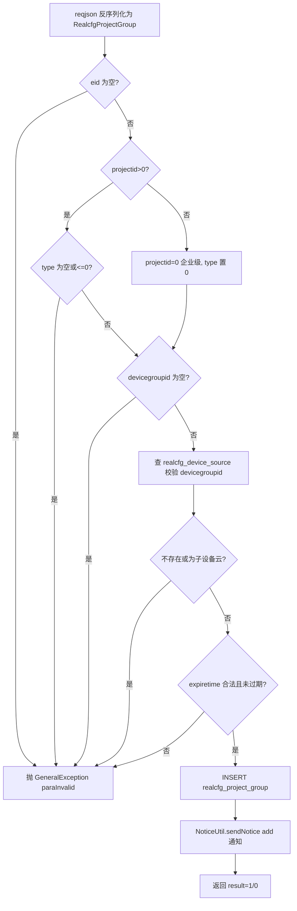
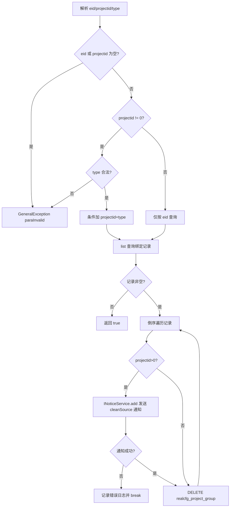
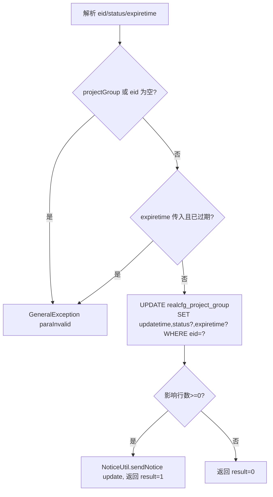
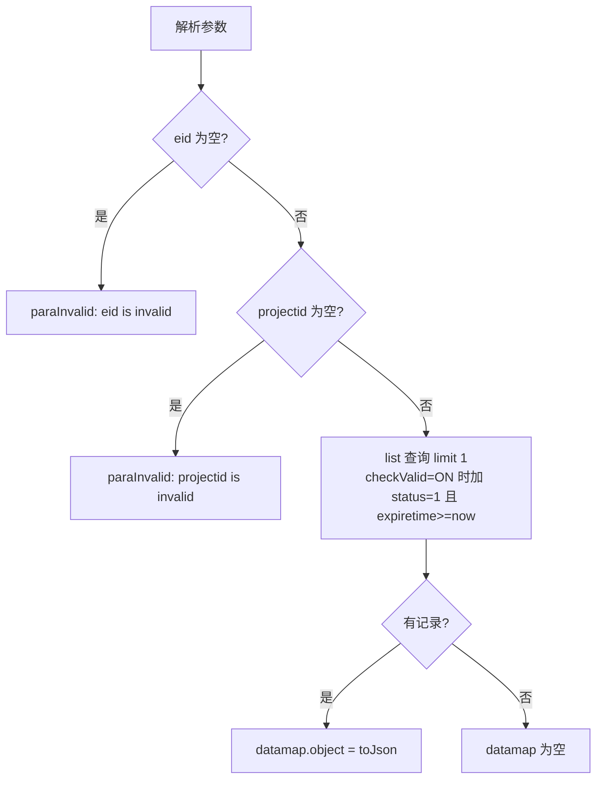
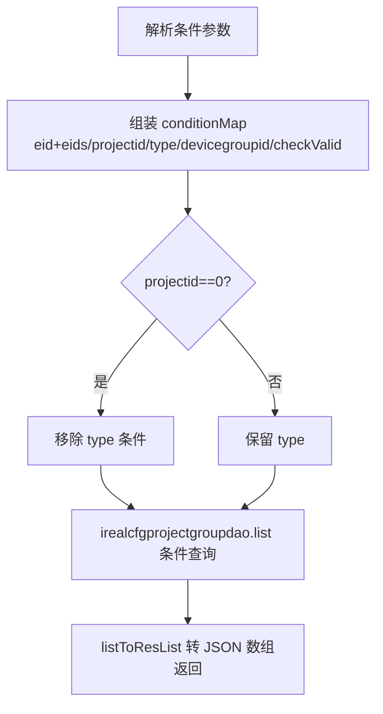
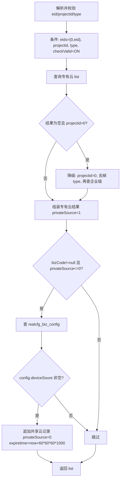
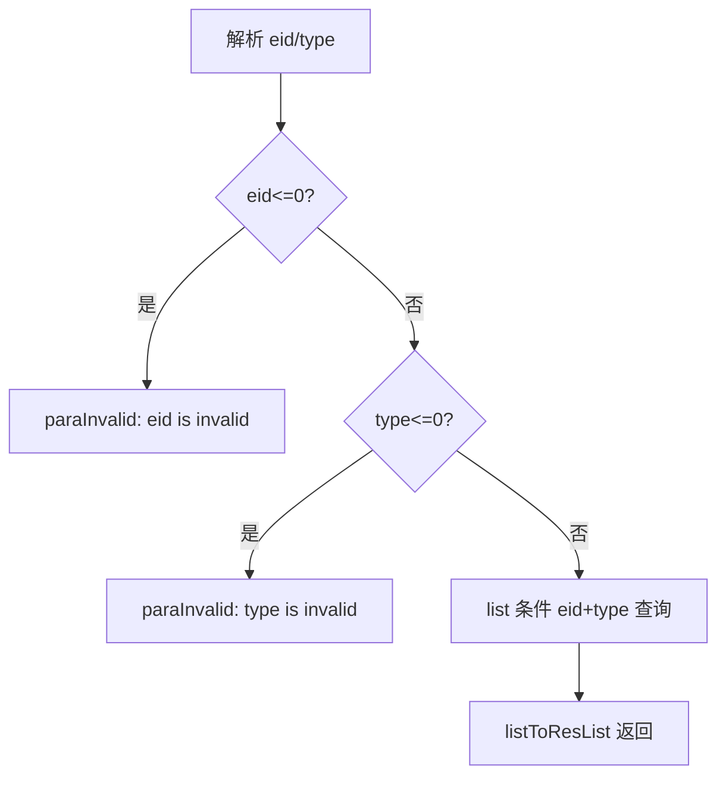

# ProjectGroup

企业/项目组的设备云配置管理服务：维护企业（及项目组）与设备云（devicegroupid）的绑定关系、状态与过期时间，供后台及其他模块查询某企业/项目可用的专有云与共享云设备资源。

- 源码：`real-cfg/src/main/java/cn/testin/service/cfg/ProjectGroup.java`
- 业务实现：`real-cfg/src/main/java/cn/testin/business/impl/ProjectGroupServiceImpl.java`
- DAO：`real-cfg/src/main/java/cn/testin/dao/impl/realcfg/RealcfgProjectGroupDAOImpl.java`
- pojo：`cn.testin.pojo.realcfg.RealcfgProjectGroup`（表 `realcfg_project_group`）

## op 一览

| op | 说明 |
|---|---|
| add | 新增企业/项目设备云绑定 |
| remove | 移除设备云配置（含子云清理通知） |
| maintain | 维护项目云状态、过期时间 |
| get | 查询单条企业项目云信息 |
| list | 按条件查询设备云配置列表 |
| my | 查询企业/项目可用设备云（专有云+共享云） |
| listByType | 按类型（app/web/pc）查询企业云信息 |

---

### add (`ProjectGroup.add`)

- **入口**：ApiServlet，action=cfg，op=ProjectGroup.add
- **实现意图**：新增企业项目云信息，把企业（或项目组）绑定到某个设备云（devicegroupid）。整个请求体直接用 gson 反序列化为 `RealcfgProjectGroup`，业务层做完整性强校验：projectid>0 时 type 必填（1 app / 2 web），projectid=0 表示企业级（type 强制置 0）；devicegroupid 必须存在于 `realcfg_device_source` 且不能是子设备云（parentName 为空）；expiretime 必须是将来的时间。插入时 status 固定为 STATUS_ON。
- **请求参数**：

| 参数名 | 类型 | 必填 | 说明 |
|---|---|---|---|
| eid | int | 是 | 企业 ID |
| projectid | int | 是 | 项目组 ID，0 表示企业级 |
| type | int | projectid>0 时必填 | 分组分类：1 app；2 web |
| devicegroupid | string | 是 | 设备云 ID（须为 `realcfg_device_source` 中的非子设备云） |
| expiretime | long | 是 | 过期时间（毫秒），必须大于当前时间 |

- **响应结构**：统一返回 `{code, msg, data}` 报文，错误时无 `data` 节点。

| 字段 | 类型 | 说明 |
| --- | --- | --- |
| code | Integer | 返回码，0 成功 |
| msg | String | 提示信息 |
| data | Object | 数据对象 |
| data.result | Integer | 1 成功 / 0 失败 |
- **处理流程**：



- **调用链**：ProjectGroup → IProjectGroupService（ProjectGroupServiceImpl）→ IRealcfgProjectGroupDAO（RealcfgProjectGroupDAOImpl）、IRealcfgDeviceSourceDAO（校验设备云）→ NoticeUtil（MQ 通知，见 notice-manager）
- **涉及表与 SQL**：
  - `realcfg_project_group`：INSERT（eid, projectid, type, devicegroupid, status, createtime, updatetime, expiretime），mapper/DAO 方法 `RealcfgProjectGroupDAOImpl.add`
  - `realcfg_device_source`：SELECT 校验 devicegroupid，`irealcfgdevicesourcedao.get`
- **异常与校验**：业务层以 `GeneralException(CommonCode.paraInvalid)` 抛出各类校验失败（eid 空、type 非法、devicegroupid 空/非法、expiretime 过期）。
- **关键代码摘录**：

```java
// real-cfg/src/main/java/cn/testin/business/impl/ProjectGroupServiceImpl.java
// 检测devicegroupid 有效性，设备云非子设备云信息。
RealcfgDeviceSource deviceSource = this.irealcfgdevicesourcedao.get(projectGroup.getDevicegroupid());
if (deviceSource == null || StringUtils.isNotBlank(deviceSource.getParentName())) {
    String msg = CommonCode.paraInvalid.getDescr() + "(devicegroupid is invalid! )";
    throw new GeneralException(CommonCode.paraInvalid.getValue(), msg);
}
if (projectGroup.getExpiretime() == null || projectGroup.getExpiretime() < System.currentTimeMillis()) {
    String msg = CommonCode.paraInvalid.getDescr() + "(expiretime is invalid! )";
    throw new GeneralException(CommonCode.paraInvalid.getValue(), msg);
}
return this.irealcfgprojectgroupdao.add(projectGroup) > 0;
```

---

### remove (`ProjectGroup.remove`)

- **入口**：ApiServlet，action=cfg，op=ProjectGroup.remove
- **实现意图**：移除设备云配置。按 eid+projectid(+type) 查出所有绑定记录，逐条删除；对 projectid>0 的项目级记录，删除前通过 MQ 通知服务（INoticeService）发送 `cleanSource` 类型通知，让各节点清理对应子云资源。通知发送失败会中断循环（break）。
- **请求参数**：

| 参数名 | 类型 | 必填 | 说明 |
|---|---|---|---|
| eid | int | 是 | 企业 ID |
| projectid | int | 是 | 项目组 ID，0 表示删除企业级绑定 |
| type | int | projectid≠0 时必填 | 分组分类：1 app；2 web |

- **响应结构**：统一返回 `{code, msg, data}` 报文，错误时无 `data` 节点。

| 字段 | 类型 | 说明 |
| --- | --- | --- |
| code | Integer | 返回码，0 成功 |
| msg | String | 提示信息 |
| data | Object | 数据对象 |
| data.result | Integer | 1 成功 / 0 失败（业务层正常走完即返回 true） |
- **处理流程**：



- **调用链**：ProjectGroup → IProjectGroupService → IRealcfgProjectGroupDAO（list/delete）→ INoticeService（`SpringHelper.getBean("INoticeService")`，MQ 通知，notice-manager）→ NoticeUtil
- **涉及表与 SQL**：
  - `realcfg_project_group`：SELECT（条件 eid/projectid/type）`RealcfgProjectGroupDAOImpl.list`；DELETE `WHERE eid=? and projectid=? and devicegroupid=?`（`RealcfgProjectGroupDAOImpl.delete`）
- **异常与校验**：eid/projectid 为空、projectid≠0 而 type 非法时抛 `GeneralException(paraInvalid)`。
- **关键代码摘录**：

```java
// real-cfg/src/main/java/cn/testin/business/impl/ProjectGroupServiceImpl.java
if (projectGroup.getProjectid() > 0) {
    // 增加清理子云通知
    MqInfoNotice notice = new MqInfoNotice();
    notice.setVhost(Config.MODULE_NODE_ID);
    notice.setType(CfgConfigEnum.NoticeType.cleanSource.getValue());
    notice.setLevel(CfgConfigEnum.NoticeType.cleanSource.getLevel());
    notice.setNoticemark(projectGroup.getDevicegroupid());
    // ...
    INoticeService inoticeservice = (INoticeService) SpringHelper.getBean("INoticeService");
    Long result = inoticeservice.add(notice);
    if (result == null || result <= 0) {
        Logit.debugLog("INoticeService.add is " + result + ". Notice:" + notice, "ERROR");
        break;
    }
}
this.irealcfgprojectgroupdao.delete(projectGroup.getEid(), projectGroup.getProjectid(), projectGroup.getDevicegroupid());
```

---

### maintain (`ProjectGroup.maintain`)

- **入口**：ApiServlet，action=cfg，op=ProjectGroup.maintain
- **实现意图**：维护企业项目云的状态（启用/停用）与过期时间。仅更新 status（须为 STATUS_ON/STATUS_OFF）与 expiretime（若传必须是将来的时间），updatetime 自动刷新。
- **请求参数**：

| 参数名 | 类型 | 必填 | 说明 |
|---|---|---|---|
| eid | int | 是 | 企业 ID |
| status | int | 否 | 状态：STATUS_ON 启用 / STATUS_OFF 停用 |
| expiretime | long | 否 | 过期时间（毫秒），传入时必须大于当前时间 |

注：service 层未传 projectid，DAO 的 UPDATE 按 `eid`（及 projectid，若为 null 则不带该条件）执行，因此实际是更新该企业下全部绑定记录的状态/过期时间。

- **响应结构**：统一返回 `{code, msg, data}` 报文，错误时无 `data` 节点。

| 字段 | 类型 | 说明 |
| --- | --- | --- |
| code | Integer | 返回码，0 成功 |
| msg | String | 提示信息 |
| data | Object | 数据对象 |
| data.result | Integer | 1 成功 / 0 失败 |
- **处理流程**：



- **调用链**：ProjectGroup → IProjectGroupService → IRealcfgProjectGroupDAO（update）→ NoticeUtil（notice-manager）
- **涉及表与 SQL**：`realcfg_project_group`：UPDATE（status/expiretime/updatetime，按 eid[+projectid]），`RealcfgProjectGroupDAOImpl.update`
- **异常与校验**：eid 为空、expiretime 已过期抛 `GeneralException(paraInvalid)`；status 非 ON/OFF 时不更新该字段。
- **关键代码摘录**：

```java
// real-cfg/src/main/java/cn/testin/dao/impl/realcfg/RealcfgProjectGroupDAOImpl.java
sql.append("UPDATE ");
sql.append(RealcfgProjectGroup.table());
sql.append(" SET updatetime = ? ");
if (projectGroup.getStatus() != null
        && (projectGroup.getStatus().equals(RealcfgProjectGroup.STATUS_ON)
        || projectGroup.getStatus().equals(RealcfgProjectGroup.STATUS_OFF))) {
    sql.append(", status = ? ");
}
if (projectGroup.getExpiretime() != null) {
    sql.append(", expiretime = ? ");
}
sql.append(" WHERE eid = ? ");
```

---

### get (`ProjectGroup.get`)

- **入口**：ApiServlet，action=cfg，op=ProjectGroup.get
- **实现意图**：按 eid+projectid 查询单条企业项目云配置。默认 checkValid=STATUS_ON，即只返回 status 启用且未过期的记录；传 checkValid 其他值可关闭有效性过滤。
- **请求参数**：

| 参数名 | 类型 | 必填 | 说明 |
|---|---|---|---|
| eid | int | 是 | 企业 ID |
| projectid | int | 是 | 项目组 ID（0 表示企业级） |
| checkValid | int | 否 | 是否校验有效性，默认 1（STATUS_ON：status=1 且未过期） |

- **响应结构**：统一返回 `{code, msg, data}` 报文，错误时无 `data` 节点。

| 字段 | 类型 | 说明 |
| --- | --- | --- |
| code | Integer | 返回码，0 成功 |
| msg | String | 提示信息 |
| data | Object | 数据对象 |
| data.objInfo | Object | RealcfgProjectGroup 对象（查不到则无此节点） |
| data.objInfo.eid | Integer | 企业 ID |
| data.objInfo.projectid | Integer | 项目组 ID |
| data.objInfo.type | Integer | 分组分类（1 app / 2 web / 3 pc） |
| data.objInfo.devicegroupid | String | 设备云 ID |
| data.objInfo.status | Integer | 状态 |
| data.objInfo.createtime | Long | 创建时间（毫秒时间戳） |
| data.objInfo.updatetime | Long | 更新时间（毫秒时间戳） |
| data.objInfo.expiretime | Long | 过期时间（毫秒时间戳） |
- **处理流程**：



- **调用链**：ProjectGroup → IProjectGroupService → IRealcfgProjectGroupDAO（list(0,1)）
- **涉及表与 SQL**：`realcfg_project_group`：SELECT，WHERE eid/projectid[+status=1 and expiretime>=now]，`RealcfgProjectGroupDAOImpl.list`
- **异常与校验**：eid/projectid 为空返回 `CommonCode.paraInvalid`。
- **关键代码摘录**：

```java
// real-cfg/src/main/java/cn/testin/dao/impl/realcfg/RealcfgProjectGroupDAOImpl.java
// 有效性检验
Integer checkValid = (Integer) conditionMap.get("checkValid");
if (checkValid != null && checkValid.equals(RealcfgProjectGroup.STATUS_ON)) {
    sqlwhere.append(" status = " + RealcfgProjectGroup.STATUS_ON);
    sqlwhere.append(" and expiretime >= " + System.currentTimeMillis());
}
```

---

### list (`ProjectGroup.list`)

- **入口**：ApiServlet，action=cfg，op=ProjectGroup.list
- **实现意图**：按多条件查询设备云配置列表（后台管理用）。eid 会同时放入 `eids={0,eid}`，即企业记录与公有云（eid=0）记录一并查出；projectid=0 时忽略 type 条件（查企业级配置）；checkValid 默认 ON 时叠加有效性过滤。max 上限为 `Config.MaxSize`。
- **请求参数**：

| 参数名 | 类型 | 必填 | 说明 |
|---|---|---|---|
| eid | int | 否 | 企业 ID（传入时附带查询 eid=0 公有云） |
| projectid | int | 否 | 项目组 ID，0 表示企业级（忽略 type） |
| type | int | 否 | 分组分类：1 app；2 web |
| devicegroupid | string | 否 | 设备云 ID |
| checkValid | int | 否 | 默认 1，叠加 status=1 且未过期过滤 |
| max | int | 否 | 最大返回条数，越界时取 Config.MaxSize |

- **响应结构**：统一返回 `{code, msg, data}` 报文，错误时无 `data` 节点。

| 字段 | 类型 | 说明 |
| --- | --- | --- |
| code | Integer | 返回码，0 成功 |
| msg | String | 提示信息 |
| data | Object | 数据对象 |
| data.list | Array\<Object\> | RealcfgProjectGroup 数组，元素字段： |
| data.list[].eid | Integer | 企业 ID |
| data.list[].projectid | Integer | 项目组 ID |
| data.list[].type | Integer | 分组分类（1 app / 2 web / 3 pc） |
| data.list[].devicegroupid | String | 设备云 ID |
| data.list[].status | Integer | 状态 |
| data.list[].createtime | Long | 创建时间（毫秒时间戳） |
| data.list[].updatetime | Long | 更新时间（毫秒时间戳） |
| data.list[].expiretime | Long | 过期时间（毫秒时间戳） |
- **处理流程**：



- **调用链**：ProjectGroup → IProjectGroupService → IRealcfgProjectGroupDAO（list）
- **涉及表与 SQL**：`realcfg_project_group`：SELECT，WHERE 动态拼接（eid in (...)/projectid/type/devicegroupid/status+expiretime），`RealcfgProjectGroupDAOImpl.list/conditionsql`
- **异常与校验**：max 越界自动回落 `Config.MaxSize`；本接口不强制必填参数（条件可全空）。
- **关键代码摘录**：

```java
// real-cfg/src/main/java/cn/testin/service/cfg/ProjectGroup.java
if (projectid != null) {
    conditionMap.put("projectid", projectid);
    // 查询企业级别的设备云配置，忽略type查询
    if (projectid == 0) {
        type = null;
    }
}
```

---

### my (`ProjectGroup.my`)

- **入口**：ApiServlet，action=cfg，op=ProjectGroup.my
- **实现意图**：查询某企业下某项目组可用的设备云列表（业务侧核心查询）。先查专有云（eid∈{0,eid}、projectid、type，且有效）；若项目组级无记录则降级查企业级（projectid=0，不带 type）。随后若传了 bizCode 且未要求仅私有源（privateSource<=0），再从 `realcfg_biz_config` 读取该业务配置中的共享云 `deviceSoure`，追加一条 privateSource=0 的共享云记录。返回项含 eid/projectid/type/devicegroupid/privateSource/expiretime。
- **请求参数**：

| 参数名 | 类型 | 必填 | 说明 |
|---|---|---|---|
| eid | int | 是 | 企业 ID，>0 |
| projectid | int | 是 | 项目组 ID，>=0 |
| type | int | 是 | 分组分类：1 app；2 web，>0 |
| bizCode | int | 否 | 业务编码，用于查询共享云配置 |
| privateSource | int | 否 | 是否仅查私有云；<=0 或未传时附带共享云 |

- **响应结构**：统一返回 `{code, msg, data}` 报文，错误时无 `data` 节点。

| 字段 | 类型 | 说明 |
| --- | --- | --- |
| code | Integer | 返回码，0 成功 |
| msg | String | 提示信息 |
| data | Object | 数据对象 |
| data.list | Array\<Object\> | 设备云数组，元素字段： |
| data.list[].eid | Integer | 企业 ID |
| data.list[].projectid | Integer | 项目组 ID |
| data.list[].type | Integer | 分组分类（1 app / 2 web） |
| data.list[].devicegroupid | String | 设备云 ID |
| data.list[].privateSource | Integer | 1 专有云 / 0 共享云 |
| data.list[].expiretime | Long | 过期时间（毫秒时间戳） |
- **处理流程**：



- **调用链**：ProjectGroup → IProjectGroupService（专有云 list）→ IRealcfgBizConfigService（共享云 bizConfig.get）→ DAO（realcfg_project_group / realcfg_biz_config）
- **涉及表与 SQL**：
  - `realcfg_project_group`：SELECT（eids in (0,eid)、projectid、type、status=1 且未过期）
  - `realcfg_biz_config`：SELECT 按 bizCode（`irealcfgbizconfigservice.get`），取 config JSON 中的 deviceSoure
- **异常与校验**：eid<=0、projectid<0、type<=0 返回 `CommonCode.paraInvalid`。
- **关键代码摘录**：

```java
// real-cfg/src/main/java/cn/testin/service/cfg/ProjectGroup.java
// 获取共享云信息
if (bizCode != null && (privateSource == null || privateSource <= 0)) {
    RealcfgBizConfig bizConfig = irealcfgbizconfigservice.get(bizCode);
    if (bizConfig != null) {
        JSONObject configJson = new JSONObject(bizConfig.getConfig());
        String deviceSoure = null;
        if (!configJson.isNull("deviceSoure")) {
            deviceSoure = configJson.getString("deviceSoure");
        }
        if (StringUtils.isNotBlank(deviceSoure)) {
            JSONObject tempJson = new JSONObject();
            tempJson.put("devicegroupid", deviceSoure);
            tempJson.put("privateSource", 0);
            resultArray.put(tempJson);
        }
    }
}
```

---

### listByType (`ProjectGroup.listByType`)

- **入口**：ApiServlet，action=cfg，op=ProjectGroup.listByType
- **实现意图**：按类型查询某企业的 app/web/pc 云信息列表，不带有效性过滤（与 list 的区别：不查 eid=0 公有云、不加 checkValid）。
- **请求参数**：

| 参数名 | 类型 | 必填 | 说明 |
|---|---|---|---|
| eid | int | 是 | 企业 ID，>0 |
| type | int | 是 | 分组分类：1 app；2 web；3 pc，>0 |

- **响应结构**：统一返回 `{code, msg, data}` 报文，错误时无 `data` 节点。

| 字段 | 类型 | 说明 |
| --- | --- | --- |
| code | Integer | 返回码，0 成功 |
| msg | String | 提示信息 |
| data | Object | 数据对象 |
| data.list | Array\<Object\> | RealcfgProjectGroup 数组，元素字段： |
| data.list[].eid | Integer | 企业 ID |
| data.list[].projectid | Integer | 项目组 ID |
| data.list[].type | Integer | 分组分类（1 app / 2 web / 3 pc） |
| data.list[].devicegroupid | String | 设备云 ID |
| data.list[].status | Integer | 状态 |
| data.list[].createtime | Long | 创建时间（毫秒时间戳） |
| data.list[].updatetime | Long | 更新时间（毫秒时间戳） |
| data.list[].expiretime | Long | 过期时间（毫秒时间戳） |
- **处理流程**：



- **调用链**：ProjectGroup → IProjectGroupService → IRealcfgProjectGroupDAO（list）
- **涉及表与 SQL**：`realcfg_project_group`：SELECT WHERE eid=? and type=?，`RealcfgProjectGroupDAOImpl.list`
- **异常与校验**：eid/type 非法返回 `CommonCode.paraInvalid`。
- **关键代码摘录**：

```java
// real-cfg/src/main/java/cn/testin/service/cfg/ProjectGroup.java
Map<String, Object> conditionMap = new HashMap<>();
if (eid != null) {
    conditionMap.put("eid", eid);
}
if (type != null) {
    conditionMap.put("type", type);
}
List<RealcfgProjectGroup> list = this.iprojectgroupservice.list(conditionMap, max);
```
