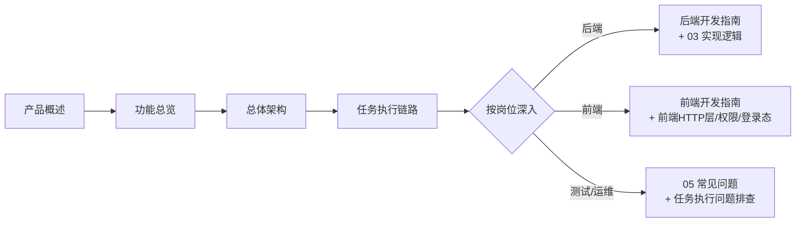

# 接口自动化测试平台 · 知识库首页

> 本知识库由 `testin-api-backend`（Java 后端）与 `testin-api-frontend`（Vue3 前端）两个工程的源码分析生成，面向**新员工培训**与 **AI 数字人知识储备**。
> 覆盖：产品功能、技术架构、实现逻辑、复杂功能细节、常见问题、开发指南六个维度。

## 快速入口

| 我想… | 从这里开始 |
|---|---|
| 了解这个平台是做什么的 | [产品概述](产品概述.md) → [功能总览](功能总览.md) |
| 第一天上班搭环境 | [快速上手指南](06-开发指南/快速上手指南.md) |
| 理解系统整体架构 | [总体架构](总体架构.md) → [后端双形态架构](02-技术架构/后端双形态架构.md) → [前端架构](02-技术架构/前端架构.md) |
| 搞懂"任务是怎么跑起来的" | [任务执行链路](03-实现逻辑/任务执行链路.md)（全平台最重要的一篇） |
| 排查线上执行问题 | [任务执行问题排查](05-常见问题/任务执行问题排查.md) |
| 改代码前查约定 | [后端开发指南](06-开发指南/后端开发指南.md) / [前端开发指南](06-开发指南/前端开发指南.md) / [开发约定与常见坑](05-常见问题/开发约定与常见坑.md) |
| 查某个词什么意思 | [术语表](术语表.md) |

## 目录地图

### 01 · 产品功能

平台"能做什么"——按模块逐一讲解功能、数据模型与操作约束。

- [产品概述](产品概述.md) / [功能总览](功能总览.md)
- 资产：[接口管理](01-产品功能/接口管理.md) · [脚本管理](脚本管理.md) · [用例管理](01-产品功能/用例管理.md)
- 支撑配置：[环境与配置管理](01-产品功能/环境与配置管理.md) · [数据集与数据枚举](01-产品功能/数据集与数据枚举.md) · [协议配置管理](01-产品功能/协议配置管理.md) · [测试机管理](01-产品功能/测试机管理.md)
- 执行：[测试任务](01-产品功能/测试任务.md) · [测试计划](测试计划.md)
- 结果：[测试报告与分享](01-产品功能/测试报告与分享.md) · [概览分析与消息](01-产品功能/概览分析与消息.md)
- 治理：[回收站](01-产品功能/回收站.md) · [开放平台OpenApi](01-产品功能/开放平台OpenApi.md)

### 02 · 技术架构

系统"长什么样"——进程拓扑、工程结构、部署形态、存储设计。

- [总体架构](总体架构.md) — 系统上下文与四个核心架构决策
- [后端双形态架构](02-技术架构/后端双形态架构.md) — 一份代码两个产物：服务端 + 执行端
- [前端架构](02-技术架构/前端架构.md) — Vue3 iframe 子系统的工程约束
- [部署与打包](02-技术架构/部署与打包.md) — `deploy/` 产物布局、启动脚本、镜像构建
- [数据存储设计](../数据库管理/接口自动化/数据存储设计.md) — MySQL 存业务、Redis 做总线，其余皆被测对象
- [数据库表结构](../数据库管理/接口自动化/数据库表结构.md) — 52 张表的数据字典与核心关系图（ER）
- 字段级字典：[数据库字段字典-接口与脚本](../数据库管理/接口自动化/数据库字段字典-接口与脚本.md) · [数据库字段字典-用例与任务](../数据库管理/接口自动化/数据库字段字典-用例与任务.md) · [数据库字段字典-报告与环境数据](../数据库管理/接口自动化/数据库字段字典-报告与环境数据.md) · [数据库字段字典-治理与支撑](../数据库管理/接口自动化/数据库字段字典-治理与支撑.md)

### 03 · 实现逻辑

系统"怎么运转"——跨进程链路与横切机制，以及各功能模块的实现篇（产品篇见 01，两者一一对应互相链接）。

- 执行主链路：[任务执行链路](03-实现逻辑/任务执行链路.md) · [Redis通信与Key设计](03-实现逻辑/Redis通信与Key设计.md) · [JMX生成与解析](03-实现逻辑/JMX生成与解析.md) · [批次结果聚合](03-实现逻辑/批次结果聚合.md) · [执行端Runner详解](03-实现逻辑/执行端Runner详解.md)
- 横切机制：[权限体系](03-实现逻辑/权限体系.md) · [编辑锁机制](03-实现逻辑/编辑锁机制.md) · [定时调度体系](03-实现逻辑/定时调度体系.md)
- 前后端管线：[前端HTTP层与响应约定](03-实现逻辑/前端HTTP层与响应约定.md) · [登录态与主平台集成](03-实现逻辑/登录态与主平台集成.md) · [后端请求处理管线](03-实现逻辑/后端请求处理管线.md)
- 资产模块实现：[接口管理实现](03-实现逻辑/接口管理实现.md) · [脚本管理实现](03-实现逻辑/脚本管理实现.md) · [用例管理实现](03-实现逻辑/用例管理实现.md)
- 执行与报告实现：[测试任务实现](03-实现逻辑/测试任务实现.md) · [测试计划实现](03-实现逻辑/测试计划实现.md) · [测试报告与分享实现](03-实现逻辑/测试报告与分享实现.md) · [开放平台OpenApi实现](03-实现逻辑/开放平台OpenApi实现.md)
- 支撑配置实现：[环境与配置管理实现](03-实现逻辑/环境与配置管理实现.md) · [数据集与数据枚举实现](03-实现逻辑/数据集与数据枚举实现.md) · [测试机管理实现](03-实现逻辑/测试机管理实现.md) · [协议配置管理实现](03-实现逻辑/协议配置管理实现.md)
- 治理实现：[回收站实现](03-实现逻辑/回收站实现.md) · [概览分析与消息实现](03-实现逻辑/概览分析与消息实现.md)

### 04 · 复杂功能细节

编排与协议的"深水区"——改这些代码前必读。

- 用例编排：[前置后置处理器与断言](04-复杂功能细节/前置后置处理器与断言.md) · [变量体系与参数提取](04-复杂功能细节/变量体系与参数提取.md) · [控制器与流程编排](04-复杂功能细节/控制器与流程编排.md) · [全局脚本与自定义函数](04-复杂功能细节/全局脚本与自定义函数.md)
- 协议族：[FIX协议支持](04-复杂功能细节/FIX协议支持.md) · [T2协议支持](04-复杂功能细节/T2协议支持.md) · [Dubbo与GRPC支持](04-复杂功能细节/Dubbo与GRPC支持.md) · [TCP与WebSocket支持](04-复杂功能细节/TCP与WebSocket支持.md) · [Mock服务](04-复杂功能细节/Mock服务.md) · [数据库与NoSQL测试](04-复杂功能细节/数据库与NoSQL测试.md)

### 07 · 开放接口文档

第三方/CI 对接参考——`/open/**` 全部 14 个端点的参数、响应、示例与坑。

- [开放接口总览](07-开放接口文档/开放接口总览.md) — 接入地址、Sid 鉴权、两套响应包装（code=0 / code=200）
- [开放接口-环境查询](07-开放接口文档/开放接口-环境查询.md) · [开放接口-脚本查询](07-开放接口文档/开放接口-脚本查询.md) · [开放接口-设备查询](07-开放接口文档/开放接口-设备查询.md)（stub 警示）
- [开放接口-任务管理](07-开放接口文档/开放接口-任务管理.md) — task/create、saveTaskCase、scriptRunInfos
- [开放接口-接口创建](07-开放接口文档/开放接口-接口创建.md) · [开放接口-项目与模块查询](07-开放接口文档/开放接口-项目与模块查询.md) · [开放接口-通用调用](07-开放接口文档/开放接口-通用调用.md)（Task.run / Report.get）

### 05 · 常见问题

出问题"去哪查"——按症状组织的排查手册与使用答疑。

- [产品使用FAQ](05-常见问题/产品使用FAQ.md) — 高频使用疑问（直接关联 vs 副本…）
- [构建与部署FAQ](05-常见问题/构建与部署FAQ.md) — 编译、打包、镜像、依赖冲突
- [任务执行问题排查](05-常见问题/任务执行问题排查.md) — "任务没跑/报告不对"三段定位法
- [前端联调FAQ](05-常见问题/前端联调FAQ.md) — 登录态、代理、权限、锁
- [开发约定与常见坑](05-常见问题/开发约定与常见坑.md) — 不知道就会踩的约定清单

### 06 · 开发指南

动手"怎么做"——流程、规范与名词表。

- [快速上手指南](06-开发指南/快速上手指南.md) — 第一周路线图
- [后端开发指南](06-开发指南/后端开发指南.md) — 分层、约定、跨端红线
- [前端开发指南](06-开发指南/前端开发指南.md) — 模块开发流程、chrome71 约束
- [术语表](术语表.md) — 批次 / machineId / JMX / authKey / skey…

## 阅读建议

## 维护约定

- 文档与代码强关联：文中引用格式为 `相对路径:行号`，代码大改后请同步更新对应文档。
- 新增文档后回到本页登记，并保持 Obsidian 双链只指向已存在的文档。
- 本知识库与代码同源演进，发现过期内容优先修正文档而非口头传递。
