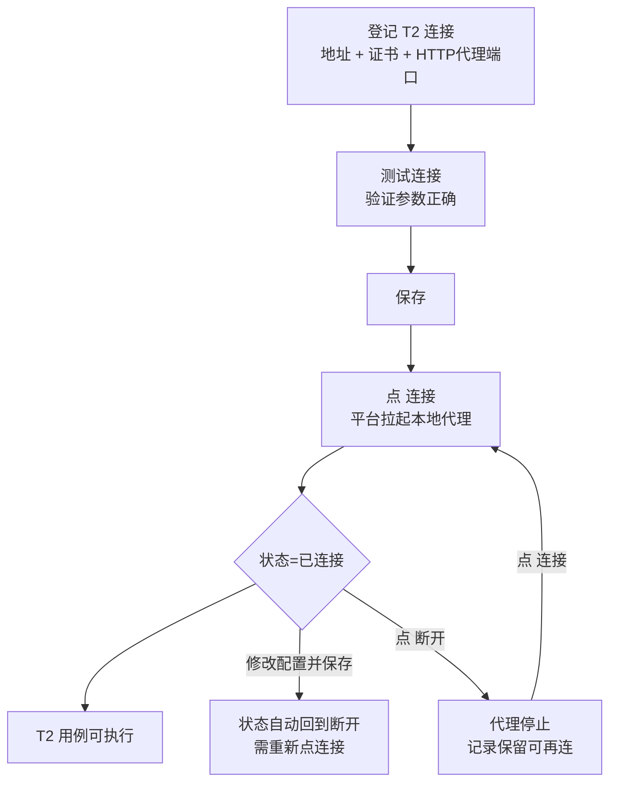

# 协议配置管理

## 功能是什么

"协议配置"在本平台包含两个相关但独立的页面：

1. **协议配置管理页**：项目级**命名连接注册表**的维护界面——按协议类型（HTTP/LDP/OES/ATP/TCP/Dubbo/WebSocket/gRPC/GraphQL/MQTT/FIX/数据库）新建、改名、删除连接项。这里只管"名字 + 描述"，**不含实际连接参数**；参数在每个环境里分别填写（机制详见 [环境与配置管理](环境与配置管理.md)）。
2. **T2 连接管理页**：恒生 T2 协议连接的完整生命周期管理——登记 T2 柜台地址与 license 证书，并能一键**连接/断开**：连接时平台会在服务端机器上拉起一个本地代理服务，把 T2 长连接包装成本地 HTTP 服务，供用例执行时调用。

T2 报文怎么编排、断言怎么写，见 [T2协议支持](../04-复杂功能细节/T2协议支持.md)；本篇讲管理操作。

## 页面入口与界面分区

### 协议配置管理页

入口：左侧菜单 **系统管理 → 协议配置管理**（也是"系统管理"组的默认首页）。

- 页面按协议分页签：数据库配置固定存在，其余页签（HTTP/LDP/OES/ATP/TCP/Dubbo/WebSocket/gRPC/GraphQL/MQTT/FIX）按项目开通的协议显示。
- 每个页签内是该协议的连接列表：**连接名称、连接描述**，行操作 **修改 / 删除**。
- 右上角 **新建连接** 按钮。
- 新建/修改弹窗只有三个字段：**配置类别**（下拉，新建时可选、修改时锁定）、**连接名称**（必填）、**连接描述**。

### T2 连接管理页

入口：左侧菜单 **系统管理 → T2连接管理**。

| 区域 | 内容 |
|---|---|
| 搜索区 | 按名称/IP 模糊搜索 |
| 列表列 | 环境名称（连接名）、HTTP代理端口、柜台IP地址、柜台端口、证书（文件名）、状态（已连接/断开）、备注 |
| 行操作 | 断开状态下：连接、修改、删除；已连接状态下：断开 |
| 右上按钮 | 新建连接 |

**新建/编辑弹窗**字段：

| 字段 | 说明 |
|---|---|
| 环境名称 | 连接名（必填，同项目内唯一） |
| HTTP代理端口 | 本地代理服务的监听端口（必填，**全平台唯一**，别的项目用过也不能再用） |
| 柜台IP地址 / 柜台端口 | T2 服务端（柜台）地址（必填） |
| 选择证书 | 上传 T2 license 证书文件（必填，大小限制 1MB） |
| 连接密码 | UFX 连接密码（选填） |
| 字符集 | utf-8（默认）/ gbk |
| 备注 | 自由文本 |

弹窗左下角有 **测试连接** 按钮：不保存也能用当前填写的参数试连柜台，验证网络、证书、账号是否正确。

## 核心概念

### 命名连接注册表（协议配置页）

命名连接是"项目里存在一个叫 XX 的连接"的登记。登记之后：

- 项目下**所有环境**自动出现同名空连接，各环境填各自的实际参数（域名、库地址、账号等）；
- **改名**会同步到所有环境；**删除**前平台会检查是否被接口定义或脚本引用，有引用则拒绝删除。

简单说：协议配置页管"有哪些连接"，环境页管"每个连接在这套环境里具体连哪"。

### T2 本地代理

T2 是长连接二进制协议，测试引擎不能直接讲。平台的办法是：点"连接"时，在**服务端所在机器**上以登记的"HTTP代理端口"拉起一个独立的代理服务——它持有到柜台的 T2 长连接，对外提供普通 HTTP 接口。用例执行时按"HTTP代理端口"调用本地代理，由代理完成 T2 收发。

所以 T2 连接有三种用户可感知的状态：

| 状态 | 含义 |
|---|---|
| 断开 | 只有登记信息，代理服务没在跑 |
| 已连接 | 代理服务已拉起且通过柜台验证，可执行 T2 用例 |

点 **断开** 会先让代理主动断开与柜台的长连接，再停止代理进程；点 **连接** 幂等——同端口有残留旧进程会先清理再拉起。

### 修改即断开

修改 T2 连接（哪怕只改备注以外的任何参数）保存后，连接状态会被**强制置回"断开"**——因为代理进程用的还是旧参数。保存后需要重新点"连接"生效。

## 如何操作

### 登记一个命名连接（协议配置页）

1. **系统管理 → 协议配置管理**，切到目标协议页签。
2. 点 **新建连接**，选配置类别、填连接名称与描述，确定。
3. 通知各环境负责人到 **测试环境** 页为同名连接填写实际参数（详见 [环境与配置管理](环境与配置管理.md)）。
4. 之后接口定义/脚本里即可按名字引用该连接。

### 建立一条 T2 连接

1. 准备：向柜枱方索取 T2 地址（IP/端口）、license 证书文件，确认平台服务器到柜台的端口网络可达。
2. **系统管理 → T2连接管理 → 新建连接**，填写各字段并上传证书。
3. 点 **测试连接**：提示成功说明地址、证书、账号都没问题；失败则按提示修正（网络不通先找运维开通策略）。
4. **保存**。列表新增一条"断开"状态的记录。
5. 点行操作 **连接**：平台开始拉起代理，按钮伴随加载状态，稍候提示"连接成功"，状态变为"已连接"。
6. 之后即可在 T2 类型用例中按此连接执行（编排细节见 [T2协议支持](../04-复杂功能细节/T2协议支持.md)）。

### 变更与下线

- **改参数**：修改 → 保存 → 重新点"连接"（保存后状态必为断开）。
- **临时停用**：点 **断开**（二次确认），代理停止、记录保留。
- **彻底删除**：先 **断开**，再 **删除**（二次确认）。

## 使用场景与最佳实践

1. **连接命名带语义**：如"集中交易-UF20-测试柜台"，列表扫一眼就知道连的是哪个柜台哪个环境。
2. **HTTP代理端口统一规划**：该端口全平台唯一且不能与服务端自身端口冲突，建议由管理员划定号段（如 19100-19199）并在备注里登记用途。
3. **先测试连接再保存**：证书过期、密码错误、网络不通都在"测试连接"阶段暴露，避免存下一堆连不上的记录。
4. **字符集与柜台一致**：报文出现中文乱码时，优先核对字符集设置（utf-8/gbk）是否与柜台约定一致。
5. **不用就断开**：T2 长连接占用柜台侧 license/会话资源，长时间不执行的连接主动断开。

## 注意事项

- **删除连接不会自动停止代理进程**：如果删除前忘了"断开"，代理还在跑、端口仍被占用。规范操作是先断开再删除；若已遗留，联系运维到服务端机器按端口找到进程清理。
- **代理跑在服务端本机，不在执行机上**：多副本部署服务端时，"连接"操作落在哪台服务端，代理就在哪台——请固定访问同一台服务端做 T2 连接管理，否则会出现"状态对不上"。
- 点"连接"提示超时/失败：依次检查 ① 服务端到柜台的网络；② 证书是否过期或与柜台不匹配；③ HTTP代理端口是否被本机其它进程占用（换端口可验证）；④ 服务端机器的日志目录是否有写权限。都排查不了找运维。
- 删除操作的失败提示可能不明显（界面仍提示删除成功）——删完发现列表还有，请联系管理员查后台日志。
- 证书文件按 1MB 限制上传，超大证书先与柜台方确认是否给错文件。
- 协议配置页删除连接被"存在关联过的接口/脚本"拦下时，需先解除引用；排查引用关系可找管理员协助。

## 延伸阅读

- [协议配置管理实现](../03-实现逻辑/协议配置管理实现.md) — 注册表级联、T2 代理进程管理的代码实现
- [环境与配置管理](环境与配置管理.md) — 命名连接在各环境填值的机制
- [T2协议支持](../04-复杂功能细节/T2协议支持.md) — T2 报文编排与执行细节
- [FIX协议支持](../04-复杂功能细节/FIX协议支持.md) — 另一类长连接金融协议的支持方式
