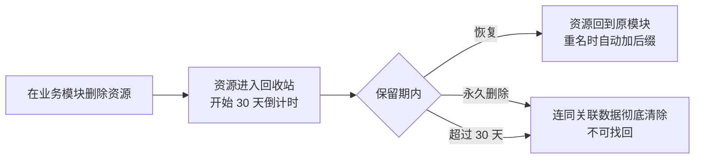

# 回收站

## 功能是什么

回收站是平台的**误删保护机制**。当你删除接口、脚本、用例、任务、数据集、环境这六类资源时，资源不会立刻消失，而是先进入回收站保留 **30 天**。在保留期内可以把资源**恢复**回原模块；确认不要了也可以在回收站里**永久删除**。超过 30 天没人处理的数据，平台每天自动清理，清理后不可找回。

## 页面入口与界面分区

入口：左侧菜单 **回收站**。页面分为三块：

- **筛选区**：名称（直接搜索，回车触发）；展开"更多筛选"后可按 **类型**（接口/脚本/用例/任务/数据集/环境）、**删除时间**（开始/结束时间段）、**删除人**（项目成员下拉）组合筛选。
- **批量操作**：勾选表格左侧复选框后，右上角"批量操作"下拉提供 **批量删除**（永久删除）与 **批量恢复**；未勾选任何行时按钮置灰。
- **列表区**：每行展示名称、类型、删除人、删除时间、**倒计时**（还剩多少天被自动清理，按 30 天保留期计算，显示 0 天即当日会被清理）；行尾操作列为 **恢复**、**永久删除**。名称和删除时间列支持点击表头排序，排序偏好在本地记忆。

> 页面操作受权限控制：没有恢复/删除权限的成员看不到对应按钮（含批量入口），需要联系项目负责人开通。

## 核心概念

| 概念 | 含义 |
|---|---|
| 进回收站的资源 | 接口、脚本、用例、任务、数据集、环境，共 6 类 |
| 不进回收站的资源 | 数据枚举、测试计划删除后**不进回收站**，删除即不可恢复，操作时需格外谨慎 |
| 保留期 | 30 天，列表"倒计时"列实时显示剩余天数，到期后平台自动永久删除 |
| 恢复 | 把资源还原回原业务模块。删除时资源已从原模块消失，恢复后才重新出现 |
| 永久删除 | 从回收站抹掉，同时清理该资源的关联数据（如用例的步骤、任务的用例关联、接口的 Mock），**不可找回** |
| 重名处理 | 恢复时如果原位置已有同名资源，自动改名为 `原名_恢复1`，再冲突则继续叠加后缀 |

## 如何操作

### 筛选数据

1. 进入"回收站"页面；
2. 在筛选区输入名称关键字，或展开更多筛选选择类型、删除时间段、删除人；
3. 点击搜索，列表按条件刷新；点重置可清空全部条件。

### 恢复资源

1. 在列表找到目标资源（可按类型/删除人缩小范围）；
2. 点击行尾 **恢复**（或勾选多条后用"批量操作 → 批量恢复"）；
3. 在确认弹窗中核对名称后点"确认"；
4. 回到对应业务模块（接口/脚本/用例/任务/数据集/环境）即可看到恢复后的资源；若有重名，名称会带 `_恢复N` 后缀，可再手动改名。

### 永久删除

1. 点击行尾 **永久删除**（或勾选多条后"批量操作 → 批量删除"）；
2. 弹窗确认后数据被彻底清除，不可找回——**执行前请确认该资源确实不再需要**。

### 各资源恢复后的效果对照

| 资源 | 恢复后效果 | 需要手工补做的事 |
|---|---|---|
| 接口 | 回到原接口目录 | 检查关联 Mock 是否还在（永久删除会清掉 Mock） |
| 脚本 | 回到原脚本目录 | 打开核对脚本内容完整性 |
| 用例 | 回到原用例目录 | **核对步骤是否完整**——步骤不随快照走，可能恢复出只有基本信息的用例 |
| 任务 | 回到原任务目录 | 核对任务下挂的用例列表 |
| 数据集 | 回到原数据集目录 | **重新绑定引用它的用例步骤**（删除时已自动解绑） |
| 环境 | 回到环境管理 | 无（环境以整条配置快照，还原较完整） |

## 使用场景与最佳实践

- **误删急救**：删除后发现删错了，第一时间到回收站恢复，30 天内都有效。
- **团队清理前二次确认**：负责人可定期按"删除人"筛选，检查团队成员删掉的数据是否确实该删，该恢复的恢复、该彻底清除的清除，避免回收站长期堆积。
- **大改版前的"后悔药"**：批量重构接口/用例前，先删后改的场景下回收站提供 30 天回退窗口；但记住恢复带 `_恢复N` 后缀，正式数据建议恢复后立即改回规范名称。
- **恢复后补检查**：恢复只还原资源本体。数据集恢复后，原先绑定它的用例步骤**不会自动重新绑定**，需手工重新关联；用例、任务、接口恢复后也建议打开核对内容是否完整。
- **定期清理减负**：对确认无用的条目主动永久删除，而不是等自动清理——列表越短，真出事时越容易找到要恢复的数据。

## 注意事项

- **只能操作自己删除的数据**：恢复和永久删除都要求"谁删的谁处理"，管理员也不能替别人操作。如果删除人离职，其删除的数据只能等 30 天自动清理。团队交接时，建议离职前先处理掉名下回收站数据。
- **倒计时到期即清**：列表里的"倒计时"归零后数据会被自动永久删除，重要数据不要拖到最后一天才处理。
- **恢复 ≠ 时光倒流**：删除期间产生的副作用不撤销。典型例子：数据集删除时会解除所有用例对它的引用，恢复后需要重新绑定。
- **挂在根目录的数据集不进回收站**：数据集如果直接挂在根目录（不在任何目录下），删除后不会出现在回收站，删除即丢失。管理数据集时建议都放到具体目录下。
- **同一资源可反复"删了恢复、恢复了删"**：每次删除都会重新记一次快照和 30 天倒计时，恢复后再删名字上的 `_恢复N` 后缀会保留在新快照里。
- **删除立即生效**：资源删除当下就从原模块列表消失、执行链路也不再使用它，回收站只是给了 30 天的后悔机会——不要指望"删了但任务还在跑的东西还能正常跑"。

## 常见问题

**Q：我在用例里删了一条数据，回收站里怎么没有？**
先确认资源类型：数据枚举、测试计划不进回收站；数据集如果挂在根目录下也不进。其余六类删除后应立即出现在列表里，可用类型+删除人（自己）快速过滤。

**Q：能恢复同事删掉的数据吗？**
不能。恢复和永久删除仅限删除者本人操作，这是硬限制。如果必须找回，请联系该同事本人操作，或等 30 天清理前由对方处理。

**Q：恢复后发现名字多了一串 `_恢复1_恢复2`？**
说明恢复时原位置已有同名资源，系统自动加了后缀避让；多次重名会逐次叠加。直接改成需要的名字即可，不影响功能。

## 延伸阅读

- 实现细节（快照机制、还原流程、定时清理）：[回收站实现](../03-实现逻辑/回收站实现.md)
- 相关资源模块：[接口管理](接口管理.md)、[脚本管理](脚本管理.md)、[用例管理](用例管理.md)、[测试任务](测试任务.md)、[数据集与数据枚举](数据集与数据枚举.md)、[环境与配置管理](环境与配置管理.md)
