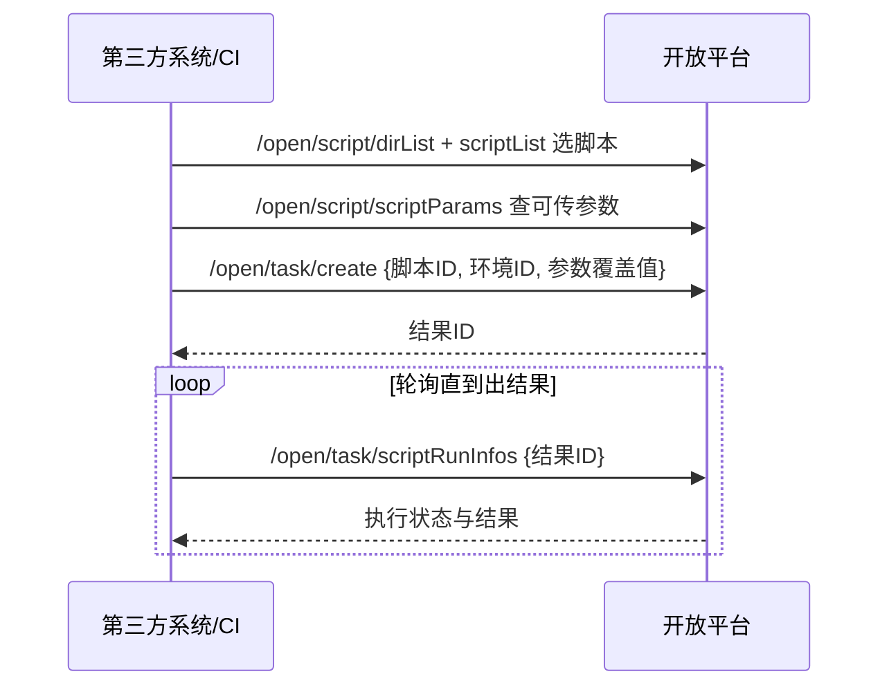

# 开放平台OpenApi

> 开放平台 OpenApi 是平台**对外开放给第三方系统**（测试管理平台、CI 流水线、数研所项目等）的 HTTP 接口集合，与前端页面使用的内部接口并列存在。典型场景：第三方系统创建接口/任务、以脚本提测、触发[测试任务](测试任务.md)执行、拿回[报告](测试报告与分享.md)结果。

## 能调什么

开放接口按能力分四组（所有端点均为 `POST`，路径以 `/open` 开头，完整 URL 前缀以部署网关配置为准）：

### 1. 基础数据查询

| 端点 | 能力 |
|---|---|
| `/open/project/queryid` | 按项目名换项目 ID |
| `/open/module/queryid` | 按目录名换目录 ID |
| `/open/env/list` | 查询项目下的环境列表 |
| `/open/script/dirList` | 查询脚本目录树 |
| `/open/script/scriptList` | 分页查询脚本（含子目录，可按名称过滤） |
| `/open/script/scriptParams` | 批量查询脚本引用的数据集变量/参数（传参前先看这里） |

### 2. 资产写入

| 端点 | 能力 |
|---|---|
| `/open/interface/add` | 新增接口定义（名称、路径、协议、请求参数、响应等全量定义，覆盖 HTTP/Dubbo/GRPC/TCP/WebSocket 等多协议） |
| `/open/task/saveTaskCase` | 测管系统建任务后回写任务-用例关系（**先清空再全量替换**，见注意事项） |

### 3. 触发执行与结果回查

| 端点 | 能力 |
|---|---|
| `/open/task/create` | **以脚本提测**：传脚本 ID + 环境 ID + 参数覆盖值，立即执行脚本，返回结果 ID |
| `/open/task/scriptRunInfos` | 按结果 ID 轮询脚本执行结果 |
| `/open/api` | **通用派发端点**（面向数研所类项目）：通过操作指令执行任务、查询任务报告，见下文 |

### 4. 设备查询（暂不可用）

`/open/device/conditions` 与 `/open/device/list` 目前是**占位实现**（返回空数据/默认设备），不要对第三方承诺设备查询能力。

## 怎么接入

### 第一步：准备凭证

- 开放平台使用**平台用户登录凭证（sid）**作为唯一身份凭证：在本平台所属主平台注册一个**专用对接账号**，登录拿到 sid，并把该账号加入目标项目。
- 每个请求都必须携带 sid，三种携带方式任选其一：**请求头 `Sid`**、URL 参数 `sid`、JSON 请求体里的 `sid` 字段。
- 首次调用时平台会自动从主平台同步该用户信息，**第一次请求延迟较高属正常现象**。

### 第二步：换取基础 ID

```text
项目名 ──/open/project/queryid──▶ 项目 ID
目录名 ──/open/module/queryid───▶ 目录 ID
       ──/open/env/list────────▶ 环境 ID 列表
```

后续接口的项目字段统一叫 `thirdProjectId`，值就是本平台的项目 ID（"third"表示第三方系统视角的传参）。

### 第三步：按场景调用

**场景 A：以脚本提测（CI 流水线最常用）**



`/open/task/create` 的请求体：

```json
{
  "thirdProjectId": "项目ID",
  "scriptId": "脚本ID",
  "envId": "环境ID",
  "paramList": [{ "k": "参数名", "v": "覆盖值" }]
}
```

注意：脚本执行的结果**不是任务报告**，必须用 `/open/task/scriptRunInfos` 查询，不能拿到结果 ID 去查任务报告接口。

**场景 B：触发已有任务执行并取报告（通用派发 `/open/api`）**

请求体是"操作指令 + 业务数据"结构：

```json
{
  "sid": "对接账号的sid",
  "op": "Task.run",
  "data": { "taskNumber": 100001, "projectId": "项目ID", "envId": "环境ID" }
}
```

- `op = "Task.run"`：按**任务编号**（任务列表里 100001 起的那列，不是系统内部 ID）串行执行任务，返回报告 ID。
- `op = "Report.get"`：`data` 传报告 ID，返回报告批次概要——`status` 到 2（已完成）/3（中断）即终态，`caseSuccessCount / caseFailCount / passRate` 为结果数字。
- 其它操作指令会返回"无效的参数(op)"错误。

**场景 C：测管系统双向同步**

测管侧建完任务后调 `/open/task/saveTaskCase` 回写任务-用例关系（任务按"名称 + 项目 + 目录"定位）；接口资产用 `/open/interface/add` 推送。

## 响应约定（务必读）

开放接口存在**两套成功码**，对接时必须按端点区分：

| 端点 | 成功码 | 响应结构 |
|---|---|---|
| `/open/api` | **`code === 200`** | `code / msg / data` |
| 其余 `/open/**` | **`code === 0`** | `code / msg / data`（失败时可能带调试字段 `detailMessage`，按三字段解析即可） |

常用错误码：

| code | 含义 |
|---|---|
| 0 | 成功（非 `/open/api` 端点） |
| 10005 | 无效的参数 |
| 1000503 | 无效的参数(op) |
| 10014 | 该用户未登录（sid 失效） |
| 10016 | 执行失败（通用失败，如"未找到脚本"） |

## 接入检查清单

正式联调前按此清单过一遍，可以避开绝大多数首轮问题：

1. 对接账号已注册、已加入目标项目，且用该账号能在平台界面正常看到目标项目的数据。
2. 已确认完整 URL 前缀（开放平台只暴露 `/open` 相对路径，域名与前缀以部署方网关配置为准）。
3. sid 的携带方式已选定（推荐请求头 `Sid`），并实现了 `10014` 失效后的重新获取逻辑。
4. 已按端点区分两套成功码（`/open/api` 为 200，其余为 0）。
5. 执行类调用已设计轮询间隔与超时上限（任务执行可能持续数分钟，不要同步死等）。
6. 已规划好 ID 映射的本地缓存：项目 ID、目录 ID、环境 ID、任务编号变动频率低，没必要每次现查。
7. 并发触发执行前已与平台方确认执行机资源容量。

## 注意事项（对接方视角）

- **开放接口不校验功能权限**：任何有效 sid 都能调用全部开放端点（包括创建接口、触发执行）。请务必使用**专用对接账号**，并只把它加入需要对接的项目，避免越权面扩大。
- **两套成功码并存**是最常见的对接坑：`/open/api` 成功码 200、其余端点成功码 0，HTTP 层不要统一按一种判断。
- **`/open/task/saveTaskCase` 是全量覆盖语义**：每次调用先清空任务现有关联再整体写入——增量传参会覆盖掉界面上的人工调整；任务定位不到时**静默成功**，不会报错。
- **任务编号 vs 系统 ID**：`Task.run` 用的是界面上可见的任务编号（100001 起），与平台内部 ID 不是一回事，传错会报"找不到"。
- **结果查询别混用**：脚本提测（`/open/task/create`）的结果走 `/open/task/scriptRunInfos`；任务执行（`Task.run`）的报告走 `Report.get`。两个 ID 体系互不通用。
- **脚本参数为空时先核对数据集**：查询脚本参数时，若脚本引用的数据集列被删除过，对应参数会**静默缺失**而不报错——传参前发现参数列表比预期少，先检查数据集列是否变动过。
- **目前无调用频率限制与配额概念**，但触发执行类调用会真实占用执行机资源，CI 侧请控制并发，避免把执行机打满影响界面用户。
- **错误消息存在已知的文案瑕疵**：个别端点失败文案与实际原因不完全对应（如目录查询失败提示"未找到用户"），以 code 为准、文案为辅。
- 平台侧目前**没有 apikey / 签名机制**，sid 即全部凭证；sid 会过期，对接系统要处理 `10014` 并重新获取。
- 开放平台**没有配套前端页面**，联调直接使用 curl / Postman；需要界面验证结果时，到平台的[测试任务](测试任务.md)、[测试报告与分享](测试报告与分享.md)页面查看。

### 常见对接问题速查

| 现象 | 优先排查 |
|---|---|
| 返回"该用户未登录" | sid 缺失或过期；确认三种携带方式至少用了一种 |
| 判断"调用失败"但其实是成功 | 成功码用错了：检查该端点是 0 还是 200 |
| `Task.run` 报找不到任务 | 传的是不是任务编号（界面可见的 100001 起），而不是其它 ID |
| 脚本参数查出来比预期少 | 脚本引用的数据集列被删除过，参数会静默缺失 |
| 回写用例关系后界面上的修改丢了 | `saveTaskCase` 是全量覆盖语义，需传完整列表 |
| 首次调用特别慢 | 平台在同步对接账号的用户信息，属一次性开销 |
| 查不到设备 | 设备查询端点未实现，属预期行为 |

## 延伸阅读

- [开放接口总览](../07-开放接口文档/开放接口总览.md) —— 逐端点对接文档（参数/响应/示例）入口，见 07-开放接口文档 目录
- [开放平台OpenApi实现](../03-实现逻辑/开放平台OpenApi实现.md) —— 鉴权链路、响应包装、派发机制、各端点实现的代码级解析
- [测试任务](测试任务.md)、[测试报告与分享](测试报告与分享.md)、[脚本管理](脚本管理.md)、[接口管理](接口管理.md)、[数据集与数据枚举](数据集与数据枚举.md)
