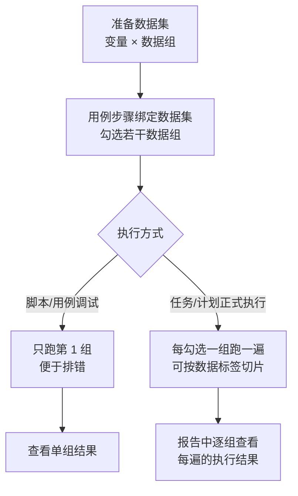

# 数据集与数据枚举

## 功能是什么

这两个模块共同支撑**参数化执行（数据驱动）**——同一条用例用多组数据反复执行：

- **数据集**：一张二维表。**列是"数据组"**（一次完整执行用的一组值），**行是"变量"**（变量名 + 说明 + 每组取值）。用例步骤绑定数据集并勾选若干数据组后，执行时每勾一组就跑一遍。
- **数据枚举**：一份"枚举值 + 描述"的字典（如"证件类型：身份证/护照/军官证"）。数据集里某行的变量名与枚举同名时，该行的数据组单元格自动变成**下拉框**，只能选枚举里的值；枚举值修改后，所有引用它的数据集会自动跟着更新。

典型收益：一条"开户"用例配 10 组数据，一次执行覆盖 10 种开户场景，报告里能逐组看结果。

相关文档：[用例管理](用例管理.md)（步骤如何绑定数据集）、[变量体系与参数提取](../04-复杂功能细节/变量体系与参数提取.md)、[测试任务](测试任务.md)。

## 页面入口与界面分区

入口：左侧菜单 **数据管理**，下分两个子菜单——**数据集管理** 与 **枚举管理**。

两个页面布局一致：左侧**目录树**（可建文件夹归类、拖拽移动、右键新建/重命名/删除），右侧多页签工作区（默认页签是列表，点击名称打开编辑页签）。

### 数据集列表页

- 搜索：名称/描述；展开"更多"可按**字段名**、**字段值**反查（"哪个数据集里有变量 token""谁用了取值 13800000000"）。
- 列表列：数据集名称（名称旁有锁图标表示别人正在编辑）、描述、操作（复制/删除）。
- 右上：**新建数据集**；勾选多行后出现**批量操作**（批量复制、批量移动、批量删除、批量替换）。

### 数据集编辑页

顶部：名称（必填）、描述（必填）、表格内容搜索框、保存按钮。主体是一个类 Excel 的表格编辑器：

- 第 1 行是表头（"变量 / 变量说明 / 数据组1 / 数据组2 …"），第 2 行是**标签行**（给每个数据组打标签，执行时可按标签筛选），从第 3 行起是变量行。
- 前两列（变量名、变量说明）之外的列即数据组列。单元格上**右键**可插入/删除行列、复制；支持从 Excel 直接粘贴。
- 某行变量名与某个枚举同名时，该行数据组单元格变为下拉选择，选项以"值（描述）"展示。
- 数据组列的增删会同步影响所有绑定了该数据集的用例步骤——删掉已被勾选的列时，步骤上的勾选会被自动剔除，不会出现"引用了不存在的列"。

### 枚举列表页与编辑页

- 列表列：字段名称（枚举名）、字段描述、枚举数量、操作（删除）；批量操作支持批量移动、批量删除。
- 编辑页：枚举名称（必填）、枚举描述（必填），表格两列——**枚举值 / 枚举说明**，逐行填写。

## 核心概念

### 数据组驱动执行

- 用例的**执行份数 = 绑定步骤中勾选数据组数的最大值**。勾了 3 组的用例执行时就跑 3 遍，每遍各步骤取对应那一组的值注入请求参数。
- 同一用例里"勾了 3 组的步骤"和"只勾 1 组的步骤"混排时，后者在后续遍次自动跳过取数（设计如此，不是异常）。
- **调试限制**：脚本调试只允许勾选 1 组；用例调试（debug）即使勾了多组也只跑第 1 组。正式执行（测试任务/计划/定时任务）才会全部展开。

### 数据组标签

数据集第 2 行可为每个数据组写标签（如"正向""逆向""边界值"）。执行入口的运行弹窗里有**数据标签**选项，选了标签就只跑打了该标签的数据组——一份大数据集可以按场景切片执行。测试报告的结果列表里也能看到每条结果对应的"数据集标签"。

### 枚举联动与级联

- 绑定关系靠**名字**：数据集的变量名 = 枚举名，即视为绑定。
- 枚举被任一数据集绑定后：**不可删除**、**不可改枚举名**（平台会直接拒绝并提示）。
- 修改枚举的"值/描述"并保存后，所有绑定数据集里对应的单元格内容会自动替换为新值；删除某枚举行，对应单元格会被清空。
- 枚举删除是**直接删除（不进回收站）**，删前请确认无绑定（有绑定平台也会拦住）。

### 编辑锁

数据集编辑页是**独占编辑**：有人正在编辑时，其他人打开同一数据集会看到"XX 正在编辑，当前页面锁定中，只支持查看不能保存"，列表上的名称旁也会出现锁图标。删除/批量操作被锁定的数据集同样会被拒绝。详见 [编辑锁机制](../03-实现逻辑/编辑锁机制.md)。

## 如何操作

### 新建数据集

1. **数据管理 → 数据集管理**，在左侧目录树选好目标文件夹，点 **新建数据集**（或列表页右上按钮）。
2. 填名称、描述。
3. 编辑表格：第 1 行表头保持"变量/变量说明"开头，从第 3 列起每个数据组占一列；第 2 行按需填数据组标签；第 3 行起逐行填变量名、变量说明、各组取值。列不够用右键"在右侧插入列"。
4. 点 **保存**。

### 在用例步骤上绑定数据集

1. 打开用例编辑页，选中目标步骤，切到步骤编辑器的 **请求数据（关联数据）** 页签。
2. 点 **选择数据集**，在弹窗中：左侧选目录找到数据集 → 右侧预览表格 → **勾选要执行的数据组列** → 确定。
3. 页签顶部显示"已关联数据集：XX 选中列：数据组1：数据组3"，下方表格预览选中组的取值。
4. 要换绑重新点"选择数据集"，要解绑点 **解除数据关联**。
5. 保存用例。执行该用例（或包含它的任务）即按勾选组数展开执行；运行弹窗里可用"数据标签"进一步筛选。

### 新建枚举并在数据集中使用

1. **数据管理 → 枚举管理 → 新建枚举**，填枚举名称（如"证件类型"）、描述。
2. 表格逐行填 枚举值 / 枚举说明（如 `身份证 / 居民身份证`），不允许存在"值和说明完全相同"的重复行。
3. 保存后，到数据集里把某行的变量名写成同名（"证件类型"），该行数据组单元格即刻变成下拉框，从候选中选择即可。

### 批量替换

1. 数据集列表勾选多个数据集 → **批量操作 → 批量替换**。
2. 选替换类型（字段名 / 字段值 / 字段名=字段值），填"将 X 替换为 Y"。
3. 点确定后平台先查找匹配，弹出"确认将 N 个数据集的 … 替换为 … 吗？"，点 **开始替换** 执行。适合域名变更、变量改名等批量场景。

## 使用场景与最佳实践

1. **正向/逆向分层**：一份数据集覆盖全部场景，用标签区分"正向""逆向"，日常回归只跑正向标签，全量验证跑全部。
2. **枚举管字典，数据集管数据**：有固定取值范围的字段（证件类型、币种、渠道）一律建枚举，避免各数据集手打出不一致的值；改字典只改枚举一处。
3. **变量名即契约**：数据集的变量名要和脚本/步骤里引用的变量名严格一致，建议团队约定命名规范并在描述里写清用途。
4. **调试先勾一组**：在步骤上绑定多组数据前，先用一组调试通过，再补勾其余组，定位问题更快。
5. **批量替换先预览**：替换弹窗会先给出"将影响 N 个数据集"的确认数，数量与预期不符就取消检查条件。

## 注意事项

- **删除数据集会先解除所有用例步骤的绑定再进回收站**。即使之后从回收站还原，原步骤也不会自动恢复绑定，需要手工重新绑定——删前确认没有在用。
- 枚举提示"已绑定数据集，不可删除/不可修改枚举名称"时，平台没有"查看绑定关系"的入口，可先用数据集列表的"字段名"搜索枚举名，找出引用它的数据集。
- 枚举改值是**按文本整体替换**：如果某单元格被手工改成了和枚举格式相同的文本，也会被一并替换掉。
- 数据组列被删后，引用该数据集的步骤勾选会自动剔除；但如果某个步骤因此一组都不剩，该步骤执行时不再取数——删列前建议先检查绑定情况。
- 表格前两行（表头、标签行）结构是固定的，不要把数据写进这两行；"变量""变量说明"两个表头文字被改掉会保存失败。
- 别人正在编辑的数据集打不开保存（锁图标），需要协调对方关闭页签释放，或联系管理员处理。

## 延伸阅读

- [数据集与数据枚举实现](../03-实现逻辑/数据集与数据枚举实现.md) — 存储格式、绑定关系与执行展开的代码实现
- [用例管理](用例管理.md) — 步骤编排与数据集绑定入口
- [变量体系与参数提取](../04-复杂功能细节/变量体系与参数提取.md) — 数据集变量与其它变量来源的优先级
- [测试报告与分享](测试报告与分享.md) — 多数据组结果在报告中的呈现
