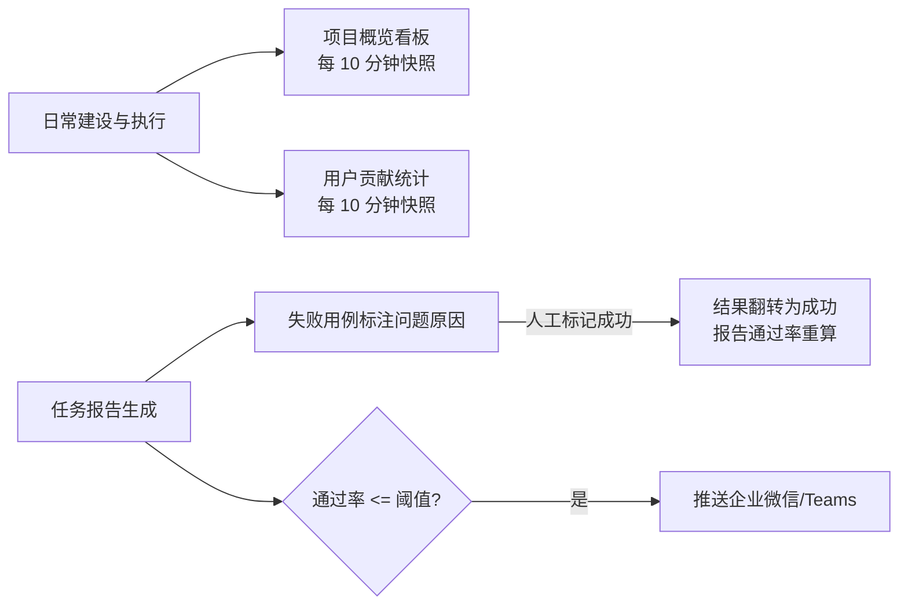

# 概览分析与消息

本篇汇总平台里"统计看板 + 问题分析 + 消息触达"三类辅助能力，面向测试负责人与团队成员：

- **项目概览看板**：项目级资源与质量指标的统计快照，展示在私有云主平台首页。
- **用户贡献统计**：按人统计各成员创建了多少接口、脚本、用例、任务等。
- **用例分析**：对报告里的失败用例标注"问题原因"，原因字典可自定义；内置的"人工标记成功"可以把确认无误的失败翻转成成功。
- **消息通知**：任务跑完后，通过率低于预期时向企业微信 / Teams 群推送告警。

## 一、项目概览看板

**在哪里看**：本子系统的概览数据展示在**私有云主平台首页**（子系统内没有单独的概览页）。每个项目一行快照，包含接口、脚本、用例、任务四组指标。

**统计口径**：

| 维度 | 指标 | 口径说明 |
|---|---|---|
| 用例 | 总数 / 本周新增 / 通过率 | 不含已删除用例；通过率 = 最后一次执行结果为成功的用例占比 |
| 任务 | 总数 / 本周新增 / 平均通过率 | 不含已删除任务；平均通过率 = 该任务各次报告通过率的平均值 |
| 脚本 | 总数 / 本周新增 / 调试通过数 | 总数**含已删除**；通过数指调试执行通过的脚本数 |
| 接口 | 总数 / 本周新增 / 覆盖率 | 总数**含已删除**；覆盖率 = 被引用的接口数 ÷ 接口总数 |

**怎么读这块看板**：

- 看板是**定时快照，每 10 分钟刷新一次**，不是实时数据。刚建完资源数字没动，等一轮刷新即可。
- "本周新增"以周一为界（上周日 24 点之后算本周）。
- 用例/任务的"总数"剔除已删除，接口/脚本不剔除——对比维度时注意口径差异。

## 二、用户贡献统计

按成员统计其创建的接口、脚本、用例、任务、用例分析、数据集数量，用于看团队建设投入。同样是每 10 分钟随概览一起刷新。

注意口径：成员删掉了自己建的接口/脚本/数据集，贡献数**不会扣减**（用例和任务会扣减）。

## 三、用例分析（失败标注与问题类型管理）

### 问题类型管理

入口：**系统管理 → 问题类型管理**。页面可搜索（名称/描述）、新建、修改、启用/禁用、删除。

- 平台内置 8 类系统默认原因：**环境问题、产品变更、产品缺陷、用例问题、执行问题、脚本问题、工具问题、人工标记成功**。系统默认项不可修改名称、不可删除（页面上不显示修改/删除按钮）。
- 团队可以**新建问题类型**（自定义原因）：名称不超过 16 个字、全局不重名，可附描述；新建后默认启用。
- 自定义类型可以修改、禁用（禁用有二次确认）、删除；**禁用后该原因在报告标注下拉里不再出现**，历史标注不受影响。

### 在报告里标注失败原因

入口：打开一份**任务报告**，左侧用例列表中失败用例行尾有分析图标。

**单个标注**：

1. 点击失败用例的分析图标，弹出"错误原因分析"窗口；
2. 分析人自动填当前用户（不可改），从下拉选择**问题原因**（必选），填写**详细描述**；
3. 保存后，该行显示所选原因的标签，再次点击可修改。

**批量标注**：

1. 勾选左侧列表中多条失败用例（或点"全部"选中全部失败）；
2. 点击上方 **批量设置原因**；
3. 在弹窗中统一选择原因并保存。

**人工标记成功（特殊原因）**：

- 对"确认产品没问题、是环境抖动等原因导致的失败"，把原因选为 **人工标记成功** 后，该用例结果会由失败**翻转为成功**，报告通过率与导出数据同步重算；此时无需填写详细描述（弹窗会提示）。
- 被标记的用例显示"人工标记成功"标签；想撤销标记，重新打开标注弹窗改选其它原因即可，结果回退为失败并再次重算。
- 普通原因标注不影响结果与通过率，只有"标记成功 / 撤销标记"才触发报告重算。

## 四、消息通知（企业微信 / Teams）

**能干什么**：任务执行完生成报告后，如果报告通过率**低于等于设定阈值**，自动向配置好的企业微信群或 Teams 频道推送告警消息，消息里附报告链接，点击直达报告页。

**前置条件**：通知通道（群机器人 webhook 等）在**私有云主平台的消息中心**配置，并授权给本项目；子系统只读取通道，不提供通道管理页面。

**如何开启**（以定时任务为例，手动/补充执行弹窗中同样可配）：

1. 打开任务的"定时执行"配置弹窗；
2. 若本项目有可用通道，会看到 **企业微信** / **Teams通知** 开关；
3. 打开开关，设置触发条件"通过率 <= N% 触发"（默认取通道上配置的阈值，可按任务调整）；
4. 保存。之后每次跑完报告，通过率达标不打扰，低于等于阈值才推送。

**最佳实践**：核心回归任务建议阈值设为 100（有任何失败都告警）；冒烟任务可适当放低，减少噪音。

## 注意事项

- **统计都是快照不是实时**：概览与贡献统计最长滞后 10 分钟，刚操作完数字没变是正常现象。
- **各维度删除口径不一致**：用例/任务剔除已删除，接口/脚本不剔除；做月度对比汇报时先统一口径。
- **"人工标记成功"要慎用**：翻转后报告直接按成功计算，**原始失败结果不留痕**（分析描述会更新，但看不到翻转前的结果），重要版本报告建议同时在描述里写清原因。分享报告页的访客看不到分析入口，只能看到翻转后的结果。
- **消息里的报告链接身份问题**：链接带的是项目内最近活跃成员的登录态，接收人点开时可能以他人身份查看，注意内部知悉范围。
- **通道开关是主平台级**：主平台关闭了消息通道总开关后，任务上即使配了通知也不会发送。

## 延伸阅读

- 实现细节（统计口径代码、标注翻转链路、消息发送协议）：[概览分析与消息实现](../03-实现逻辑/概览分析与消息实现.md)
- 相关文档：[测试报告与分享](测试报告与分享.md)、[测试任务](测试任务.md)、[登录态与主平台集成](../03-实现逻辑/登录态与主平台集成.md)
