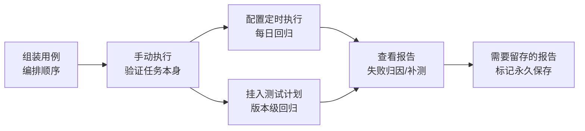

# 测试任务

> 测试任务是**批量执行用例的载体**：把一批[用例](用例管理.md)按顺序组织起来，选择环境与执行机后一次性执行，产出一份批次[报告](测试报告与分享.md)。任务是平台"执行层"的核心概念，上可被[测试计划](测试计划.md)编排，下可挂定时任务自动触发。

## 功能是什么

- 一个任务 = 基本信息（名称、负责人、标签、出错重测次数）+ **有序用例列表**。
- 任务按目录组织（任务有自己的目录树，与用例、接口的目录互相独立），支持多层级分类与拖拽调整。
- 每个任务有**项目内唯一的任务编号**（从 100001 起递增），编号常用于搜索和第三方系统对接定位。
- 同一个用例**可以多次加入同一任务**（在列表中出现多行），每行有自己的执行顺序号，报告中按"第几次出现"分别展示结果。
- 任务支持三种触发方式：**手动执行**（点"执行"按钮）、**定时执行**（配置一次或周期性调度）、**被[测试计划](测试计划.md)编排执行**。
- 每次执行产出一份报告；任务列表永远指向**最后一次报告**，历史报告可在"历史报告"页查看。

## 页面入口与界面分区

入口：左侧导航 **测试执行 → 测试任务**。

页面是"左树 + 右 Tab"结构：

- **左侧目录树**：任务目录，支持新建/重命名/删除目录、拖拽移动，右键目录可"新建任务"。
- **右侧 Tab 区**：
  - **任务列表**（固定 Tab）：当前目录下的任务清单，支持搜索、批量操作、自定义显示列。
  - **任务编辑 Tab**：点任务名打开，维护基本信息与用例列表；可同时打开多个任务的编辑 Tab。
  - **历史报告 Tab**：从任务行"更多操作 → 历史报告"打开，按时间列出该任务的全部历史报告。

### 任务列表列说明

| 列 | 含义 |
|---|---|
| 任务编号 | 项目内递增编号，100001 起 |
| 任务名称 | 带时钟图标的表示该任务配置了定时执行 |
| 任务状态 | 未执行 / 执行中 / 已完成 / 停止中 / 中断 |
| 任务进度 | 仅执行中显示，为实时进度条（每 3 秒自动刷新） |
| 执行结果 | 最后一次执行的结论：通过 / 失败（全部用例通过才算通过） |
| 执行环境 | 最后一次执行使用的环境 |
| 负责人 / 创建时间 / 用例数量 / 标签等 | 部分列默认隐藏，点列表右上角的列设置按钮可开启 |

搜索区支持按任务名称快速搜索；展开"更多搜索"可按任务状态、任务标签、**关联用例**（查出包含某个用例的所有任务）组合过滤。

> 列表的两个小特性：表头可按列排序（排序偏好会被记住，下次进入保持）；列设置按钮可自定义显示哪些列（配置保存在本机浏览器，换电脑需重配）。

## 核心概念

| 概念 | 说明 |
|---|---|
| 任务编号 | 项目内自动分配的递增编号（100001 起），全局唯一且不可修改；搜索、第三方对接都用它定位任务 |
| 串行执行 | 全部用例在一台执行机上按列表顺序逐个执行，前一个结束才跑下一个 |
| 并行执行 | 用例分配到多台执行机同时跑，整体耗时大幅下降；所有机器共享同一份报告 |
| 出错重测次数 | 任务级配置（0-5 次）：用例失败后自动重跑，重测通过则该用例记为成功。适合网络抖动感知的场景 |
| 用例标签 / 数据标签过滤 | 执行时可只跑"打了指定标签的用例"或"指定标签的数据集行"，实现一次任务多场景复用，见 [数据集与数据枚举](数据集与数据枚举.md) |
| 补测 | 只重跑上一份报告里**失败的用例**，结果写回原报告（不生成新报告） |
| 定时执行 | 给任务挂调度（执行一次/重复执行），由平台到点自动触发，产出报告的"报告分类"显示为"定时任务" |
| 历史报告 | 任务每次执行都留一份报告，可随时回看；默认定期清理，可标记永久保存 |
| 消息通知 | 执行完成后，若通过率低于设定阈值，向企业微信 / Teams 频道推送结果（需先在主平台配置消息通道） |

## 如何操作

### 创建任务并组装用例

1. 在左侧目录树选中目标目录，点列表上方"**新建任务**"（或右键目录 → 新建任务），打开任务编辑 Tab。
2. 填写基本信息：**任务名称**（必填，同目录下唯一）、**负责人**（必选）、**出错重测次数**（0-5）、**标签**。
3. 点"保存"。
4. 点"**添加用例**"打开选用例弹窗：可按目录浏览、按名称/优先级等筛选，勾选后确认；弹窗支持"仅显示未选用例"，标题实时显示已选中条数。若任务尚未保存，点"添加用例"会先自动保存再弹窗。
5. 用例列表展示每条用例的名称（点击可跳到用例编辑页）、优先级、用例状态、最近一次调试结果、所属目录；支持**拖拽排序**（决定执行顺序）、按优先级筛选、按名称搜索、单个移除与批量移除。

> 也可以在**用例列表页**勾选一批用例，用"创建自动化任务"一键生成任务（填任务名称、负责人、任务目录即可），适合"围绕一批新用例快速组任务"的场景。

### 手动执行

1. 任务列表行内点"**执行**"，弹出执行配置框（每次打开时上次的标签过滤条件不会保留，需重新选择）。
2. 依次选择：**执行环境**（必选）→ **执行方式**（串行/并行）→ **执行机**（串行选 1 台，并行选多台）→ 可选的用例标签 / 数据标签过滤 → 可选的消息通知（通过率 ≤ N% 时推送到企业微信或 Teams）。
3. 确认后任务进入"执行中"，列表出现实时进度条（每 3 秒自动刷新）；点"**查看报告**"可在新页签实时观看报告。
4. 执行中可点"**停止**"中断任务，状态经过"停止中"最终落为"中断"；已跑完的用例结果保留在报告里。
5. 任务执行期间该行"执行"按钮变为不可用，同一任务不能同时发起第二次执行。

### 补测失败用例

- 当任务最后一次执行为"已完成但有失败用例"或"中断"时，行内"更多操作"里出现"**补测**"。
- 补测只需选一台执行机，平台自动找出上一份报告中的失败用例重跑，结果合并回原报告；报告上会记录补测次数。
- 补测**沿用原报告的执行环境与标签过滤条件**，不需要（也不能）重新选择环境和标签。
- 若上次报告没有失败用例，补测会提示"无需补测"。
- 被**中断**的任务行内同样会出现"补测"入口，可基于中断时那份报告继续补跑，结果依然写回原报告。

### 配置定时执行

1. 行内"更多操作 → **定时执行**"打开定时配置框。
2. 配置：启用开关、描述、执行环境、执行方式与执行机、执行时间（**执行一次**＝指定日期时间；**重复执行**＝通过可视化 Cron 设置器配置周期）、消息通知。
3. 保存后到"**测试执行 → 定时执行**"菜单统一管理：列表按任务展示定时配置（任务名称、描述、环境、定时类型、**下次执行时间**、启用状态、修改时间），支持启用/禁用切换与删除；页面每 30 秒自动刷新。点任务名称可直接改定时配置。
4. 配置了定时执行的任务，在任务列表的名称旁会显示时钟图标。
5. "执行一次"的定时任务到期触发后，下次执行时间清空；"重复执行"按 cron 周期持续触发，直到被禁用或删除。

### 历史报告与报告导出

- 行内"更多操作 → **历史报告**"打开该任务的历史报告 Tab：每次执行一行，列包括任务名称（定时执行产生的带时钟图标）、报告分类（手动任务/定时任务）、用例数、成功数、失败数、通过率、任务状态、执行环境、执行时间、完成时间；列表每 10 秒自动刷新，点"查看报告"新页签打开。
- 历史报告默认会被平台定期清理；需要长期留存的在行内点"**永久保存**"（再次点击可取消）。
- 列表勾选多个任务后，"批量操作 → **导出报告**"可批量下载 Excel 报告；单个报告也可在报告页点"下载报告"。

### 导入 / 导出任务

- **导出**：勾选任务 → 批量操作 → 导出任务，得到一个 JSON 文件（含任务基本信息与用例关联）。
- **导入**：列表上方"任务导入"：浏览选择导出的 JSON 文件 → 选择导入目录 → 选择**覆盖模式**：
  - 覆盖：目标目录下同名对象被新数据覆盖；
  - 不覆盖：同名对象保留原数据，新导入的自动改名为"名称_2、名称_3"。

### 删除任务

- 行内"删除"或勾选后"批量删除"，删除后进入[回收站](回收站.md)（可在回收站还原或彻底删除）。
- **被[测试计划](测试计划.md)关联的任务不能删除**：删除时会弹出提示并列出关联的计划清单（计划 ID + 名称），需先到对应计划里"移除"该任务；批量删除时只要有一个任务被计划引用，整批都会被拒绝。
- 删除任务会同时删除它的定时执行配置（如有）；历史报告与回收站快照保留，还原后任务可继续使用。

## 使用场景与最佳实践

- **日常回归**：核心业务流程组一个任务，配"重复执行"定时任务每天跑，配合消息通知，通过率不达标自动推到群里。
- **版本提测**：按迭代把任务挂进[测试计划](测试计划.md)，统一配置环境与执行机，一次执行计划看整体完成度。
- **多环境验证**：同一任务分别在测试/预发环境各跑一次（执行时选不同环境即可，无需复制任务）。
- **跨项目迁移**：用导出/导入把验收通过的任务迁移到其它项目，导入时注意覆盖模式的选择（覆盖 or 自动改名）。
- **部分回归**：给用例打"冒烟""核心"等标签，执行时用标签过滤，同一个任务既能全量跑也能只跑冒烟集。
- **偶发失败处理**：先补测确认是否稳定复现，再在报告里做失败归因；确认是环境抖动引起的，可用"人工标记成功"修正通过率（见 [测试报告与分享](测试报告与分享.md)）。

## 注意事项

- **执行前先确认执行机在线**：并行执行时选了多台机器，若机器离线会导致任务卡住或部分用例未执行；"定时任务到点没跑"也优先排查执行机状态，见 [测试机管理](测试机管理.md)。
- 执行环境决定本次使用的域名、变量、数据库连接等，同一任务切换环境无需修改任务本体，见 [环境与配置管理](环境与配置管理.md)。
- 任务支持**批量移动**到其它目录（勾选 → 批量操作 → 批量移动），移动只改变目录归属，不影响任务内容、用例关联与历史报告。
- **并行退化**：并行执行时如果过滤后的用例不足 2 条，平台会自动退化为单机串行——"为什么并行只用了一台机器"先看用例数。
- **重测次数是任务级配置**：每次执行（手动、定时、计划触发）都会生效；重测通过记成功，但报告中能看到重测痕迹。
- **定时执行的任务删除时，定时配置会一并删除**；在"定时执行"管理页删除定时配置不会影响任务本体。
- 任务名称在**同目录下唯一**，改名前先确认没有被定时/计划引用带来的认知成本。
- 消息通知依赖主平台已配置的企业微信/Teams 消息通道，未配置时执行弹窗里不会出现通知开关。
- 执行弹窗中环境与执行机都是**必填**，不选无法提交；切换串行/并行时已选的执行机会尽量保留联动，减少重复选择。
- 任务/用例的编辑保存、删除等操作受[编辑锁](../03-实现逻辑/编辑锁机制.md)与功能权限控制（查看/编辑/删除/执行/导入导出分别授权）。

## 延伸阅读

- [测试任务实现](../03-实现逻辑/测试任务实现.md) —— 数据模型、执行编排、批次拆分、补测链路的代码级解析
- [测试计划](测试计划.md)、[测试报告与分享](测试报告与分享.md)、[数据集与数据枚举](数据集与数据枚举.md)、[测试机管理](测试机管理.md)、[回收站](回收站.md)
