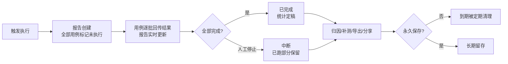

# 测试报告与分享

> 每次执行——[测试任务](测试任务.md)、单个用例、脚本调试、[测试计划](测试计划.md)——都会产出一份测试报告。报告按"**批次概要 → 用例 → 步骤 → 请求/响应**"层层展开，支持失败归因、导出 Excel、以及通过**免登录分享链接**发给他人查看。

## 功能是什么

- 报告是执行的完整留痕：跑了多少用例、通过多少、每个用例每个步骤的请求与响应、断言结果、执行日志。
- 报告**边执行边生成**：任务一开始执行就有报告，执行中打开能看到进度实时变化。
- 报告按来源区分类型：任务报告（串行/并行）、单用例执行、用例批量执行、用例调试、脚本调试、计划执行等；任务列表的"查看报告"和"历史报告"进入的都是任务报告。
- 报告提供两个提效能力：**失败归因**（给失败用例标记问题原因，含特殊的"人工标记成功"）和**导出 Excel**（单个或批量）。
- 报告可通过**分享链接**免登录查看：把链接发给没有平台账号的人（开发、项目经理），对方直接打开。

### 报告类型速览

| 类型 | 产生时机 | 入口 |
|---|---|---|
| 任务报告 | 任务手动/定时/计划触发执行 | 任务列表、历史报告、计划执行记录 |
| 单用例报告 | 用例列表/编辑页执行单个用例 | 用例的历史执行记录 |
| 批量报告 | 用例列表勾选批量执行 | 用例的历史执行记录 |
| 调试报告 | 用例/脚本编辑器内调试 | 调试面板 |
| 计划报告 | 计划执行时每个任务各产一份任务报告 | 计划的任务执行记录 |

## 报告的打开方式

| 入口 | 说明 |
|---|---|
| 任务列表 → 行内"查看报告" | 打开该任务**最后一次**执行的报告 |
| 任务列表 → 更多操作 → 历史报告 | 列出该任务全部历史报告，逐份打开 |
| [测试计划](测试计划.md) → 执行记录 → 任务执行记录 → 查看报告 | 打开计划执行中该任务的报告 |
| 用例列表/用例编辑页 | 单用例执行或调试后的报告 |
| 分享链接 | 免登录打开（来自导出的 Excel，见下文"报告分享"） |

报告一律在**新浏览器页签**打开，不占用主平台的工作区。

## 报告页布局

报告页从上到下分四块：

### 1. 执行汇总

一行关键信息：**任务状态**（执行中/已完成/已中断）、**执行方式**（串行/并行，仅任务报告）、**执行环境**、**开始/结束时间**、**总执行时长**、**通过率**。下方两个环形图：

- **用例分布**：成功 / 失败 / 未执行的数量占比；
- **接口覆盖率**（仅任务报告）：本次执行覆盖了多少接口——"已测/未测"对比，帮助评估回归充分度（口径见 [概览分析与消息](概览分析与消息.md)）。

右上角按钮（分享页不显示）：

- **永久保存 / 取消永久保存**：历史报告会被平台定期清理，标记永久保存的除外；
- **下载报告**：导出 Excel；
- **刷新页面**：执行中手动刷新进度。

### 2. 批次概要表

本次批次的统计行：任务名称、状态、用例数、成功数、失败数、未执行数、通过率、耗时，以及本次执行使用的**用例标签 / 数据标签过滤条件**（便于回溯"这次到底跑了哪些"）。### 3. 用例列表（左列）

- 顶部可按**全部用例 / 成功用例 / 失败用例**筛选，可按用例名称搜索。
- 每行显示用例名，**颜色即结论**：绿色＝成功，红色＝失败，灰色＝未执行；行内还可能带有执行机名称（灰色小标签）、归因结论（红色标签）、"人工标记成功"标记（绿色标签）。
- 点击用例名，右列加载该用例的步骤明细。
- 勾选失败用例后，可用"**批量设置原因**"统一归因；行首复选框默认隐藏，鼠标悬停失败行时显示。

### 4. 步骤明细（右列）

- 步骤按执行顺序排列：**成功的用例默认展开第一步，失败的用例默认展开第一个失败步骤**，其余点击展开。
- 每个步骤展示：执行结果、耗时、**请求数据**、**返回数据**（JSON 自动格式化）、**期望结果**（断言内容）、**错误信息**（断言失败明细、响应错误、脚本/SQL 错误）、开始/结束时间。
- 点"**日志**"打开该步骤的执行日志弹窗（按级别着色，弹窗可拖拽调宽度）。
- 若同一用例跑了多行数据集或经过多次重测，用例名上会标注数据行/重测信息，每一步都有独立明细。
- 右列顶部显示当前用例的完整目录路径，点击可在新页签打开用例编辑页（分享页无此入口）。

## 失败归因与"人工标记成功"

1. 在用例列表里点失败用例旁的**分析图标**（或勾选多条后"批量设置原因"），打开"错误原因分析"弹窗。
2. 选择**问题原因**（选项来自项目的"问题原因配置"，如环境问题、产品缺陷、用例问题等），填写详细描述，保存。
3. 已归因的用例在行内显示原因标签和分析人；分享页读者能看到归因结论。
4. **人工标记成功**是特殊归因：选择后该用例结果由失败改为成功，**报告通过率、饼图、导出的 Excel 全部按新结果重算**；之后若想撤销，重新打开归因改选其它分类即可回退。

> 典型用途：确认失败由环境抖动等"非产品问题"引起且不想重跑时，用标记修正通过率，同时保留原始错误信息供追溯。

## 报告导出（Excel）

- **单个导出**：报告页"下载报告"，得到一份 Excel，含"测试概述 + 测试用例"两部分。
- **批量导出**：任务列表勾选多个任务 → 批量操作 → 导出报告（只导出有报告的任务）。
- Excel 中带"**查看报告**"超链接，点击可在浏览器打开对应的在线报告——**这个链接就是分享链接**（免登录，见下节）。

## 报告分享（免登录链接）

- 分享链接的获取途径：**导出 Excel 时平台自动为每个报告生成一条分享链接**，嵌在 Excel 的"查看报告"列里。把链接单独复制出来发给他人即可。
- 打开分享链接看到的是**只读报告页**：布局与内部报告一致（汇总、饼图、用例、步骤明细都在），但没有永久保存/下载/刷新/归因等操作按钮。

| 能力 | 内部报告页 | 分享页 |
|---|---|---|
| 执行汇总、饼图、用例与步骤明细、日志 | 有 | 有 |
| 失败归因 / 人工标记成功 | 有 | 无 |
| 永久保存 / 下载报告 / 刷新页面 | 有 | 无 |
| 跳转编辑用例 | 有 | 无 |
| 登录要求 | 需要平台登录态 | 免登录 |

- **有效期 30 天**：超过后链接失效，打开提示"无效的链接"，需要重新导出 Excel 获取新链接。
- 每次导出都会生成**新链接**，旧链接在各自 30 天有效期内依然可用。
- 分享页展示的是报告生成时的内容；补测、归因等后续修改会同步反映到同一报告的分享页（链接指向报告本身，不是快照文件）。

## 报告的生命周期与保存策略

- **补测与断点续跑写回原报告**：补测失败用例不会产生新报告，而是覆盖更新原报告中对应用例的结果（报告上记录补测次数，历史过程留有补测记录）。
- 任务的"最后一次报告"会随补测不断变化；历史快照请到"历史报告"里按时间查看。
- **定期清理**：未标记永久保存的历史报告会被平台定期清理以控制存储；重要版本报告请及时"永久保存"。
- 用例被删除后，其历史报告仍可查看（用例路径只显示名称），报告数据不受影响。

## 使用场景与最佳实践

**推荐的读报告路径**：先看执行汇总的通过率与状态 → 饼图确认失败规模 → 用例列表切到"失败用例"→ 逐个点开失败用例，右列默认展开的就是第一个失败步骤 → 对照"期望结果"与"错误信息"定位断言差异 → 需要更多上下文时点"日志"看执行日志 → 最后做归因。

其它典型场景：

- **提测质量证明**：版本提测时执行回归任务，导出 Excel 附在提测单里——审阅人点 Excel 内的链接就能看到在线报告的完整步骤明细，比静态数字更有说服力。
- **跨团队协作**：把分享链接发给接口提供方开发，对方免登录直接看到失败步骤的请求/响应与错误信息，省去截图与复述。
- **版本留档**：里程碑版本的回归报告统一"永久保存"，避免被定期清理后无法回溯。
- **日报/周报口径**：通过率以"归因后"的数字为准——先完成失败归因（必要的用人工标记成功修正），再导出或截图，保证对外口径一致。

## 注意事项

- **执行中的报告**：统计数字（通过率、耗时、覆盖率）只对"已完成/中断"的报告可信；执行中这些值显示"暂无"或为中间值，以最终状态为准。报告页不会自动轮询刷新，执行中想看最新进度请点右上角"刷新页面"。
- **分享链接即凭证**：拿到链接的人无需登录即可查看完整报告（含请求/响应明细），涉及敏感数据时请谨慎外传；链接 30 天后自动失效。
- 导出 Excel 的"查看报告"链接同样有 30 天有效期，过期后 Excel 里的超链接会打不开，需重新导出。
- "人工标记成功"会改变统计口径，团队内建议约定使用规范（如必须填写备注、仅限已知环境问题），避免通过率失真。
- 报告中看到的"接口覆盖率"是按用例步骤引用的接口去重统计的，未挂接口定义的步骤（如纯脚本步骤）不计入。
- 同一用例在同一任务中加入了多次时，报告里按出现顺序分别成行、各自统计，互不影响。
- 报告页在新页签打开后，长时间停留再操作（如归因）可能因登录态过期失败，刷新页面即可恢复。

## 延伸阅读

- [测试报告与分享实现](../03-实现逻辑/测试报告与分享实现.md) —— 报告四级数据结构、批次聚合、分享链接机制、导出链路的代码级解析
- [测试任务](测试任务.md)、[测试计划](测试计划.md)、[批次结果聚合](../03-实现逻辑/批次结果聚合.md)、[概览分析与消息](概览分析与消息.md)
