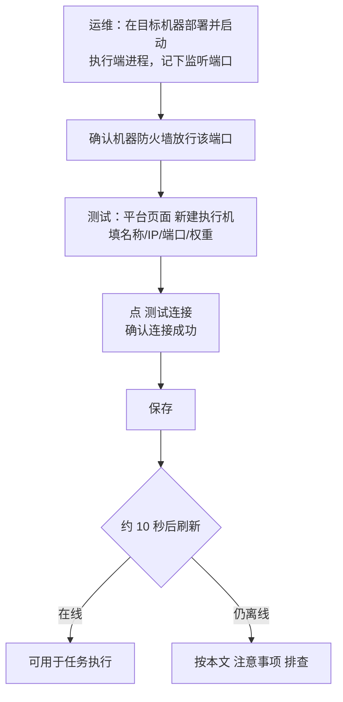

# 测试机管理

## 功能是什么

测试机（也叫**执行机**、执行端）是真正运行测试引擎、发出请求并采集结果的机器。平台的服务端负责管理和调度，执行机负责埋头执行——一个项目可以挂多台执行机分担压力。

本模块是执行机的**管理面**，提供：

- **登记**：把部署好的执行机（IP + 端口）注册到平台；
- **状态维护**：平台每 10 秒自动探测一次所有启用中的执行机，页面上实时反映"在线/离线"；
- **启用/禁用与权重**：控制哪些执行机参与任务、并行执行时各自分多少用例；
- **连通性自检**：登记或修改前可一键"测试连接"。

执行机领到任务后怎么跑、结果怎么回传，属于执行链路，见 [任务执行链路](../03-实现逻辑/任务执行链路.md)；本篇只讲"怎么把执行机管起来"。

## 页面入口与界面分区

入口：左侧菜单 **系统管理 → 执行机管理**。

| 区域 | 内容 |
|---|---|
| 搜索区 | 按名称或 IP 模糊搜索 |
| 列表列 | 执行机名称、执行机地址（IP:端口）、启用状态（启用/禁用）、在线状态（在线/离线）、权重（百分比） |
| 行操作 | 修改、禁用/启用、删除 |
| 右上按钮 | 新建执行机 |

**新建/编辑弹窗**字段：执行机名称（必填）、IP 地址（必填）、端口号（必填）、权重（10%~100%，步进 10%）、状态（启用/禁用）。弹窗左下角有 **测试连接** 按钮：填好 IP 和端口后先点它，提示"连接成功"说明该地址上确有执行端进程在监听，再保存。

### 默认执行机

全新环境第一次打开本页面时，列表里会自动出现一台**默认执行机**（指向服务端本机），开箱即用——不额外部署任何执行端，也能用服务端本机跑任务。默认执行机**不可修改地址、不可禁用、不可删除**。

## 核心概念

### 启用/禁用 vs 在线/离线

这是两个独立维度，别混淆：

| 状态 | 谁控制 | 含义 |
|---|---|---|
| 启用/禁用 | 用户在页面上手工切换 | 禁用后不参与自动探测，也不能被选去执行任务；数据保留，可随时启用回来 |
| 在线/离线 | 平台自动探测维护 | 在线 = 能正常通信、可以接任务；离线 = 连不上（进程没起、网络不通等） |

刚保存（新增或修改）的执行机会先显示"离线"，等平台下一轮探测（≤10 秒）通过后自动变"在线"。

### 执行机的身份标识

每台执行机的身份由**平台在登记时分配**，并在探测过程中自动下发给执行端进程——所以执行端进程重启、换机器重启都没关系，只要 IP:端口 和登记的一致，最多 10 秒就会被平台重新识别并拉回在线，**无需任何手工干预**。平台校验的不只是"端口通"，而是"端口后面确实是登记的那台执行机"，可防止 IP 被别的进程占用造成的张冠李戴。

### 权重

并行执行（选多台执行机跑同一批用例）时，平台按各机**权重比例**切分用例：两台权重 100 和 50 的机器，大约分走 2/3 和 1/3 的用例。权重反映的是机器的相对处理能力——CPU/内存强的机器给高权重。

### 执行端进程是"哑"的

运维视角只需要记住：在执行机上把执行端进程按指定端口启动起来，剩下的（身份分配、任务领取）全部由平台侧驱动。执行端启动后只监听端口等指令，不会主动连平台。

### 单台执行与多台并行

| 模式 | 说明 | 适用 |
|---|---|---|
| 单台执行 | 整批用例在一台执行机上跑完 | 日常回归、调试 |
| 多台并行 | 平台先逐台确认在线（至少两台可用），再按权重把用例切成多份同时跑 | 大批量用例、压测类场景 |

多台并行时若某台机器中途掉线，它分到的用例结果会缺失——大批量执行前先确认所有目标机器在线稳定。

## 如何操作

### 上线一台新执行机（运维 + 测试配合）

1. 运维在执行机上启动执行端进程（部署细节见 [部署与打包](../02-技术架构/部署与打包.md)），确认进程存活、端口在监听。
2. 平台页面 **新建执行机**，填写名称、IP、端口（必须与执行端启动端口一致）、权重、状态选"启用"。
3. 点 **测试连接** 自检，成功后 **保存**。
4. 等约 10 秒刷新列表，在线状态变绿即可用。

### 日常使用

- **临时摘机维护**：行操作点 **禁用**（二次确认）。正在跑的任务不受影响，新任务不会再分给它；维护完点 **启用** 恢复。
- **调整分担比例**：修改弹窗里调权重（如大促压测前把高性能机器调到 100%）。
- **下线**：点 **删除**。删除会自动把定时任务里对该执行机的引用一并清掉，但**不会打断正在执行的任务**。
- **并行执行**：任务的运行配置里勾选多台执行机即可按权重分流（要求至少两台在线可用）。

## 使用场景与最佳实践

1. **单机起步**：小团队直接用默认执行机，零部署成本；任务量变大便携式扩容。
2. **专机专用**：按业务线或网络区域分组部署执行机（如"支付区专用"），命名里带上区域/用途，选机时一目了然。
3. **权重贴着配置走**：权重按机器实际 CPU/内存比例设，避免弱机分太多用例拖慢整批。
4. **大任务前看一眼在线状态**：批量执行前先刷新本页确认目标机器全部在线，比任务失败后再排查省时。
5. **禁用代替删除**：临时下线的机器用禁用；删除适合"机器已退服不再回来"的场景。

## 注意事项

- **执行机显示离线，按顺序自查**：
  1. 执行机上的执行端进程是否还活着（没启动、崩溃退出都会离线）；
  2. 登记的 IP、端口与执行端实际监听是否一致（改端口后忘了同步修改登记是最常见原因）；
  3. 平台服务端到执行机的网络/防火墙是否放行该端口；
  4. 该端口是否被别的进程占用（平台上"测试连接"能通不代表是执行端——可能撞了别的服务；换一个干净端口最稳妥）。
- 刚保存的执行机显示离线是**正常的**，等约 10 秒自动探测即可，不要反复保存。
- 删除执行机**不会中断正在它上面跑的任务**，任务结果照常回写；但新任务不会再分配过去。
- 同一台物理机上不要在同一端口起多个执行端进程，会导致平台探测与任务下发互相干扰。
- 默认执行机跑在服务端本机上，只适合小任务量；生产高并发场景请部署独立执行机，避免拖垮服务端。
- 禁用中的执行机不做自动探测，页面上的"离线"对它没有参考意义——看启用状态即可。

## 延伸阅读

- [测试机管理实现](../03-实现逻辑/测试机管理实现.md) — 探测机制、身份下发与任务切分的代码实现
- [任务执行链路](../03-实现逻辑/任务执行链路.md) — 任务如何分发到执行机
- [执行端Runner详解](../03-实现逻辑/执行端Runner详解.md) — 执行端进程内部结构
- [任务执行问题排查](../05-常见问题/任务执行问题排查.md) — "任务没跑起来"的定位手册
