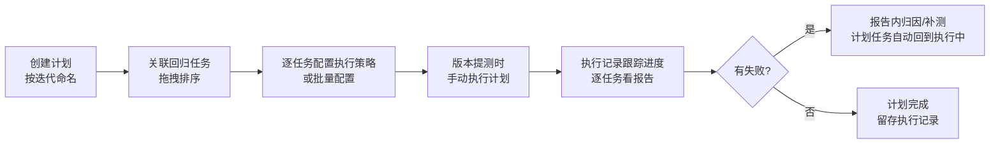

# 测试计划

> 测试计划是**在更高维度组织[测试任务](测试任务.md)的容器**：一个计划关联多个任务，为每个任务单独配置执行策略（环境、执行机、串/并行、标签过滤），一次"执行计划"按顺序把任务逐个跑完，形成一条**执行记录**。典型用法是按迭代/版本组织回归任务，跟踪整体完成度。

## 功能是什么

- 计划解决的是"**一组任务按固定顺序、各自独立的执行参数跑一遍**"的问题——手动跑任务一次只能跑一个，计划一次能跑一串。
- 计划本身只有名称和目录；它的内涵在**关联任务列表**上：每个被关联的任务都带着自己专属的一份**执行策略**。
- 点一次"执行"，平台生成一条**执行记录**，然后按列表顺序自动下发任务：前一个任务跑完（或中断）才发下一个。
- 每个任务在计划内产出的报告与手动跑任务**完全同构**，从执行记录里点进去就是标准报告页。
- 计划按自己的目录树组织（与任务目录、用例目录互相独立）——在"测试计划"菜单下建目录，不要到任务目录里找。
- 计划可以随时补挂/移除任务、调整策略，**已产生的执行记录不受影响**（记录里保存的是执行那一刻的任务与策略快照）。

### 计划 vs 任务 vs 定时执行

| 维度    | 测试任务       | 测试计划               |
| ----- | ---------- | ------------------ |
| 执行对象  | 一批用例       | 一批任务               |
| 执行参数  | 每次执行时临时选择  | 固化在每个任务的执行策略里      |
| 任务间顺序 | 不涉及        | 严格按列表顺序串行下发        |
| 定时触发  | 支持（定时执行菜单） | 暂不支持定时，需手动点"执行"    |
| 产出    | 一份批次报告     | 一条执行记录 + 每个任务各一份报告 |
|       |            |                    |

## 页面入口与界面分区

入口：左侧导航 **测试执行 → 测试计划**。

页面同样是"左树 + 右 Tab"结构：

- **左侧目录树**：计划目录，右键目录可新建计划、重命名、删除目录，拖拽可调整计划所在目录（与任务、用例的目录树相互独立）。
- **右侧 Tab 区**：
  - **计划模版**（固定 Tab）：计划列表。列有计划 ID、计划名称、任务数（已关联的任务数量）、创建人、创建时间；可按计划名称搜索，展开"更多搜索"按计划 ID、创建人过滤。行内操作：**执行**、**执行记录**、**删除**。列表底部的分页栏会显示当前目录下的计划总数；左侧目录树支持拖拽调整计划所在目录。
  - **计划编辑 Tab**：点计划名打开，维护基本信息与关联任务。
  - **执行记录 Tab**：点列表行内"执行记录"打开，标题为"XX执行记录"。列说明：

| 列 | 含义 |
|---|---|
| 执行记录名称 | 点击可进入该次执行的任务明细 |
| 任务进度 | "已完成任务数 / 计划关联任务总数"，直观反映计划推进程度 |
| 预期执行用例数 | 执行开始时按各任务策略（含标签过滤）算出的本次用例总数 |
| 执行状态 | 未执行 / 执行中 / 已完成 / 中断 |
| 创建人 / 创建时间 / 结束时间 | 由谁触发、何时开始、何时全部跑完 |

  - **任务执行记录 Tab**：从执行记录里点记录名称打开，标题为"XX任务执行记录"，列出该次执行中每个任务的明细：任务名称、报告分类（手动任务/定时任务）、实际执行用例数、成功数、失败数、用例执行通过率、任务状态、执行环境、执行时间、完成时间；行内"查看报告"打开该任务的标准报告。

## 核心概念

| 概念 | 说明 |
|---|---|
| 执行策略 | 计划内每个任务单独的一份执行配置：**执行环境、执行方式（串行/并行）、执行机、用例标签、数据标签**。策略挂在"计划-任务关系"上——同一任务在两个计划里可以用完全不同的环境/机器 |
| 执行记录 | 点一次"执行"产生的一次运行凭证，记录整体进度（已完成任务数/总任务数）、状态、起止时间 |
| 任务进度 | 执行记录上的"已完成任务 / 计划关联任务"计数，直观反映计划推进程度 |
| 预期执行用例数 | 执行开始时按策略（含标签过滤）算出的每个任务本次要跑的用例数 |
| 执行状态 | 未执行 / 执行中 / 已完成 / 中断，执行记录和记录内每个任务各有自己的状态 |

### 执行策略逐项说明

| 配置项 | 取值与影响 |
|---|---|
| 执行环境 | 决定本次执行使用的环境变量、域名、数据库连接等，见 [环境与配置管理](环境与配置管理.md) |
| 执行方式 | 串行＝该任务全部用例在一台执行机顺序跑；并行＝用例分配到多台执行机同时跑 |
| 执行机 | 串行选 1 台；并行必须选 2 台以上，机器离线会导致任务卡住 |
| 用例标签 | 只跑任务内打了这些标签的用例，留空＝全跑 |
| 数据标签 | 只跑匹配标签的数据集行，留空＝全跑，见 [数据集与数据枚举](数据集与数据枚举.md) |

任务自身的"出错重测次数"配置在计划执行中同样生效，无需在策略里重复设置。

## 如何操作

### 创建计划并关联任务

1. 计划列表上方点"**新建计划**"（或右键目录），打开计划编辑 Tab。
2. 填**计划名称**（必填，不超过 50 字）并保存；若未保存就点"关联任务"，平台会先自动保存再弹出选择框。
3. 基本信息区有"任务执行策略＝串行"的固定说明：**计划内的任务永远按列表顺序逐个执行**，并行只发生在单个任务内部（用例分配到多台执行机）。
4. 点"**关联任务**"打开"关联任务模版"弹窗：按任务编号/名称浏览勾选（**已在计划内的任务不会再出现在候选里**，即一个任务在同一计划中只能关联一次；但一个任务可以挂进多个不同计划）。
5. 关联后可**拖拽调整顺序**（序号列拖动），顺序即执行顺序；列表上方支持按任务编号、任务名称、负责人组合过滤，方便大计划里定位任务。
6. 不再需要的任务用行内"移除"或勾选后"批量移除"——移除只解除关联，不影响任务本体。

> 提示：已关联任务列表会显示每个任务的用例数与负责人，方便在配置策略前核对任务内容是否符合预期。

### 配置执行策略

1. 在"已关联任务"列表的"执行策略"列：未配置的任务显示红色警示图标和"**添加**"，已配置显示"**编辑/查看**"。
2. 点开配置框，与手动执行任务相同的选项：执行环境、串行/并行、执行机（并行须选 **2 台以上**）、用例标签、数据标签。配置框会回显上次保存的策略；未配置过的任务打开时是默认值（串行）。
3. 多个任务要用同一套策略时，勾选后点"**批量修改执行策略**"一次写入；如果用表头全选，则按当前过滤条件对筛选出的全部任务生效。
4. 策略随改随存，**不影响已产生的执行记录**（历史记录保留执行时的策略快照）。

### 执行计划

1. 计划列表行内点"**执行**"（按钮在请求返回前处于加载状态，防止重复触发）。
2. 若存在**未配置完整执行策略**的任务，会弹出"计划中存在无效任务，请设置任务执行策略"，点"去查看"自动打开计划编辑 Tab 补配。
3. 校验通过后提示"操作成功"，立即生成一条执行记录（初始状态"未执行"），随后平台自动按顺序下发任务——**接口很快返回，真正的执行完全异步**，到"执行记录"里看进度。
4. 执行记录页每 10 秒自动刷新，无需手动刷新页面；执行中的记录可点"**终止**"中断整个计划（已在跑的任务被停止，未开始的任务不再下发，已产出的报告保留，记录状态落为"中断"）。
5. 点执行记录名称进入"任务执行记录"，可看到每个任务的实际执行用例数、成功/失败数、通过率、执行环境、起止时间，行内"**查看报告**"新页签打开该任务的标准[报告](测试报告与分享.md)；该页同样每 10 秒自动刷新。

### 管理执行记录与计划

- 执行记录列表支持按名称、执行状态、创建人、起止时间搜索；记录可单条"删除"（连同任务明细一起删），删除不影响已生成的报告本体（报告仍可从任务的历史报告中查看）。
- 计划本身可在列表行内"删除"。**注意：计划删除不进[回收站](回收站.md)，删除后无法还原**，关联任务关系与全部执行策略一并丢失，请谨慎操作。
- 反向约束：被计划关联的**任务**在任务侧删除会被拦截并提示关联的计划清单（见 [测试任务](测试任务.md)）。

### 计划与任务的典型配合方式

一个常见误区是"把计划当成任务的定时器"——计划目前只能手动触发执行，周期性回归请用任务的[定时执行](测试任务.md)能力。计划的价值在于**编排与留痕**：它回答的是"这个版本跑了哪些任务、每个任务什么环境、整体通过率如何"，而不是"什么时候自动跑"。

## 使用场景与最佳实践

- **版本回归看板**：每个迭代建一个计划（如"V7.8 回归"），把本期要跑的回归任务全挂进去；提测后执行一次，用执行记录的"任务进度"和逐任务通过率向团队同步质量状态。
- **发布卡口**：上线前执行发布计划，任何一个任务失败都能在执行记录里直接点进报告定位；失败修复后用任务侧补测，计划进度自动续上。
- **多环境分层执行**：把"冒烟任务"排在计划最前、"全量回归"排后，冒烟失败可及早终止，不浪费执行机资源。
- **策略与任务解耦**：任务本体不带环境信息，计划里配策略——所以"同一个任务在每日巡检计划里跑测试环境、在发布计划里跑预发环境"不需要复制任务。
- **大批量任务统一改配**：环境切换（如执行机扩容）时用"批量修改执行策略"，避免逐条编辑。
- **沉淀回归资产**：每个版本的执行记录连同任务报告一起留存，季度复盘时按执行记录回溯各版本的通过率趋势与失败分布。

## 注意事项

- **计划内任务之间永远串行**：即使每个任务都配了并行，任务与任务也是一个跑完再发下一个；计划级没有"全部任务同时跑"的模式。
- **计划只能手动触发执行**：目前没有"定时执行计划"的入口。需要周期性计划级回归时，可改用 CI 定时调[开放平台OpenApi](开放平台OpenApi.md)逐个触发任务，或为关键任务单独配置定时执行。
- 计划编辑 Tab 中只有"计划名称"走顶部"保存"按钮（关闭未保存的 Tab 会提示保存）；关联任务、移除、拖拽排序、执行策略的修改都是**即时生效**的，不需要点保存。
- **执行机离线会导致计划卡住**：下发任务时若目标执行机离线/被禁用，该任务会停在"执行中"，后续任务一直等——发现计划长时间不动，先到[测试机管理](测试机管理.md)确认执行机状态，再考虑终止后重跑。
- 执行记录的"**终止**"按钮只在记录处于"执行中"时可用；已完成/中断的记录只能查看或删除。
- 任务执行记录里的"**实际执行用例数**"与计划执行前的"预期执行用例数"可以互相对照：两者差异通常说明标签过滤或执行中断改变了实际执行范围。
- **并行任务必须选 2 台以上执行机**，否则保存策略时会被拦截。
- **执行策略校验在执行时才做**：关联任务后可以暂不配策略，但点"执行"时只要有一个任务策略不完整就整体拒绝执行。
- 并行任务的标签过滤后若只剩 1 条用例，会自动降级为单机串行执行。
- **补测会联动计划状态**：对计划执行产生的报告做失败补测时，对应任务在执行记录里会重新变为"执行中"，计划进度随之回退——这是预期行为。
- 执行记录删除后不可恢复；计划删除同样不可恢复且不进回收站，两个删除操作都要二次确认。
- **同一计划内一个任务只能关联一次**（候选列表会自动排除已关联任务）；如果业务上需要"同一任务在一个版本里跑两遍"，请拆成两个计划或复制一个任务。
- 任务被多个计划引用时，**任何一个**计划的引用都会阻止该任务在任务侧被删除。
- 计划相关功能受权限控制（查看/编辑/删除/执行分别授权），按钮不可见时先找管理员核对权限。

## 延伸阅读

- [测试计划实现](../03-实现逻辑/测试计划实现.md) —— 执行记录数据模型、轮询下发机制、状态机的代码级解析
- [测试任务](测试任务.md)、[测试报告与分享](测试报告与分享.md)、[测试机管理](测试机管理.md)、[环境与配置管理](环境与配置管理.md)
