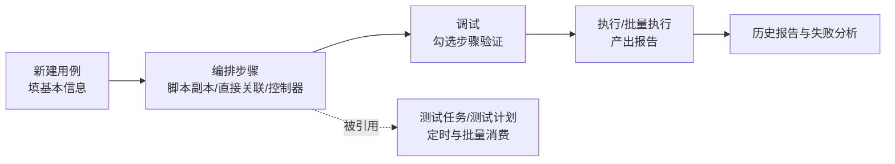

# 用例管理

## 功能是什么

**用例是把多个[脚本](脚本管理.md)按顺序与控制逻辑编排而成的完整测试场景**。如果说脚本是"一次调用"，用例就是"一段业务流程"：登录 → 创建订单 → 查询 → 断言 → 清理数据。

它解决的核心问题：

- **流程编排**：把单点调用串成有顺序、有分支、有循环的业务场景。
- **数据驱动**：步骤可绑定数据集，同一条用例跑多组数据（[数据集与数据枚举](数据集与数据枚举.md)）。
- **可追踪**：每次执行留报告，失败可填写原因分析，用例有状态、优先级、维护人管理。

一条用例从建设到消费的完整链路：

## 页面入口与界面分区

从主平台菜单进入"用例管理"，仍是"左树右签"布局：

- **左侧模块树**：用例目录（最多 8 层），支持拖拽、右键新建目录/重命名/删除/移动等。
- **用例列表页签**：搜索区 + 用例表格 + 批量操作。默认列有用例名称、用例类型、优先级、用例状态、执行结果、创建人、创建时间、用例描述；列设置里可再开出用例编号、执行方式、更新人、更新时间、标签。用例名称可直接在表格里点击修改（行内重命名）。
- **用例编辑页签**（点名称打开），上下两块：
  1. **基本信息**：用例名称、优先级、用例状态、用例类型、维护人、错误继续执行、用例标签、执行方式、用例描述。
  2. **测试步骤**：步骤表格 + 操作按钮区（用例调试、最近调试结果、添加步骤、添加控制器、批量操作）。
- **历史报告页签**：从列表"更多操作 → 历史报告"打开，按时间列出该用例的历次执行记录。

## 核心概念

| 概念 | 说明 |
|---|---|
| 步骤 | 用例的最小组成单位，一个步骤对应一次脚本调用。步骤可排序、启停用、单独绑定数据集 |
| 脚本副本 | 添加步骤时选"另存副本"：把脚本完整拷进本用例，改它不影响源脚本 |
| 直接关联 | 添加步骤时选"直接关联"：步骤共享引用脚本本体，改脚本所有引用的用例都生效 |
| 控制器 | 一种特殊步骤，管辖一组子步骤的执行逻辑，共四种：条件判断控制器（if）、迭代器（foreach）、循环控制器（指定次数）、while 控制器（条件 + 超时） |
| 步骤数据集 | 给单个步骤绑定/覆盖数据集；也可勾选多个步骤批量绑定或移除 |
| 用例状态 | 待评审 / 待设计 / 设计中 / 已启用 / 已废弃 / 已存档 |
| 优先级 | P0（最高）到 P4 |
| 维护人 | 用例的负责人；**用例"已存档"后只有维护人本人能修改** |
| 用例类型 | 正向用例 / 反向用例 |
| 错误继续执行 | 开启后某步骤失败仍继续执行后续步骤，否则失败即中止 |
| 执行方式 | 自动化执行 / 手动调试 |

四种控制器的用途对照：

| 控制器 | 语义 | 典型场景 |
|---|---|---|
| 迭代器（foreach） | 对一个列表型变量逐个元素循环执行子步骤 | 遍历查询结果逐条校验/清理 |
| 条件判断控制器（if） | 条件成立才执行子步骤 | 某步骤失败时跳过依赖步骤、按环境分流 |
| 循环控制器 | 子步骤固定执行 N 次 | 造数、固定次数重试 |
| while 控制器 | 条件成立期间反复执行，带超时兜底 | 轮询等待异步任务完成 |

控制器的配置（循环次数、判断条件、变量名、超时时间等）直接点击步骤表里的控制器行内联编辑。

## 如何操作

### 新建用例

1. 左侧选中目录，列表点"新建用例"，打开编辑页签。
2. 填基本信息（名称、优先级、状态、类型、执行方式为必填）。
3. 保存。注意：**添加第一个步骤前系统会要求先保存用例**（未保存的用例点"添加步骤"会自动先触发保存）。

### 编排步骤

1. **添加步骤 → 调用脚本**：弹出脚本选择窗口（左树右表，可搜索），勾选脚本后二选一：
   - **另存副本**：生成用例私有拷贝，步骤"脚本类型"列显示"脚本副本"。
   - **直接关联**：共享引用脚本本体，显示"直接关联"。
2. **添加步骤 → 调用用例步骤**：从其他用例里挑选现成步骤拷进当前用例（副本步骤会深拷贝，直接关联步骤只带引用）。
3. **添加控制器**：下拉选四种控制器之一。控制器在步骤表里显示为"开始行 + 结束行"包住内部步骤；把步骤**拖拽**进控制器区间即成为其子步骤。点击控制器行可编辑其配置（如循环次数、判断条件、超时时长），并可移除整个控制器（连带内部步骤）。
4. **调整顺序**：拖拽步骤行排序；控制器连同其内部步骤整体移动。
5. **改名/启停用**：步骤名称行内可改；"启用"开关控制该步骤是否参与执行。控制器被停用时其内部步骤联动不可操作。
6. **绑定数据**：步骤行内"添加数据/移除数据"管单个步骤；勾选多行后"批量操作 → 绑定数据集/移除数据集"批量处理。
7. 点"保存"（或 Ctrl+S）落盘整个用例。

> 步骤行内还有"复制"（把该步骤再拷一份进当前用例）和"移除"。点步骤的"关联脚本"列可打开抽屉查看/编辑该步骤的请求详情——副本步骤改的是用例内拷贝；同一脚本的副本被多个用例引用时，可把出参/断言改动一键同步到其他用例。

步骤表格的列含义：

| 列 | 说明 |
|---|---|
| 序号 | 展示顺序号，行首有拖拽手柄 |
| 步骤名称 | 行内可改；控制器行显示控制器配置编辑区 |
| 关联脚本 | 该步骤对应的脚本/副本名称，点击打开请求详情抽屉 |
| 关联数据 | 该步骤绑定的数据集与数据组名称，点击可改绑 |
| 脚本类型 | "脚本副本"或"直接关联" |
| 启用 | 开关控制步骤是否参与执行 |
| 操作 | 移除 / 添加数据（或移除数据）/ 复制 |

### 执行与调试

- **列表页执行**：行内"执行"或勾选后"批量执行"，弹窗选择执行环境、执行方式（串行/并行）、执行机后开始执行；执行中行内按钮变"停止"可中断。执行完成后"执行结果"列显示通过/失败，有报告时行内出现"查看报告"（新窗口打开报告页）。
- **编辑页调试**：勾选步骤后点"用例调试（N）"，选环境执行，仅跑勾选的步骤；"最近调试结果"可回看上一次调试。
- **历史报告**：列表"更多操作 → 历史报告"打开历史页签，列明每次执行的分类（用例执行/任务执行/用例批量执行/任务并行执行/用例调试执行）、结果与时间，可跳转查看报告。**注意：调试执行不进入历史记录；报告被定期清理后，历史记录仍在但报告打不开**。

### 批量管理（列表页"批量操作"）

添加标签、批量修改状态、批量修改优先级、批量绑定数据集、批量复制、批量移动、批量导出、批量执行、批量删除、**创建自动化任务**（把勾选用例直接生成[测试任务](测试任务.md)）。

批量操作对"已存档且你不是维护人"的用例不生效：系统会提示"勾选项包含被保护的用例"并自动忽略它们。

### 搜索用例

快捷搜索支持"名称/描述"；更多筛选可按用例名称、描述、状态、类型、优先级、执行方式、用例编号、创建人/更新人、时间区间、标签，以及**按关联脚本、按关联数据集反查用例**（两个关联条件同样互斥，选一个会自动清掉另一个）。

### 导入导出

"用例导入"弹窗上传平台自导出文件，选择导入目录、绑定服务与覆盖模式，并可指定关联脚本/接口/数据集的落位目录。**用例导入会自动连同关联的脚本、接口、数据集一起导入**。

### 用例分析（失败归因）

执行失败后，在报告详情里可针对"本次执行 × 该用例"填写失败原因与说明（原因分类由"问题原因配置"维护），便于统计失败分布。详见[测试报告与分享](测试报告与分享.md)。

## 使用场景与最佳实践

- **副本还是直接关联？** 需要为用例定制参数、且不希望被别处改动影响 → 另存副本；希望脚本修复一处、处处生效（如登录脚本）→ 直接关联。
- **控制器即流程语义**：轮询等待用 while（条件 + 超时），固定重试用循环控制器，遍历列表数据用迭代器，分支跳过用条件判断。细节见[控制器与流程编排](../04-复杂功能细节/控制器与流程编排.md)。
- **数据驱动**：把会变的取值抽到数据集，步骤绑数据集按列取数；一组用例换套数据即可回归另一套环境/业务口径。
- **善用批量入口**：列表页多选即可一键生成自动化任务，是"用例 → [测试任务](测试任务.md) → [测试计划](测试计划.md)"常规链路的第一步。
- **用状态与优先级管理盘点**：评审通过置"已启用"，下线置"已废弃"；确认不再改动的重要用例置"已存档"并指定维护人，防止被误改。
- **失败必归因**：任务执行失败后及时在报告里填用例分析，长期可统计出稳定性问题分布。
- **错误继续执行要谨慎开**：步骤间有数据依赖（后面步骤用前面步骤的出参）时开启会产生连环失败噪音；适合各步骤相互独立的盘点型用例。
- **反向用例单独标记**：异常流场景（鉴权失败、参数非法）建用例时类型选"反向用例"，便于按类型筛选与统计覆盖率。

## 注意事项

- **已存档保护**：用例为"已存档"时，非维护人打开是只读的，批量操作也会自动忽略这些用例并提示"勾选项包含被保护的用例"。把用例改为已存档的人会自动成为维护人。
- **编辑锁按用例粒度**：别人在编辑同一用例的任意步骤时，你打开该用例也是锁定只读（[编辑锁机制](../03-实现逻辑/编辑锁机制.md)）。
- **删除进回收站但还原有限**：删除用例会连同步骤一起删除，回收站只存用例本体快照，不要把回收站当版本管理（[回收站](回收站.md)）。
- **删除前留意任务**：用例可能已被测试任务引用，删除前先确认相关任务。
- **历史报告"有记录无报告"是常态**：报告有保留期，过期清理后历史记录里"查看报告"入口消失。
- 调试（编辑页勾选步骤执行）不产生历史记录，只在"最近调试结果"里留最近一次。
- 用例编号自动分配、删除不回填，规则同接口/脚本编号。
- 同一目录下用例名称唯一；批量导入与接口、脚本一样，全系统同一时间只允许一个导入任务。
- 执行中的用例列表会定时自动刷新执行状态，不需要手动刷页面。

## 延伸阅读

- [用例管理实现](../03-实现逻辑/用例管理实现.md) — 用例/步骤/历史报告数据模型、控制器存储结构、复制与删除级联
- [脚本管理](脚本管理.md) — 脚本副本与直接关联的上游概念
- [控制器与流程编排](../04-复杂功能细节/控制器与流程编排.md) — 四种控制器的执行语义
- [测试任务](测试任务.md) / [测试计划](测试计划.md) / [测试报告与分享](测试报告与分享.md) — 用例的下游消费方
- [数据集与数据枚举](数据集与数据枚举.md) — 步骤数据集的机制细节
