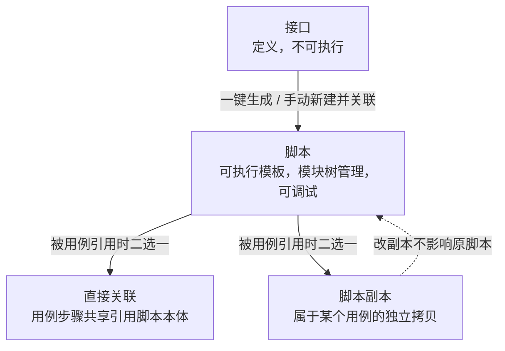

# 脚本管理

## 功能是什么

**脚本是平台里最小的可执行单元**。在[接口定义](接口管理.md)的基础上，填充具体的请求参数、前后置处理器、断言规则和数据集绑定后，形成的"可执行的请求模板"。

一句话区分两个概念：

- **接口**回答"这个端点长什么样"（协议、路径、参数骨架）——不可执行。
- **脚本**回答"这次调用具体发什么、断言什么"——可以点"调试执行"真实发请求并看响应。

脚本解决的典型问题：同一个登录接口，用 A 账号断言成功、用 B 账号断言锁定提示——这是两条脚本，共享一份接口定义。

## 脚本的三种存在形态

理解脚本模块的关键是分清它的三种形态：

- **脚本本体**：脚本管理页里维护的资产，可被任意多个用例引用。
- **直接关联**：用例步骤直接使用脚本本体，改脚本所有引用它的用例都生效。
- **脚本副本**：把脚本拷进某个用例的"私有拷贝"，改它不影响源脚本和其他用例。详见[用例管理](用例管理.md)。

> 注意区分两个容易混淆的"复制"：脚本列表页的"**复制**"是把一条脚本克隆成另一条脚本；脚本被拉进用例时生成的"**副本**"是挂在用例下的独立数据。两者互不相干。

三种形态的对照：

| 维度 | 脚本本体 | 直接关联步骤 | 脚本副本步骤 |
|---|---|---|---|
| 数据归属 | 脚本库 | 仍指向脚本本体 | 用例私有 |
| 改脚本影响谁 | —— | 所有引用它的用例 | 不影响任何副本 |
| 改步骤影响谁 | —— | 等于改脚本本体 | 只影响本用例 |
| 删除脚本的限制 | —— | 被引用时禁止删除 | 不拦删除 |
| 典型用途 | 资产沉淀 | 登录等强复用步骤 | 需要定制参数的步骤 |

## 页面入口与界面分区

从主平台菜单进入"脚本管理"，布局与接口管理一致——左侧模块树、右侧页签区：

- **脚本列表页签**：搜索区 + 脚本表格 + 批量操作。默认列有脚本名称、描述、协议类型、请求方式、请求路径、脚本状态、更新人、更新时间；列设置里可再开出脚本编号、创建人、创建时间、标签。
- **脚本编辑页签**（点脚本名称打开），从上到下三块：
  1. **基本信息**：脚本名称、状态、关联接口、协议类型、接口请求、脚本类型、标签、描述。
  2. **请求数据**：请求头/参数/请求体、前后置处理器、断言、数据集绑定（见 [前置后置处理器与断言](../04-复杂功能细节/前置后置处理器与断言.md)、[数据集与数据枚举](数据集与数据枚举.md)）；这一区的右上角是**执行环境选择 + 调试执行按钮**。
  3. **响应**：调试结束后展示响应体、响应头、断言结果、耗时等。

## 核心概念

| 概念 | 说明 |
|---|---|
| 脚本类型 | **功能脚本**（常规接口调用）与**空脚本**（不关联接口、不带请求，常用于占位或纯逻辑步骤） |
| 关联接口 | 脚本的来源接口。选择后自动带出名称、标签、协议、请求方式、路径和各协议参数；也可解除关联 |
| 脚本编号 | 项目内自动分配的递增编号，规则同接口编号 |
| 脚本状态 | 待评审 / 待设计 / 设计中 / 已启用 / 已废弃，仅作流程标记，**任何状态都能调试执行** |
| 断言 | 脚本的校验规则，独立存储；复制脚本、生成副本时会随脚本一起完整拷贝 |
| 数据集绑定 | 脚本可绑定数据集并指定取数列，执行时按列逐行取数（[数据集与数据枚举](数据集与数据枚举.md)） |
| 调试 | 选执行环境后真实发一次请求，页面轮询执行状态并展示结果 |

脚本状态的生命周期（仅作流程约定，系统不强制流转顺序）：

新脚本（手动新建或接口生成）初始状态一般是"待设计"；调通后推进到"设计中/待评审"；评审通过置"已启用"再交给用例引用；下线置"已废弃"。

## 如何操作

### 新建脚本

方式一（从接口派生，推荐）：

1. 到[接口管理](接口管理.md)列表勾选接口 →"批量操作 → 创建脚本"→ 选脚本目标目录。
2. 系统批量生成脚本，初始状态"待设计"，名称与接口同名（重名自动加序号后缀）。

方式二（手动新建）：

1. 脚本列表点"新建脚本"。
2. 填基本信息：名称、状态、脚本类型（功能脚本/空脚本）。功能脚本可直接点"关联接口"选择已有接口，一键带出请求定义；也可不关联接口从零填写。
3. 在"请求数据"区完善请求参数、前置/后置处理器、断言规则、数据集绑定。
4. 保存（按钮或 Ctrl+S）。

### 调试脚本

1. 打开脚本编辑页签，在"请求数据"区右上角选择**执行环境**（环境来自[环境与配置管理](环境与配置管理.md)，平台会记住你上次为该脚本选的环境）。
2. 点"**调试执行**"，按钮变为"调试中..."，可随时点"取消调试"。
3. 完成后下方"响应"区展示响应体、断言结果、响应码/耗时/日志等，并提示"调试完成"。
4. 调试不要求脚本处于特定状态；调试产生的报告有过期清理机制，过期后响应区显示无数据属正常。

### 编辑、复制、移动、删除

- **编辑**：编辑锁机制与接口一致——他人正在编辑时页面锁定、只读（[编辑锁机制](../03-实现逻辑/编辑锁机制.md)）。
- **复制**：行内"复制"在当前目录克隆，或勾选后"批量复制"到指定目录；副本自动命名为"原名_副本_xxxx"，断言随脚本一起拷贝。
- **移动**：勾选后"批量移动"选目标目录。
- **删除**：行内或批量删除，删除后进[回收站](回收站.md)。**限制：被用例以"直接关联"方式引用的脚本不能删除**，需先到用例里移除对应步骤；仅以副本方式被引用则不拦截（副本已是独立数据）。
- **批量修改状态**：勾选后"批量操作 → 批量修改状态"。
- **批量导出**：勾选后"批量操作 → 批量导出"。
- 模块树上右键脚本节点：重命名 / 删除 / 移动到；右键目录节点：新建目录 / 重命名 / 删除 / 展开全部下级 / 批量导出。

### 批量操作一览

| 批量操作 | 说明 |
|---|---|
| 批量修改状态 | 把勾选脚本统一置为某一状态 |
| 批量复制 | 复制到当前目录或选定目录 |
| 批量移动 | 改挂到另一个目录 |
| 批量导出 | 导出为平台自描述文件 |
| 批量删除 | 进回收站；被直接关联引用的会被拒绝 |

被他人锁定编辑中的脚本，批量修改状态/移动/删除会被拦截并提示"所选项已锁定，不可操作"。

### 导入与导出

- **导出**：勾选脚本 →"批量导出"，得到平台自描述格式文件（`testIn-script-export.json`）。
- **导入**："脚本导入"弹窗中选择文件、绑定服务、导入目录、覆盖模式（覆盖 / 不覆盖，规则同接口导入），并可指定关联接口、数据集的落位目录。**脚本导入会自动连同关联的接口和数据集一起导入**。同一时间全系统只允许一个导入任务。

### 搜索脚本

快捷搜索支持"名称/描述/路径"；更多筛选可按脚本名称、描述、路径、状态、协议、请求方式、时间区间、标签，以及**按关联接口、按关联数据集反查脚本**（注意：关联接口与关联数据集两个条件不能同时使用，选择其中一个会自动清掉另一个）。

## 使用场景与最佳实践

- **一脚本一职责**：每条脚本只验证一个点（一个业务动作 + 它的断言），用例负责编排，避免"巨型脚本"。
- **优先从接口生成脚本**：保证路径、参数骨架与接口定义一致；接口变更后人工检查派生脚本。
- **参数化用数据集，不要复制脚本**：同一接口要测多组数据时，绑数据集按列取数，而不是复制 N 条只改参数的脚本。
- **断言写在脚本里**：断言随脚本复制/生成副本时自动深拷贝，沉淀在脚本层可最大化复用。
- **出参提取在脚本层定义**：下游步骤要用的变量，在脚本的后置处理器里提取（[变量体系与参数提取](../04-复杂功能细节/变量体系与参数提取.md)）；同一脚本被多个用例以副本引用时，可在用例内把出参改动一键同步到其他用例的同名副本。
- **调通再进用例**：脚本先单独调试通过，再被用例引用，减少用例层排错成本。
- **空脚本的用途**：只做变量赋值、等待、逻辑占位等不需要发请求的场景，用空脚本保持步骤语义清晰。
- **用关联接口/关联数据反查**：接口要下线前，在脚本列表按"关联接口"筛出所有派生脚本，逐一确认处置方式；数据集调整前同理反查依赖它的脚本。
- **跨环境迁移用导入导出**：导出脚本时选"同时导入关联"思路——脚本导入会自动带上关联接口与数据集，迁移前确认目标项目的落位目录。

## 注意事项

- 脚本与接口是**弱引用**：接口后续修改不会同步到已生成的脚本。
- 脚本**没有版本/历史机制**：页面只能看到最近更新人和更新时间；误改只能靠回收站快照（删除时点）找回，重要脚本改动前建议先复制一份留底。
- 被用例"直接关联"引用的脚本删不掉，报错会提示存在关联；排查时到用例里找引用步骤。
- 仅以副本方式被引用时脚本可正常删除，副本不受影响（副本里只保留了来源记录）。
- 调试报告会被定期清理，脚本页看不到历史调试结果不代表没调试过。
- 编辑页长时间开着会持有编辑锁，离开前关闭页签。

## 延伸阅读

- [脚本管理实现](../03-实现逻辑/脚本管理实现.md) — 数据模型、副本机制、导入导出与开发注意事项
- [接口管理](接口管理.md) — 脚本的来源模板
- [用例管理](用例管理.md) — 脚本的编排层，直接关联与副本的完整说明
- [前置后置处理器与断言](../04-复杂功能细节/前置后置处理器与断言.md) / [变量体系与参数提取](../04-复杂功能细节/变量体系与参数提取.md) / [数据集与数据枚举](数据集与数据枚举.md)
