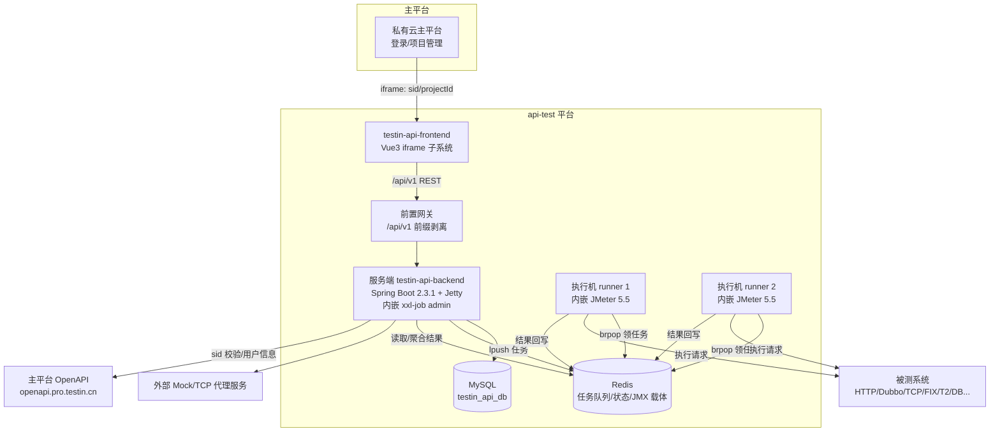

# 总体架构

## 平台定位

接口自动化测试平台（api-test）是私有云主平台的一个**子系统**，以 iframe 形式嵌入主平台运行。它覆盖接口测试的完整生命周期：接口定义 → 脚本编排 → 用例组装 → 任务/计划执行 → 报告分析，支持 HTTP、Dubbo、gRPC、TCP、WebSocket、FIX（证券）、恒生 T2 等多种协议，并提供 Mock、数据集驱动、环境管理等配套能力。

## 系统上下文

## 核心架构决策

### 1. 服务端与执行端分离（一份代码、两个产物）

同一份 Java 源码打出两个独立部署的服务：

- **服务端**：接 REST 请求、管数据、做调度，内嵌 xxl-job 管理台。
- **执行端（runner）**：非 Spring 应用，内嵌 JMeter 5.5 引擎，只干一件事——从 Redis 队列领任务并执行。

分离的原因：JMeter 执行是重资源操作（内存、线程、外部连接），不能与管理服务争抢资源；执行机可以水平扩容、就近部署到被测系统所在网络。详见 [后端双形态架构](后端双形态架构.md)、[执行端Runner详解](../03-实现逻辑/执行端Runner详解.md)。

### 2. 用 Redis list 做任务分发（而非 MQ / RPC）

服务端 `lpush` 任务到**每台执行机专属的 Redis list**，执行端 `brpop` 阻塞领取。JMX 脚本本体也作为 value 存在 Redis 里。这带来三个结果：

- 队列天然按机器隔离，调度就是"选哪台机器 lpush"；
- 没有引入额外中间件，Redis 是既有依赖；
- 代价是**没有持久化投递保证**——Redis 重启或 key 过期任务就丢，排查任务丢失先看 [Redis通信与Key设计](../03-实现逻辑/Redis通信与Key设计.md)。

### 3. 前端无独立登录，登录态来自主平台

前端通过 iframe URL query（`sid`、`projectId`）或 `postMessage` 拿登录态，请求拦截器自动注入到每个请求。后端不维护自己的用户体系，用户/权限数据来自主平台 OpenAPI。详见 [登录态与主平台集成](../03-实现逻辑/登录态与主平台集成.md)。

### 4. 后端无统一 URL 前缀

控制器直接是 `@RequestMapping("/case")` 这样的路径，`/api/v1` 前缀由生产前置网关剥离。本地直连后端开发时要开 vite 的 rewrite。详见 [前端HTTP层与响应约定](../03-实现逻辑/前端HTTP层与响应约定.md)。

## 代码工程一览

| 工程 | 技术栈 | 产物 | 说明 |
|---|---|---|---|
| `testin-api-backend` | Java 1.8 / Spring Boot 2.3.1 / Jetty / MyBatis / JMeter 5.5 | 服务端 jar + runner jar | `pom.xml` 与 `runnerPom.xml` 分别构建 |
| `testin-api-frontend` | Vue 3.2 / TS / Vite 3 / Element Plus 2.2 / Pinia | 静态资源（时间戳目录） | 必须 pnpm，dev 端口 3001 |
| `testin-plugin-t2` | — | 插件 | 独立工程，本知识库暂不展开 |

## 端口与地址速查

| 项 | 值 | 出处 |
|---|---|---|
| 服务端 HTTP | 8526 | `testin-api-backend/src/main/resources/application.yml` |
| 内嵌 xxl-job admin | 同 8526，路径 `/job` | `application.yml` xxl 配置段 |
| xxl-job 执行器 | 端口 8889，注册名 `testin-task-job-executor` | `application.yml` xxl 配置段 |
| 前端 dev server | 3001 | `testin-api-frontend/vite.config.ts` server 段 |
| 执行端默认 HTTP | 6254 | `testin-api-backend/startup_runner.sh`（`${HTTP_PORT:-6254}`） |

## 延伸阅读

- [后端双形态架构](后端双形态架构.md) — 两个产物如何构建与通信
- [前端架构](前端架构.md) — 前端工程结构与技术约束
- [任务执行链路](../03-实现逻辑/任务执行链路.md) — 全平台最核心的流程
- [部署与打包](部署与打包.md) — 产物布局与启动脚本
- [数据存储设计](../../数据库管理/接口自动化/数据存储设计.md) — MySQL / Redis 各自存什么
