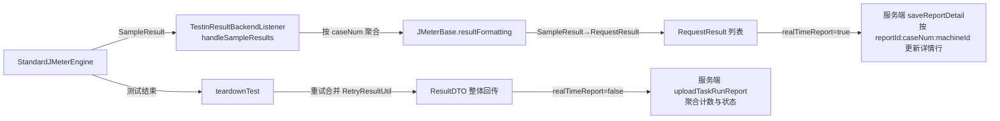

# JMX生成与解析

## 概述

平台自己的数据结构（用例、步骤、前后置、断言、环境变量）不直接执行，而是先转换成 JMeter 的内存模型 `HashTree`，再序列化成 JMX XML 字符串传输/执行。执行结果**不读 jtl 文件**——平台给每个测试计划挂一个 JMeter `BackendListener`（`TestinResultBackendListener`），采样结果在内存里直接转成平台的 `RequestResult` / `ResultDTO` 结构回传。本文分两段：①平台结构 → JMX 的生成；②JMeter 采样结果 → 平台报告结构的解析。

相关代码集中在 `src/main/java/cn/testin/service/jmeter/`、`src/main/java/cn/testin/entity/vo/request/`、`src/main/java/io/metersphere/jmeter/`。

## 一、平台结构 → JMX

### 1. TestinElement 树模型

平台所有可执行节点的基类是 `TestinElement`（`src/main/java/cn/testin/entity/vo/request/base/TestinElement.java`）：

- 用 `@JsonTypeInfo(property = "clazzName")` 做多态反序列化，每个子类把全限定类名写进 `clazzName` 字段；数据库存的步骤定义、前端传来的调试报文都是这棵树的 JSON；
- 每个节点持有 `LinkedList<TestinElement> hashTree`作为子节点，整棵树与 JMeter `HashTree` 同构；
- 子类按 JMeter 组件一一对应，都在 `entity/vo/request/element/` 下：`TestinTestPlan`（测试计划）、`TestinThreadGroup` / `TestinSetUpThreadGroup`（线程组）、`TestinCase`（用例，带 `caseNum`）、`TestinHTTPSamplerProxy`、`TestinJDBCSampler`、`TestinDubboSampler`、`TestinFixSampler`、`TestinTCPSampler`、`TestinWebSocketSampler`、`TestinIfController`、`TestinLoopController`、`TestinWhileController`、`TestinTransactionController`、`TestinJSR223PreProcessor/PostProcessor`、`TestinAssertions`、`TestinExtract` 等 40+ 个。

### 2. 双层转换：TestinElement 树 → HashTree → JMX 字符串

```
RunParams + ParameterConfig
      │  ElementUtil.assembleBaseTestElements   （拼树：查库/展开数据集/注入环境）
      ▼
TestinTestPlan(TestinElement 树)
      │  generateHashTree → 各节点 toHashTree     （递归转成 JMeter 组件）
      ▼
org.apache.jorphan.collections.HashTree
      │  TestinElement.getJmx → SaveService.saveTree
      ▼
JMX XML 字符串（存 Redis / 本地直接跑）
```

- **拼树**：`ElementUtil.assembleBaseTestElements`（`src/main/java/cn/testin/entity/vo/request/ElementUtil.java`）按类型构建 `TestinTestPlan → TestinThreadGroup → [TestinCase × N]`；用例的步骤、数据集展开（一条数据集生成一份步骤副本）、重测断言注入都在这一步完成。`ElementUtil` 有 5500+ 行，是拼树逻辑的总仓库。
- **转 HashTree**：`generateHashTree`（`TestinElement.java`）从根节点开始递归调每个节点的 `toHashTree(HashTree, List<TestinElement>, ParameterConfig)`。每个子类负责把自己翻译成对应的 JMeter 组件并 `tree.add(...)`，例如：
  - `TestinTestPlan.toHashTree`（`element/TestinTestPlan.java`）→ `org.apache.jmeter.testelement.TestPlan`，全局变量写成 `TestPlan.userDefinedVariables`（`ElementUtil.addGlobalVariablesProcessor`）；
  - `TestinThreadGroup.toHashTree`（`element/TestinThreadGroup.java`）→ JMeter `ThreadGroup`；
  - `TestinCase.toHashTree`（`element/TestinCase.java`）→ 把用例包成一层事务/控制器，`caseNum`、`caseId` 等元数据挂在节点属性上（结果回传时靠它们对位）；
  - `TestinHTTPSamplerProxy.toHashTree`（`element/TestinHTTPSamplerProxy.java`）→ `HTTPSamplerProxy`，同时把该步骤的前后置处理器、断言、提取器挂到自己的子树。
- **序列化成 JMX**：`TestinElement.getJmx`（`TestinElement.java`）用 `SaveService.saveTree(hashTree, outputStream)` 输出标准 JMX XML。这个方法加了 `synchronized`——`SaveService` 全局共享别名表，并发序列化会互相污染，**不要图快去掉这个锁**。

### 3. 执行端还原

执行端拿到 JMX 字符串后用 `SaveService.parseHashTreeFromString`（`src/main/java/org/apache/jmeter/save/SaveService.java`）还原 HashTree（`RunnerTestExecuteService.java`）。注意这个 `SaveService` 是项目内 `org.apache.jmeter.save` 包下的**覆盖类**（overlay，与 JMeter 官方类同名同包，靠 classpath 顺序覆盖官方实现），平台对它做过定制；同理还有 `org.apache.jmeter.threads.JMeterThread`、`org.apache.jmeter.util.GlobalVariableUtil`（执行端全局变量命名空间工具，`src/main/java/org/apache/jmeter/util/GlobalVariableUtil.java`，namespace 即 reportId）。

### 4. 引擎初始化与 BackendListener 注入

- JMeter 引擎初始化：`JmeterService.init`（`src/main/java/cn/testin/service/jmeter/JmeterService.java`）加载 `jmeter/bin/jmeter.properties`、设置 `JMETER_HOME`。默认 home 是 classpath 下的 `jmeter/` 目录（`getJmeterHome`），即 `src/main/resources/jmeter/`（内含 `bin/jmeter.properties`、`lib/ext/` 下的平台插件 jar：`testin-plugin-all.jar`、`Testin_ApacheJMeter_functions-5.5.jar`、`jython-standalone-2.7.2.jar` 等）。
- 执行前 `JMeterBase.addBackendListener`（`src/main/java/io/metersphere/jmeter/JMeterBase.java`）往 HashTree 根部挂一个 JMeter `BackendListener`，classname = `TestinResultBackendListener`，并把 `REPORT_ID / TEST_ID / RUN_MODE / MACHINE_ID / PLAN_ID / 补测标记 / 步骤总数 / 通知参数` 等全部塞进 listener 的 `Arguments`——这些参数在 JMX 之外传递，是结果回传时还原上下文的依据。
- 计划 ID 等 null 值经 JMX 序列化后会变成字符串 `"null"`，`addBackendListener` 里统一归一为空串（注释），新增参数时沿用这个约定。

## 二、JMeter 采样结果 → 平台结构



关键转换逻辑：

1. **采样收集与用例切分**：`TestinResultBackendListener.handleSampleResults`（`listener/TestinResultBackendListener.java`）把 `SampleResult` 按 `caseNum` 分组——caseNum 变化即认为上一个用例执行完，触发一次实时落库。所以**每个步骤的 caseNum 必须在拼 JMX 时正确设置**，错一个就会导致两个用例的报告串行。
2. **SampleResult → RequestResult**：`JMeterBase.getRequestResult`（`JMeterBase.java`）提取 URL、方法（`getMethod` 按 sampler 数据识别 HTTP/DUBBO/SQL 等）、请求/响应体与头、断言结果（从 `customerAssertionResultList` 读取平台自定义断言）、JMeter 变量（`JMeterVars`）。超过 20MB 的二进制响应体不入库。`Transaction=` 前缀的事务控制器结果会被递归拍平（`transactionFormat`）。
3. **过滤自动生成采样**：`ResultParseUtil.isNotAutoGenerateSampler`（`service/jmeter/tools/ResultParseUtil.java`）过滤平台自己注入的环境初始化采样（`PRE_PROCESSOR_ENV_` / `POST_PROCESSOR_ENV_` 前缀），不让它们出现在报告步骤里。
4. **重试合并**：任务配置了自动重测（retestNum）时，同一步骤会有多条采样；`teardownTest` 里 `RetryResultUtil.clearLoops` + `mergeRetryResults`按"最后一次结果为准"合并；服务端落库时按"步骤 id 与首步相同则开启新一轮重测"的约定重置内容（`TestReportService.saveReportDetail`）。
5. **控制台日志**：`FixedCapacityUtils`（`service/jmeter/tools/FixedCapacityUtils.java`）是一个容量 100 的 LRU 缓存，按时间戳存 JMeter 运行日志片段，`teardownTest` 时汇总成报告的 console 字段。
6. **脚本模式例外**：`SCRIPT` / `CALLAPI` 模式下 listener 在执行开始就 return，不做按用例的实时聚合；脚本结果最终走 `TestScriptExecutionResultService.saveExecutionResult`（`service/execution/TestScriptExecutionResultService.java`）写脚本执行结果表。

## 关键代码位置表

| 环节 | 类 / 方法 | 位置 |
|---|---|---|
| 元素基类 | TestinElement（toHashTree/getJmx/generateHashTree） | src/main/java/cn/testin/entity/vo/request/base/TestinElement.java |
| 拼树总入口 | ElementUtil.assembleBaseTestElements | src/main/java/cn/testin/entity/vo/request/ElementUtil.java |
| 用例列表组装 | ElementUtil.assembleTestCaseList | src/main/java/cn/testin/entity/vo/request/ElementUtil.java |
| 数据集展开 | ElementUtil.generateStepByDataSet | src/main/java/cn/testin/entity/vo/request/ElementUtil.java |
| TestPlan 转换 | TestinTestPlan.toHashTree / getPlan | src/main/java/cn/testin/entity/vo/request/element/TestinTestPlan.java |
| 用例转换 | TestinCase.toHashTree | src/main/java/cn/testin/entity/vo/request/element/TestinCase.java |
| HTTP 步骤转换 | TestinHTTPSamplerProxy.toHashTree | src/main/java/cn/testin/entity/vo/request/element/TestinHTTPSamplerProxy.java |
| 引擎初始化 | JmeterService.init / getJmeterHome | src/main/java/cn/testin/service/jmeter/JmeterService.java |
| 引擎启动 | LocalRunner.run | src/main/java/io/metersphere/jmeter/LocalRunner.java |
| BackendListener 注入 | JMeterBase.addBackendListener | src/main/java/io/metersphere/jmeter/JMeterBase.java |
| 结果监听 | TestinResultBackendListener | src/main/java/cn/testin/service/jmeter/listener/TestinResultBackendListener.java |
| 结果转换 | JMeterBase.getRequestResult / resultFormatting | src/main/java/io/metersphere/jmeter/JMeterBase.java |
| 采样过滤 | ResultParseUtil.isNotAutoGenerateSampler | src/main/java/cn/testin/service/jmeter/tools/ResultParseUtil.java |
| JMX 反序列化 | SaveService.parseHashTreeFromString（overlay 类） | src/main/java/org/apache/jmeter/save/SaveService.java |

## 注意事项与坑

1. **项目里有 JMeter 同名 overlay 类**：`org.apache.jmeter.save.SaveService`、`org.apache.jmeter.threads.JMeterThread`、`org.apache.jmeter.util.GlobalVariableUtil` 都是平台改写版，靠 classpath 顺序覆盖官方 jar。升级 JMeter 依赖或调整打包（`lib/` 顺序）时这些类可能静默失效，症状是 JMX 反序列化失败或变量回传丢失。
2. **`getJmx` 的 synchronized 不能去掉**：`SaveService.saveTree` 共享静态状态，并发序列化多个 JMX 会互相污染。
3. **caseNum 贯穿全链路**：拼树时生成（`ElementUtil`）、执行时随 SampleResult 传播、回传时按它聚合、落库时按 `reportId:caseNum:machineId` 对位。任何新增步骤类型都要保证 caseNum 正确透传。
4. **`JmeterService.addDebugListener`是死代码**：私有方法无人调用；调试结果的实时展示不走 `TestinDebugListener`，别被类名误导。
5. **JMX 不写文件**：平台全程用 JMX 字符串（内存/Redis），不落 .jmx 文件，也没有解析 jtl 的逻辑；排查执行问题时想拿到 JMX，去 Redis `JMETER_JMX_ID:{machineId}:{reportId}` 里 GET（执行完会被 runner 删除）。
6. **新增步骤类型的改动面**：`entity/vo/request/element/` 新增 TestinElement 子类（实现 toHashTree）+ `ElementUtil` 拼树分支 + 前端步骤定义 + 必要时扩展 `JMeterBase.getRequestResult` 的方法识别，四处要同步。
