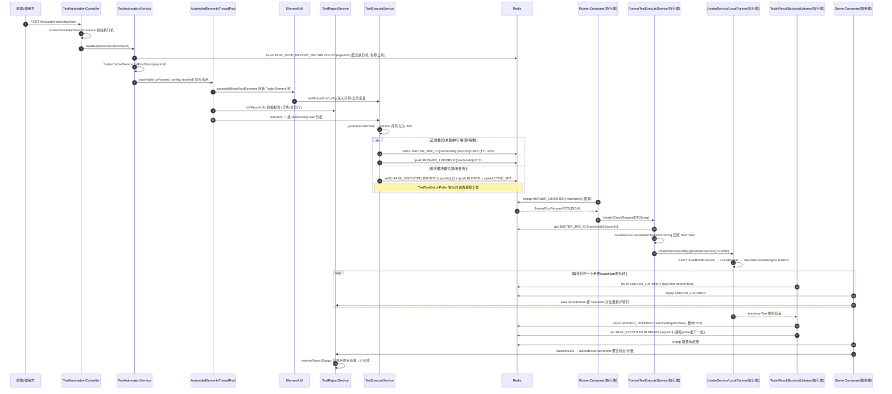

# 任务执行链路

## 概述

本文描述平台最核心的一条链路：从用户点击"执行"到报告落库的完整过程。链路横跨**服务端**（`cn.testin.Application`，Spring Boot）与**执行端 runner**（`cn.testin.runner.RunnerApplication`，非 Spring），两端通过 Redis list + 序列化 DTO 通信（见 [Redis通信与Key设计](Redis通信与Key设计.md)），执行引擎是内嵌 JMeter 5.5（见 [JMX生成与解析](JMX生成与解析.md)），多批任务的下发节奏由 [批次结果聚合](批次结果聚合.md) 控制。

整条链路可以概括为 8 步：

1. Controller 接收执行请求，校验执行机连通性；
2. `TestAutomationService.run` 组装 `RunParams` / `ParameterConfig`，**同步**调用 `AssembleElementsThreadPool.assemble`；
3. `ElementUtil.assembleBaseTestElements` 把用例/任务/脚本组装成 `TestinElement` 树；
4. `TestReportService.initReportInfo` 预插报告主表 + 报告详情行（`exeResult` 为空，作为"未执行"槽位）；
5. `TestExecuteService.taskRun` 把 `TestinElement` 树转成 JMeter `HashTree` 再序列化成 JMX 字符串；
6. JMX 写入 Redis（key 按 `machineId + reportId`），DTO 通过 `ServerProducer` lpush 到该执行机专属队列；
7. 执行端 `RunnerConsumer` brpop 拿到 DTO → 从 Redis 取回 JMX → 内嵌 JMeter 执行；
8. 执行结果经 `TestinResultBackendListener` → `RunnerProducer` → 服务端 `ServerConsumer` → `TestReportService` 落库。

## 两种执行位置、三种下发模式

代码里存在"**在哪台 JVM 里跑 JMeter**"的区分，读代码前必须先建立这个认知：

| 执行位置 | 触发方式 | 说明 |
|---|---|---|
| **远程执行机**（默认） | 用例执行/调试、任务执行、任务补测、断点续跑、批量执行、并行执行 | JMX 经 Redis 发到 runner，runner 内嵌 JMeter 执行 |
| **服务端本地** | 脚本调试（`SCRIPT`）、UI 自动化调接口（`CALLAPI`） | 服务端 JVM 自己起 JMeter 跑，不经过执行机队列 |

判断分支在 `TestExecuteService.taskRun`（`src/main/java/cn/testin/service/execution/TestExecuteService.java`）：`type == callApi` 时直接把 `hashTree` 塞进 DTO 调 `JmeterServiceConfig.getJmeterService().run(runRequest)` 本地执行并 return；其余类型走 Redis 下发。

远程下发又分两种模式（`sendJmeterRunRequestDTOToExecutionMachine`，`TestExecuteService.java`）：

- **正常模式**（`batchIndex == null`）：JMX 直接写 `getJmeterRunIdRedisKey(machineId, reportId)`，DTO 立即 lpush 到执行机队列。
- **批次缓冲模式**（`batchIndex != null`）：任务超过 50 条用例时被拆成多批（`TestTaskConstants.MAX_CASE_COUNT = 50`，`src/main/java/cn/testin/commons/constants/TestTaskConstants.java`），所有批次先入 Redis 缓冲队列，由 `TestTaskBatchPoller` 每 3s 轮询逐批下发——同一时刻一个报告只有一个批次在执行机上跑。详见 [批次结果聚合](批次结果聚合.md)。

运行模式枚举有两个，容易混淆：

- `ApiRunMode`（`src/main/java/cn/testin/commons/constants/ApiRunMode.java`）：`SCRIPT / CASE / TASK / BATCH / CALLAPI` 等，标记"这次运行是什么粒度"，会原样传进 JMeter 的 BackendListener 参数 `RUN_MODE`，决定结果回传后走哪个落库分支。
- `TestReportConstants`（`src/main/java/cn/testin/commons/constants/TestReportConstants.java`）：报告类型 `script / case / task / batch / parallel / debug / callApi / plan`，同时定义报告状态 `0 未开始 / 1 执行中 / 2 已完成 / 3 中断`。

## 全链路时序图

## 逻辑详解

### 1. 触发入口

`TestAutomationController`（`src/main/java/cn/testin/controller/TestAutomationController.java`）暴露全部执行入口：

| 端点 | 方法 | 说明 |
|---|---|---|
| `POST /test/automation/task/run` | `taskRun` | 单执行机任务执行，先 `runnerCheckMachineConnection` 校验执行机 |
| `POST /test/automation/task/parallel` | `taskParallelRequest` | 多执行机并行，`assignTasks` 按权重拆分用例 |
| `POST /test/automation/task/supplementalTest` |  | 任务补测（只重跑失败用例，复用原 reportId） |
| `POST /test/automation/testCase/run` |  | 单用例执行 |
| `POST /test/automation/testCase/call_api/run` |  | UI 自动化平台调接口执行（服务端本地跑） |
| `POST /test/automation/testCase/debugRun` |  | 用例调试（runType=debug） |
| `POST /test/automation/testCase/batchRun` |  | 用例批量执行 |
| `POST /test/automation/script/run` |  | 脚本执行/调试（服务端本地跑） |
| `POST /test/automation/stop` |  | 停止执行 |
| `POST /test/automation/resume` |  | 断点续跑 |

### 2. TestAutomationService.run —— 总装配入口

`run(RunParams)`（`src/main/java/cn/testin/service/execution/TestAutomationService.java`）做四件事：

1. **登记执行机**：把 `machineId` lpush 到 `TASK_STOP_REPORT_MACHINEIDLIST:{reportId}`（TTL 24h），停止任务时按这个 list 找到要给哪些执行机发 HTTP 停止请求；
2. **构建 `ParameterConfig`**：环境 id、项目 id、数据集标签、前置/后置失败策略（`oem_pre_post_script_check`）等；
3. **初始化执行状态缓存**：`StatusCacheService.initExeStatus(reportId)`；
4. **调用组装**：`AssembleElementsThreadPool.assemble(...)`，随后立即 `getResponseData` 把 `{type, reportId}` 返回给前端。前端拿到 reportId 后轮询报告接口看进度。

### 3. 组装与报告预初始化

`AssembleElementsThreadPool.assemble`（`src/main/java/cn/testin/config/exec/AssembleElementsThreadPool.java`）：

- 调 `ElementUtil.assembleBaseTestElements`（`src/main/java/cn/testin/entity/vo/request/ElementUtil.java`）生成 `TestinTestPlan → TestinThreadGroup → TestinCase → 步骤` 的元素树；环境解析在 `TestExecuteService.setGlobalEnvConfig`（`TestExecuteService.java`）完成，HTTP 服务器、数据源、各协议配置、全局变量、全局前后置/断言都塞进 `ParameterConfig`；
- 从元素树提取用例清单（`caseId + caseNum`，caseNum 是用例在任务内的位置编号，**后续结果对位落库全靠它**）；
- 调 `TestReportService.initReportInfo`（`src/main/java/cn/testin/service/TestReportService.java`）：写报告主表（状态=执行中）、按 `用例数 × 数据集行数` 预插报告详情行（`exeResult` 为空）、回填任务表 `executionStatus=1`、写任务-报告关系表；
- **任务类型且非补测**走 `taskRunByCase`：按每批 50 条用例拆分元素树；`multiBatch = 批数 > 1`，多批时每个批次带 `batchIndex = i+1` 进入缓冲模式，单批时 `batchIndex = null` 直接下发。

### 4. JMX 生成与下发

`TestExecuteService.taskRun`（`TestExecuteService.java`）：

- `request.getTestElement().generateHashTree(config)` 把 `TestinElement` 树递归转成 JMeter `HashTree`（每个元素类自己实现 `toHashTree`）；
- `getJmx(hashTree)` 用 `SaveService.saveTree` 把 HashTree 序列化成 JMX XML 字符串（`src/main/java/cn/testin/entity/vo/request/base/TestinElement.java`）；
- 构造 `JmeterRunRequestDTO`（testId、reportId、runMode、machineId、补测标记、消息通知参数等），发给 `sendJmeterRunRequestDTOToExecutionMachine`：
  - 缓冲模式：JMX 与 DTO 分别写 `TASK_EXECUTED:JMX:{reportId}:{i}` / `TASK_EXECUTED:DTO:{reportId}:{i}`（TTL 24h），批次序号 lpush 到 `TASK_EXECUTED:BUFFER:{reportId}`，reportId 加入 `TASK_EXECUTED:ACTIVE_SET`；
  - 正常模式：JMX 写 `JMETER_JMX_ID:{machineId}:{reportId}`（TTL 24h），然后 `ServerProducer.servicePublish` 把 DTO JSON lpush 到 `RUNNER_LINTERER:{machineId}`（`src/main/java/cn/testin/config/redisConfig/ServerProducer.java`）。

### 5. 执行端接收与执行

- `RunnerConsumer.runnerJedisLinter`（`src/main/java/cn/testin/runner/jedisConfig/RunnerConsumer.java`）在本机专属队列上 `brpop(0, ...)` 死循环，拿到 DTO JSON 后交给 `RunnerTestExecuteService.JmeterCheckRequestDTO`；
- `RunnerTestExecuteService.jmeterRun`（`src/main/java/cn/testin/runner/service/RunnerTestExecuteService.java`）：按 DTO 里的 `machineId + reportId` 从 Redis 取回 JMX，`SaveService.parseHashTreeFromString` 还原 `HashTree`，交给 `JmeterServiceConfig.getJmeterService().run(dto)`，执行完删除 JMX key；
- `JmeterService.run`（`src/main/java/cn/testin/service/jmeter/JmeterService.java`）→ `ExecThreadPoolExecutor.addTask`（10 线程池 + 10000 队列 + 缓冲区回补调度，见 `src/main/java/cn/testin/config/exec/ExecThreadPoolExecutor.java`）→ `ExecTask.run` → `runLocal`（`JmeterService.java`）：给 HashTree 挂 `TestinResultBackendListener`，`new LocalRunner(hashTree).run(reportId)` 起 `StandardJMeterEngine`（`src/main/java/io/metersphere/jmeter/LocalRunner.java`），引擎实例缓存在 `JMeterEngineCache.runningEngine`供停止用；
- `ExecTask` 随后 `PoolExecBlockingQueueUtil.take(reportId)` 阻塞最长 10 分钟（`src/main/java/cn/testin/config/exec/ExecTask.java`），等 listener 在测试结束时 `offer` 一个 `RUN-END` 信号（`src/main/java/cn/testin/config/exec/PoolExecBlockingQueueUtil.java`），超时则清理引擎缓存。

### 6. 结果回传与落库

`TestinResultBackendListener`（`src/main/java/cn/testin/service/jmeter/listener/TestinResultBackendListener.java`）是 JMeter BackendListener，两端用的是同一个类，但行为按运行位置分叉：

- **过程中实时落库**：`handleSampleResults`按 `caseNum` 聚合采样结果，caseNum 变化说明上一个用例执行完 → `saveReportDetail()`包装成 `JmeterRunResponseDTO`（`realTimeReport=true`），**执行机上**通过 `RunnerProducer` lpush 到服务端队列 `SERVER_LINTERER`；`CALLAPI` 本地模式则直接拿 Spring bean 落库；
- **整批结束**：`teardownTest`做重试合并（`RetryResultUtil`）、收集控制台日志、最后一个用例补一次实时落库，然后：
  - 脚本模式 → `TestScriptExecutionResultService.saveExecutionResult` 写脚本执行结果表；
  - CALLAPI → 直接 `saveResults`；
  - 其他（远程执行机）→ lpush 整体 DTO 到 `SERVER_LINTERER`，并且任务模式非补测时删除批次执行中标记 `TASK_EXECUTED:RUNNING:{reportId}`——这是批次轮询继续发下一批的信号；
- **服务端接收**：`ServerConsumer`（`src/main/java/cn/testin/config/redisConfig/ServerConsumer.java`）启动时起一个线程在 `SERVER_LINTERER` 上 brpop，`realTimeReport=true` 走 `TestReportService.saveReportDetail`（按 `reportId:caseNum:machineId` 对位更新预插的详情行），否则 `TestResultService.saveResults`（`src/main/java/cn/testin/service/execution/TestResultService.java`）按 runMode 分发到 `uploadCaseRunReport` / `uploadTaskRunReport` 做最终聚合（详见 [批次结果聚合](批次结果聚合.md)）。

注意：`TestinResultBackendListener.convertToXML/convertFromXML`名字叫 XML，实际是 Jackson JSON 序列化。

### 7. 停止链路

`TestAutomationService.stopRun`（`TestAutomationService.java`）：

1. 用例/任务/计划状态置为"停止中"，报告置为"中断"（`StopExecThread.updateDB`，`src/main/java/cn/testin/config/exec/StopExecThread.java`）；
2. 清理该报告的批次缓存 key（JMX/DTO/BUFFER/RUNNING/ACTIVE_SET）；
3. `taskStopper`：从 `TASK_STOP_REPORT_MACHINEIDLIST:{reportId}` 取出所有执行机，逐台发 HTTP `GET http://{ip}:{port}/stopTask?reportId=..&testId=..&type=..`；
4. 执行端 `RunnerService.stopTaskRunner`（`src/main/java/cn/testin/runner/service/RunnerService.java`）起 `StopExecThread`：从 `JMeterEngineCache.runningEngine` 找到引擎 `stopTest(true)`（找不到会等 3 次 × 3 秒），并清掉该 reportId 的执行端全局变量命名空间（`GlobalVariableUtil.removeNamespace`）。

### 8. 补测与断点续跑

- **补测**（`taskSupplementalTest`，`TestAutomationService.java`）：复用原 reportId，只把失败用例重新下发，`supplementId` 区分第几次补测；详情行回写按 `reportId + caseNum + machineId + supplementId` 对位。
- **断点续跑**（`resumeRun`）：仅支持 task 类型、且任务处于"执行中断"状态；找详情行中 `exeResult` 为空的用例整例重跑；续跑前用 `ElementUtil.recomputeTaskCaseNumMap` 重算 `caseNum→caseId` 与原报告逐位比对，任务在中止期间被改过则拒绝续跑（`validateTaskUnchangedForResume`）；多执行机场景按原 machineId 分组下发。

## 关键代码位置表

| 环节 | 类 / 方法 | 位置 |
|---|---|---|
| 执行入口 | TestAutomationController | src/main/java/cn/testin/controller/TestAutomationController.java |
| 总装配 | TestAutomationService.run | src/main/java/cn/testin/service/execution/TestAutomationService.java |
| 元素树组装 | AssembleElementsThreadPool.assemble | src/main/java/cn/testin/config/exec/AssembleElementsThreadPool.java |
| 元素树构建 | ElementUtil.assembleBaseTestElements | src/main/java/cn/testin/entity/vo/request/ElementUtil.java |
| 报告预初始化 | TestReportService.initReportInfo | src/main/java/cn/testin/service/TestReportService.java |
| 按用例分批 | AssembleElementsThreadPool.taskRunByCase | src/main/java/cn/testin/config/exec/AssembleElementsThreadPool.java |
| JMX 生成+下发 | TestExecuteService.taskRun / sendJmeterRunRequestDTOToExecutionMachine | src/main/java/cn/testin/service/execution/TestExecuteService.java |
| 服务端→Redis | ServerProducer.servicePublish | src/main/java/cn/testin/config/redisConfig/ServerProducer.java |
| 执行端接收 | RunnerConsumer.runnerJedisLinter | src/main/java/cn/testin/runner/jedisConfig/RunnerConsumer.java |
| 执行端执行 | RunnerTestExecuteService.jmeterRun | src/main/java/cn/testin/runner/service/RunnerTestExecuteService.java |
| JMeter 启动 | JmeterService.runLocal / LocalRunner.run | src/main/java/cn/testin/service/jmeter/JmeterService.java / src/main/java/io/metersphere/jmeter/LocalRunner.java |
| 结果监听 | TestinResultBackendListener | src/main/java/cn/testin/service/jmeter/listener/TestinResultBackendListener.java |
| 服务端接收结果 | ServerConsumer.startServerRedisLinterThread | src/main/java/cn/testin/config/redisConfig/ServerConsumer.java |
| 结果分发 | TestResultService.saveResults | src/main/java/cn/testin/service/execution/TestResultService.java |
| 实时详情落库 | TestReportService.saveReportDetail | src/main/java/cn/testin/service/TestReportService.java |
| 任务报告聚合 | TestReportService.uploadTaskRunReport | src/main/java/cn/testin/service/TestReportService.java |
| 停止 | TestAutomationService.stopRun / taskStopper | src/main/java/cn/testin/service/execution/TestAutomationService.java |
| 断点续跑 | TestAutomationService.resumeRun | src/main/java/cn/testin/service/execution/TestAutomationService.java |

## 注意事项与坑

1. **`AssembleElementsThreadPool` 名不副实**：`TestAutomationService.run` 里注释写"异步执行组装过程"，但实际是**同步**调用 `assemble()`（`TestAutomationService.java`），类里的 `threadPool` 字段（`AssembleElementsThreadPool.java`）没有任何地方使用。组装大任务（几百用例 × 数据集展开）时 HTTP 请求线程会被一直占住。
2. **caseNum 是结果落库的唯一锚点**：预插详情行→执行回写全靠 `reportId:caseNum:machineId` 对位（`TestReportService.java`）。任务执行中改任务（增删用例/调顺序）会导致 caseNum 错位——`saveReportDetail` 做了 caseId 对位校验，不匹配会拒绝写入并打 error 日志。
3. **JMX 与 DTO 分离传输**：JMX 走 `JMETER_JMX_ID:{machineId}:{reportId}`（TTL 24h），队列里只有 DTO。执行端取不到 JMX 会直接 return（`RunnerTestExecuteService.java`），任务静默丢失——JMX key 过期或被执行机外的 Redis 清库都会触发。
4. **convertToXML 不是 XML**：结果回传的方法名叫 XML，实际是 Jackson JSON（`TestinResultBackendListener.java`）。改序列化方式时两端（runner 的 `RunnerProducer`、服务端的 `ServerConsumer`）必须一起改一起发版。
5. **CALLAPI / 脚本调试在服务端本地跑 JMeter**：这两种模式不经过执行机，服务端自己就是执行引擎；`TestinResultBackendListener` 里靠 `CommonBeanFactory.getBean(...)` 拿 Spring bean 落库——这个 listener 类在两端被复用，改它时要意识到它跑在两个进程里。
6. **停止的 10 分钟边界**：`PoolExecBlockingQueueUtil.take` 最多等 10 分钟（`PoolExecBlockingQueueUtil.java`），超时后 `ExecTask` 清理引擎缓存；此时如果引擎还在跑，停止请求会找不到 engine（`StopExecThread` 最多等 9 秒）。
7. **`task_finish` HTTP 回调**：报告完成后服务端会对每台相关执行机发 `/task_finish?reportId=` 清执行端全局变量（`TestReportService.java`），执行机端口不通时会打 error 但不影响报告。
8. **任务执行期间不要重启服务端 Redis 连接外的组件**：`ServerConsumer` 的 brpop 线程用的是 `BackendJedisPoolManager` 的原生 Jedis（不是 Spring 的 RedisTemplate），连接断了只会循环打"报告结果落库失败"日志，没有重连告警，见 [任务执行问题排查](../05-常见问题/任务执行问题排查.md)。
