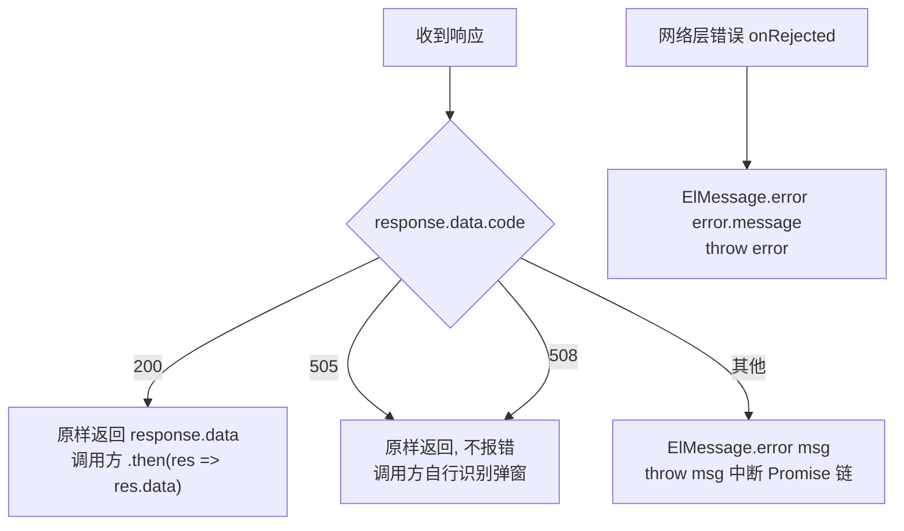

# 前端HTTP层与响应约定

## 概述

前端全部业务请求收敛到**唯一一个 axios 实例**（`src/utils/Http.ts` 导出的 `http` 对象），业务代码只引用 `src/api/*.ts` 里的封装函数，不允许自己 new axios。这一个实例承担三件横切工作：

1. **请求拦截器自动注入登录态/项目上下文**：`projectId / sid / userId` 注入 body 或 params，同时写入 `Sid`、`projectId` 请求头——业务代码永远不手动传这三个字段。
2. **响应拦截器统一消化 `code` 约定**：`200` 成功返回 data；`505 / 508` 原样透传给调用方做业务弹窗；其余 code 统一 `ElMessage` 报错并 throw。
3. **新页签场景的 sessionStorage 兜底**：报告页在新页签打开时 Pinia store 是空的，拦截器从 `sessionStorage.store` 恢复上下文。

baseURL 是相对路径 `api/v1`（**无前导 `/`**），生产环境由前置网关把 `/api/v1` 前缀剥掉再转给后端——**后端 controller 没有任何 `/api/v1` 统一前缀**。dev 环境靠 vite proxy 转发。

## 逻辑详解

### 实例与封装

`Http` 类（`src/utils/Http.ts`）对 axios 包了五个方法：`get/put/post/patch/delete`，泛型 `R` 标注 `data` 的业务类型。唯一实例：

```ts
export const http = new Http('api/v1')   // src/utils/Http.ts
```

`baseURL` 不带前导 `/` 是有意的：页面部署在网关的某个路径下时，相对路径能跟随当前页面 base 拼接；代价是**路由在非根路径时相对 baseURL 的解析依赖部署形态**，联调时如果发现请求打到了奇怪的路径，先检查浏览器地址栏当前 hash 路由之外的 base。

### 请求拦截器：上下文注入

`src/utils/Http.ts`，规则矩阵：

| 请求形态 | 注入位置 | 注入内容 |
|---|---|---|
| data 已是对象（POST/PUT/PATCH） | `config.data` 前面展开 | `{projectId, sid, userId, ...原data}` |
| params 已是对象（GET/DELETE 带参） | `config.params` 前面展开 | 同上 |
| GET 且无 params | 新建 `config.params` | 同上 |
| POST/PUT/DELETE 且无 body | 新建 `config.data` | `{projectId, sid, userId}` |
| 所有请求 | `config.headers` | `Sid = store.sid`、`projectId = store.projectId` |

注意注入是**展开在前**：`{projectId, sid, userId, ...config.data}`——调用方自己在 data 里传同名字段会覆盖注入值（`src/utils/Http.ts`）。

上下文来源（`src/utils/Http.ts`）：

```ts
let store = useStore()
store = store.projectId ? store : JSON.parse(sessionStorage.getItem('store') || '{}')
```

即 Pinia store 为空（新页签首请求）时从 `sessionStorage.store` 恢复。这个 sessionStorage 是 `src/main.ts` 通过 `store.$subscribe` 在**每次 state 变化时全量写入**的。报告页从列表 `window.open` 新页签（如 `src/views/case/CaseList.vue`），新页签首屏请求就靠这个机制拿到 projectId/sid。

### 响应拦截器：code 约定

`src/utils/Http.ts`（第一个响应拦截器）：



- **`200` 成功**：后端 `ResponseResult` 的默认 code 就是 200（`src/main/java/cn/testin/commons/Response/ResponseResult.java`）。
- **`505 / 508` 半成功态透传**：这两个码定义在 `ResponseErrorEnum`（`src/main/java/cn/testin/commons/constants/ResponseErrorEnum.java`）：`505=计划中无效的任务`、`508=无法删除计划中的任务`。它们需要调用方弹带数据的确认框（如 `PlanListTable.vue` 执行计划遇 505 弹"去查看"，`TaskListTable.vue` 删除任务遇 508 列出关联计划），所以拦截器不能统一报错，原样返回由页面判断 `res.code`。
- **其他 code**（含后端 `TIException` 抛出的 500、`GlobalExceptionHandler` 兜底的 500）：统一 toast `msg` 并 throw，业务 `.then` 不会执行，`.catch` 通常也不用再提示。
- 之后还挂了**第二个响应拦截器**（`src/utils/Http.ts`）：成功直通、失败直接 rethrow——里面 429/401/400/500 的分类提示整段被注释掉了，等于一个占位空管道，别指望它做 HTTP 状态码处理。

### dev 代理与"改本地后端要开 rewrite"

`vite.config.ts`：

```ts
server: {
  host: '0.0.0.0',
  port: 3001,
  proxy: {
    '/api/v1': {
      target: 'http://api-test.pro.testin.cn',   // 默认连测试环境网关
      changeOrigin: true,
      secure: false,
      // rewrite: path => path.replace(/^\/api\/v1/, '')   // ← 连本地后端时取消注释
    }
  }
}
```

- 默认 target 是测试环境网关，网关自己会剥 `/api/v1`，所以 rewrite 注释着。
- **target 改成本地后端 `http://127.0.0.1:8526` 时必须打开 rewrite 那行**——后端 controller 的路径没有 `/api/v1` 前缀，不剥掉会全部 404。文件里还留着几个注释掉的历史 target（`vite.config.ts`），切换时注意只放开一个。
- dev 端口固定 3001，`host 0.0.0.0` 允许局域网访问。

### 不走统一实例的例外

少数场景绕过 `http` 实例，直接用裸 axios 或原生手段：

- **文件下载/导出**：`downloadFileByApi`、`batchExportByApi`（`src/api/common.ts`）裸 `axios.get/post`，因为要拿 `content-disposition` 响应头拼下载——这两个请求**手动拼了 `Sid/projectId` 请求头**，且 URL 手写 `api/v1/...`。
- **文件上传**：`uploadApi`（`src/api/common.ts`）走统一实例，但 URL 里拼 sid（`/upload/${store.sid}`）、自带 `multipart/form-data` 头。

新增"下载类"接口时照抄前者的手写头模式；普通接口永远不要学它。

## 关键代码位置表

| 位置 | 作用 |
|---|---|
| `testin-api-frontend/src/utils/Http.ts` | `Http` 类，五方法封装 |
| `testin-api-frontend/src/utils/Http.ts` | 唯一实例，baseURL `api/v1` |
| `testin-api-frontend/src/utils/Http.ts` | 请求拦截器：三字段注入 body/params + Sid/projectId 请求头 |
| `testin-api-frontend/src/utils/Http.ts` | 响应拦截器：200 成功 / 505、508 透传 / 其余 toast+throw |
| `testin-api-frontend/src/utils/Http.ts` | 第二响应拦截器（空管道，占位） |
| `testin-api-frontend/src/main.ts` | `store.$subscribe` 把 store 全量持久化到 sessionStorage |
| `testin-api-frontend/vite.config.ts` | dev 代理配置与 rewrite 开关 |
| `testin-api-backend/src/main/java/cn/testin/commons/Response/ResponseResult.java` | 后端响应体结构，code 默认 200 |
| `testin-api-backend/src/main/java/cn/testin/commons/constants/ResponseErrorEnum.java` | 500/505/508 等业务码定义 |
| `testin-api-backend/src/main/java/cn/testin/commons/handler/GlobalExceptionHandler.java` | 异常 → code/msg 的统一出口 |

## 注意事项与坑

- **`code === 200` 才算成功**，与同公司另一套系统（`code === 0` 成功）完全不同，跨系统移植代码时这是高频翻车点。
- **注入是"展开在前"可被覆盖**：`{projectId, sid, userId, ...data}` 的顺序意味着业务方在 data 里显式传 `projectId` 会赢。定时任务保存等接口会故意这么干（传任务归属人的 sid），读代码时注意区分。
- **新页签首请求偶发 projectId 为空**：`sessionStorage.store` 是上一个页签写入的；如果用户直接复制报告 URL 到全新浏览器窗口（无 sessionStorage），拦截器注入的就是空值，后端 `KeyInterceptor` 会抛"无效的 Sid"。这是分享场景要走 skey 免登链路的原因之一，见 [登录态与主平台集成](登录态与主平台集成.md)。
- **DELETE 请求容易丢三字段**：`http.delete` 第二参数是 params（`Http.ts`）；如果调用方既没传 params 也没传 data，拦截器走 `method==='delete' && !config.data` 分支注入 data（`Http.ts`）——后端如果用 `@RequestParam` 接收就拿不到，只能用 `@RequestBody` 或从 header 读。新增 DELETE 接口前后端要对齐取参方式。
- **改本地后端 404 全灭**：99% 是忘了开 `vite.config.ts` 的 rewrite 注释。
- **错误消息被双重 toast 的风险**：拦截器已经 toast 了非 200 的 msg，业务 `.catch` 里再 `ElMessage.error(err)` 就会弹两次；`PageInteraction.ts` 的 `saveItem/deleteItem` 已经按"catch 里不再提示"的约定写（注释掉了），新代码保持一致。
- **505/508 不是错误而是业务分支**：调用方必须显式判断 `res.code`，否则会当成功处理（拿到的是错误语义的数据）。
- 后端如何从这些注入位置（header/params/body）解析 sid 与 projectId，见 [后端请求处理管线](后端请求处理管线.md)；响应码在后端的产生路径（`TIException` → `GlobalExceptionHandler`）同上。
