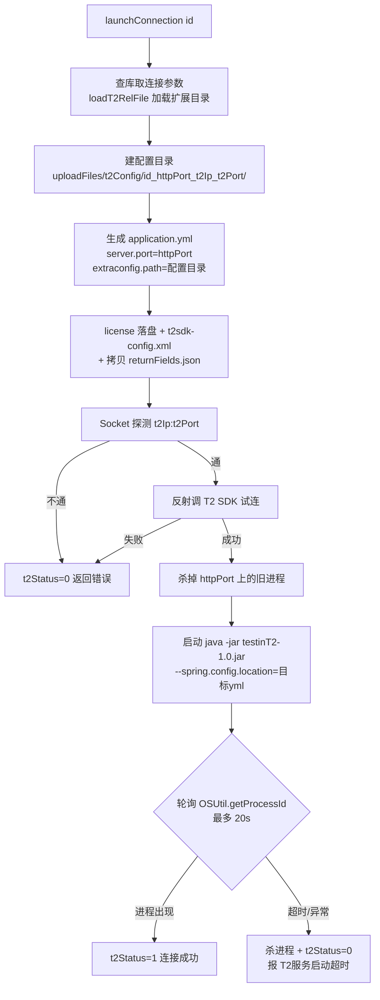

# 协议配置管理实现

## 概述

本模块覆盖两个页面的实现：① 协议配置页——`EnvironmentConfigService` 命名连接注册表的前端入口（数据模型与级联机制的全部细节在 [环境与配置管理实现](环境与配置管理实现.md)，本篇不重复）；② T2 连接管理页——`test_t2_protocol_conn_management` 表 + 在服务端本机拉起 `testinT2-1.0.jar` 代理进程的完整生命周期。产品功能与操作说明见 [协议配置管理](../01-产品功能/协议配置管理.md)；T2 报文/执行细节见 [T2协议支持](../04-复杂功能细节/T2协议支持.md)。

## 数据模型

### 命名连接注册表

复用 `test_environment_config` 表与 `EnvironmentConfigService`，见 [环境与配置管理实现](环境与配置管理实现.md) 的"数据模型"与"级联同步"两节。

### T2 连接 test_t2_protocol_conn_management

DO：`src/main/java/cn/testin/dao/TestT2ProtocolConnManagement.java`：

| 字段 | 含义 |
|---|---|
| `id` | **Integer 自增主键**（注意：与平台其它资源普遍用 UUID 字符串不同） |
| `projectId` | 所属项目 |
| `envConnection` | 连接名（同项目唯一， 校验） |
| `t2Ip` / `t2Port` | T2 服务端地址；**不允许等于服务端自身端口** `server.port`（防止把代理指向自己） |
| `httpPort` | 本地 HTTP 代理监听端口；**全局唯一**（跨项目查重， 抛"本项目或其他项目下已存在Http代理端口为[xxx]的t2连接信息"） |
| `t2CertificateName` / `t2CertificateContent` | license 文件名与 **Base64 内容**（入库，限制 1MB） |
| `charset` | 字符集，默认 utf-8（gbk 时写 GBK）；旧数据存 '1'/'2'，前端编辑时做兼容转换 |
| `poolSize` | T2 连接池大小 |
| `t2Status` | 0 断开 / 1 已连接（byte，展示时转中文） |
| `ufxPassword` | UFX 密码（恒生柜台），可空 |
| `extra` | JSON 扩展，目前固定初始化 `{"returnType": 1}`（单条返回 JSON 对象，`TestT2ProtocolManagementService.java`，枚举 `T2ExtraEnum`） |
| `remark` | 备注 |

## 关键流程

### 1. 协议配置页（命名连接注册表）

前端 `src/views/protocolConfig/index.vue`：

- tab 由 `useProtocol` store 决定（项目开通了哪些协议），固定含"数据库配置"，其余按协议动态 unshift；
- 列表数据来自 `GET /environment/listEnvConfig?type=XXX`（`src/api/env.ts`）；
- 新建/编辑走 `POST /environmentConfig/save`（弹窗只有"配置类别/连接名称/连接描述"三个字段）；
- 删除走 `POST /environmentConfig/config/delete`，由后端做引用检查（被接口/脚本引用则拒绝）并从所有环境 JSON 中级联移除。

### 2. T2 连接管理接口

`TestT2ProtocolConnectionManagementController`（`src/main/java/cn/testin/controller/TestT2ProtocolConnectionManagementController.java`，前缀 `/t2Connection`）：

| 端点 | 说明 |
|---|---|
| `POST /t2Connection/add` | 新增（**表单上传**，`@ModelAttribute` + MultipartFile license） |
| `POST /t2Connection/update` | 修改；**保存后强制 `t2Status=0`**（需重新连接） |
| `GET /t2Connection/list` / `GET /view` | 分页 / 详情 |
| `GET /t2Connection/delete?ids=` | 删除（**GET 请求**，ids 逗号串；异常只记日志不回抛） |
| `POST /t2Connection/test` | 测试连接（未保存也能测，直接用界面参数） |
| `GET /t2Connection/launchConnection?id=` | 连接：拉起本地 T2 代理进程 |
| `GET /t2Connection/disConnect?id=` | 断开：停代理进程 |

前端 API：`src/api/t2Config.ts`；页面：`src/views/t2Config/index.vue`（字符集选项在 `config.ts` 的 `CHARSET_TYPE_LIST`）。

### 3. 测试连接（test）的实现

`TestT2ProtocolConnectionService.testT2Connection`（`src/main/java/cn/testin/service/TestT2ProtocolConnectionService.java`）：

1. 必填校验 + **Socket 直连探测** t2Ip:t2Port（5s 超时，`checkNetCommunication`）；
2. 定位 T2 扩展目录：取主程序 jar 所在目录，拼 `extension/t2/`（`getT2ExtensionPath`），读取 `com.hundsun.t2sdk-ext-1.1.18.jar` 与模板 `t2sdk-config-template.xml`（`loadT2RelFile`）；
3. 在 `uploadFiles/t2Config/temp/<日期>/<时间毫秒>/` 建临时目录（带 `ReentrantLock`）；
4. 把 license 落盘、按模板生成 `t2sdk-config.xml`（写入 ip/port/poolSize/charset/licenseFile 路径，`setT2ConfigParam`）；
5. **URLClassLoader 反射加载** T2 SDK jar 执行连接测试（`getT2ConnectionByReflection`），返回消息含"成功"才算通过。

### 4. 连接 / 断开的实现（核心流程）

`launchT2Connection`→ `launchT2`：



要点：

- 代理进程是**独立 Java 进程**：Linux 下命令行固定 `-Xms2g -Xmx4g` 加一堆 GC 日志参数，日志目录**硬编码** `/home/syy/data/logs/t2Server/<httpPort>`；Windows 下 `cmd /k java -Dlog.dir=<工作目录>/t2ServerLogs/...`。
- 停止链路：`disConnectT2`→ 先 HTTP 调 `http://127.0.0.1:<httpPort>/t2/stopT2/-1` 让代理主动断开 T2 长连接（`stopT2SdkConnectionByHttp`），再 `OSUtil.getProcessId(httpPort)` 按端口找 PID 并 `killProcess`。
- 每次连接前都会先杀同端口旧进程（`stopT2SdkConnection`），保证幂等。
- `updateT2Conn` 修改配置后状态强制断开（`TestT2ProtocolManagementService.java`），需要用户重新点"连接"。

### 5. 文件布局

```
<部署根目录>/
├── extension/t2/                     # T2 扩展（package 阶段拷入 deploy，见 部署与打包）
│   ├── com.hundsun.t2sdk-ext-1.1.18.jar   # T2 SDK（反射加载）
│   ├── t2sdk-config-template.xml          # sdk 配置模板
│   ├── testinT2-1.0.jar                   # HTTP→T2 代理程序
│   ├── application.yml                    # 代理 yml 模板
│   └── returnFields.json                  # 返回字段裁剪配置
└── uploadFiles/t2Config/             # 运行时生成
    ├── temp/<日期>/<毫秒>/            # 测试连接的临时配置
    └── <id>_<httpPort>_<t2Ip>_<t2Port>/   # 每个连接的正式配置目录
        ├── application.yml
        ├── t2sdk-config.xml
        ├── <license 文件>
        └── returnFields.json
```

## 关键代码位置

后端（相对 `testin-api-backend/`）：

| 位置 | 作用 |
|---|---|
| `src/main/java/cn/testin/controller/TestT2ProtocolConnectionManagementController.java` | T2 连接 REST 入口 |
| `src/main/java/cn/testin/service/TestT2ProtocolManagementService.java` | 新增（license 1MB 限制、唯一性校验） |
| `src/main/java/cn/testin/service/TestT2ProtocolManagementService.java` | envConnection/httpPort 唯一性 + 端口冲突校验 |
| `src/main/java/cn/testin/service/TestT2ProtocolManagementService.java` | 修改（保存后强制断开） |
| `src/main/java/cn/testin/service/TestT2ProtocolConnectionService.java` | 测试连接全流程 |
| `src/main/java/cn/testin/service/TestT2ProtocolConnectionService.java` | 定位 extension/t2 扩展目录 |
| `src/main/java/cn/testin/service/TestT2ProtocolConnectionService.java` | 生成 t2sdk-config.xml |
| `src/main/java/cn/testin/service/TestT2ProtocolConnectionService.java` | 反射加载 T2 SDK 试连 |
| `src/main/java/cn/testin/service/TestT2ProtocolConnectionService.java` | 启动代理进程并等待端口就绪 |
| `src/main/java/cn/testin/service/TestT2ProtocolConnectionService.java` | 断开连接（HTTP 停 T2 + 杀进程） |
| `src/main/java/cn/testin/dao/TestT2ProtocolConnManagement.java` | T2 连接表模型 |

前端（相对 `testin-api-frontend/`）：

| 位置 | 作用 |
|---|---|
| `src/views/protocolConfig/index.vue` | 协议配置页（命名连接 CRUD） |
| `src/views/t2Config/index.vue` | T2 连接管理页 |
| `src/api/t2Config.ts` | T2 连接 API |
| `src/api/env.ts` | 协议配置项列表/保存/删除 API |

## 注意事项与坑

1. **T2 代理进程跑在服务端本机**，不走执行机：`launchConnection` 的服务端在哪台机器，代理就起在哪台。集群化部署服务端时 T2 状态（端口占用、进程）不随请求漂移，必须固定访问同一台服务端。
2. Linux 启动命令把日志/GC 目录**硬编码**为 `/home/syy/data/logs/t2Server/...`（`TestT2ProtocolConnectionService.java`），部署目录不同或无写权限时代理起不来，报"T2服务启动超时"。
3. `httpPort` 是全局（跨项目）唯一，删除连接**不会**自动杀进程前先确认进程状态——先删库记录而代理进程仍在跑的情况会遗留端口占用，需要手工 kill。
4. `deleteByIds` 捕获所有异常只记 error 日志（`TestT2ProtocolManagementService.java`），删除失败前端依然收到"删除成功"，排查时先看日志。
5. license 以 Base64 存库且整个连接表更新走 `updateByExampleWithBLOBs`，证书接近 1MB 时每次编辑都是大字段写。
6. 测试连接/正式连接都会把 license 明文写到 `uploadFiles/t2Config/` 磁盘目录（T2 SDK 只支持文件路径），注意目录清理与权限。
7. 删除用的是 `GET /t2Connection/delete?ids=`（GET 请求做写操作），过网关/防火墙规则时容易被拦或缓存。
8. 新增协议配置类型时，除了本模块前端 tab，还要同步改 `EnvironmentConfigService` 的 add/edit/delete 三处 switch（见 [环境与配置管理实现](环境与配置管理实现.md)）。
