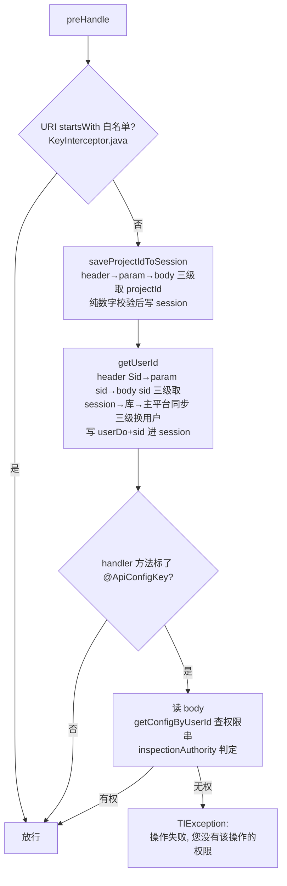
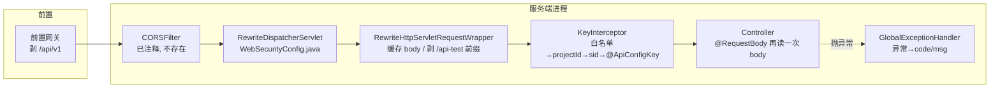

# 后端请求处理管线

## 概述

服务端（Spring Boot 2.3.1 + Jetty，端口 8526）对一个 HTTP 请求的处理，在进 controller 之前经过一条**定制过的管线**：

```
HTTP 请求
  → (CORSFilter —— 已整体注释，形同不存在)
  → RewriteDispatcherServlet        包装 request：缓存 body + 剥 /api-test 前缀
  → Spring 拦截器链                  实际只注册了 KeyInterceptor（AuthInterceptor 未注册）
      └─ KeyInterceptor.preHandle    白名单 → 解析 projectId/sid → @ApiConfigKey 权限判定
  → @RestControllerAdvice 环绕       GlobalExceptionHandler 把异常翻译成 {code,msg}
  → Controller
```

三个必须记住的事实：

1. **body 可以被反复读**——因为自定义 DispatcherServlet 把所有请求包进了缓存 body 的 wrapper，`KeyInterceptor` 才敢多次 `getInputStream()`。
2. **真正的鉴权只有 `KeyInterceptor`**；`AuthInterceptor`（`@UserAuth` 配套）是个没注册、且实现也是假的摆设。
3. **fastjson 处于安全模式**（启动类第一行 `setSafeMode(true)`），autoType 反序列化被禁。

## 逻辑详解

### 第一层：CORSFilter（已废弃）

`src/main/java/cn/testin/CORSFilter.java` 整个文件被块注释。曾经的逻辑是塞 `Access-Control-Allow-*` 头并对 `OPTIONS` 预检直接回 204。**现状：跨域完全靠前置网关/部署形态解决**（生产上前端与后端同源经网关转发；dev 上 vite proxy 代理），后端不做任何 CORS 头。新增外部直连调用方时如果对方浏览器报跨域，不要来后端找过滤器——没有了。

### 第二层：RewriteDispatcherServlet + 请求包装器

注册点：`src/main/java/cn/testin/configuration/WebSecurityConfig.java`，用 `@Qualifier(DEFAULT_DISPATCHER_SERVLET_BEAN_NAME)` 把 Spring MVC 的 DispatcherServlet 换成自定义子类。每次分发前包装请求（`src/main/java/cn/testin/interceptor/RewriteDispatcherServlet.java`）：

```java
super.doDispatch(new RewriteHttpServletRequestWrapper(request), response);
```

wrapper（`src/main/java/cn/testin/interceptor/RewriteHttpServletRequestWrapper.java`）干两件事：

1. **缓存 body**：构造时 `StreamUtils.copyToByteArray(request.getInputStream())` 一次性读进字节数组，`getInputStream()/getReader()` 每次返回基于该数组的新流。这是整条管线的地基——后面 `KeyInterceptor` 解析 sid 读一次 body、权限判定再读一次 body、controller `@RequestBody` 还要读一次，全靠这个缓存。
2. **剥 `/api-test` 前缀**：URI 以 `/api-test` 开头时，`requestURI/servletPath/requestURL` 全部去掉该前缀。这是为了兼容某些部署形态下网关注入的路径前缀，controller 的路由表里永远没有 `/api-test`。注意它**只剥 `/api-test`，不剥 `/api/v1`**——`/api/v1` 是前置网关剥的，见 [前端HTTP层与响应约定](前端HTTP层与响应约定.md)。

### 第三层：拦截器链

`WebSecurityConfig.addInterceptors`（`WebSecurityConfig.java`）**只注册了 `keyInterceptor`，没有配路径模式 = 拦截全部请求**。`authInterceptor` 虽然被 `@Resource` 注入，但从未 addInterceptor——是死代码。

`KeyInterceptor.preHandle`（`src/main/java/cn/testin/interceptor/KeyInterceptor.java`）的顺序：



白名单清单（构造函数 `KeyInterceptor.java`）：swagger 资源、`/project/sync`、mock 相关、`/job/api`（xxl-job 执行器通信）、`/share`（分享报告）、`/t2Connection/view`、`/task/testin/maintainOldCaseInfo`、UI 自动化回调等。权限判定的细节（特殊目录 key 替换、api-all 兜底）见 [权限体系](权限体系.md)。

### @UserAuth 与 AuthInterceptor：假实现，别依赖

- 注解 `src/main/java/cn/testin/annotation/UserAuth.java` 本身只是个标记。
- `AuthInterceptor.preHandle`（`src/main/java/cn/testin/interceptor/AuthInterceptor.java`）：方法或类上有 `@UserAuth` 时，**塞一个写死的 `User{id=1010, name=User1010}`** 进 request attribute（`UserSessionService.setLoginUser`，`src/main/java/cn/testin/service/UserSessionService.java`），真正的 token 校验逻辑整段注释（`TODO`）。
- 如前所述它**根本没注册进拦截器链**，所以即使标了 `@UserAuth`，request attribute 里也不会有 user——`MonitorController.loginUserName`（`src/main/java/cn/testin/controller/MonitorController.java`）这种"测试登陆"接口拿到的就是 null。
- 结论：**任何需要当前用户的代码都走 `SessionUtil.getUserDoSession()`**（由 KeyInterceptor 保证写入），不要用 `UserSessionService.getLoginUser()`，也不要指望 `@UserAuth` 有任何防护作用。

### 第四层：异常翻译与响应约定

`GlobalExceptionHandler`（`src/main/java/cn/testin/commons/handler/GlobalExceptionHandler.java`）`@RestControllerAdvice` 统一出口：

| 异常 | 处理 | 结果 code |
|---|---|---|
| `TIException` | `handleGeneralException` | 异常自带 code（默认 500，见 `TIException.java`） |
| `BindException`（参数绑定失败） |  | 1006 + "参数 [x] 非法值 [y]" |
| `AccessTokenException` |  | 异常自带 code |
| `UnsupportedEncodingException` |  | 1010 |
| 其余一切 `Exception` | `errorHandler` | 500 "系统错误" |

加上 `ResponseResult` 成功 code=200（`src/main/java/cn/testin/commons/Response/ResponseResult.java`）、业务码 505/508（`ResponseErrorEnum.java`），构成与前端拦截器对应的完整响应约定（消费侧见 [前端HTTP层与响应约定](前端HTTP层与响应约定.md)）。

### 启动期的两个安全/开关设置

- **fastjson 安全模式**：`src/main/java/cn/testin/Application.java`，`ParserConfig.getGlobalInstance().setSafeMode(true)` 是 main 的第一行——禁掉 autoType，防 fastjson 反序列化漏洞。不要因为"某个 DTO 反序列化不出来"去关它；正解是修 DTO 或用显式反序列化。
- **swagger 生产禁用**：`src/main/java/cn/testin/commons/configs/Swagger2Config.java` 的 `@Profile({"dev","test"})` 使 swagger 只在 dev/test profile 装配；生产（`prod`）没有 Docket Bean，`/swagger-ui.html` 不可用。同时 swagger 路径在 KeyInterceptor 白名单里（`KeyInterceptor.java`），dev/test 环境免登可看。

### 完整管线图



## 关键代码位置表

| 位置 | 作用 |
|---|---|
| `testin-api-backend/src/main/java/cn/testin/Application.java` | fastjson `setSafeMode(true)` |
| `testin-api-backend/src/main/java/cn/testin/CORSFilter.java` | CORS 过滤器（整体注释，废弃） |
| `testin-api-backend/src/main/java/cn/testin/configuration/WebSecurityConfig.java` | 拦截器注册（仅 KeyInterceptor）+ DispatcherServlet 替换 |
| `testin-api-backend/src/main/java/cn/testin/interceptor/RewriteDispatcherServlet.java` | 自定义分发器，包装所有请求 |
| `testin-api-backend/src/main/java/cn/testin/interceptor/RewriteHttpServletRequestWrapper.java` | body 缓存 + `/api-test` 前缀剥离 |
| `testin-api-backend/src/main/java/cn/testin/interceptor/KeyInterceptor.java` | 鉴权/上下文解析主流程 |
| `testin-api-backend/src/main/java/cn/testin/interceptor/AuthInterceptor.java` | 假的 @UserAuth 拦截器（未注册、实现写死 User 1010） |
| `testin-api-backend/src/main/java/cn/testin/annotation/UserAuth.java` | 用户认证标记注解（无实际效力） |
| `testin-api-backend/src/main/java/cn/testin/annotation/ApiConfigKey.java` | 接口权限 key 注解（实际生效的鉴权配置点） |
| `testin-api-backend/src/main/java/cn/testin/commons/handler/GlobalExceptionHandler.java` | 统一异常翻译 |
| `testin-api-backend/src/main/java/cn/testin/commons/configs/Swagger2Config.java` | swagger 仅 dev/test 装配 |
| `testin-api-backend/src/main/java/cn/testin/service/UserSessionService.java` | request attribute 存取 User（仅假登录体系用） |

## 注意事项与坑

- **不要在过滤器/拦截器里直接读原始 request 的 body 后再放行**——只能读 wrapper 缓存后的流。管线里所有读 body 的地方（KeyInterceptor 三处、controller `@RequestBody`）都依赖 `RewriteHttpServletRequestWrapper`；如果你新加一个 Filter 在 DispatcherServlet **之前**把流读掉了，后面全线崩盘。新 Filter 要么自己也缓存转交，要么只读 header。
- **白名单是 `startsWith` 前缀匹配**：`/share` 会命中 `/shareAnything`、`/project/sync` 会命中 `/project/syncXxx`。新增路径时留意被误放行的风险；反之命名新接口时别意外撞进白名单前缀。
- **body 解析 sid 时静默吞 JSON 异常的场景**：`saveProjectIdToSession` 里 JSON 解析失败只 log 不抛（`KeyInterceptor.java`），projectId 会以 null 跳过 session 写入（兼容测管平台）；但 `getUserId` 里 body 读失败直接抛"获取Sid失败"。排"无效的Sid"报错时按 header → param → body 的顺序确认前端到底放在哪。
- **`@UserAuth` 没有任何防护作用**：真正的登录态只有 KeyInterceptor 的 sid 解析。别在新代码上用 `@UserAuth` 表达"需要登录"，也别用 `UserSessionService.getLoginUser()` 拿用户（拿到 null）。
- **非 GET 请求进 controller 前 body 已被读过多次**：这对性能有影响（全量 body 进内存），上传大文件的接口走 `multipart` 时不受影响（wrapper 读的是输入流，multipart 由 Spring 另行解析——但大 JSON 请求体要注意内存）。
- **actuator 的 context-path 配置疑似写错**：`application.yml` `servlet: context-path=: /actuator` 的键名带了冒号，实际不生效，别照着抄。
- 权限判定细节见 [权限体系](权限体系.md)；sid/projectId 的业务语义见 [登录态与主平台集成](登录态与主平台集成.md)。
