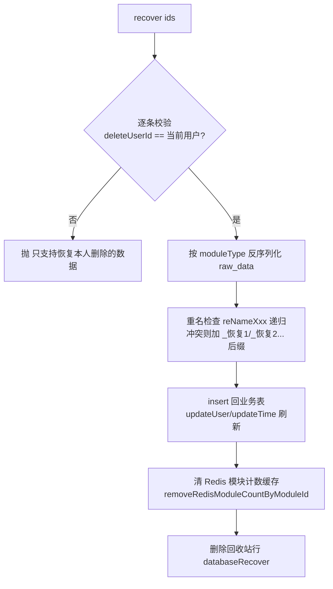

# 回收站实现

回收站的后端实现：删除 = 快照入 `test_recycle_bin` + 业务表物删；还原 = 反序列化快照重插；到期由 Spring 定时任务清理。产品视角见 [回收站](../01-产品功能/回收站.md)。

## 数据模型

回收站只有一张表 `test_recycle_bin`（模型 `src/main/java/cn/testin/dao/TestRecycleBinDo.java`）：

| 字段 | 说明 |
|---|---|
| id | **资源本身的 id**（回收站行主键，不新生成） |
| name | 资源名称 |
| moduleType | 资源类型，对应 `ModuleType` 枚举 |
| projectId | 所属项目 |
| deleteUserId / deleteUserName | 删除人 |
| deleteTime | 删除时间戳 |
| raw_data | 被删资源的完整 JSON 快照（LONGTEXT/BLOB） |

设计要点：不建外键、不打删除标记，**快照即全部**——还原就是反序列化 + insert。业务表是真删，所以列表页/执行链路完全无感知，也不需要到处加 `is_deleted` 过滤（环境、数据集等表历史上残留的 `isDeleted`/`deleteFlag` 字段与本机制无关）。

资源类型枚举 `ModuleType`（`src/main/java/cn/testin/enums/ModuleType.java`）定义了 8 种：`INTERFACE, SCRIPT, CASE, TASK, DATASET, ENUM, ENV, PLAN`，但**实际写入回收站的只有 6 种**——调 `saveTestRecycleBinDo` 的删除入口：

| 资源 | moduleType | 删除入口（先快照后物删） |
|---|---|---|
| 接口 | INTERFACE | `InterfaceService` |
| 脚本 | SCRIPT | `ScriptService` |
| 用例 | CASE | `TestCaseService` |
| 任务 | TASK | `TestTaskService` |
| 数据集 | DATASET | `TestDataCollectService.java` |
| 环境 | ENV | `EnvironmentService.java` |

`ENUM`（数据枚举走逻辑删除）与 `PLAN`（测试计划）定义了类型但**没有写入方**，回收站里不会出现这两类。前端类型下拉也只有 6 项（`src/views/recycleBin/index.vue`）。

## 关键流程

### 1. 快照写入

`RecycleBinService.saveTestRecycleBinDo`（`src/main/java/cn/testin/service/RecycleBinService.java`）：以资源 id 为回收站行主键，记录名称、moduleType、projectId、删除人 id/姓名、删除时间戳、`raw_data` 完整 JSON。

> 写入口径差异：环境删除是把 env 整条 JSON 快照（`EnvironmentService.java`）；数据集批量删除有个坑——只有 `parentId` 非空的记录才进回收站（`TestDataCollectService.java` 的 `if` 包住了回收站写入），挂在根目录的数据集删除后不进回收站。

### 2. 还原（recover）

`POST /recycleBin/recover`（`RecycleBinController.java`，权限 key `api-recycleBin-recover`）→ `recover`（`RecycleBinService.java`）：

- 重名递归命名：`reNameInterface`/`reNameScript`/`reNameCase`/`reNameTask`/`reNameDataset`/`reNameEnv`，后缀形如 `原名_恢复1`，再冲突则 `原名_恢复1_恢复2`（每轮递归 `timer+1` 追加，名字会越叠越长）。
- 环境还原的重名范围是**项目级**（`reNameEnv`），其余按模块目录级。
- **还原 ≠ 完整回滚**：删除时已做的副作用不撤销——数据集删除前已解绑所有用例步骤（`datasetId` 置空），还原后需手工重新绑定。

### 3. 彻底删除（delete）

`POST /recycleBin/delete`（`RecycleBinController.java`，权限 key `api-recycleBin-delete`）→ `delete`（`RecycleBinService.java`）：

1. 校验只能删自己的（抛"只支持本人删除的数据！"）；
2. `databaseDelete`按类型清关联数据：
   - **INTERFACE** → 删对应 mock（`testInterfaceMockDoMapper.deleteByPrimaryKey`）；
   - **CASE** → 删该用例全部步骤 `test_case_step`；
   - **TASK** → 删任务-用例关联 `test_task_case`；
   - SCRIPT / DATASET / ENV 无额外级联（脚本的副本等不在此处清理）。
3. 删除回收站行本体。

### 4. 定时清理

`scheduleDelete`（`RecycleBinService.java`）：`@Scheduled(cron = "0 0 2 * * ?")` 每日 02:00，把 `deleteTime` 距今超过 30 天（`RETENTION_TIME_MILLIS`）的记录走 `databaseDelete` 彻底删除。另有手工触发端点 `POST /recycleBin/scheduleDelete`（`RecycleBinController.java`，**无权限注解**，任何登录用户可触发全量过期清理）。

### 5. 前端

- 页面 `src/views/recycleBin/index.vue`：名称/类型（6 类）/删除人/删除时间段筛选；单条/批量恢复与永久删除；列表含"倒计时"列（按 30 天 - 已删除天数前端计算，`index.vue`）；确认弹窗复用 `src/utils/PageInteraction.ts` 的 `recoverItem/deleteItem/batchDeleteItems/batchRecoverItems`。
- API `src/api/recycle.ts`：`pageList` / `recover` / `delete`（批量即传数组）。
- "类型"中文映射（接口/脚本/用例/任务/数据集/环境）前端写死（`index.vue`）。

## 关键代码位置

后端（相对 `testin-api-backend/`）：

| 位置 | 作用 |
|---|---|
| `src/main/java/cn/testin/controller/RecycleBinController.java` | 回收站 REST 入口 `/recycleBin` |
| `src/main/java/cn/testin/service/RecycleBinService.java` | 快照写入（资源 id 即主键） |
| `src/main/java/cn/testin/service/RecycleBinService.java` | 彻底删除（本人校验 + 级联） |
| `src/main/java/cn/testin/service/RecycleBinService.java` | 还原主流程 |
| `src/main/java/cn/testin/service/RecycleBinService.java` | 六个 reNameXxx 重名递归 |
| `src/main/java/cn/testin/service/RecycleBinService.java` | 每日 02:00 清理 30 天前数据 |
| `src/main/java/cn/testin/enums/ModuleType.java` | 8 类资源枚举（ENUM/PLAN 未实际使用） |
| `src/main/java/cn/testin/dao/TestRecycleBinDo.java` | 回收站表模型（raw_data 为 BLOB） |

各资源删除入口（快照调用点）：

| 位置 | 资源 |
|---|---|
| `src/main/java/cn/testin/service/EnvironmentService.java` | 环境 |
| `src/main/java/cn/testin/service/TestDataCollectService.java` | 数据集（单个，当前无对应接口暴露） |
| `src/main/java/cn/testin/service/TestDataCollectService.java` | 数据集（批量） |
| `src/main/java/cn/testin/service/InterfaceService.java` / `ScriptService.java` / `TestCaseService.java` / `TestTaskService.java` | 接口/脚本/用例/任务 |

前端（相对 `testin-api-frontend/`）：

| 位置 | 作用 |
|---|---|
| `src/views/recycleBin/index.vue` | 回收站页面 |
| `src/api/recycle.ts` | 回收站 API |
| `src/utils/PageInteraction.ts` | 恢复/删除确认弹窗与成功提示 |

## 注意事项与坑

1. **只能操作本人删除的数据**：管理员也无法替别人还原/彻底删除，用户离职后其删除的数据只能等 30 天自动清理。
2. 回收站行主键 = 资源原 id。同一资源"删除 → 还原 → 再删除"没问题（还原时已删回收站行）；但如果删除逻辑有 bug 没进回收站而业务表已删，**数据不可恢复**。
3. 还原时的重名后缀会递归叠加（`_恢复1_恢复2`…），多次还原同名资源名字会很长。
4. 删除用例时**步骤没进快照**：还原用例只恢复 `test_case` 主表记录；步骤数据依赖删除时业务侧的处理（当前回收站还原 CASE 只 insert `test_case`，步骤若已被物删则还原出"空用例"）。
5. `POST /recycleBin/scheduleDelete` 无 `@ApiConfigKey`，属于裸露的管理端点，网关层应限制访问。
6. 还原接口/脚本/用例/任务/数据集时会清 Redis 模块计数缓存（`removeRedisModuleCountByModuleId`），环境还原不清（它没有目录树计数）。
7. `ENUM`/`PLAN` 类型在枚举里存在但永不进回收站，前端筛选/后端新需求不要误以为它们受回收站保护。
8. 定时任务用 Spring `@Scheduled` 而非 xxl-job，多实例部署服务端时每天 2 点会**每个实例都跑一遍**（`databaseDelete` 幂等，暂无并发保护）。

相关文档：[权限体系](权限体系.md)、[定时调度体系](定时调度体系.md)、[编辑锁机制](编辑锁机制.md)。
