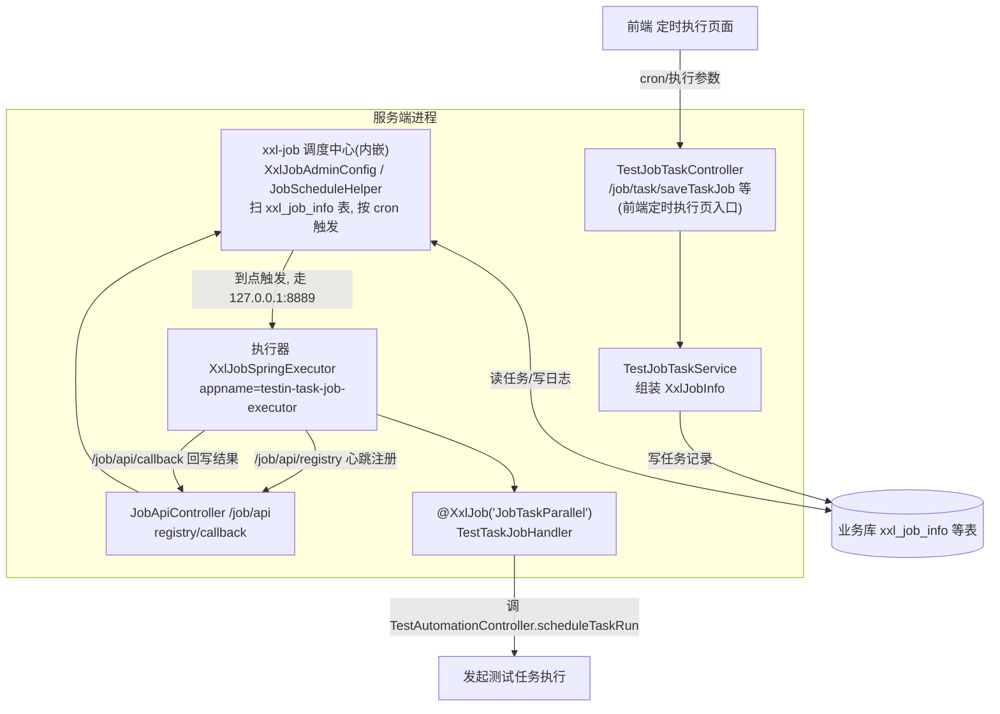
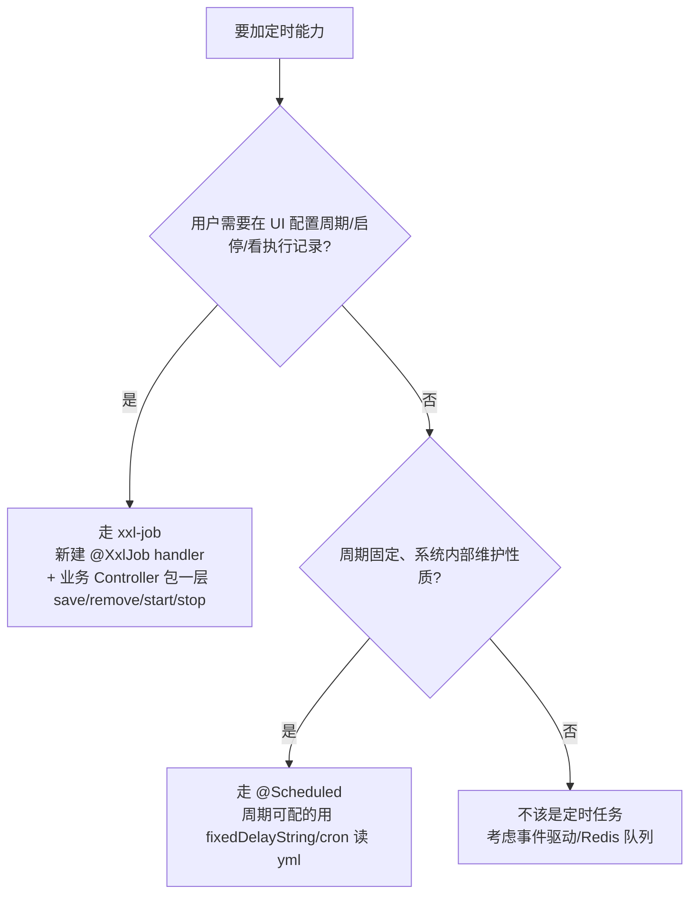

# 定时调度体系

## 概述

平台的"定时"能力由两套并存的机制承担：

1. **内嵌 xxl-job 2.4.0（调度中心 + 执行器同进程）**：面向**用户可配置的定时任务**——测试任务的定时执行（定时执行页面）。xxl-job-admin 的源码被整体拷进工程 `cn.testin.xxljob` 包，调度中心不再独立部署，而是随服务端一起启动；执行器也注册到自己身上。
2. **Spring `@Scheduled`**：面向**系统内部的固定周期维护任务**——报告清理、回收站清理、目录清理、总览统计刷新、批次/计划轮询下发。周期写死在代码里，用户不可见。

取舍原则一句话：**需要用户在 UI 上配 cron、随时启停、查看执行历史的，走 xxl-job；系统自己干的脏活累活，走 `@Scheduled`。**

## 逻辑详解

### 为什么把 xxl-job admin 内嵌进来

标准 xxl-job 是"独立调度中心 + 各业务执行器"的分布式架构。本平台是私有云交付的子系统，多一个独立部署的调度中心意味着多一份运维成本和一张额外的 xxl_job 库表运维面。因此采用内嵌方案：

- `cn.testin.xxljob` 包 = xxl-job-admin 2.4.0 源码裁剪版（`core/scheduler/XxlJobScheduler.java` 启动调度线程 `JobScheduleHelper`），随 `Application` 主进程启动，任务数据（`xxl_job_info` 等表）直接落在业务库。
- 调度中心地址配成自己：`xxl.job.admin.addresses: http://127.0.0.1:8526/job`（`src/main/resources/application.yml`）。
- 执行器也在本进程：`XxlJobSpringExecutor`（`src/main/java/cn/testin/xxljob/core/conf/XxlJobConfig.java`），`appname=testin-task-job-executor`、`port=8889`（`application.yml`），通过 `/job/api/registry` 注册到本机调度中心。
- 总开关：`xxl.job.open`（`application-test.yml` 置 true；`XxlJobConfig.java` 为 false 时执行器不装配任何参数）。
- 任务生命周期管理没有暴露 xxl-job 原生控制台 UI，而是包了一层业务接口 `TestJobTaskController`（`/job/task/*`），前端"定时执行"页直接对接。

整体结构：

### 用户态定时任务（xxl-job handler）

唯一的业务 handler 是 `TestTaskJobHandler.JobTaskParallel`（`src/main/java/cn/testin/xxljob/jobhandler/TestTaskJobHandler.java`）：

1. 前端在"定时执行"页保存 → `POST /job/task/saveTaskJob`（`TestJobTaskController.java`，带 `@ApiConfigKey("api-jobTask-save")` 权限校验）。
2. `TestJobTaskService.saveTaskJob`（`src/main/java/cn/testin/service/xxljob/TestJobTaskService.java`）：同 taskId 的旧任务先删后插（幂等重存）；`type=once` 把指定时间转 cron，`type=repeat` 直接用用户 cron 并**强制秒字段必须为 0**（`validateCronSecondField`，`TestJobTaskService.java`）；执行参数整体 JSON 序列化进 `executorParam`；handler 固定写 `JobTaskParallel`（`TestJobTaskService.java`），路由策略 `FIRST`、阻塞策略 `SERIAL_EXECUTION`、不调超时不重试。
3. xxl-job 到点触发 → 执行器 → handler 读 `XxlJobHelper.getJobParam()` 反序列化出 `TestJobTaskDTO`，调 `TestAutomationController.scheduleTaskRun` 真正发起执行（`TestTaskJobHandler.java`），成功/失败通过 `XxlJobHelper.handleSuccess/handleFail` 回写调度日志。
4. 任务的启停（`startTaskJob/stopTaskJob`）同步维护任务表的 `isTime` 标记（`TestJobTaskService.java`），列表页 `pageList` 查的是业务视图 `TestScheduleTaskViewDo` 而非 xxl_job_info 原生表。

### 调度中心与执行器的通信细节

- 执行器对调度中心的两个回调节点收在 `JobApiController`（`src/main/java/cn/testin/controller/xxljob/JobApiController.java`）：`/job/api/registry`（注册/心跳）与 `/job/api/callback`（执行结果回写），逐个比对 `accessToken` 请求头，token 来自 `application.yml` 的 `xxl.job.accessToken`（默认 `default_token`）。
- 保存任务时 `XxlJobInfo` 的固定参数组（`TestJobTaskService.java`）：`jobGroup=1`（单执行器组，代码注释"没有分布式调度，直接取第一个执行即可"）、`scheduleType=CRON`、`misfireStrategy=DO_NOTHING`（宕机错过不补跑）、`executorRouteStrategy=FIRST`、`executorBlockStrategy=SERIAL_EXECUTION`（上次没跑完则丢弃本次）、`glueType=BEAN`、超时 0（不限）、失败重试 0 次。
- xxl-job admin 原生的登录体系（`xxljob/service/LoginService.java`）与控制台页面接口（`controller/xxljob/IndexController.java`）仍在代码里但业务上不使用，任务管理一律走业务封装的 `/job/task/*`。

### 系统态周期任务（@Scheduled）清单

| 任务 | 位置 | 周期 | 干什么 |
|---|---|---|---|
| 清理 n 天前任务报告 | `commons/task/ScheduledTask.java` `clean15DaysReport` | 每天 0 点 | 按 `clean.report.day`（默认 15 天）清报告详情与错误分析；**受 `isTaskEnabled` 开关控制，默认 false** |
| 清理无用用例报告 | `commons/task/ScheduledTask.java` `cleanCaseReport` | 每天 0 点 | 删除不再被任何用例引用的用例报告；同样受开关控制 |
| 刷新项目/用户总览 | `commons/task/ScheduledTask.java` `updateProjectOverview` | 每 10 分钟 | 重算总览统计表（概览分析页数据源） |
| 上传目录清理 | `schedule/FolderClean.java` `cleanOldFolders` | 每天 19 点 | 删除 `/data/webhome/backend/uploadFiles` 下一天前的导入文件目录 |
| 回收站彻底删除 | `service/RecycleBinService.java` `scheduleDelete` | 每天凌晨 2 点 | 回收站超保留期的记录物理删除 |
| 批次缓冲轮询下发 | `service/TestTaskBatchPoller.java` `pollBatchBuffer` | 每 3s（`batch.poller.fixed-delay` 可配） | 扫 Redis 批次缓冲队列，上一批执行完再发下一批到执行机 |
| 计划任务轮询下发 | `service/plan/PlanTaskPoller.java` `pollPendingTasks` | 每 10s（`plan.task.poller.fixed-delay` 可配，test 环境 5s） | 扫执行中的计划执行记录，按顺序下发下一个未开始任务 |

后两个轮询是任务执行链路的关键环节，细节见 [任务执行链路](任务执行链路.md) 与 [批次结果聚合](批次结果聚合.md)。

### 新定时任务挂哪边的取舍

- 走 xxl-job 的收益：cron 存库可改、有调度日志、有失败回写；代价：要按 `TestJobTaskController` 的模式包业务层，且 handler 名全局唯一。
- 走 `@Scheduled` 的收益：几十行搞定；代价：改周期要发版（除非把周期抽到 `application-*.yml` 用 `fixedDelayString = "${...}"`，参考两个 Poller 的做法），多实例部署时每个实例都会跑（当前服务端单实例部署，无此问题；`ScheduledTask` 的 `isTaskEnabled` 开关就是为"只在指定实例跑"预留的手工闸门）。

## 关键代码位置表

| 位置 | 作用 |
|---|---|
| `testin-api-backend/src/main/java/cn/testin/xxljob/` | 内嵌 xxl-job-admin 2.4.0 裁剪版（调度中心源码） |
| `testin-api-backend/src/main/java/cn/testin/xxljob/core/conf/XxlJobConfig.java` | 执行器装配，`xxl.job.open` 总开关 |
| `testin-api-backend/src/main/java/cn/testin/xxljob/core/conf/XxlJobAdminConfig.java` | 调度中心 Bean，启动调度线程 |
| `testin-api-backend/src/main/java/cn/testin/xxljob/jobhandler/TestTaskJobHandler.java` | 唯一业务 handler `JobTaskParallel` |
| `testin-api-backend/src/main/java/cn/testin/service/xxljob/TestJobTaskService.java` | 定时任务保存/删除/启停业务封装 |
| `testin-api-backend/src/main/java/cn/testin/controller/xxljob/TestJobTaskController.java` | 前端"定时执行"页对接接口 `/job/task/*` |
| `testin-api-backend/src/main/java/cn/testin/controller/xxljob/JobApiController.java` | 执行器注册/回调端点 `/job/api`（在 KeyInterceptor 白名单） |
| `testin-api-backend/src/main/resources/application.yml` | xxl 全部配置（admin addresses / executor appname/port 8889 / 日志保留 30 天） |
| `testin-api-backend/src/main/resources/application-test.yml` | `xxl.job.open: true` 开关位 |
| `testin-api-backend/src/main/java/cn/testin/commons/task/ScheduledTask.java` | 报告清理 + 总览刷新（@Scheduled 集中类） |
| `testin-api-backend/src/main/java/cn/testin/schedule/FolderClean.java` | 上传目录清理 |
| `testin-api-backend/src/main/java/cn/testin/service/RecycleBinService.java` | 回收站定时物理删除 |
| `testin-api-backend/src/main/java/cn/testin/service/TestTaskBatchPoller.java` | 批次缓冲轮询（3s） |
| `testin-api-backend/src/main/java/cn/testin/service/plan/PlanTaskPoller.java` | 计划任务轮询（10s） |

## 注意事项与坑

- **cron 秒字段必须为 0**：`validateCronSecondField`（`TestJobTaskService.java`）强制用户 cron 第一字段是 "0"，最小粒度分钟。前端给用户的报错是"定时时间无效，请重新设置"，排查"合法的 6 段 cron 被拒"时先怀疑这一点。
- **保存=先删后插**：同一 taskId 重复保存会先删掉旧的 xxl_job 记录（`TestJobTaskService.java`），历史调度日志与任务的关联会断，属预期行为。
- **`xxl.job.open=false` 时执行器"裸奔"**：`XxlJobConfig.java` 只在 open 时才 set 参数；关闭时 Bean 依然创建但没地址没端口，调度中心那边触发会失败。改环境配置时这个开关要和 admin addresses 一起看。
- **调度中心没有独立登录防护体系**：`/job/api` 在 KeyInterceptor 白名单里（`KeyInterceptor.java`），靠 xxl 自己的 `accessToken`（`application.yml`，默认 `default_token`）校验执行器通信。生产环境若暴露 8526 端口，务必改 token。
- **xxl-job admin 的登录页 UI 还留在代码里**（`controller/xxljob/IndexController.java` 的 login/logout），但业务上不用它管任务——别对着 xxl 官方文档去找控制台入口，管理入口是前端"定时执行"页。
- **`ScheduledTask` 两个清理任务默认不跑**：`isTaskEnabled` 默认 false（`ScheduledTask.java`），只有外部调用 `setTaskEnabled(true)` 才生效；线上报告没清理先查这个开关，再查 `clean.report.day` 配置。
- **多实例部署风险**：所有 `@Scheduled` 都没有分布式锁。当前服务端单实例运行没问题，一旦水平扩容，报告清理、轮询下发都会重复执行（两个 Poller 靠 Redis 状态天然幂等，清理类不幂等）。扩容前先给这些任务加锁或加开关。
- xxl-job 依赖版本在 `pom.xml`（`com.xuxueli:xxl-job-core:2.4.0`）；调度中心源码是拷进来的，**升级 xxl-job-core 版本不会升级内嵌 admin**，两者要手工保持兼容。
