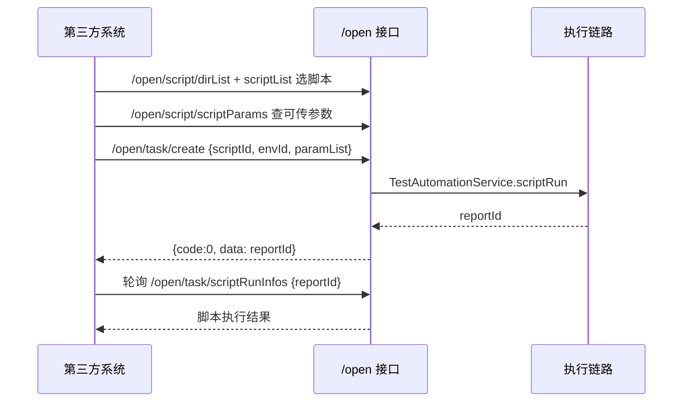

# 开放平台OpenApi实现

> 开放平台 OpenApi 的代码级解析：/open 端点全集、鉴权链路、两套响应包装、通用派发机制、出方向主平台调用。面向对接方的接入说明见 [开放平台OpenApi](../01-产品功能/开放平台OpenApi.md)。

## 概述

`/open/**` 是平台对外开放给第三方系统调用的接口集合。入口控制器 `testin-api-backend/src/main/java/cn/testin/controller/OpenApiController.java`，统一挂载 `@RequestMapping("/open")`；业务实现集中在 `testin-api-backend/src/main/java/cn/testin/service/openApi/OpenApiService.java`（整个 service 包只有这一个类）。请求/响应模型在 `cn.testin.entity.open.qo`（入参 QO）与 `cn.testin.entity.open.vo`（出参 VO），通用包装类 `R` 与 `RequestDTO` 在 `cn.testin.commons.openApi` 下。内部接口的鉴权与请求处理全貌见 [后端请求处理管线](后端请求处理管线.md)，本篇只讲开放接口与它的差异点。

## 与内部接口的三点差异

| 维度 | 内部接口（/task、/case 等） | 开放接口（/open/**） |
|---|---|---|
| 成功码 | `code === 200`（`ResponseResult`） | **`code === 0`**（`R`，`CommonCode.success`，`testin-api-backend/src/main/java/cn/testin/commons/openApi/CommonCode.java`） |
| 功能权限 | 方法上 `@ApiConfigKey` + KeyInterceptor 按 key 校验（见 [权限体系](权限体系.md)） | 无 `@ApiConfigKey`，**不做功能权限校验** |
| 身份认证 | 同左（sid → 用户） | 同样需要有效 sid |

**鉴权方式**：`/open` 不在 `KeyInterceptor` 白名单中，所以每个请求仍要经过 `KeyInterceptor.getUserId`（`testin-api-backend/src/main/java/cn/testin/interceptor/KeyInterceptor.java`）——sid 依次从**请求头 `Sid` → URL 参数 `sid` → JSON body 的 `sid` 字段**取，必须能映射到平台用户（查不到时还会回调主平台同步用户，`KeyInterceptor.java`）。也就是说开放接口的鉴权是"**有效用户 sid 即可，不校验操作权限**"；目前没有 apikey/签名校验（`CommonCode` 里预留了 apikey/sig 错误码但未在 `/open` 链路使用）。

**响应包装 `R`**（`testin-api-backend/src/main/java/cn/testin/commons/openApi/R.java`）：字段 `code / msg / data / detailMessage`，`R.ok()` → `code=0, msg=成功`，`R.failed()` → `code=10016`。常用错误码：`10005 无效的参数`、`1000503 无效的参数(op)`、`10014 该用户未登录`、`10016 执行失败`。

**`R` 的序列化注意点**：`R` 用 lombok `@Accessors(chain = true)` 且显式声明了 `@Getter/@Setter`，同时实现 `Serializable`——字段名就是 `code/msg/data`，没有内部接口 `ResponseResult` 里的额外字段；`detailMessage` 只在内部调试错误时出现，第三方对接按三字段解析即可。

**入参命名约定**：对外 QO 里的项目字段叫 `thirdProjectId`（如 `EnvListQO` / `ScriptListQO` / `TaskCreateQO`），值就是本平台的 projectId——"third" 强调是第三方系统视角的传参。

## 数据模型与端点全集

`OpenApiController` 全部端点：

| 端点 | 说明 | 实现 |
|---|---|---|
| `POST /open/env/list` | 按项目查环境列表 | `OpenApiService.list`， |
| `POST /open/script/dirList` | 脚本目录树（SCRIPT 类型模块） | `scriptDirTreeList`， |
| `POST /open/script/scriptList` | 脚本分页查询（含子目录） | `scriptPageList`， |
| `POST /open/script/scriptParams` | 批量查脚本引用数据集的变量/参数 | `scriptParamsList`， |
| `POST /open/device/conditions` / `/open/device/list` | 执行机筛选条件/列表（**目前是 stub**，返回空/默认设备） | `OpenApiController.java` |
| `POST /open/task/create` | **以脚本提测**：scriptId + envId + paramList → 立即执行脚本，返回 reportId | `taskCreate`， |
| `POST /open/task/saveTaskCase` | 测管系统建任务后回写任务-用例关系（全量替换） | `saveTaskCase`， |
| `POST /open/task/scriptRunInfos` | 按 reportId 查脚本执行结果 | `scriptRunInfos`， |
| `POST /open/interface/add` | 新增接口定义（含 jsonSchema 处理、form-data 文件关联） | `add`， |
| `POST /open/project/queryid` | 项目名 → 项目 ID | `queryProId`， |
| `POST /open/module/queryid` | 模块名 → 模块 ID | `queryModId`， |
| `POST /open/api` | **数研所通用派发接口**（见下） | `dealRequest`， |

### 关键 QO 结构

- `TaskCreateQO`（`entity/open/qo/TaskCreateQO.java`）：`thirdProjectId / scriptId / envId / paramList`（paramList 是脚本数据集参数的覆盖值，`Param{k, v}`，`entity/open/Param.java`）。
- `ScriptListQO`：`thirdProjectId / scriptDirId / page / pageSize / scriptName`。
- `TaskScriptInfoQO`：只有 `reportId`。
- `InterfaceAddQO`：接口全量定义（名称、路径、协议、模块、请求参数、响应、jsonSchema 等），配套一组 Body/Dubbo/Grpc/Tcp/WebSocket QO 覆盖多协议。
- `RequestDTO`（仅 `/open/api` 用）：`sid / mkey / action / op / data(JSONObject)`。

## 关键流程

### 典型调用方式一：以脚本提测



`taskCreate` 的实现（`OpenApiService.java`）是"读脚本定义 → 组装 `ScriptRequestStructure` → 直接调 `TestAutomationService.scriptRun`"，与前端脚本调试执行共用[任务执行链路](任务执行链路.md)，产出的是 script 类型（type=0）的执行结果，落在 `test_script_execution_result` 表而不是任务报告表——所以结果查询走的是独立的 `/open/task/scriptRunInfos`，**不要**拿这个 reportId 去查 `/task/getReport`。

**补充：`/open/script/scriptParams` 的数据解析**。`scriptParamsList`（`OpenApiService.java`）读取脚本 JSON 里的数据集引用（`dataSet.id + dataSet.column`），再去 `test_data_collect.detail` 里按列 ID 反查列索引取值——数据集 detail 是一个 JSON 数组：第 0 行是列 ID 列表、第 1 行是表头、第 2 行起是数据行（结构见 [数据集与数据枚举](../01-产品功能/数据集与数据枚举.md)）。列 ID 找不到对应索引时**静默跳过不报错**（`OpenApiService.java` 的 catch 注释"根据id找不到行号，不做处理"），第三方看到参数为空时先核对数据集列是否被删过。

### 典型调用方式二：通用派发 `/open/api`（数研所项目）

请求体是 `RequestDTO`（`testin-api-backend/src/main/java/cn/testin/commons/openApi/RequestDTO.java`）：`{sid, mkey, action, op, data}`——与主平台的 mkey/action/op 协议同构。`dealRequest` 按 `op` 派发（`OpenApiService.java`）：

- `op = "Task.run"`：`data` 传 `{taskNumber, projectId, envId}`，按**任务编号**（项目内 100001 起的序号，不是 UUID）定位任务并串行执行（`runTask`，`OpenApiService.java`）。返回 `{reportId, type}`，后续轮询报告。
- `op = "Report.get"`：`data` 传 `{reportId}`，返回 `TestReportDo` 批次概要（`getReport`，`OpenApiService.java`）。
- 其它 op 返回 `1000503 无效的参数(op)`。

```json
// 执行任务
POST /open/api
{
  "sid": "第三方用户的平台sid",
  "op": "Task.run",
  "data": { "taskNumber": 100001, "projectId": "xx", "envId": "xx" }
}
// 响应
{ "code": 200, "msg": "...", "data": { "reportId": "uuid", "type": "task" } }
```

注意 `/open/api` 这个端点返回的是内部包装的 `ResponseResult`（code 200 成功），**与 `/open` 其它端点的 `R`（code 0 成功）不一致**，调用方要分别处理。

### 反向调用：本系统作为主平台 OpenApi 的客户端

`OpenApiService` 里还有一组**出方向**能力，配置项 `platform.apikey` / `platform.url`（`OpenApiService.java`）：

- `getOem / getOemFresh`（`OpenApiService.java`）：按 `mkey=usermanager, action=user, op=SystemParam.list` 拉主平台 OEM 企业配置（如 `oem_pre_post_script_check` 控制前后置脚本出错是否中断），`getOem` 用静态缓存、`getOemFresh` 实时拉取。任务执行时 `TestAutomationService.run` 会调它注入执行配置。
- `getEnvByOpenApi`（`OpenApiService.java`）：按 `mkey=realcfg, action=cfg, op=EnvCfg.getEvn` 查主平台环境名称。

这两类与 `/open/**` 方向相反，但同处一个 Service，维护时注意区分"对外提供"与"调主平台"两组方法。

### 部署形态提醒

`/open/**` 只在**服务端**（Spring Boot，8526 端口）暴露；执行端 runner 由 runnerPom.xml 构建，不包含这些控制器。对外开放时通常由前置网关把第三方域名路由到服务端并补 `/api/v1` 前缀，与前端流量共用同一入口；因此给第三方的完整 URL 要以网关配置为准，代码里只有 `@RequestMapping("/open")` 这段相对路径。服务端部署细节见 [部署与打包](../02-技术架构/部署与打包.md)。

## 关键代码位置

| 位置 | 说明 |
|---|---|
| `testin-api-backend/src/main/java/cn/testin/controller/OpenApiController.java` | /open 全部端点 |
| `testin-api-backend/src/main/java/cn/testin/service/openApi/OpenApiService.java` | 业务实现（对外开放 + 调主平台） |
| `testin-api-backend/src/main/java/cn/testin/commons/openApi/R.java` | 开放接口响应包装（code=0 成功） |
| `testin-api-backend/src/main/java/cn/testin/commons/openApi/RequestDTO.java` | /open/api 通用请求模型 |
| `testin-api-backend/src/main/java/cn/testin/commons/openApi/CommonCode.java` | 错误码枚举（与主平台体系对齐） |
| `testin-api-backend/src/main/java/cn/testin/interceptor/KeyInterceptor.java` | sid 身份校验（开放接口唯一鉴权） |
| `testin-api-backend/src/main/java/cn/testin/entity/open/qo/` | 入参 QO 对象 |

## 注意事项与坑

- **两套成功码并存**：`/open/**` 大多数端点成功码是 0，唯独 `/open/api` 返回 `ResponseResult` 成功码 200——对接文档必须写清楚，否则第三方按一种处理必然踩坑。
- **开放接口不校验功能权限**：任何有效 sid 都能调 `/open/**` 全部端点（包括创建接口、执行任务），接入第三方时要用专用账号并控制其可见项目。
- sid 查不到本地用户时会**同步触发主平台用户同步**（`projectService.syncPlatformEnv`），第三方账号首次调用延迟较高属正常现象。
- `/open/device/*` 两个端点是**未实现的 stub**（返回空对象和写死的"默认设备"），不要对第三方承诺设备查询能力。
- `saveTaskCase` 是**先清空再全量插入**任务用例关系（`OpenApiService.java`），第三方增量传参会覆盖掉界面上的修改；且任务不存在时按 名称+项目+目录 反查，静默返回不报错。
- `/open/task/create` 找不到脚本返回 `R.failed("未找到脚本")`（code=10016），不是参数错误码；`queryProjectId` 找不到返回 `R.failed`，但 `queryModuleId` 的错误消息误写成了"未找到用户"（`OpenApiController.java`）。
- `interface/add` 内部用了一段脆弱的字符串替换把 QO 的 toString 转 JSON（`OpenApiService.Format`），嵌套结构复杂的请求体容易解析错乱——改这个接口要格外小心。
- 前端**没有任何页面**调用 `/open/**`，`src/api/` 里搜不到；它纯粹服务第三方系统，联调直接走 curl/Postman。
- `getOem` 用的是**静态 HashMap 缓存**（`OpenApiService.java`），多实例部署时各节点缓存不一致、且全进程共享不区分企业——要拿实时配置一律用 `getOemFresh`。
- `/open/api` 的 op 派发是 if-else 硬编码（`dealRequest`，`OpenApiService.java`），新增 op 需要改代码发版；目前没有按 mkey/action 路由的逻辑，这两个字段传了也不会被校验。

## 相关文档

[开放平台OpenApi](../01-产品功能/开放平台OpenApi.md)、[后端请求处理管线](后端请求处理管线.md)、[权限体系](权限体系.md)、[测试任务实现](测试任务实现.md)、[测试报告与分享实现](测试报告与分享实现.md)、[脚本管理](脚本管理.md)、[接口管理](../01-产品功能/接口管理.md)、[数据集与数据枚举](../01-产品功能/数据集与数据枚举.md)、[任务执行链路](任务执行链路.md)、[部署与打包](../02-技术架构/部署与打包.md)
