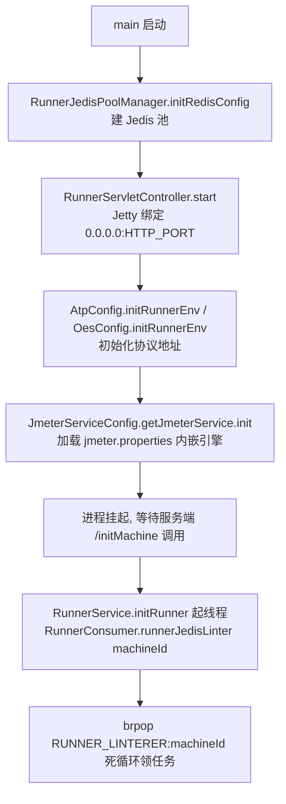

# 执行端Runner详解

## 概述

执行端（runner / 执行机）是 `testin-api-backend` 同一份代码的第二种产物（见 [后端双形态架构](../02-技术架构/后端双形态架构.md)）：`mvn package -f runnerPom.xml` 打出 `testin-api-backend-runner`，入口 `cn.testin.runner.RunnerApplication`。它**不是 Spring 应用**——没有 IOC、没有配置文件注入，所有组件手动 new、Redis 连接靠位置参数传入。职责很单一：起一个小 Jetty 接收服务端控制指令，在自己专属的 Redis 队列上 brpop 领任务，用内嵌 JMeter 5.5 执行，把结果推回服务端队列。

## 启动流程

入口 `RunnerApplication.main`（`src/main/java/cn/testin/runner/RunnerApplication.java`）：

```
java cn.testin.runner.RunnerApplication <HTTP_PORT> <REDIS_HOST> <REDIS_PORT> <REDIS_DB> <REDIS_PASSWORD|"EMPTY_PASSWORD"> [JMETER_HOME]
```

- 第 5 个参数为字面量 `EMPTY_PASSWORD` 时转成 null——无密码 Redis 的约定；
- 第 6 个参数可选，覆盖 JMETER_HOME；不传则用 classpath 下的 `jmeter/` 目录。

启动顺序（main 方法体内严格按序）：



**注意 main 方法本身不会开始消费任务**：brpop 线程是在服务端调用 `/initMachine?machineId=xxx` 之后才拉起的（`RunnerService.initRunner`，`src/main/java/cn/testin/runner/service/RunnerService.java`）。所以"runner 进程活着但不干活"先检查服务端有没有成功调 init。

### 服务端侧的执行机初始化握手

服务端 `Application.main` 最后调用 `TestMachineService.initRunner()`（`src/main/java/cn/testin/Application.java`），拉起 `listenerRunnerConnect` 线程（`src/main/java/cn/testin/service/TestMachineService.java`）：

- 每 10 秒扫描数据库里所有未删除/未禁用的执行机；
- 对每台机器先 `checkConnection`（GET `/checkMachine`）——该接口返回 runner 当前已初始化的 machineId（`RunnerServletController.java`）；
- 连不上或校验失败就发 `initMachineConnent`：`GET http://{ip}:{port}/initMachine?machineId={id}`，runner 收到后才启动 brpop 消费线程；
- 根据两次校验结果回写 `is_connect` 在线状态。

这是一个"服务端每 10s 轮询保活 + 失败重推 machineId"的模型：runner 重启后最多 10s 会被重新初始化；但**重复调用 initMachine 会重复拉起多个 brpop 线程**（没有幂等判断，见注意事项）。

## HTTP 端点

`RunnerServletController`（`src/main/java/cn/testin/runner/controller/RunnerServletController.java`）是纯 Servlet（Jetty `ServletContextHandler` 直接挂），返回纯文本：

| 路径 | 常量 | 行为 |
|---|---|---|
| `/checkMachine` | CHECK_MACHINE_URL | 返回 runner 已初始化的 machineId（未初始化返回 null） |
| `/initMachine?machineId=` | INIT_MACHINE_URL | 起 brpop 消费线程，返回 200 |
| `/testMachine` | TEST_MACHINE_URL | 连通性探测，固定返回 200 |
| `/stopTask?reportId=&testId=&type=` | STOP_TASK_URL | 起 `StopExecThread` 停 JMeter 引擎 + 清该报告的全局变量命名空间 |
| `/task_finish?reportId=` | TASK_FINISH_URL | 报告完成后清执行端全局变量（服务端在报告终态时回调） |

停止的实现：`RunnerService.stopTaskRunner`（`RunnerService.java`）→ `StopExecThread.run`（`src/main/java/cn/testin/config/exec/StopExecThread.java`）从 `JMeterEngineCache.runningEngine` 取 `StandardJMeterEngine` 调 `stopTest(true)`；缓存里暂时没有会等 3 次 × 3 秒（任务可能刚进队列还没起引擎）。

## 任务执行内部结构

```
brpop 线程 (1个/machineId)
   │ RunnerTestExecuteService.JmeterCheckRequestDTO
   │   解析 DTO → GET JMETER_JMX_ID:{machineId}:{reportId} → SaveService 还原 HashTree
   ▼
JmeterService.run ──► ExecThreadPoolExecutor（10线程 + 10000队列 + 溢出缓冲区）
   │ ExecTask.run
   ▼
JmeterService.runLocal
   │ ① JMeterBase.addBackendListener 挂 TestinResultBackendListener
   │ ② new LocalRunner(hashTree).run(reportId) → StandardJMeterEngine
   │ ③ PoolExecBlockingQueueUtil.take(reportId) 等结束信号(≤10min)
   ▼
TestinResultBackendListener ──► RunnerProducer lpush SERVER_LINTERER（结果回传）
```

关键参数：

- 执行线程池：核心/最大 10，队列 10000（`src/main/java/cn/testin/config/exec/ExecThreadPoolExecutor.java`）；队列满后进 `TestinRejectedExecutionHandler` 的缓冲队列，由内置调度线程每 2s 回补；
- 单任务等待上限：`PoolExecBlockingQueueUtil.take` 阻塞 10 分钟（`src/main/java/cn/testin/config/exec/PoolExecBlockingQueueUtil.java`），超时 ExecTask 清理引擎缓存并打"任务执行超时"；
- 每次测试结束 listener 的 finally 里手动 `System.gc()`（`TestinResultBackendListener.java`）——长任务后强制回收；
- 预留的内存检查（每用例 30MB）代码已注释（`RunnerTestExecuteService.java`），当前**不做**内存准入控制。

## 内嵌 JMeter 与资源目录

- 引擎初始化：`JmeterService.init`（`src/main/java/cn/testin/service/jmeter/JmeterService.java`）`JMeterUtils.loadJMeterProperties(JMETER_HOME + "/bin/jmeter.properties")`。默认 home 取 classpath 下 `jmeter/`（`getJmeterHome`），对应源码 `src/main/resources/jmeter/`：
  - `bin/`：`jmeter.properties`、`saveservice.properties`、`user.properties`、`base64.js`、`bignumber.js`；
  - `lib/ext/`：平台插件 `testin-plugin-all.jar`、`Testin_ApacheJMeter_functions-5.5.jar`、`ApacheJMeter-associate-api-functions.jar`、`jython-standalone-2.7.2.jar`（Python 前后置脚本的 JSR223 引擎）。
- runner 打包（`runnerPom.xml`）：依赖拷到 `deploy/lib/`，资源拷到 `deploy/resources/`，JMeter 插件单独拷到 `deploy/resources/jmeter/lib/ext/`（`runnerPom.xml`），mainClass 固定在 `runnerPom.xml`。
- 全局变量：执行端进程内用 `org.apache.jmeter.util.GlobalVariableUtil`（平台 overlay 类，`src/main/java/org/apache/jmeter/util/GlobalVariableUtil.java`）按 reportId 作命名空间存全局变量；`/stopTask`、`/task_finish` 都会清对应命名空间。

## 部署一台新执行机

1. 构建：`mvn package -f runnerPom.xml -Dmaven.test.skip=true`，产物在 `deploy/`（bin / lib / resources）。
2. 目标机准备 JDK8、`startup_runner.sh`（仓库根目录）。脚本会：`dpkg -i resources/deb/*.deb` 装依赖、解压 `resources/python_dep/python_dep.tgz` 到 python3.8 dist-packages（FIX/T2 等协议的 Python 依赖）、然后 `java -cp ... cn.testin.runner.RunnerApplication ${HTTP_PORT:-6254} ${REDIS_HOST} ${REDIS_PORT} ${REDIS_DB} ${TESTINPRO_REDIS_PASSWORD}`。
3. 环境变量（或改脚本默认值）：`HTTP_PORT`（默认 6254）、`REDIS_HOST/PORT/DB`、`TESTINPRO_REDIS_PASSWORD`（无密码用 `EMPTY_PASSWORD`）、`OPENAPI_URL`。
4. 在主平台"测试机管理"页面登记执行机（IP + HTTP_PORT），服务端 10s 内会自动探测、初始化 machineId 并标记在线。登记后观察服务端日志"执行机已经初始化"与 runner 日志确认。
5. 验证：调 `curl http://{ip}:{port}/checkMachine` 应返回 machineId；跑一个单用例调试任务确认报告回传。

## 关键代码位置表

| 环节 | 类 / 方法 | 位置 |
|---|---|---|
| 入口 | RunnerApplication.main | src/main/java/cn/testin/runner/RunnerApplication.java |
| Jetty/Servlet | RunnerServletController.start / service | src/main/java/cn/testin/runner/controller/RunnerServletController.java |
| 初始化消费线程 | RunnerService.initRunner | src/main/java/cn/testin/runner/service/RunnerService.java |
| 消费循环 | RunnerConsumer.runnerJedisLinter | src/main/java/cn/testin/runner/jedisConfig/RunnerConsumer.java |
| 取 JMX 并执行 | RunnerTestExecuteService.jmeterRun | src/main/java/cn/testin/runner/service/RunnerTestExecuteService.java |
| Redis 池 | RunnerJedisPoolManager / RunnerJedisPoolUtils / RunnerProducer | src/main/java/cn/testin/runner/jedisConfig/ |
| JMeter 单例 | JmeterServiceConfig | src/main/java/cn/testin/config/JmeterServiceConfig.java |
| 执行线程池 | ExecThreadPoolExecutor | src/main/java/cn/testin/config/exec/ExecThreadPoolExecutor.java |
| 结束等待 | PoolExecBlockingQueueUtil | src/main/java/cn/testin/config/exec/PoolExecBlockingQueueUtil.java |
| 停止引擎 | StopExecThread | src/main/java/cn/testin/config/exec/StopExecThread.java |
| 服务端保活 | TestMachineService.listenerRunnerConnect | src/main/java/cn/testin/service/TestMachineService.java |
| 启动脚本 | startup_runner.sh | 仓库根目录 |

## 注意事项与坑

1. **initMachine 不幂等**：`RunnerService.initRunner` 每次收到请求都 new 一个 brpop 线程，没有"已初始化则跳过"判断。服务端保活线程在校验失败时会重发 init——`checkConnection` 要求 `/checkMachine` 返回的 machineId 匹配（`TestMachineService.java`），正常情况下已初始化机器不会重复 init，但手工重复调 `/initMachine` 会起多个消费线程，同一任务可能被重复消费。
2. **brpop 线程用裸连接且不会自愈**：`RunnerConsumer.java` 用的是 `RunnerJedisPoolManager.getJedis()` 新建的独立连接，Redis 重启/网络闪断后该连接永久失效，while 循环只打日志不重连——runner 需要重启进程恢复。
3. **JMX 取不到直接丢任务**：`jmeterRun` 里 JMX 为空就 return（`RunnerTestExecuteService.java`），没有任何告警；叠加队列里 DTO 已被消费，表现为"任务静默消失"。排查见 [Redis通信与Key设计](Redis通信与Key设计.md) 与 [任务执行问题排查](../05-常见问题/任务执行问题排查.md)。
4. **执行完手动 `System.gc()`**：listener finally 里每批结束都 Full GC（`TestinResultBackendListener.java`），高并发小任务场景会有可见停顿；不要随意去掉，JMeter 的 HashTree/SampleResult 引用链容易攒内存。
5. **`checkUnfinishedTasks` 与阻塞任务 key 是半成品**：`RunnerConsumer.java` 已注释掉调用，执行端重启后**不会**自动恢复中断的任务，队列里残留的 DTO 会被正常消费但对应 JMX 多半已过期（见坑 3）。
6. **一台 runner 只认一个 machineId**：machineId 存在静态字段（`RunnerTestExecuteService.java`），不要在一台机器上用同一端口起多个 runner 实例；同机多实例必须不同 HTTP_PORT。
7. **位置参数没校验收尾**：`args.length < 5` 只打错误日志不退出（`RunnerApplication.java`），参数缺失会继续往下跑然后 NPE，部署脚本里要确保 5 个参数齐全。
