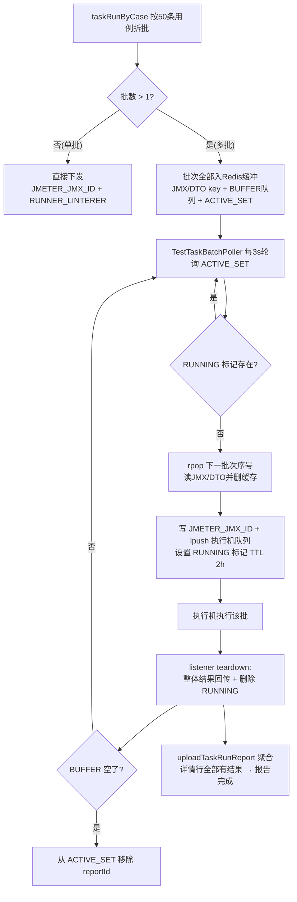
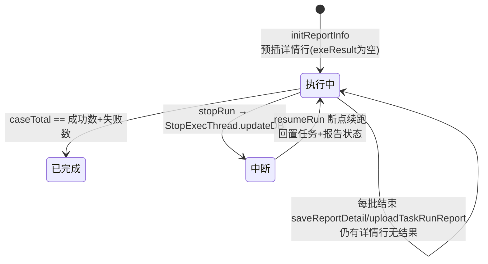

# 批次结果聚合

## 概述

任务（task）可能包含几百条用例、每条用例再乘数据集行数，整包发给执行机会产生超大 JMX、超长执行时间。平台把任务按用例数拆成**批次（batch）**：每批最多 50 条用例（`TestTaskConstants.MAX_CASE_COUNT = 50`，`src/main/java/cn/testin/commons/constants/TestTaskConstants.java`），多批任务先把所有批次的 JMX/DTO 缓存在 Redis，由 `TestTaskBatchPoller` 每 3 秒轮询、逐批下发——**同一时刻一个报告只有一个批次在执行机上跑**，上一批执行完的回调清掉"执行中"标记后才发下一批。所有批次共享同一个 reportId，报告状态由 `TestReportService.uploadTaskRunReport` 按"详情行是否全部有结果"推进到终态。

## 批次的生命周期

### 1. 拆批与登记（服务端）

`AssembleElementsThreadPool.taskRunByCase`（`src/main/java/cn/testin/config/exec/AssembleElementsThreadPool.java`）把线程组下的用例元素按 50 条一组切分，逐批调用 `TestExecuteService.taskRun(..., batchIndex)`：

- 多批时 `batchIndex = i+1`，进入缓冲模式：JMX 写 `TASK_EXECUTED:JMX:{reportId}:{i}`、DTO 写 `TASK_EXECUTED:DTO:{reportId}:{i}`（TTL 均 24h），批次序号 lpush 到 `TASK_EXECUTED:BUFFER:{reportId}`，reportId 加入 `TASK_EXECUTED:ACTIVE_SET`（`TestExecuteService.java`）；
- 单批时 `batchIndex = null`，直接下发，不经过 poller。

注意：**多批任务的第一批也是走缓冲队列、由 poller 首次轮询时发出的**，不是组装完立即发。

### 2. 轮询下发（TestTaskBatchPoller）

`TestTaskBatchPoller.pollBatchBuffer`（`src/main/java/cn/testin/service/TestTaskBatchPoller.java`），`@Scheduled(fixedDelayString = "${batch.poller.fixed-delay:3000}")`，默认每 3 秒一轮（调度线程池在 `config/exec/SchedulingConfig.java`，4 线程）：

1. 读 `ACTIVE_SET` 拿到有待下发批次的 reportId 集合；
2. 若该报告 `TASK_EXECUTED:RUNNING:{reportId}` 存在 → 跳过（上一批还在跑）；
3. `lRightPop` 缓冲队列取下一批次序号；队列空则把 reportId 移出 `ACTIVE_SET`；
4. 读 JMX/DTO 缓存并**立即删除**；
5. JMX 改写为 `JMETER_JMX_ID:{machineId}:{reportId}`、DTO lpush 到执行机队列；
6. 设置 `RUNNING` 标记，TTL 2 小时——这是兜底：listener 正常会主动删，2h 没删说明执行机挂了，poller 才会放行下一批。

### 3. 批次完成信号（执行端）

执行端 `TestinResultBackendListener.teardownTest` 在每批跑完后：

- 把整体结果 lpush 回服务端（`TestinResultBackendListener.java`）；
- **任务类型且非补测**时删除 `TASK_EXECUTED:RUNNING:{reportId}`——poller 下一轮就会发下一批。

补测（supplemental）不分批，整包一次下发，所以不删 RUNNING（也没有 RUNNING）。

### 4. 报告状态机

报告状态定义在 `TestReportConstants`（`src/main/java/cn/testin/commons/constants/TestReportConstants.java`）：`0 未开始 / 1 执行中 / 2 已完成 / 3 中断`。任务/用例自身的执行状态是另一套：`ExecutionStatus`（`src/main/java/cn/testin/commons/constants/ExecutionStatus.java`）`0 未执行 / 1 执行中 / 2 执行完成 / 3 执行停止中 / 4 执行中断`。执行结果：`ExeResultEnum`（`src/main/java/cn/testin/enums/ExeResultEnum.java`）`1 成功 / 0 失败`，存在详情行 `exeResult` 字段（空 = 未执行）。

推进逻辑在 `TestReportService.uploadTaskRunReport`（`src/main/java/cn/testin/service/TestReportService.java`）：

- **每批结束都会进一次**，先按 caseNum 分组更新详情（`updateReportDetail`），再用 SQL 统计该报告已出结果的用例数（`countExecutedCase`）；
- `resolveReportStatus`判定：`caseTotal == successCaseNum + failCaseNum` → **已完成**；报告已被置为中断 → **中断**；补测场景补测用例数等于失败用例数 → **已完成**；否则保持 **执行中** 并直接 return——所以中间批次不会触发最终落库、通知等动作；
- 终态时：回写报告（耗时、成功/失败数、通过率）、更新计划执行记录并查找下一个待执行任务、回填任务表最近结果（`fillTaskResult`）、删除 `TASK_STOP_REPORT_MACHINEIDLIST`、发消息通知。

详情行对位更新在 `saveReportDetail`：以 `reportId:caseNum:machineId` 为 key 找预插行主键，并做 caseId 一致性校验防止编号错位写串行；匹配不到的行计数并打 error，**进度不推进**——这是"报告卡执行中"最常见的原因。

## 关键代码位置表

| 环节 | 类 / 方法 | 位置 |
|---|---|---|
| 拆批 | AssembleElementsThreadPool.taskRunByCase | src/main/java/cn/testin/config/exec/AssembleElementsThreadPool.java |
| 批次入缓冲 | TestExecuteService.sendJmeterRunRequestDTOToExecutionMachine | src/main/java/cn/testin/service/execution/TestExecuteService.java |
| 轮询下发 | TestTaskBatchPoller.pollBatchBuffer | src/main/java/cn/testin/service/TestTaskBatchPoller.java |
| 批次完成清标记 | TestinResultBackendListener.teardownTest | src/main/java/cn/testin/service/jmeter/listener/TestinResultBackendListener.java |
| 报告初始化 | TestReportService.initReportInfo | src/main/java/cn/testin/service/TestReportService.java |
| 实时详情回写 | TestReportService.saveReportDetail | src/main/java/cn/testin/service/TestReportService.java |
| 整批聚合 | TestReportService.uploadTaskRunReport / resolveReportStatus | src/main/java/cn/testin/service/TestReportService.java |
| 用例报告聚合 | TestReportService.uploadCaseRunReport | src/main/java/cn/testin/service/TestReportService.java |
| 结果分发 | TestResultService.saveResults | src/main/java/cn/testin/service/execution/TestResultService.java |
| 状态枚举 | ExecutionStatus / ExeResultEnum / TestReportConstants | src/main/java/cn/testin/commons/constants/ExecutionStatus.java 等 |

## 注意事项与坑

1. **"批次"是下发节流手段，不是报告维度**：所有批次共享一个 reportId，报告粒度仍是任务；不要把批次序号当成子报告。
2. **RUNNING 标记 2h TTL 是双刃剑**：执行机宕机时 listener 不会删标记，poller 要等 TTL 过期才发下一批——但此时那批的结果永远不会回来，报告会卡"执行中"。反过来如果一批执行真的超过 2 小时，标记过期后两批会并发跑，详情行对位仍正确（按 caseNum）但耗时统计会失真。
3. **停止任务必须清批次缓存**：`stopRun`（`TestAutomationService.java`）会删 JMX/DTO/BUFFER/RUNNING 并把 reportId 移出 ACTIVE_SET；新增批次相关 key 时这里必须同步加清理，否则停止后 poller 还会继续发。
4. **多执行机并行（parallel）不走批次缓冲**：`taskParallelRun` 每台执行机一条链路、type=PARALLEL，整包直接下发；并行场景的报告聚合靠详情行的 machineId 维度区分（`reportId:caseNum:machineId`）。
5. **补测/续跑不重建详情行**：`initReportInfo` 对补测和续跑跳过预插（`TestReportService.java`），回写时按 `supplementId` 区分补测轮次；续跑依赖原 caseNum 不错位，所以有 `validateTaskUnchangedForResume` 的严格校验（`TestAutomationService.java`）。
6. **轮询间隔可配**：`batch.poller.fixed-delay`（默认 3000ms）；调小能加快批次衔接，但每轮会对每个活跃报告做 4-5 次 Redis 操作，活跃报告多时注意 Redis QPS。
