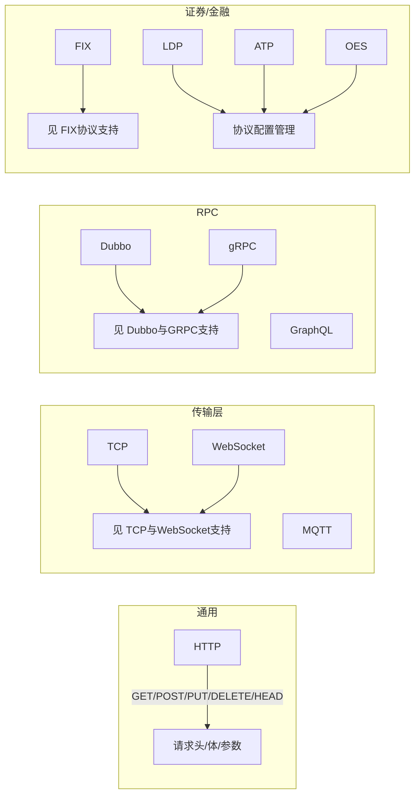
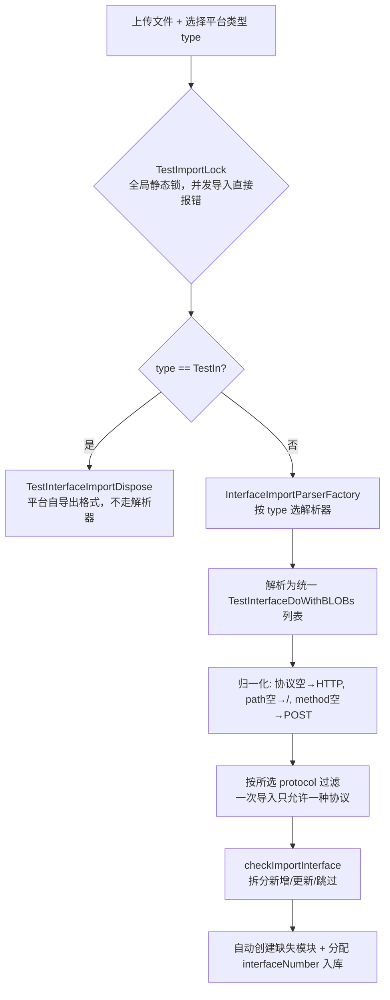

# 接口管理实现

> 产品视角的功能与操作说明见 [接口管理](../01-产品功能/接口管理.md)；本文是开发/维护视角的实现细节。

## 概述

接口管理后端围绕 `test_interface` 主表 + BLOB 大字段表展开，请求参数整体以 JSON 串存 `requestParam`；模块树复用 `test_module` 通用基础设施；导入走解析器工厂 + 全局静态锁。前端是"左树右 tabs"骨架，接口编辑表单与脚本编辑表单共用请求参数组件。

## 数据模型

后端把一条接口拆成两张表（MyBatis Generator 的典型 BLOB 拆分模式）：

- 主表字段（`dao/TestInterfaceDo.java`）：`id`、`projectId`、`name`、`method`（HTTP 方法）、`protocol`、`path`、`environmentId`、`status`、`modulePath`、`moduleId`、`tags`、`isDefaultMock`（`TestInterfaceDo.java`）、`interfaceNumber`（项目内自增编号，从 100001 开始，`service/InterfaceService.java`）、`serverId`
- 大字段（`dao/TestInterfaceDoWithBLOBs.java`）：`description`、`requestParam`（请求参数 JSON 串）、`response`（响应定义 JSON 串）、`mock`（计算出来的 Mock 地址，非持久化配置）

`requestParam` 是整条接口的核心，序列化后与前端 `HttpRequestData` 结构一一对应（`testin-api-frontend/src/vite-env.d.ts`）：

```
requestParam (JSON)
├── headerList        请求头键值对
├── queryList         query 参数
├── restfulList       restful 路径参数
├── body              请求体（含 bodyFormData，文件上传时挂 fileIds）
├── beforeActionList  前置处理器      ┐
├── afterActionList   后置处理器      ├─ 见 [前置后置处理器与断言](../04-复杂功能细节/前置后置处理器与断言.md)
├── assertionRuleList 断言规则        ┘
├── dataSet           关联数据集（见 [数据集与数据枚举](../01-产品功能/数据集与数据枚举.md)）
└── 协议专属参数块（按 protocol 取其一）
    ├── tcpRequestParameters        （reUseConnection / EOL / sendText 等）
    ├── dubboRequestParameters      （注册中心 / interfaceName / method / 参数类型列表）
    ├── webSocketRequestParameters  （connectionId / requestData / responsePattern 等）
    ├── grpcRequestParameters       （protoFolder / libFolder / fullMethod / requestJson）
    ├── graphQLRequestParameters    （operationName / query / variables）
    ├── mqttRequestParameters       （connect / pub / sub 三段）
    └── fixRequestParameters        （messageType / senderCompId / messageFields）
```

前端全局类型 `Api`（`src/vite-env.d.ts`）与后端 DO 的映射、以及 `requestParam` 的 JSON.stringify/parse 转换，集中在 `src/api/interface.ts`（`transApitoBackEndData`）和 `src/api/interface.ts`（`getInterfaceByApi`）两处。**改请求参数结构必须两端同步改。**

前端编辑页 `ApiDefinition.vue` 对七个协议参数块各写死了一份默认值，加载老数据时逐块判空补齐（tcp/webSocket/dubbo/grpc/graphQL/mqtt/fix），response.bodyXml 缺失时也补默认值。

## 模块树组织方式

接口挂在左侧模块树上，树节点存 `test_module` 表，用 `type` 列区分业务（`commons/constants/TestModuleType.java`：`INTERFACE, SCRIPT, CASE, TASK, DATASET, ENUM, PLAN`），接口节点还带 `protocol`——**同一项目下每种协议各有一棵独立的接口模块树**，前端切协议 tab 时传不同 protocol 重新拉树（`src/api/module.ts`，protocol 默认 `HTTP`）。

- 树构建：泛型基类 `service/NodeTreeService.java`（`getNodeTrees` 按 level 分组后递归 `buildNodeTree` 拼 children），节点排序用 `pos` 浮点插值法（`NodeTreeService.java`，往两个相邻节点中间插；pos 低于 `LIMIT_POS=64` 时触发同级重排）
- 默认模块：项目首次拉某协议的树时自动创建"未规划接口"根模块（`service/InterfaceModuleService.java`）
- 层级上限：`commons/constants/TestCaseConstants.java` 的 `MAX_NODE_DEPTH = 8`，同级同名校验按"项目 + 父节点 + 协议"维度（`InterfaceModuleService.java`）
- 树节点增删改会清 Redis 中该模块及父模块的数量缓存（`testCommonService.removeRedisModuleCountByModuleId`，贯穿所有 service）

> 注意仓库里存在**两套接口模块实现**：`controller/InterfaceModuleController.java`（`/interface/module`，操作独立的 `test_interface_module` 表）是早期遗留；当前前端用的是 `controller/TestModuleController.java`（`/module`，操作 `test_module` 表，见 `src/api/module.ts`）。新功能一律走后者。

页面形态（`src/views/api/index.vue`）：左树右 tabs——"接口列表" tab（`components/ApiListTable.vue`）+ 每个接口一个编辑 tab（`components/ApiDefinition.vue`），与脚本、用例页同一套 `TreeList` + `HomeTabsLayout` 骨架。Ctrl+S 保存快捷键在 `index.vue` 注册。

## 支持的协议类型

前端协议枚举（`src/vite-env.d.ts`）：



协议差异主要体现在 `requestParam` 的协议专属参数块和后端的辅助查询接口：

| 协议 | 后端辅助能力 | 位置 |
|---|---|---|
| Dubbo | 从环境配置的注册中心实时拉 provider 列表、方法列表、参数类型（依赖 jmeter dubbo 插件的 `ProviderService`） | `service/InterfaceDubboService.java`；入口 `controller/InterfaceDubboController.java`（`/interface/dubbo/providers`） |
| gRPC | 上传 proto 目录后解析出全部 `包.服务/方法` 列表（基于 zalopay benchmark 插件） | `service/InterfaceGRPCService.java`；入口 `InterfaceController.java`（`/interface/listMethodList`） |
| FIX | 从内置 `FIX44.modified.xml` 数据字典解析消息类型与字段 | `service/InterfaceFixService.java` |
| HTTP | 请求方法常量与状态色板 | 前端 `src/views/api/config.ts` |

## 接口导入机制

入口 `POST /interface/import`（`InterfaceController.java`），核心逻辑 `InterfaceService.java`：



- 支持的平台类型枚举：`commons/constants/InterfaceImportPlatform.java` —— `Metersphere, Postman, Swagger2, Plugin, Jmeter, Har, ESB, TestIn`；但工厂里真正实例化的只有 **Postman、Swagger2、Jmeter、TestIn** 四种（`entity/dto/parse/InterfaceImportParserFactory.java`，Metersphere/Har/ESB 分支已被注释掉，选这些类型会因解析器为 null 报错）。前端导入弹窗（`importApiDialog.vue`）也只暴露这四种。
- Swagger 参数位置常量：`commons/constants/SwaggerParameterType.java`（path/formData/file/header/body/cookie/query），Swagger2 解析器据此把参数落到 requestParam 的不同列表
- 文件后缀白名单校验 `InterfaceService.java`（`checkFileSuffixName`）
- 导入结果文案："导入成功，新增接口X条，更新接口Y条，跳过Z条"（`InterfaceService.java`）
- 前端导入表单字段：文件、导入格式 type、绑定服务 serverId（TestIn 格式非必填）、导入目录 moduleId、覆盖模式 isCover（0 覆盖 / 1 不覆盖），见 `src/views/api/components/importApiDialog.vue`
- 导出是逆过程：`POST /interface/export` 流式下载（`InterfaceController.java`），前端导出/导入按钮在 `src/views/api/components/importApiDialog.vue`

## 接口的保存与删除约束

- 保存 `InterfaceService.java`：同模块内名称唯一（`checkNameExist` line 274）；编辑前查[编辑锁](编辑锁机制.md)（line 162）；body 若为 JSON 会同步生成 jsonSchema（`dealBodyJsonSchema`）
- Mock 默认接口唯一性：同项目 + 同 path + 同 method 只允许一个 `isDefaultMock=1`（`InterfaceService.java`），Mock 地址由配置项 `mock.http.backend.url` + projectId + path 拼出，非默认接口追加 `?testinInterfaceId=`（`InterfaceService.java`），细节见 [Mock服务](../04-复杂功能细节/Mock服务.md)
- 删除 `InterfaceService.java`：**存在关联脚本（`test_script.interface_id`）的接口禁止删除**（line 306-310）；删除即入[回收站](../01-产品功能/回收站.md)，数据快照 JSON 存回收站表
- 复制：`InterfaceService.java` `copyInterface`，目标模块重名自动加后缀
- 所有 rename/copy/delete/save 前端先过 `checkLockedByApi('INTERFACE', ids)`（`src/api/interface.ts`），后端再二次校验
- Mock 期望编辑 UI（MockExpectDefineDialog / MockScriptDefineDialog）仍留在 `ApiDefinition.vue`，但页面上"Mock 期望 / Mock 脚本"两个区块当前被注释停用（"暂时注释mock入口"），`saveInterfaceMockByApi` 的防抖 watch 仍然挂着

## 关键代码位置表

| 功能 | 位置 |
|---|---|
| 接口 REST 入口（/interface） | `testin-api-backend/src/main/java/cn/testin/controller/InterfaceController.java` |
| 接口保存（新增/修改、编辑锁、Mock 默认唯一） | `testin-api-backend/src/main/java/cn/testin/service/InterfaceService.java` |
| 接口删除（脚本关联拦截、回收站） | `testin-api-backend/src/main/java/cn/testin/service/InterfaceService.java` |
| 接口分页查询 | `testin-api-backend/src/main/java/cn/testin/service/InterfaceService.java` |
| 接口导入主流程 | `testin-api-backend/src/main/java/cn/testin/service/InterfaceService.java` |
| 导入解析器工厂 | `testin-api-backend/src/main/java/cn/testin/entity/dto/parse/InterfaceImportParserFactory.java` |
| 导入并发锁 | `testin-api-backend/src/main/java/cn/testin/entity/dto/importT/TestImportLock.java` |
| 模块树通用构建/排序基类 | `testin-api-backend/src/main/java/cn/testin/service/NodeTreeService.java` |
| 接口模块默认节点"未规划接口" | `testin-api-backend/src/main/java/cn/testin/service/InterfaceModuleService.java` |
| Dubbo provider 拉取 | `testin-api-backend/src/main/java/cn/testin/service/InterfaceDubboService.java` |
| gRPC 方法列表解析 | `testin-api-backend/src/main/java/cn/testin/service/InterfaceGRPCService.java` |
| FIX 数据字典解析 | `testin-api-backend/src/main/java/cn/testin/service/InterfaceFixService.java` |
| Mock 配置入口（/interface/mock） | `testin-api-backend/src/main/java/cn/testin/controller/InterfaceMockController.java` |
| 接口数据模型（主表 / BLOB 表） | `testin-api-backend/src/main/java/cn/testin/dao/TestInterfaceDo.java`、`dao/TestInterfaceDoWithBLOBs.java` |
| 前端接口页骨架 | `testin-api-frontend/src/views/api/index.vue` |
| 前端接口编辑表单 | `testin-api-frontend/src/views/api/components/ApiDefinition.vue` |
| 前端接口列表（搜索/批量操作/自定义列） | `testin-api-frontend/src/views/api/components/ApiListTable.vue` |
| 前端导入弹窗 | `testin-api-frontend/src/views/api/components/importApiDialog.vue` |
| 前端接口 API 层（含前后端数据转换） | `testin-api-frontend/src/api/interface.ts` |
| 前端模块树 API 层 | `testin-api-frontend/src/api/module.ts` |
| 前端 `Api` / `HttpRequestData` / `Protocol` 类型 | `testin-api-frontend/src/vite-env.d.ts`、 |
| 列表搜索项/状态色板配置 | `testin-api-frontend/src/views/api/config.ts` |

## 注意事项与坑

1. **两套接口模块表并存**：`test_module`（当前生效，`/module/*`）与 `test_interface_module`（遗留，`/interface/module/*`）。改模块树逻辑前先确认调用方，不要改错表。
2. **导入是全局单线程**：`TestImportLock` 是一个静态 boolean，全 JVM 同时只允许一个导入；导入中途异常路径都手动 `closeLock()`，新增导入逻辑若抛异常没走 catch 会把锁永久挂住。
3. **导入一次只导一种协议**：解析结果会按前端所选 protocol 过滤（`InterfaceService.java`），Swagger 文件里混协议接口会被静默"跳过"。
4. **`requestParam` 结构前后端强耦合**：后端按固定 key（`body.bodyFormData`、`fileIds` 等）解析（如 `InterfaceService.java` 处理文件关联），前端在 `getScriptByApi`/`getInterfaceByApi` 里给每个协议参数块写死默认值；新增字段要同步三处（DO 存的就是裸 JSON，没有 schema 校验）。
5. **接口编号不连续**：`interfaceNumber` 取项目内 max+1（`InterfaceService.java`），删除不回填，不要拿它当排序键或数量统计。
6. **删除接口前先想脚本**：有脚本关联的接口删除直接被拒（报错"存在关联过接口的脚本"），产品上要引导用户先处理脚本。
7. 导出绕过统一 http 封装：前端导出用原生 axios 手动带 `Sid`/`projectId` 头（`src/api/interface.ts`），因为从响应头取文件名，别把它"重构"回统一封装。
8. Metersphere/Har/ESB 三种导入类型在枚举里存在但工厂分支被注释，前端若暴露这些选项会直接报"解析数据出错"。
9. 接口编辑页的 Mock 期望/脚本区块被整段注释，但 mock 数据加载（`getInterfaceMockByApi`）与自动保存 watch 仍在运行——重新开放 UI 前先确认这套自动保存逻辑是否符合现在的交互预期。
